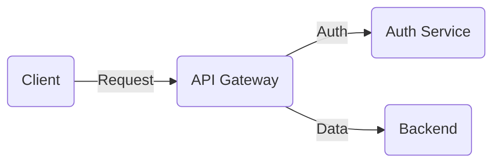

# Mermaid Diagram Creation and Updates

Use this skill when working with Mermaid diagrams in the documentation.

## Creating New Diagrams

When the user requests a diagram:
1. Create the diagram using Mermaid syntax
2. **MUST** apply styles from `resources/public/mermaid-config.js`
3. **Always use round rectangles** for nodes: `E(Python SDK)` instead of `E[Python SDK]`
4. Write the diagram to the requested file location

## Updating Existing Diagrams

When the user requests diagram updates:
1. Find all diagrams that need updating
2. Update the content as requested
3. Verify styles match `resources/public/mermaid-config.js`
4. Fix any style inconsistencies found

## Available Styles

Based on `resources/public/mermaid-config.js`, use these CSS classes for nodes:

### Color Classes (with stroke widths 1-3)
- **Red**: `red1`, `red2`, `red3` (for errors, critical flows)
- **Blue**: `blue1`, `blue2`, `blue3` (for info, data flows)
- **Violet**: `violet1`, `violet2`, `violet3` (for special operations)
- **Green**: `green1`, `green2`, `green3` (for success, valid states)
- **Yellow**: `yellow1`, `yellow2`, `yellow3` (for warnings, pending states)
- **Neutral**: `neutral1`, `neutral2`, `neutral3` (for standard elements)

### Link Label Classes
- `linkLabelNeutral` - standard labels
- `linkLabelSuccess` - success/positive labels
- `linkLabelError` - error/negative labels

## Example Diagram Structure

## Rules

1. Always use round rectangles: `(Node Name)` not `[Node Name]`
2. Apply CSS classes with `:::className` syntax
3. Use stroke widths (1-3) to indicate importance or hierarchy
4. Check existing styles before creating/updating diagrams
5. Ensure consistency across all diagrams in the project

## Dark Theme Support

The project has both light and dark theme configurations. Ensure diagrams work well in both themes by using the defined color classes rather than custom colors.
