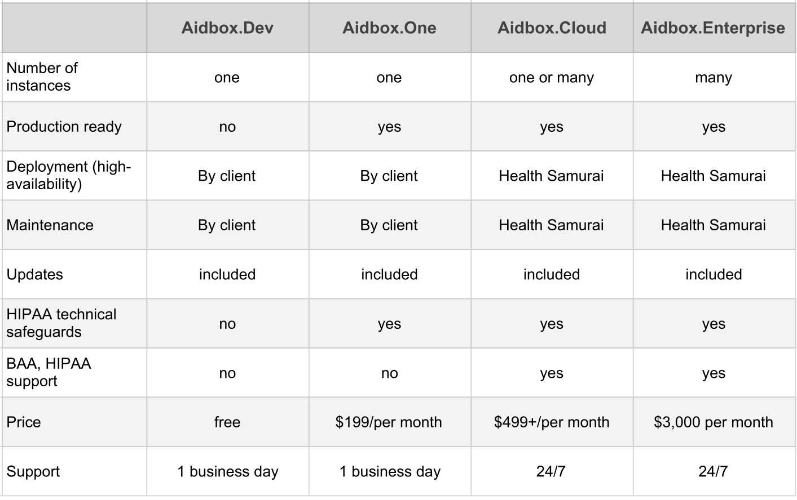

# Overview of Aidbox editions

Aidbox is a FHIR Backend-as-a-Service \(BaaS\) platform that enables deploy and integrates high available healthcare applications both on-premises and in the cloud on top of the [HL7 FHIR](https://www.hl7.org/fhir/) standard. 


With Aidbox, you can easily develop Mobile, Single Page, and classic Web Applications.


The FHIR standard currently describes about 116 models for storing health data, and these units are called [Resources](http://www.hl7.org/fhir/resourcelist.html) \(such as Patient, Encounter, Observation etc.\). FHIR uses a [REST API](https://hello.aidbox.io/docs/rest-api) to access and manipulate the data \(Create, Update, Search, etc\).

Aidbox is available in the following editions:

* Aidbox Dev
* Aidbox Cloud
* Aidbox One
* Aidbox Enterprise  

**Aidbox.Dev** is a free development environment.  It is good for developers starting new healthcare projects. You can download Aidbox Dev and set up your development environment in no time.

**Aidbox.One** is a one-server installation. It is good for small production installations. You can upgrade your Aidbox Dev to Aidbox One and move your solution into production.

**Aidbox.Enterprise** is a highly-available multi-tenant installation with 24/7 support. It is good for large enterprise installations and SaaS products.

**Aidbox.Cloud** is  Aidbox.Enterprise in the Health Samurai cloud. It is good for everyone! Use what you need and pay for what you use.  

[Aidbox](https://www.health-samurai.io/aidbox) provides you with everything you need to start building your healthcare application: 

* **FHIR storage** FHIR database schema on top of PostgreSQL that enables the use of SQL for FHIR data. Aidbox supports all major versions of FHIR: DSTU2, STU3, and R4. ****
* **Custom resources and developer-friendly extensions for FHIR resources** Not all healthcare data fits the FHIR data models. Aidbox allows adding custom resources and attributes by an easy update of metadata over RESTful API. 
* **FHIR API**   FHIR-compliant RESTful API that allows secure access and manipulation of clinical, financial and administrative healthcare data. 
* **Terminology server**  Included popular medical coding systems \(such as FHIR, ICD10, SNOMED, RxNorm, NPI\) and custom dictionaries \(ValueSets\). 
* **Security & Access Control**  Comprises OAuth 2.0, OpenID Connect and flexible security rules to control user access to healthcare application data. 
* **Subscriptions**  With the subscriptions mechanism, you can execute custom logic in your application when specific data is changing. 
* **Cloud Infrastructure**  Multi-tenant installation to a Kubernetes cluster in any public or private cloud. Aidbox handles terabytes of your healthcare data without hiccups. 
* **Add-ons**  Aidbox offers a rich ecosystem of add-ons which extend Aidbox by adding new resources and operations for specific customer needs \(e.g. Stripe integration, SMS notifications, X12 format parsing, etc.\) 
* **SDK** Integrates quickly and easily with an SDK that supports your development team's language of choice. 
* **Validation** Strict validation ensures data consistency and integrity for all FHIR resources.

