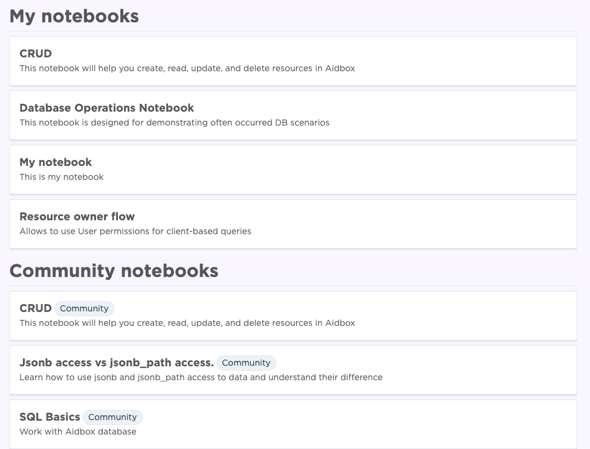
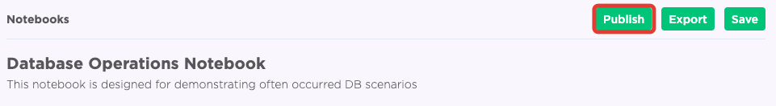

# Aidbox notebooks

A notebook is a single page where you can run code \([REST](../api-1/api/), [SQL](../modules-1/aidbox-search/usdpsql.md), [RPC](../api-1/rpc-api.md)\) check the output, and complement it with text. Using Aidbox notebook you can easily create custom scenarios with your Aidbox data, save it for later use or share it with your colleagues and the Aidbox community.

So now you can easily:

* create custom scenarios using different requests.
* share knowledge with your team and Aidbox community
* raise questions and report issues related to Aidbox

### Notebooks section in Aidbox UI

When clicking the notebooks tab in Aidbox UI you will get to the notebooks page. This page consists of your personal notebooks and the Aidbox community notebooks.

### Create a new notebook

You can create a new notebook by clicking **new** in the notebooks menu. Each notebook consists of a title, subtitle, and a block of cells.

After you create your cell click the **play** icon to see the answer.

### Save a notebook

You can save a notebook for later use or share it with your team. The saved notebook will be available in **My notebooks section.**  

### Export Aidbox notebook

You can export your Aidbox notebook and import it to another Aidbox. Just click export in the notebooks menu. Aidbox will generate a link that will look like this:  
  
[https://aidbox.app/ExportedNotebook/fa061348-1851-4962-b39e-ba496eba23bd](https://aidbox.app/ExportedNotebook/fa061348-1851-4962-b39e-ba496eba23bd)

### Import notebook

To import the notebook click import and paste the link

### Publish notebook

You can also publish a notebook and share it with the Aidbox community. The published notebook will be available in the Community notebooks section.

