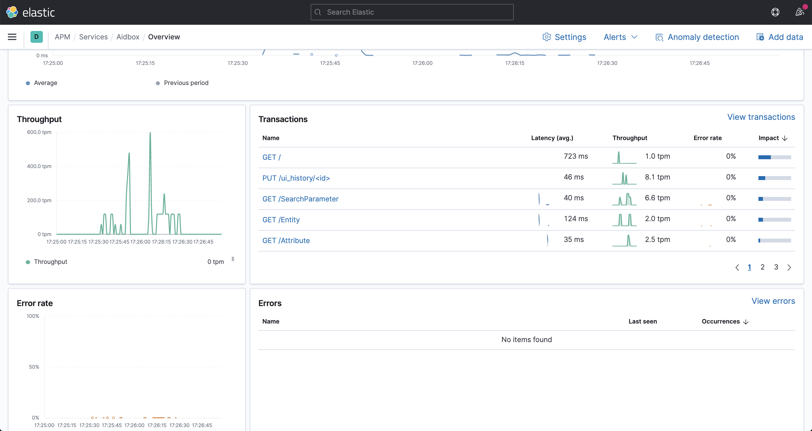

# APM Aidbox

* APM getting started - [https://www.elastic.co/guide/en/apm/server/current/getting-started-apm-server.html](https://www.elastic.co/guide/en/apm/server/current/getting-started-apm-server.html)
* Setup aidbox monitoring - [https://app.gitbook.com/@aidbox/s/project/app-development-guides/receive-logs-from-your-app/elastic-logs-and-monitoring-integration](https://app.gitbook.com/@aidbox/s/project/app-development-guides/receive-logs-from-your-app/elastic-logs-and-monitoring-integration)

После установки урла APM в главном меню kibana должен появиться пункт apm  
Во вкладке services должен появиться aidbox

