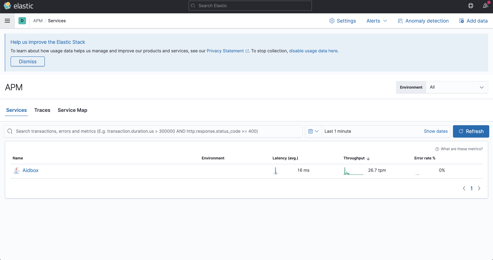

# APM Aidbox

First step to get started with APM is to read official [tutorial](https://www.elastic.co/guide/en/apm/server/current/getting-started-apm-server.html):

To setup Aidbox monitoring please read this [article](../../core-modules/logging-and-audit/elastic-logs-and-monitoring-integration.md#elastic-apm-monitoring).

After you've successfully installed APM URL, you can see APM in main Kibana menu and in services submenu you can see Aidbox. Refer to below screenshots:

