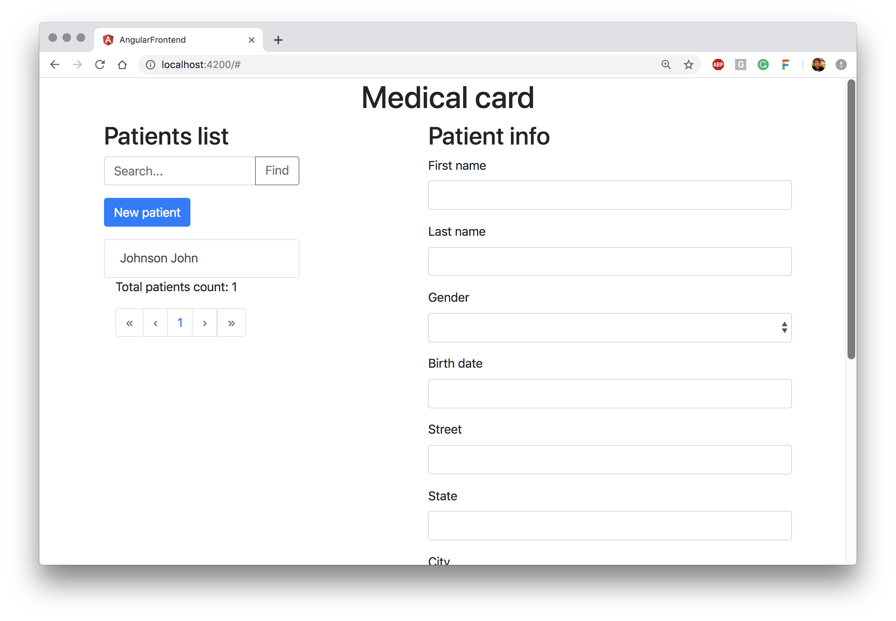

# Patient CRUD SPA

## Before

For this tutorial you will need git, node js and any version of [Aidbox](https://www.health-samurai.io/aidbox) as a backend. We recommend to use Aidbox.Dev as the easiest way. Visit the [Aidbox.Dev installation guide](../../getting-started/installation/setup-aidbox.dev.md) for detailed information and instructions how to install Aidbox backend for development.

## Introduction

This repository on GitHub [https://github.com/HealthSamurai/Aidbox-angular-sample](https://github.com/HealthSamurai/Aidbox-angular-sample).

In this guide, we will locally launch the FHIR application based on [Angular framework](https://angular.io) and Aidbox.Dev as a backend for this SPA. This simple application will implement basic CRUD operations on the patient list.

Aidbox products support [OAuth2.0](https://github.com/Aidbox/documentation/tree/9abc14b1b7fe0effba27642c5386f6d561786814/auth-betta/oauth-2.0) authorization framework and [Access Control](../../security-and-access-control-1/security/access-control.md) mechanism to provide ability for developers to create applications which can interact securely with Boxes \(Aidbox FHIR server instances\). For a single-page application, it's a common practice to use OAuth2.0 [Implicit Grant flow](../../user-management-1/auth/implicit.md).

## Install

### Clone repository

```bash
 $ git clone https://github.com/HealthSamurai/aidbox-angular-sample.git
 $ cd aidbox-angular-sample
```

### Pre-configure your box with the client and patients

To enable implicit OAuth 2.0 flow, we have to create Client in your box. Go to REST Console and create:

```yaml
POST /Client

resourceType: Client
id: SPA
auth:
  implicit:
    redirect_uri: 'http://localhost:4200'
grant_types:
  - implicit
```

As well let's add one patient:

```yaml
POST /Patient

resourceType: Patient
id: pt-1
name:
- given: [John]
  family: Johnson
birthDate: '1971-02-03'
```

### Configure Base URL

Now you need to configure your FHIR server base URL.

If you are using **Aidbox.Dev** as a backend, you need to specify `AIDBOX_URL` as `http://localhost:8888` in the `environment.ts` file.


```typescript
export const environment = {
  AIDBOX_URL : "http://localhost:8888"
}
```


When you want to run this sample application with **Aidbox.Cloud,** you need to specify `AIDBOX_URL` as `https://<YOUR_BOX_NAME>.aidbox.app`.


```typescript
export const environment = {
  AIDBOX_URL : "https://<YOUR_BOX_NAME>.aidbox.app"
}
```


### Installation and start

This sample application requires minimum [Node JS version 8.9](https://nodejs.org/en/).

Install all packages and angular cli:

```bash
 $ npm install
 $ npm install -g @angular/cli
```

And launch the application:

```bash
$ ng serve
# or
$ ng serve --port 4242 # start a web server for our SPA on the specified port
```

After server starts, open your browser and go to [`http://localhost:4200`](http://localhost:4200) — after authorization and granting access you will see Angular simple app.



It is a list of patients and information about them. Patient is a [FHIR resource](https://www.hl7.org/fhir/resourcelist.html). You can create, view, edit, and delete patient data — this is a standard set of CRUD operations. Also in this demo, we have the ability to search by last/first name and get a paginated output of the patient list.

