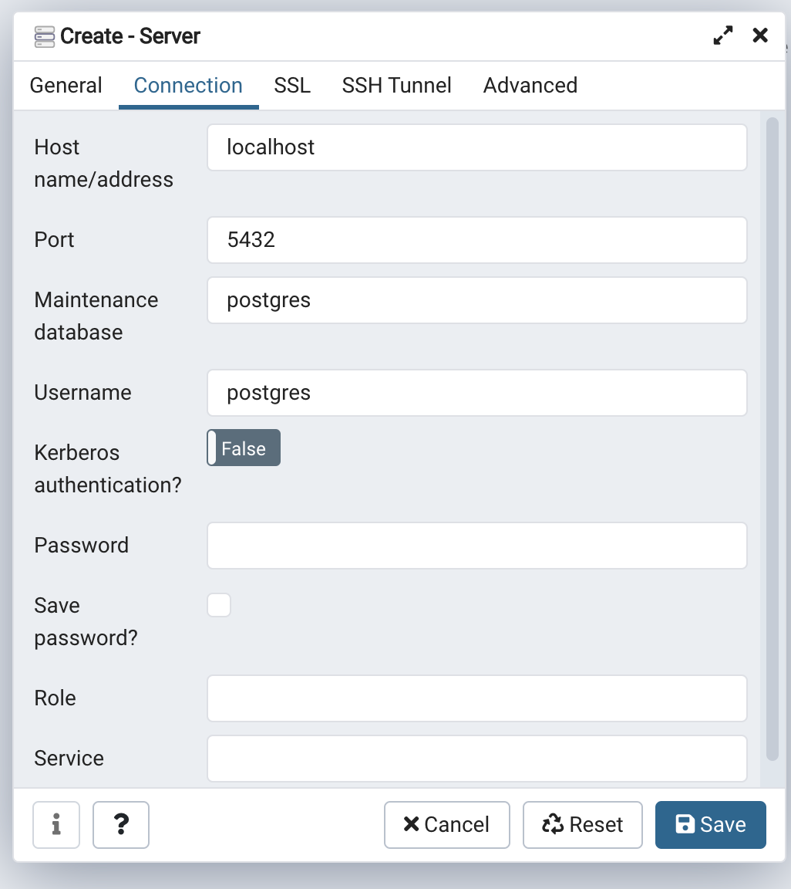
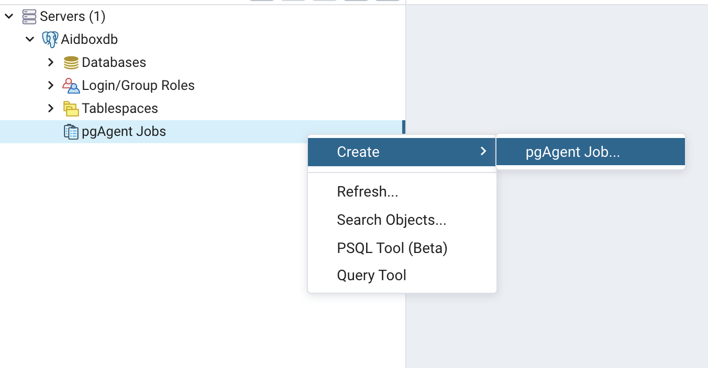

# Scheduling a job in pgAdmin


Refer to [https://www.pgadmin.org/](https://www.pgadmin.org/) for pgAdmin and pgAgent documentation


Create server connection  


It's important that **Maintenance database** is the database `pgagent` connected to.  
By default it's `postgres` database, you can control it with env variables, more info at [aidboxdb image docs](../../../getting-started/installation/aidboxdb-image.md#optional-environment-variables).


Now you can schedule a job as described at [pgAgent docs](https://www.pgadmin.org/docs/pgadmin4/development/pgagent_jobs.html).

