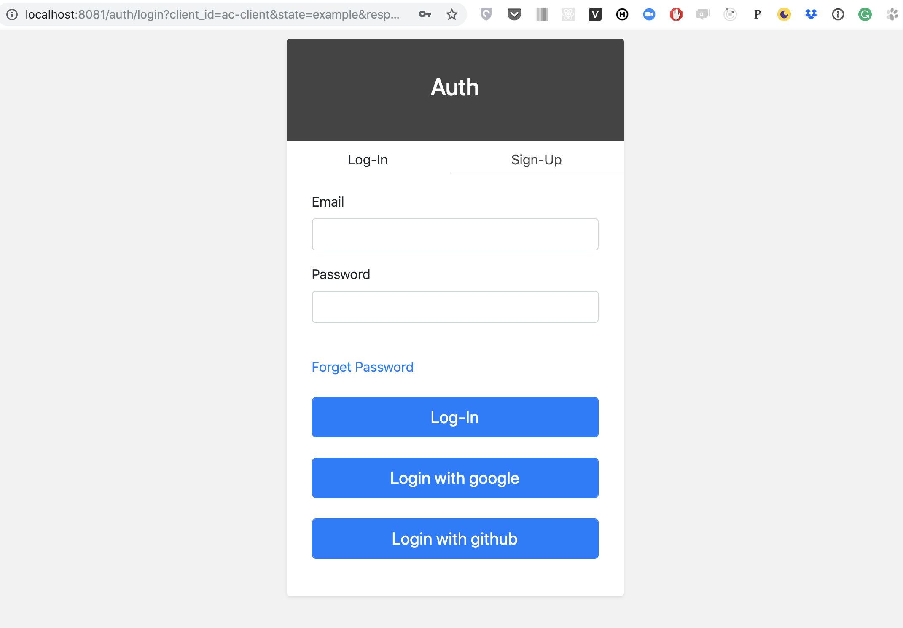
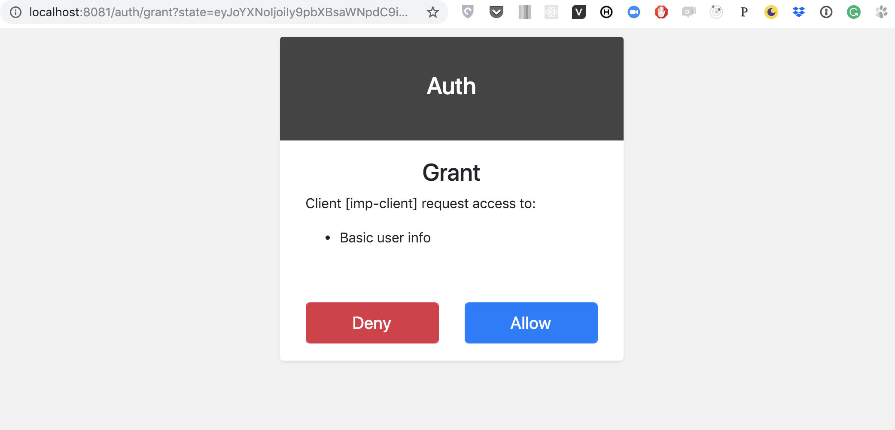

# Implicit Grant

## Description

Implicit Grant flow is an alternative for Authorization Code flow. This flow instead of obtaining secure`code` just receives `access_token` in query string fragment. It's indented for client-side apps use in order to access an API, typically as Web SPA applications. For more detailed information, read [OAuth 2.0 specification](https://tools.ietf.org/html/rfc6749#section-4.2).




Authorization Endpoint



Obtaining access token






a value used by the client to maintain state between the request and callback



scope of the access request



client redirect URI



client ID



value MUST be set to `token`







Redirect


```text
[redirect_uri]#access_token=YzI3ZjQ1M2MtYzFlYi00ZjI3LWI2MzgtOTQ0MWI0ZmIzZjBi&state=eyJoYXNoIjoiIy9pbXBsaWNpdC9iYXNpYyIsImZvcm0tZGF0YSI6eyJ0eXBlIjoiYmFzaWMiLCJiYXNpYyI6eyJjbGllbnQtaWQiOiJpbXAtY2xpZW50In19LCJmb3JtLXBhdGgiOiJpbXBsaWNpdC1wYWdlIn0%3D
```





After this request resource owner \(user\) will be redirected to Log-in/Sign-up page.



Next step is granting access to the client:



After granting access user is redirected to the redirect\_uri from the client configuration with `access_token` in query string fragment.

## Example



```yaml
POST /Client

id: imp-client
resourceType: Client
grant_types:
- implicit
auth:
  implicit:
    redirect_uri: http://localhost:3449/auth.html
```





```bash
curl -X GET \
  'http://localhost:8081/auth/authorize?
        state=example
        &client_id=imp-client
        &redirect_uri=http%3A%2F%2Flocalhost%3A3449%2Fauth.html
        &response_type=token'
```



```text
HTTP/1.1 302 Found

Location: http://localhost:3449/auth.html#access_token=ZGE0ZmQzZTYtOGU0OC00MDJhLWFkN2ItZTg5ZmViYjdmNTQ2
&state=example
```



