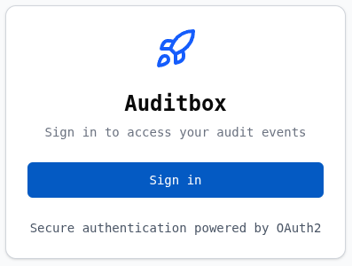
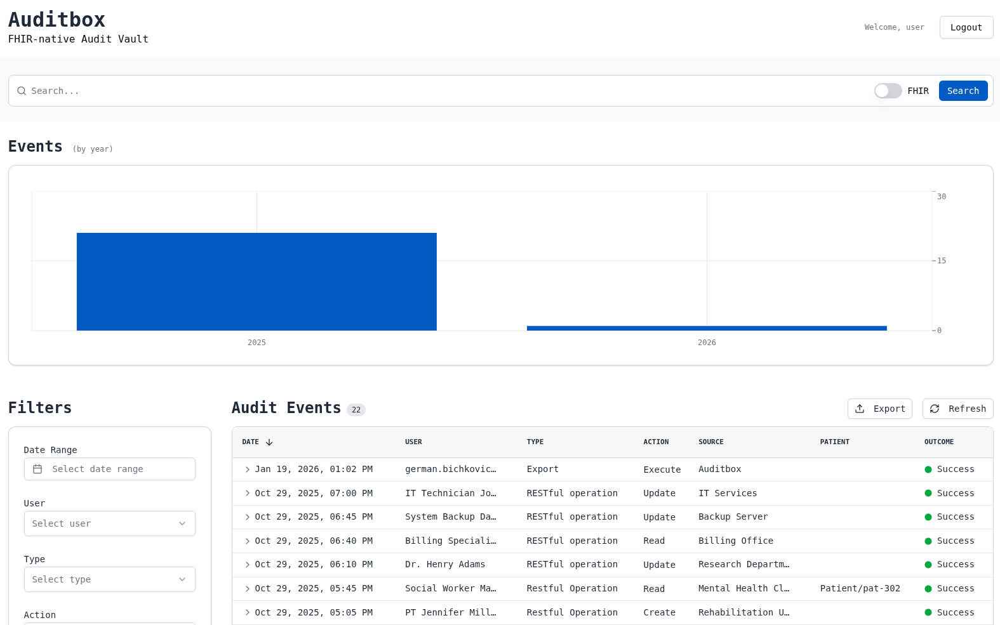
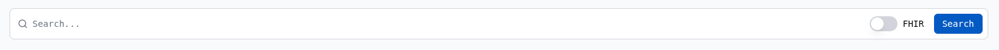
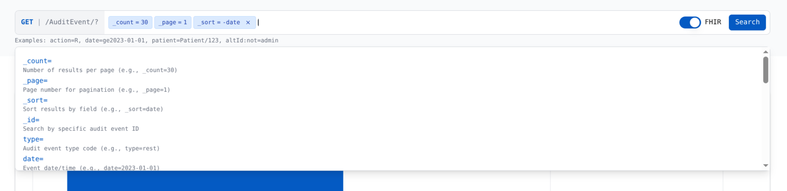
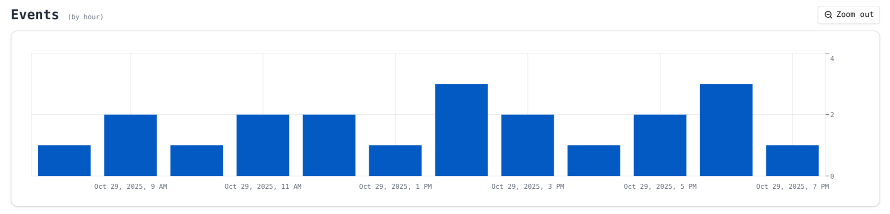
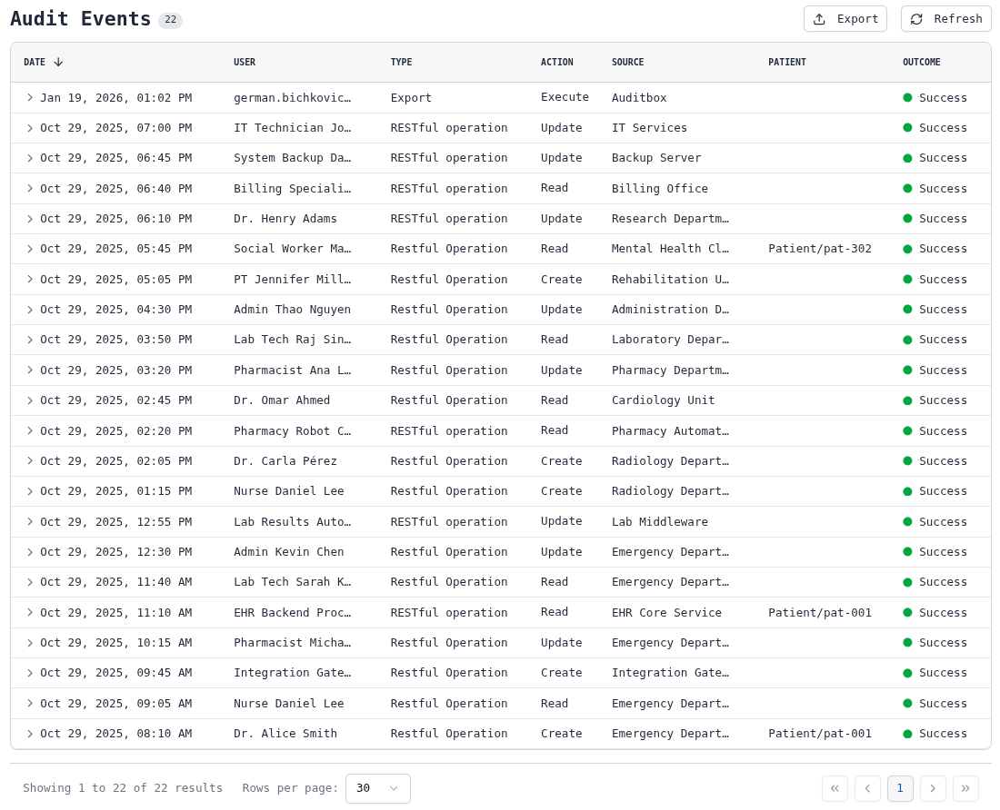
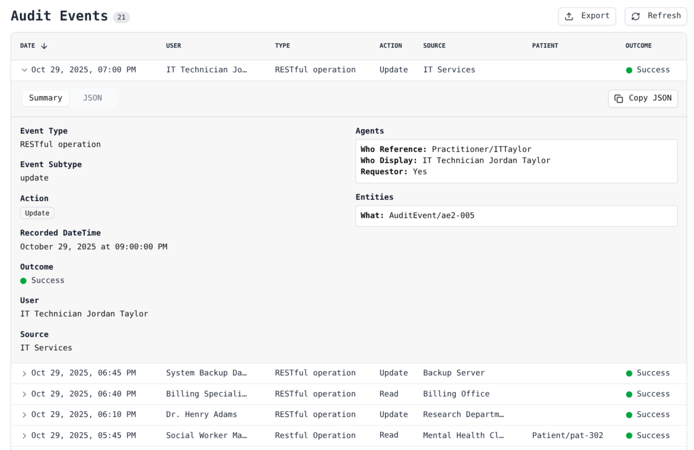
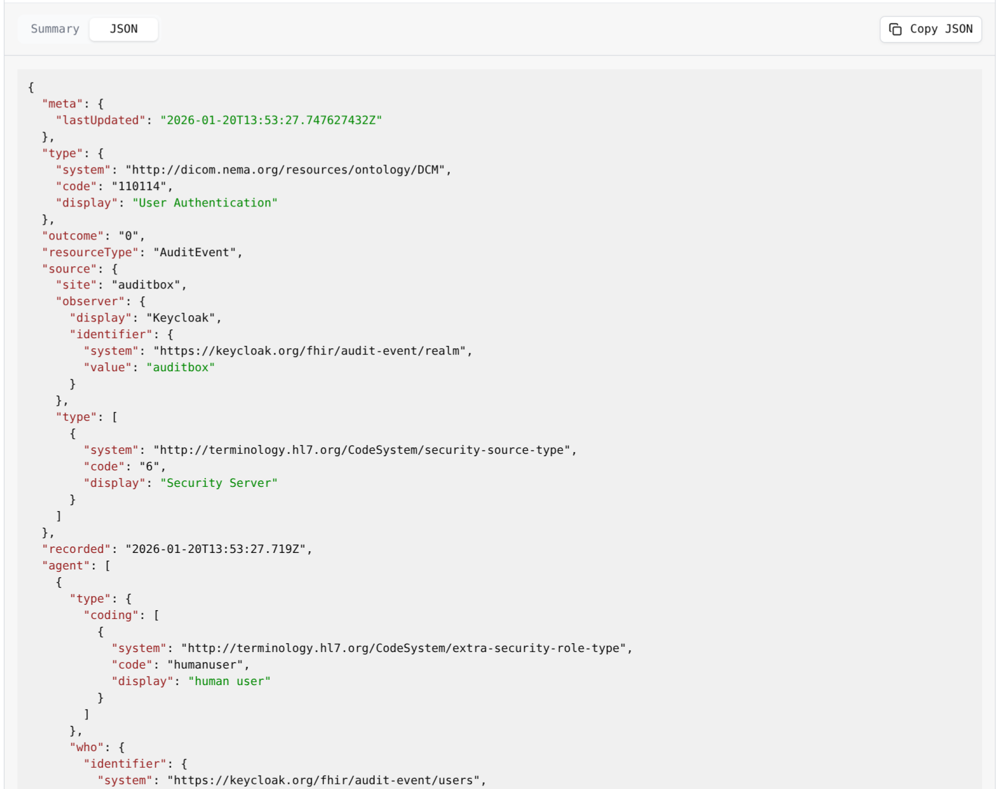
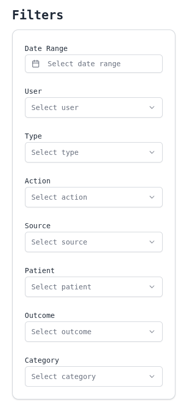
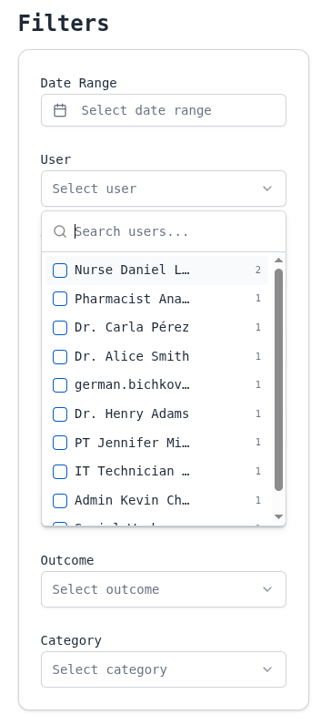

# Read AuditEvents using UI

This guide describes using Auditbox UI.

<!-- ## TODO ? Signing in -->

## Logging in
Before you start using Auditbox, you need to log in.

Image showed above is the first thing you see when logging into
Auditbox. Upon clicking "Sign In" page, you'll be redirected to your
identity provider of choice. By default, it's Keycloak.

## Overview

Upon logging in, you'll be redirected to the main page.

Following sections describe components of the main page.

## Search bar

Search bar sits at the top of the page and lets you search
through all non-archived AuditEvents using either full text search
or FHIR search. Strategy may be selected by clicking on
the "FHIR" toggle at the right side of the bar.

### Full text search

Full text search allows you to search entries by inputting some
text, that then gets looked up in these fields on each event:
- `agent[].who.display`
- `agent[].name`
- `agent[].network.address`
- `agent[].altId`
- `entity[].what.display`
- `type.code`
- `type.display`
- `source.observer.display`

For example, if you have an entry where agent.who.display is
"John Doe", inputting "John" will return it.

### FHIR search

In general, you'll be using filter sidebar instead of FHIR search,
but it's still there if you need it.

Instead of inputting unstructured text, with FHIR search you can
insert FHIR parameters. Upon focusing on the input bar, you'll see a
set of parameters you may input.

Notice, that it takes in valid FHIR search parameters. For example,
`action=Create` will fail, but `action=C` will pass.

## Bar chart

Bar charts show distribution of events over some time.

You may click on a bar to zoom into the range - if you were looking
at events by a year, clicking on the bar for 2025 would update the
view to show everything between 2025.01.01 and 2025.12.31.

While zoomed in, a button appears at the top right of the screen to
zoom back out.

Auditbox UI supports these time ranges:
- year (each bar is a single year)
- month
- day
- hour
- minute

## Grid

Grid is what displays AuditEvents.

By default, each row shows these fields:
- `date` - when was the entry recorded.
- `user` - who was the active user to trigger the event.
- `type` - pretty name of the type of the AuditEvent.
- `action` - `Create`, `Read`, `Update`, `Delete` or `Execute`.
- `source` - source that generated the AuditEvent.
- `patient` - patients related to the event.
- `outcome` - `Succedss`, `Minor failure`, `Serious failure` or `Major failure`.

### Summary
You can click on any row to show summary view for it.

Here, other than fields on the row itself, you can see
all `agents` - objects involved, and `entities` - subjects involved.
Typicaly, agents are users who did the action and entities are the
patients.

### JSON view

Upon clicking "JSON" button at the top, instead of usual overview of
the event you can see the whole AuditEvent as it is stored, in JSON
format.

You may copy the whole event resource using "Copy JSON" button at the
top.

### Pagination

At the bottom of the page, you may adjust pagination of results -
make each page display 10, 30 or 100 entries at once and select
particular page you want to see.

### Export

At the top of the grid, there's an export button, that lets you
download all the events you have queried for into a single FHIR
bundle JSON file.

If you had set a "user" filter to only show entries with user
equal to "John Doe", then exported bundle will *only* have those
entries.

Export also ignores pagination parameters - not only first page of
the results will be exported.

## Filter sidebar

Filter sidebar lets you quickly search for particular events.
Fields are the same as ones displayed in the grid, but with an extra
`category` selector, which searches with a particular set of query
parameters. For example. Data Modification will show all events with
action equal to either Create, Update or Delete.

Once you clicked on a filter, you'll see a few options you may select,
which get updated as you type in what you want to find.

For a single field, you may choose many options, for example
"john doe" and "jane doe", which will show you all entries with either
of them as one of the agents.
