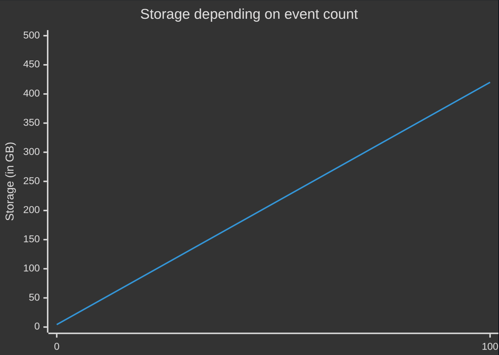

# Performance

This page describes in detail particular benchmarks of
Auditbox.


## Write throughput

### Test method

Tests are done on development environment auditbox with 1 replica.
Auditbox is set up with requests for 300m of CPU and 2142Mi of memory.
Elasticsearch has unlimited CPU power (uses e2-standard-2 node with 2
vCPUs & 8 GB Memory) and 2Gi of memory.

Tests are done using [k6](https://k6.io/).
Each payload has the biggest possible size that Auditbox supports
(87Mb).

Command used:
```sh
K6_WEB_DASHBOARD=true \
K6_WEB_DASHBOARD_EXPORT=html-report2.html \
	k6 run test.js
```

This test file was used:

```js
import http from 'k6/http';
import { check, sleep } from 'k6';

const client_id = "..."
const client_secret = "..."
const keycloak_url = "..."
const server_url = "..."

export const options = {
  stages: [
    { duration: '1m', target: 1 },
    { duration: '5m', target: 1 },
    { duration: '1m', target: 3 },
    { duration: '5m', target: 3 },
    { duration: '1m', target: 6 },
    { duration: '5m', target: 6 },
    { duration: '1m', target: 12 },
    { duration: '5m', target: 12 },
    { duration: '5m', target: 0 },
  ],
  thresholds: {
    http_req_failed: ['rate<0.01'], // <1% errors
  },
};

const bundle = {
  "resourceType": "Bundle",
  "type": "batch",
  "entry": Array(4614).fill(
    {
      "request": {
        "method": "POST",
        "url": "AuditEvent"
      },
      "resource": {
        "resourceType": "AuditEvent",
        "id": "scenario1_event_46",
        "type": {
          "system": "http://dicom.nema.org/resources/ontology/DCM",
          "code": "110106",
          "display": "Export"
        },
        "subtype": [
          {
            "system": "http://dicom.nema.org/resources/ontology/DCM",
            "code": "110105",
            "display": "Data Export"
          }
        ],
        "action": "E",
        "recorded": "2025-10-22T03:15:00+00:00",
        "outcome": "12",
        "agent": [
          {
            "requestor": true,
            "who": {
              "reference": "Practitioner/admin_fired",
              "display": "Bob Johnson"
            },
            "altId": "bob.johnson@hospital.com",
            "type": {
              "coding": [
                {
                  "system": "http://terminology.hl7.org/CodeSystem/v3-ParticipationType",
                  "code": "AUT",
                  "display": "author"
                }
              ]
            },
            "role": [
              {
                "coding": [
                  {
                    "system": "http://terminology.hl7.org/CodeSystem/practitioner-role",
                    "code": "admin",
                    "display": "Administrator"
                  }
                ]
              }
            ],
            "extension": [
              {
                "url": "http://hl7.org/fhir/StructureDefinition/employee-status",
                "valueCode": "terminated"
              }
            ]
          }
        ],
        "entity": [
          {
            "what": {
              "reference": "Patient/patient_12345",
              "display": "John Doe"
            },
            "role": {
              "system": "http://terminology.hl7.org/CodeSystem/object-role",
              "code": "1",
              "display": "Patient"
            }
          },
          {
            "query": "_count=30&_page=1&patient=Patient%2Fpatient_12345",
            "type": {
              "system": "http://terminology.hl7.org/CodeSystem/audit-entity-type",
              "code": "2",
              "display": "System Object"
            },
            "role": {
              "system": "http://terminology.hl7.org/CodeSystem/object-role",
              "code": "24",
              "display": "Query"
            }
          },
          {
            "what": {
              "identifier": {
                "system": "http://dev.auditbox.aidbox.dev/api/export-events",
                "value": "export__2026_02_03_13_55.json"
              }
            },
            "detail": [
              {
                "type": "query",
                "valueString": "_count=30&_page=1&_sort=-date"
              },
              {
                "type": "reference",
                "valueString": "Patient/8b5bacbe-b9b0-40ac-baa5-8f996bfc02bb"
              }
            ]
          }
        ],
        "source": {
          "site": "City General Hospital",
          "observer": {
            "reference": "Organization/hospital_main",
            "display": "City General Hospital"
          }
        },
        "outcomeDesc": "Suspicious data export outside business hours"
      }
    }
  )
}

const get_token = () => {
  console.log("Generating token")
  const response = http.post(
    `${keycloak_url}/realms/auditbox/protocol/openid-connect/token`,
    {
      client_id,
      client_secret,
      grant_type: "client_credentials"
    },
    {
      "Content-Type": "application/x-www-form-urlencoded"
    }
  )
  if (response.status === 200)
    return JSON.parse(response.body).access_token
  else
    throw new Error(
      `Couldn't get token from keycloak: ${response.body}`
    )
}

export function setup() {
  return {
    token: get_token(),
    payload: JSON.stringify(bundle)
  }
}

export default function (data) {
  const {token, payload} = data

  const response = http.post(
    `${server_url}/`,
    payload,
    {
      timeout: "600s",
      headers: {
        "Authorization": `Bearer ${token}`
      }
    }
  );

  console.log("Status of Auditbox request is", response.status)
  if (response.status !== 201) {
    console.log("Auditbox response body is", response.body)
  }

  check(
    response,
    {
      'status is successful': (r) => r.status === 201
    }
  );
}
```

### Data


    Test report


<!-- TODO adjust parameters to show 5 user result for 5m -->

Using the test report above, we can determine that at most, 5 virtual
users may be used at the same time without causing any failures.
Using request rate graph, we can see that between 0.2 and 0.4 bundles
are processed in the time period. Each bundle has body that is exactly
8388302 bytes long, thus we can conclude that:
```js
const single_bundle_bytes = 8388302
const average_rate_per_second = (0.2 + 0.4) / 2
const average_bytes_per_second = single_bundle_bytes * average_rate_per_second
const average_megabytes_per_second = average_bytes_per_second / 1000000
```

As a result, we get throughput of about 2.52 megabytes per second.

## Storage size per year

### Test method

As of now, we use elasticsearch snapshots as our backup
solution, which take approximately 3.5 gigabytes to store
10000000 average events (TODO Citation needed).

With this, you can simply calculate the event size with
a formula `y = b * 12`, where Y is early cost and b is
a single batch cost per month.

### Data

| Event count (M) | Storage size (Gb) |
|-----------------|-------------------|
| 1               | 4.2               |
| 10              | 42                |
| 100             | 420               |

<figure>
  
</figure>

<!--
mermaid.live

xychart-beta
    title "Storage depending on event count"
    x-axis [0, 100]
    y-axis "Storage (in GB)" 0 -- > 500
    line [4.2, 420]
-->

<!--
## TODO Latency

Using k6, you can determine that depending on the load,
response times vary heavily.
-->

## TODO Query latency

Simple field query vs FTS
Map time against event storage size
Cold vs cached

### Methodology
### Results

