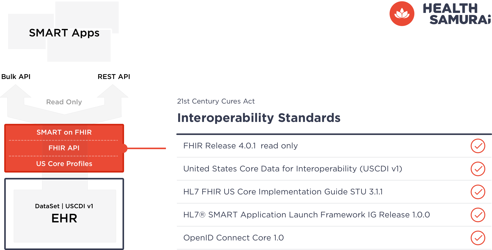
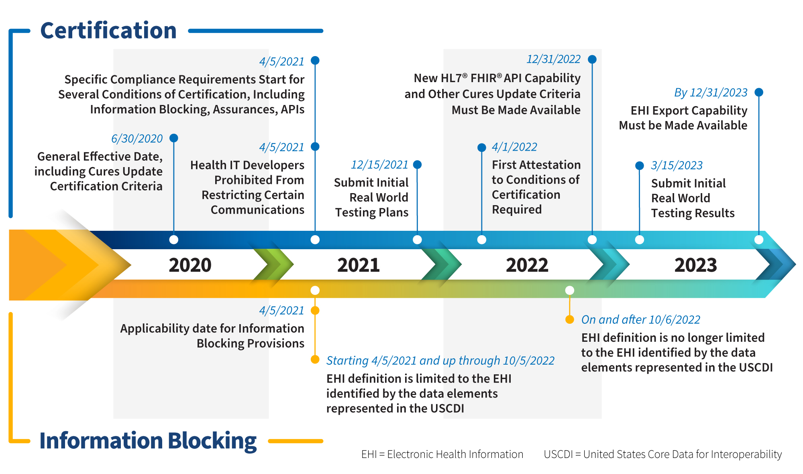
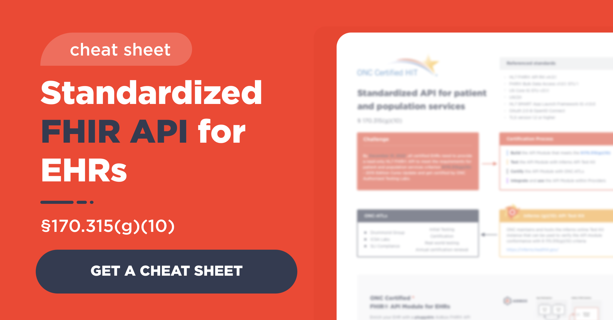
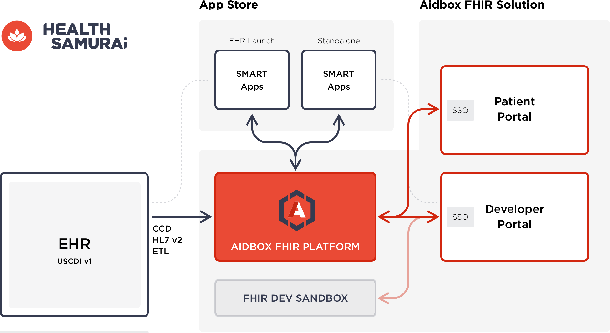
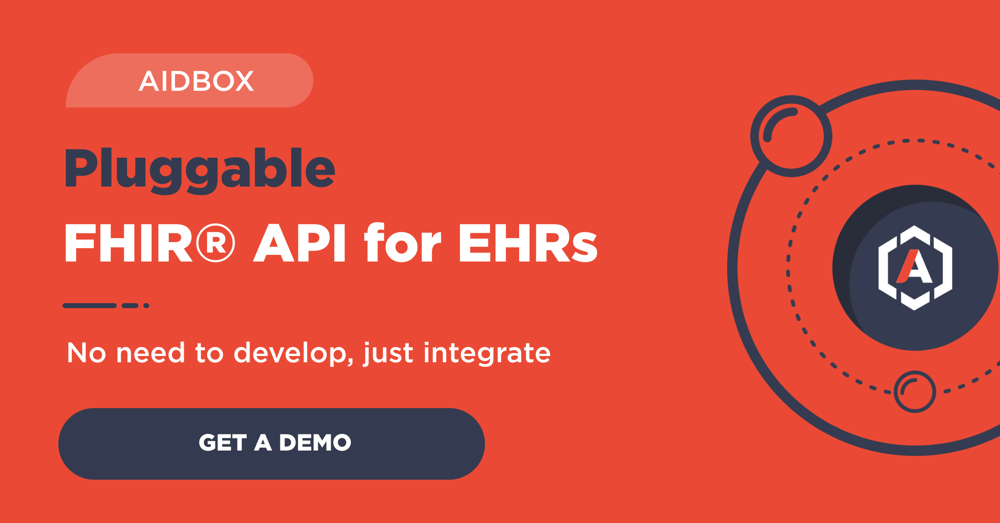

On May, 1st of 2020 ONC has published the final rule called [“21st Century Cures Act: Interoperability, Information Blocking, and the ONC Health IT Certification Program”](https://www.federalregister.gov/documents/2020/05/01/2020-07419/21st-century-cures-act-interoperability-information-blocking-and-the-onc-health-it-certification) to further boost interoperability among provider organizations and EHR system developers. The rule introduced several new provisions and updates from 2015 Edition Certification Criteria. In this blog post we are going to focus solely on the new API requirements.

The new API requirements enforce the use of the FHIR standard which came a long way to serve a key role in healthcare interoperability in the United States. ONC has chosen the latest FHIR Release 4.0.1 and adopted Standards Version Advancement Process (SVAP) to give health IT developers flexibility to use more advanced versions of the adopted standards.

#### What is in the rule?

To comply with the rule, health IT developers should allow dynamic registration and launch of 3rd-party SMART on FHIR  applications. EHR technology should support both patient-facing and practitioner-facing applications via HL7® SMART Application Launch Framework, and bulk data access via SMART Backend Services Authorization Guide.

All 3rd-party applications when authorized should be able to access patient data over FHIR API. ONC has updated the dataset that should be made available through API from the Common Clinical Data Set (CCDS) adopted in the 2015 Edition to a new dataset called [the United States Core Data for Interoperability (USCDI)](https://www.healthit.gov/isa/united-states-core-data-interoperability-uscdi). USCDI should be made available through FHIR API compliant with [HL7 FHIR US Core Implementation Guide STU 3.1.1](http://hl7.org/fhir/us/core/STU3.1.1/) which defines the minimum conformance requirements for accessing patient data using FHIR Release 4.

The API is limited to read-only and does not allow 3rd-party applications any “write” capabilities to create or modify Electronic Health Information (EHI).

#### The timeline

On November 4 of 2020 ONC issued the [Interim Final Rule](https://www.federalregister.gov/documents/2020/11/04/2020-24376/information-blocking-and-the-onc-health-it-certification-program-extension-of-compliance-dates-and) that extended compliance deadlines for the Information Blocking and the ONC Health IT Certification Program in response to the COVID-19 public health emergency. Health IT technology must make the new HL7 FHIR API capability available by December 31 of 2022.

Source: [ONC](https://www.healthit.gov/curesrule/overview/oncs-cures-act-final-rule-highlighted-regulatory-dates)

#### Build or buy?

The [new ONC requirements](https://www.health-samurai.io/webinars/webinar-june-2022) embrace many important use cases and aim to shift healthcare interoperability to the whole new level. One can imagine a marketplace of modern 3rd-party applications that complement EHR systems and resolve the most acute pain points of their users. But with comprehensive use cases come complexity and cost of their implementation.

> Get started with the Aidbox [FHIR Server](https://www.health-samurai.io/aidbox) for data storage, integrations, healthcare analytics, and more, or [hire our team](https://www.health-samurai.io/services) to support your software development needs.

The current scope includes at the minimum the latest version of the FHIR API profiled with the US Core implementation guide, SMART on FHIR profile of the OAuth 2.0 specification with OpenID Connect, UI to support dynamic registration and launch of 3rd-party applications, and forms for data access permissions management. But even though the rule is called “final”, this scope in some way is only the beginning. HL7 organization is targeting FHIR version 5 to be released in the third or fourth quarter of 2022, new versions of US Core and SMART on FHIR IG are coming along too.

At the same time the FHIR solutions from companies that are specialized in FHIR have matured and found hundreds of implementations. We believe that it is a good time for EHR developers to evaluate the new ONC requirements and decide if they want to develop and maintain their own FHIR capabilities or find a FHIR partner that will help them to address all current and future interoperability requirements in the long term.

#### Aidbox FHIR platform

Health Samurai’s [Aidbox FHIR platform](https://www.health-samurai.io/aidbox) offers you a fast and reliable route to comply with the 21st Century Cures Act. It checks all the checkboxes and already passes relevant [Inferno](https://inferno.healthit.gov/inferno) and Touchstone tests for FHIR API, US Core IG, and SMART on FHIR. It comes with an automated [HIPAA-compliant](https://www.health-samurai.io/articles/aidbox-hipaa-book-technical-safeguards) infrastructure for your favorite cloud. And it offers a web portal with a configurable UI for all the participants, dynamic app registration, app gallery, and data access permissions management.

#### Beyond the 21st Century Cures Act

You will not only comply with the current rule but establish a solid foundation for all future regulations and interoperability needs. Aidbox is fully metadata-driven and makes migration to new FHIR versions and Implementation Guides easy. Aidbox demonstrates great performance at large scale and will support your customer growth. Its fine-grained access control allows complex interoperability use cases beyond SMART on FHIR data sharing. You can even develop new modules for your EHR solution with Aidbox as its sole backend as did many Aidbox users.

Health Samurai can help you to implement Aidbox and provide quality enterprise support with a strict SLA after the implementation is complete. We are looking to become your long-term partner for all your interoperability requirements.

For more information or client references please reach out to Health Samurai at [hello@health-samurai.io](mailto:hello@health-samurai.io) or +1-818-731-1279.

Follow US

