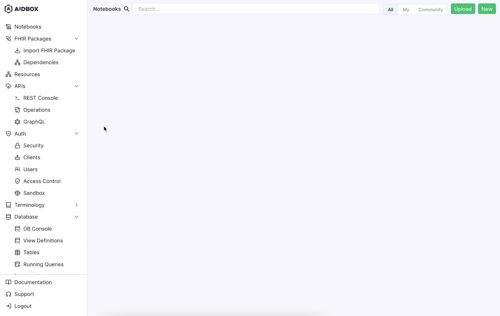
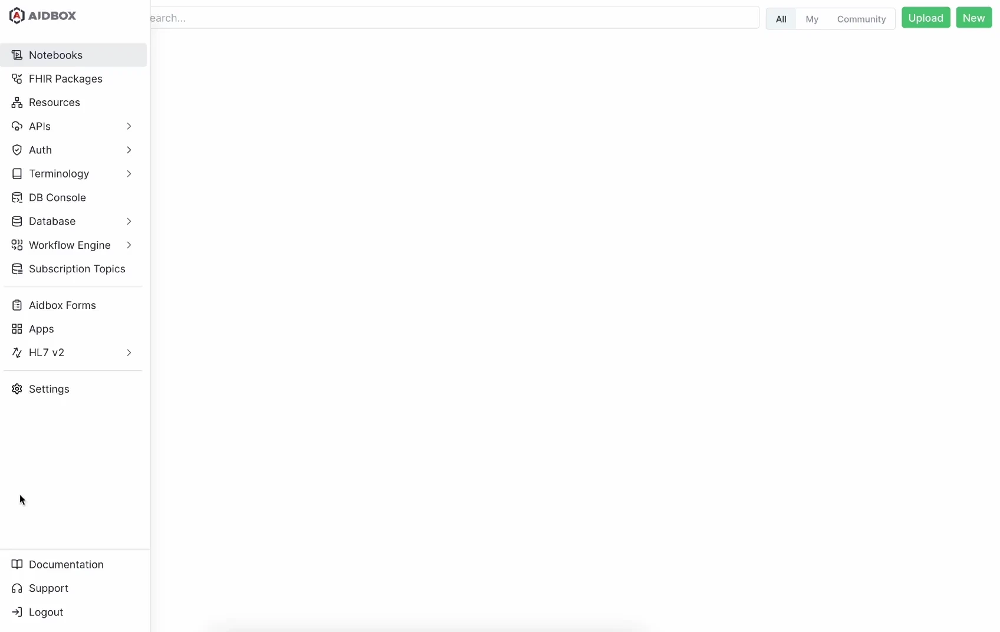

The FHIR Specification v5.0.0 provides a wide spectrum of FHIR resources (157 to be exact), APIs, and frameworks, but it has almost no mandatory requirements. For example, all elements in the Patient resource are optional. This basically means that you can create a Patient resource with no data. However, this is absolutely impractical.

Therefore, the spec often needs to be constrained and extended. And that’s done with the help of Implementation Guides (IGs) that restrict and extend APIs, resources, and terminologies, to suit specific use cases.

In addition to regional or national IGs like the US Core IG for the US and NHS FHIR IG for the UK, there are also domain-specific IGs that provide guidance for using FHIR resources in particular healthcare domains or for specific use cases, like mCODE for oncology, Argonaut Project IGs for data exchange between providers and payers, QI Core IG for representing quality measures using FHIR, DAF IGs for enabling patients to access their health data, IHE Mobile Access to Health Documents (MHD) IG for sharing documents across enterprises and more. Adding to that, healthcare organizations can create their own IGs to address specific requirements or workflows.

With over 700 IGs available, they play a crucial role in defining how your FHIR server should behave. But how do you load an IG into a FHIR server and make it work? That’s where things get tricky!

In this blog post, we'll explore 4 possible ways to configure IGs in the [Aidbox FHIR Platform](https://www.health-samurai.io/aidbox). This includes uploading an IG:

- From the Aidbox package registry
- As a FHIR NPM Package
- Using FHIR CRUD API
- Using UploadFIG utility

**Let’s dive into what, how, and why each method can fit your needs.**

## Point of Challenge

Uploading IGs to a FHIR server can often seem complex, as the FHIR spec doesn't yet provide specific instructions. Implementers face several challenges, such as:

- Which package registry should I use?
- Can I trust the quality of the FHIR npm package and its manifest?
- How do I resolve package dependencies?
- and What should I do about canonical clashes?

On the user side, the methods for uploading IGs vary by server, with options like referencing a package from a registry or manually creating resources. Usually, servers support only one method, and these methods are often mutually exclusive.

There are attempts within the FHIR community to standardize this process, such as [UploadFIG](https://brianpos.com/2023/08/04/deploying-a-fhir-implementation-guide/) utility from Brian Postlethwaite, Senior Software Engineer at Microsoft. However, these efforts are still in their infancy, and not all FHIR servers support them.

In this Aidbox release, we are introducing all the possible ways to address these challenges. Let's review each of these and explore the pros and cons of each approach.

First, let's enable the new UI look, which is also available in this release. For more information about fresh UI, [watch the video on our YouTube channel](https://youtu.be/Q0tF61rBKvM).



## 1. Upload an IG from Aidbox package registry

This is the simplest way to enable a specific IG in Aidbox. Simply search for the required IG in the UI and select it. Aidbox will then download the IG and its dependencies, and enable it. The underlying implementation guide content is sourced from our package registry, which mirrors packages2.fhir.org, syncing daily to ensure the packages are processed, normalized, and optimized for use by Aidbox. To learn more about the packages available in the Aidbox registry, [see this page](https://docs.aidbox.app/modules-1/profiling-and-validation/fhir-schema-validator/supported-implementation-guides).


**Pros:** You can simply select the IG you need, and it will automatically load all dependencies.

**Cons:** If the IG you need is not available on packages2.fhir.org, it will also be missing from our registry, which can be problematic.

**👉 Click here to read more in the** [**Aidbox Docs.**](https://docs.aidbox.app/modules-1/profiling-and-validation/fhir-schema-validator/upload-fhir-implementation-guide/aidbox-ui/ig-package-from-aidbox-registry)

What if the IG you need is missing from the Aidbox package registry? No problem, here are alternative methods to upload an IG to Aidbox.

To explore this method firsthand try the [free version of Aidbox](https://www.health-samurai.io/aidbox#run). It provides a comprehensive environment to test all functionalities without limitations, making it ideal for development and experimentation.

## 2. Upload an IG as a FHIR NPM Package

For this approach, you first need a valid FHIR NPM Package in tar.gz (tarball) format. You can obtain this artifact from [Simplifier.net](https://simplifier.net/), produce it using SUSHI build/IG Publisher build, or create it manually by adding a package manifest to your conformance resources and placing them in a tar.gz archive. For more information about FHIR NPM Packages and package manifests, please refer to the FHIR NPM Package [specification](https://confluence.hl7.org/display/FHIR/NPM+Package+Specification).

For example, to get the FHIR NPM Package for the US Core Implementation Guide, execute the following command:

```javascript
npm --registry https://packages.simplifier.net view 
hl7.fhir.us.core@6.1.0
```

The output will contain a link to a tarball file. You can then provide this link to Aidbox or upload the downloaded tarball file. Aidbox will process the provided link or archive, obtain the packages that the uploaded package depends on from the Aidbox package registry, and enable this IG in Aidbox.

You may wonder, “What if my IG references another IG as a dependency that is also absent in the Aidbox package registry?” No worries, you can upload several FHIR NPM Packages at once by providing multiple links or archive files.



**Pros:** If an IG (or IGs) is not published on public registries, you can still load it using a straightforward approach with several preparations.

**Cons:** Requires some preparation, including obtaining the FHIR NPM Package artifact.

👉 **Click here to read more in the** [**Aidbox Docs.**](https://docs.aidbox.app/modules-1/profiling-and-validation/fhir-schema-validator/upload-fhir-implementation-guide/aidbox-ui/public-url-to-ig-package)

Another option is to manually create IG content, such as StructureDefinitions and SearchParameters.

To explore this method firsthand try the [free version of Aidbox](https://www.health-samurai.io/aidbox#run). It provides a comprehensive environment to test all functionalities without limitations, making it ideal for development and experimentation.

## 3. Upload an IG using FHIR CRUD API

You can easily upload your StructureDefinitions or SearchParameters by using the Aidbox FHIR CRUD API. This [tutorial](https://docs.aidbox.app/modules-1/profiling-and-validation/fhir-schema-validator/upload-fhir-implementation-guide/aidbox-fhir-api) provides clear examples of how to use this method. It's worth noting that if your profile references external profiles, like us-core-patient as its base, you need to preload us-core into Aidbox. Likewise, when dealing with a chain of interdependent StructureDefinition resources, ensure they are posted in the correct order.

**Pros:** Easily use FHIR CRUD API for uploading.

**Cons:** Need to preload external IGs if your profiles depend on them.

**👉 Click here to read more on the** [**Aidbox Docs.**](https://docs.aidbox.app/modules-1/profiling-and-validation/fhir-schema-validator/upload-fhir-implementation-guide/aidbox-fhir-api)

This leads us to an interesting effect — when a FHIR server supports real-time creation of conformance resources, it automatically supports the UploadFIG utility. This is the last IG upload method we want to discuss.

## 4. Upload an IG using UploadFIG utility

UploadFIG, created by Brian Postlethwaite, uses the FHIR CRUD API for conformance resources. It prepares packages, obtains dependencies, pre-validates conformance resources, and more before posting them to the FHIR server. For instructions on how to use this utility, please refer to [this tutorial](https://docs.aidbox.app/modules-1/profiling-and-validation/fhir-schema-validator/upload-fhir-implementation-guide/uploading-fhir-ig-using-uploadfig-library) in our documentation.

**Pros**: UploadFIG handles a lot of background work, allowing you to simply provide the package id to load it into the FHIR server.

**Cons**: Early in development, not widely adopted, and requires the .NET platform to be installed.

## Master the best practices of IGs configuration with Aidbox

In this blog post, we explored 4 effective ways to configure IGs in [Aidbox](https://www.health-samurai.io/aidbox). These methods include uploading an IG from the Aidbox package registry, as a FHIR NPM Package, using the FHIR CRUD API, and utilizing the UploadFIG utility. Each approach has its own pros and cons, providing flexibility to meet various needs.

Tips:

- Use the Aidbox package registry for the simplest and most automated method.
- Upload FHIR NPM Packages for more control and flexibility.
- Leverage the FHIR CRUD API for manual IG content creation.
- Try the UploadFIG utility for comprehensive package handling.

OK, so you've got a plan - the next step is to put it into practice. Try these methods in the Aidbox FHIR Platform and streamline your IG implementation process.

> **Ready to master IG configuration?** [**Try it in Aidbox today**](https://hubs.li/Q02zhyz50)**!**

Follow US

*Author*:   
[**Evgeny Mukha**](https://www.linkedin.com/in/evgeny-mukha-192293228),   
Full-Stack Software Engineer at Health Samurai
