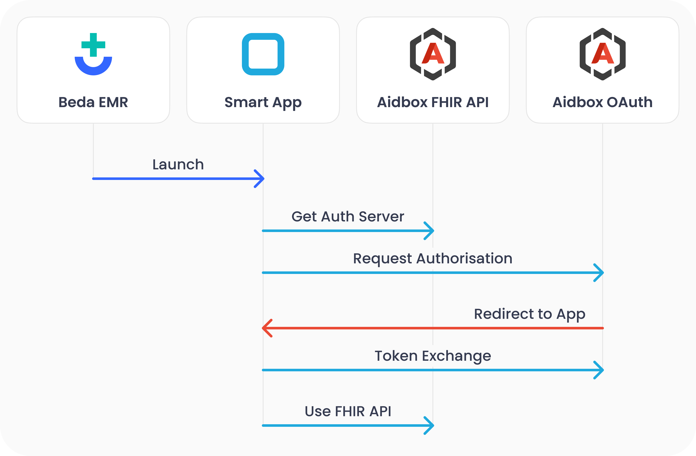
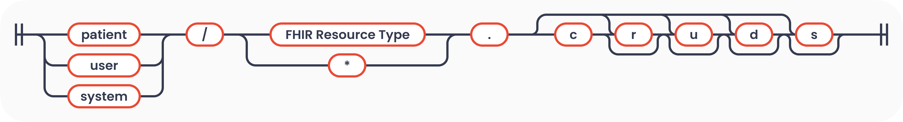
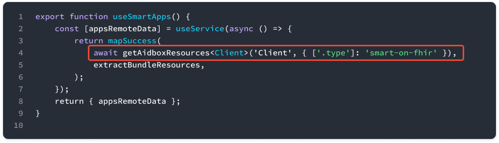
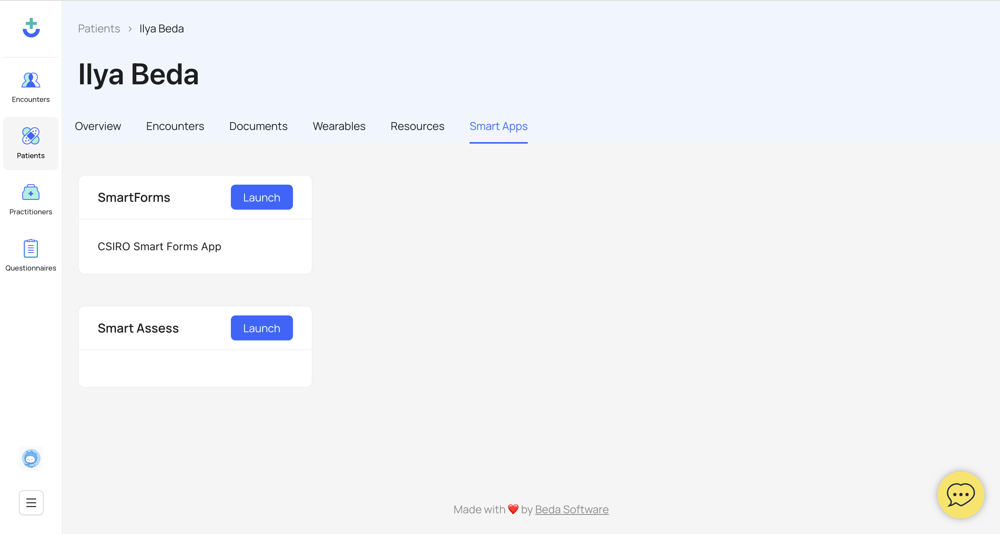
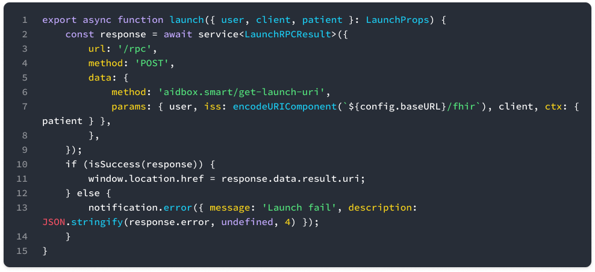
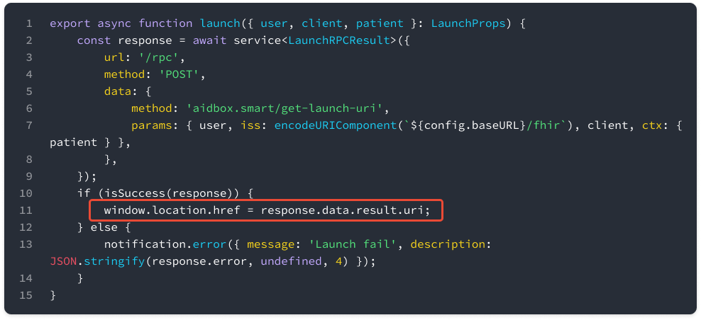
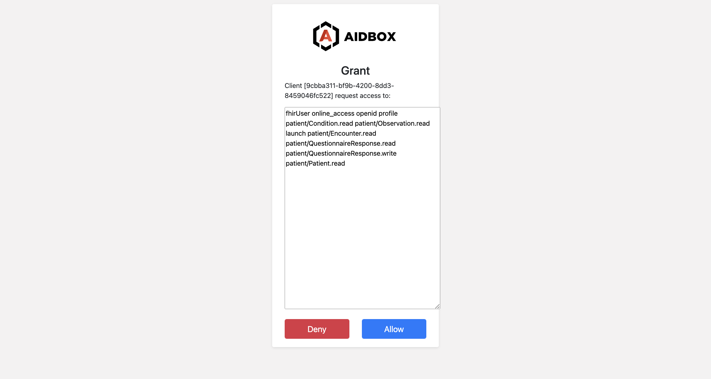
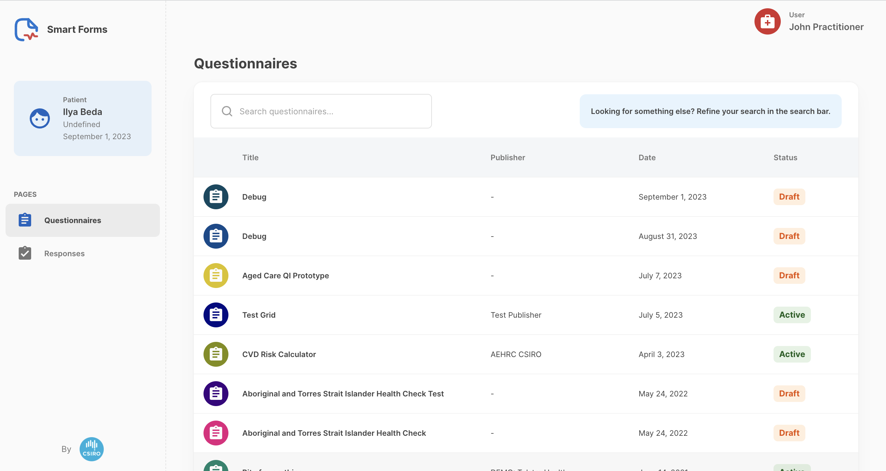
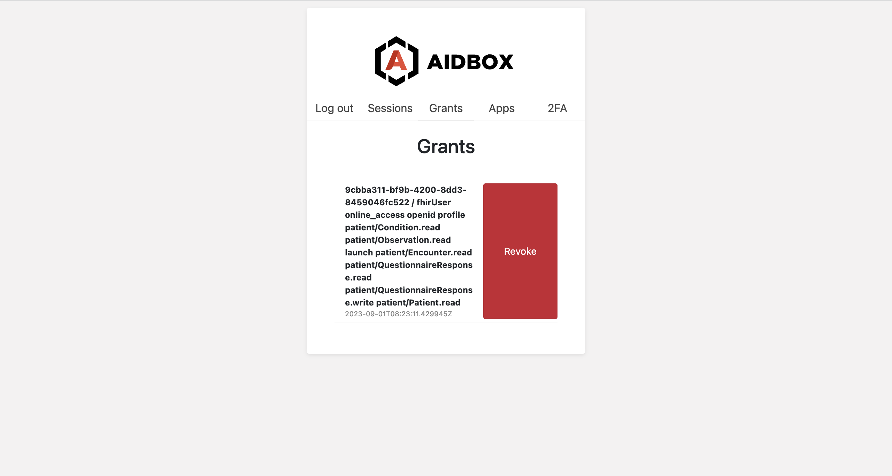

## FHIR EMR capabilities with SMART on FHIR applications

There is no such thing as an EMR or EHR that could cover all use cases. Instead of trying to build all the features you need inside one product, it’s usually better to provide external interfaces that could be leveraged by third-party extensions. FHIR provides a SMART App Launch implementation guide that covers this problem. This article offers a practical, step-by-step guide for software engineers looking for an efficient way to extend their healthcare applications.

My name is Ilya Beda. I’m CTO at [Beda Software](https://bit.ly/3qQBtnH).

At Beda Software we’re developing an [open source EMR solution](https://bit.ly/45BCBdI). It is designed to act as a frontend that turns any [FHIR server](https://www.health-samurai.io/fhir-server) into a FHIR EMR. Recently, I participated in the SMART Launch track of the HL7 AU FHIR Connectathon. I took on the SMART launch provider role and Beda’s EMR was used to launch third-party SMART on FHIR applications. The goal was to check how the implementation works and test integration between applications provided by participants.

Before diving into the technical details, let's clarify what SMART is. SMART (Substitutable Medical Applications, Reusable Technology) is a platform for creating healthcare applications that can run on different EHR (electronic health record) systems. It provides a framework for building secure, interoperable, and substitutable apps. SMART apps are designed to be easy to develop and deploy across various healthcare settings.

SMART on FHIR is built on top of OAuth 2.0, so it’s pretty easy to understand how it works.

The FHIR EMR initiates SMART launch by passing two parameters to the SMART app.

The first parameter, called iss, is a base URL of [the FHIR server](https://www.health-samurai.io/fhir-server). The second parameter – launch – is a unique sequence that tracks the launch process and assigns context to a session.

Once the app is launched, it loads information from the FHIR server about the OAuth authentication endpoint. It then redirects the user to the authentication endpoint. This authentication contains a list of scopes that defines permissions requested by the app. Let’s take a closer look at what a scope looks like:

The first part identifies the role. Patient means that the data will be restricted to a specific patient, while user means that data will be restricted to a specific user. If the user is a patient, they will only be able to access their own data. If the user is a practitioner, the data of all patients who have provided consent will be available.

Finally, system status provides access to all resources.

Resource type is self-explanatory, and defines a specific FHIR resource.

The rest are letter-coded operations:

- C for create;
- R for read by id;
- U for update;
- D for delete;
- S for search.

So, if your app needs access to a patient Observation, you need to provide the following scope: “patient/Observation.rs”.

If you would like to create any kind of QuestionnaireResponse resource the scope will be: “system/QuestionnaireResponse.c”.

Once the app requests scopes from the FHIR server, a user should authorize and grant permissions to the requested scopes. If this happens, the [FHIR server provides an access](https://www.health-samurai.io/fhir-server) code that could be exchanged for an access token, id token, and fhirContext.

When the FHIR EMR performs the launch it saves the context, which will be available under the fhirContext key in the token exchange response.

Now you are familiar with the fundamentals of SMART on FHIR and SMART launch, let’s see how it could be implemented with Aidbox.

The core component is the Client Aidbox resource, which represents the OAuth client. This resource also contains a smart field that is used to define SMART on FHIR-specific properties like launch URI, name and description:

The code could be accessed [here](https://bit.ly/3P3ASaj).

Now let’s build an app gallery page that shows all SMART on FHIR apps. To do this, we’ll need to query Client resources. Client resources aren’t used exclusively for SMART on FHIR, so some criterion is needed to select only clients that represent SMART on FHIR apps. I used the Client.type field and set it to the “smart-on-fhir” value. As a result, I can query all data like this:

The code could be accessed [here](https://bit.ly/3PnZHPv).

Here I am using the <https://github.com/beda-software/aidbox-react> library to interact with Aidbox custom resources.

Once the data is loaded, the FHIR EMR can render the SMART app gallery:

Let’s look at how to launch the app. Aidbox provides the RPC API for many internal functions.

The **aidbox.smart/get-launch-uri rpc** function generates the launch URI for the SMART app being used.

The code could be accessed [here](https://bit.ly/44CewlO).

Here you can see that the rpc method requires user, iss and ctx parameters. Ctx is a fhirContext as described earlier. I am using it to share information about a current patient.

The result of this call contains the URI that initiates the launch of the SMART app. I am using it to replace the current browser page:

The code could be accessed [here](https://bit.ly/45VivLr).

Once a user clicks on the launch button they will be redirected to the smart app, which in turn redirects us back to the Aidbox authentication endpoint, and then to the authorization page with a list of requested scopes.

Once the user grants access, Aidbox redirects back to the SMART app with the authorization code. This code is exchanged for an access token and fhirContext.

The app receives information about the current user and current patient.

If a user would like to terminate the app’s access to their data, they can revoke it using the Aidbox session interface:

## Live demo FHIR EMR

**You can find out how this process works using our live demo version of Beda EMR** [**here**](https://bit.ly/44Aoog4)**.**

As you can see, Aidbox follows the specifications we discussed earlier, and makes it possible to add SMART launch functionality to the Beda EMR in just a couple of days. I tested this approach during the HL7 AU FHIR Connectathon and it worked with all provided apps.

If you are interested in a FHIR-native EMR solution that is compliant with all modern standards, please contact [Beda Software](https://bit.ly/3qQBtnH).

To experiment with extending your EMR capabilities using SMART on FHIR applications, try the [free version of Aidbox](https://www.health-samurai.io/fhir-server). It provides a fully functional environment to test and develop these integrations, with all the necessary tools available without limitations.

Follow US

***Author:***

Ilya Beda, CTO at [Beda Software](https://bit.ly/3qQBtnH)

[Connect with Ilya via LinkedIn](https://www.linkedin.com/in/ilya-beda-6654147a/)

