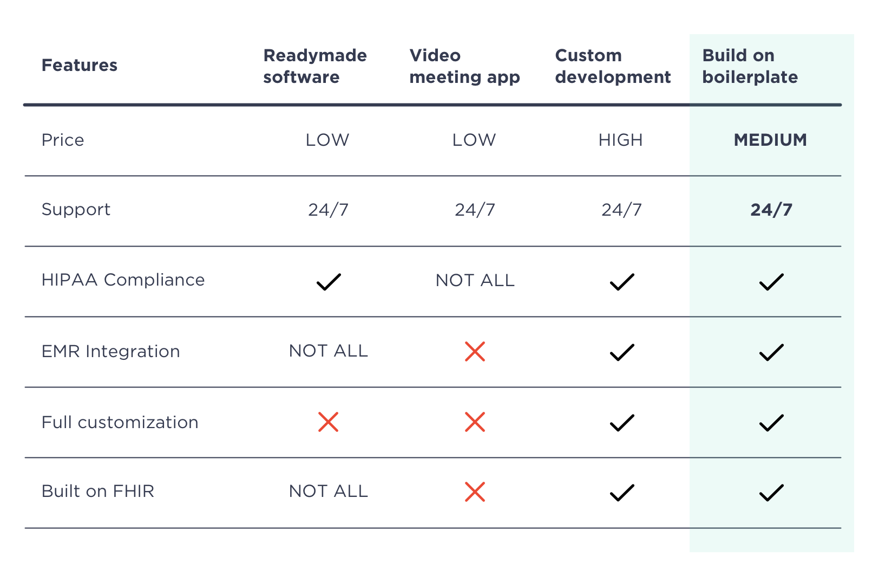
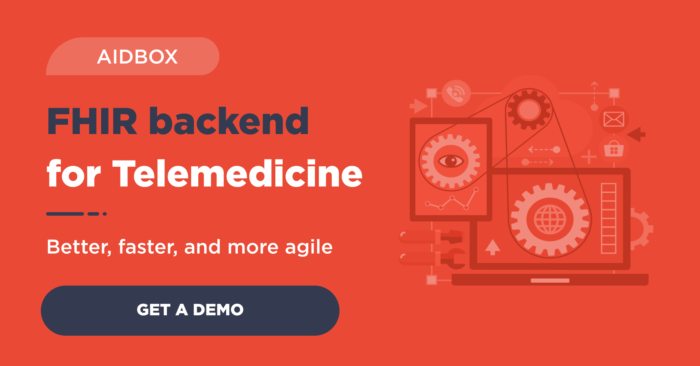

There is an ongoing debate about telemedicine in Health IT: can it really be as effective as in-person therapy? Even though a recent [report](https://www.cdc.gov/mmwr/volumes/69/wr/mm6943a3.htm?s_cid=mm6943a3_e&ACSTrackingID=USCDC_921-DM41453&ACSTrackingLabel=This) found a 154% increase in telehealth visits in 2020, a lot of care facilities still don't have their solution and remain on the lookout for the perfect telemedicine tool.

If you're thinking about telemedicine for your medical practice, there's one major issue: how can we successfully implement a telemedicine solution and then use it? The answer lies in the specific needs and requirements of your practice.

In order to make an accurate choice, let’s take a look at the table and examine the main merits and demerits of several telemedicine options.

*The data presented in this table is approximate. For more information consult telemedicine service providers.*

### **Ready-to-use telehealth platforms**

There are many resources available online where you can view and compare various telehealth applications. **The main advantage** of an out-of-the-box solution is that it's easy to learn and use, and there's always built-in support. Plus, most of them are HIPAA-compliant, which is a must in telemedicine.

But **the problem** resides in its core: it's almost impossible to find a virtual medical care tool that would fit your unique processes since most of these platforms meet standard demands only.

### Video conferencing applications

Although external video meeting tools such as Skype, Google Hangouts, and FaceTime are popular workplace apps these days, the challenge is that most of them **are not HIPAA-compliant**; therefore, patients’ personal data is not protected. Some of these video chat apps, for example, Zoom and Twilio, have plans for Healthcare, but it’s best to double-check whether they meet all your requirements for patient care.

  
A standard telemedicine consultation service is delivered through built-in tools that allow taking and sharing notes, sending notifications, etc. However, none of these video apps **have EMR system integration**, and, as a result, practitioners need to duplicate their notes into EMR after every online medical consultation. EMR in your telemedicine platform can significantly simplify the process by letting you synchronize all data.

### Develop your own telemedicine platform

Building a new telemedicine system from scratch has its benefits because you have **full control** over it and are **able to set up priorities** and detail functionality elements.

But it is, without a doubt, very **expensive** and requires you to put a lot of effort during the development process: working with a dev team, laying out the features, designing mockups, and more. Moreover, it will take ages until you can actually use it – developing a telehealth product from the ground up may take several years.

> Get started with the Aidbox [FHIR Server](https://www.health-samurai.io/aidbox) for data storage, integrations, healthcare analytics, and more, or [hire our team](https://www.health-samurai.io/services) to support your software development needs.

### Build a platform on a boilerplate backend

An alternative path is creating a telemedicine solution on a [FHIR boilerplate backend](https://www.health-samurai.io/telemedicine). This approach is recommended for anyone who needs an efficient tool for healthcare delivery **customized** for their specific business needs and processes.

The app built on the basis of earlier developments has **the same quality** as a ready-to-use solution but is **developed faster**, at a much lower cost, and, most importantly, **can be extended** and scaled vertically or horizontally at any time.

### How to get started?

With Health Samurai, it's easy to start the development process: at first, we delve into the business needs and goals of your medical practice, list your concerns and requirements, and then assemble a development team that creates your platform using our backbone solution.

The [backbone solution](https://www.health-samurai.io/telemedicine) consists of the powerful technological foundation: the full-blown FHIR backend, JS templates for web and mobile apps, and HIPAA compliant infrastructure. Template apps drastically reduce the development time while HIPAA-compliance results in a high standard of security.

Follow US

========

To see what your telemedicine application may look like, [contact us](https://bit.ly/38zVqBV), or visit our [Telemedicine page](https://www.health-samurai.io/telemedicine?utm_source=website&utm_medium=social&utm_campaign=article_on_telemed_software_alternatives).

