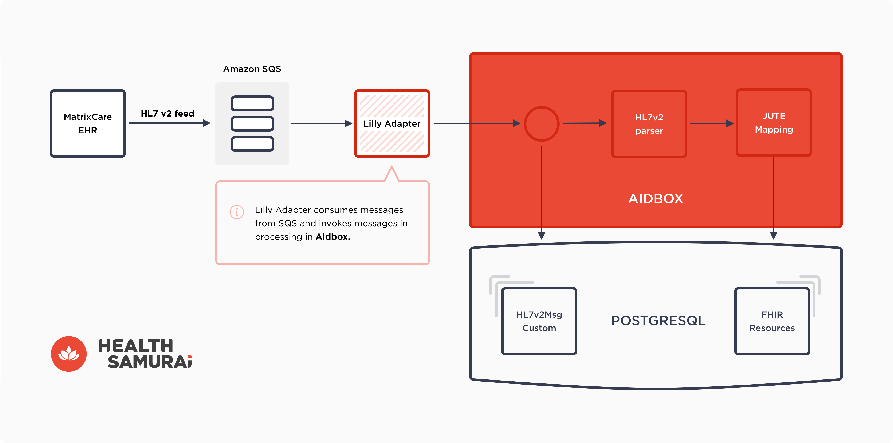
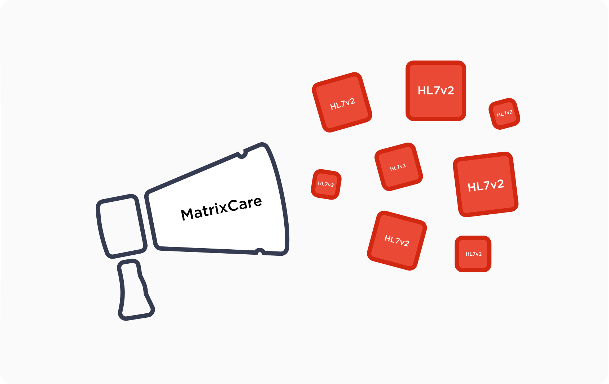
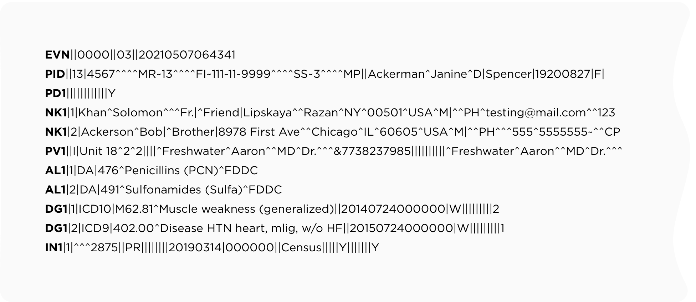
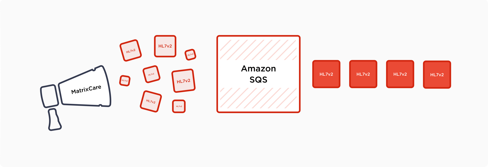
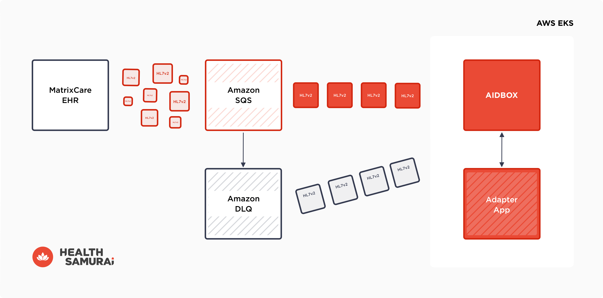
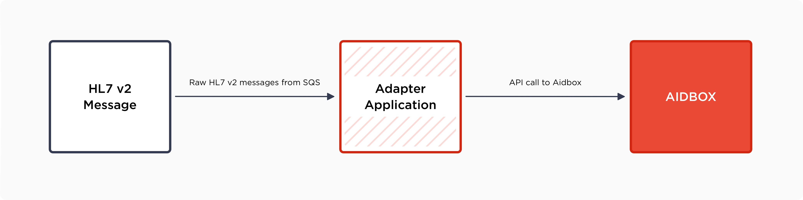
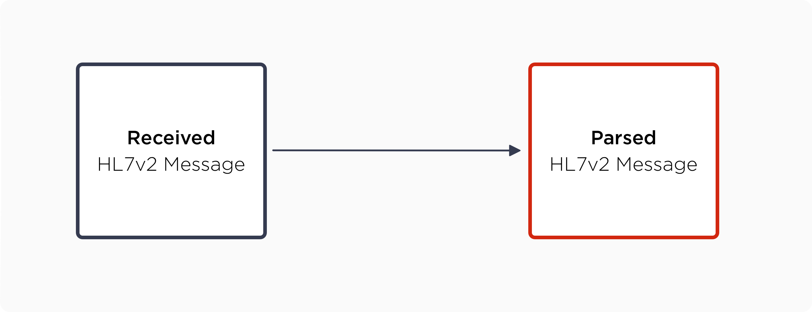
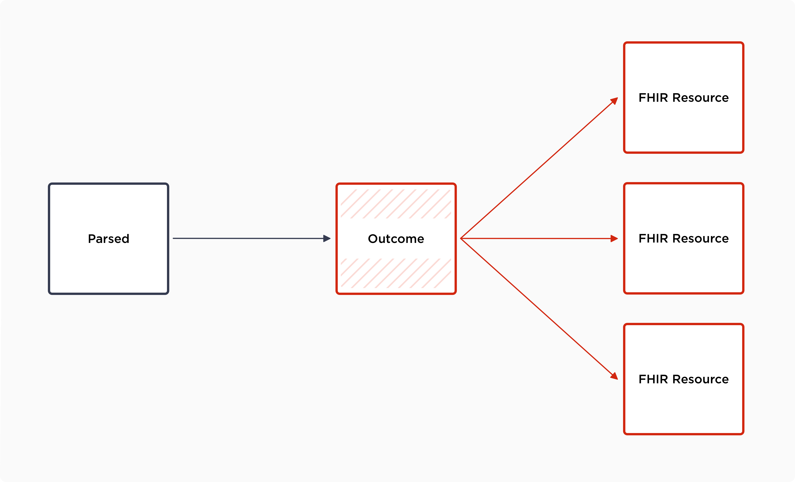
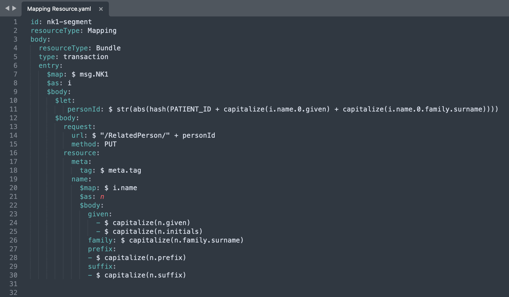

## **Abstract**

As of yet, there is no silver bullet for establishing a working ETL pipeline for transmitting an HL7v2 message feed from EHR into FHIR data out of the box. MatrixCare EHR is not an exclusion as soon as there are customization points. In this article, we are going to give examples of how we managed to ease the pain of integration and which instruments we used (spoiler: [Aidbox](https://www.health-samurai.io/aidbox)). We will also describe the core principles of the HL7v2-to-FHIR system configuration, for the benefit of anyone who may wish to build their own system from scratch.

FHIR data is a perfect informational model for:

- data aggregation for further analytics;
- creating an FHIR App store for health and providing data for smart apps;
- evolutionary enhancement of the current application or finding custom solutions for special tasks.

In order to give you a brief overview of the whole system, please take a look at this diagram which shows the full ETL pipeline for MatrixCare EHR by Health Samurai:

## **Common architecture**

In this post, we will be discussing MatrixCare EHR, though attentive readers may notice that the described experience is absolutely applicable to any other EHR because almost every system that is built in order to execute an effective ETL pipeline operates on the same principles.

So, consuming data from somewhere else starts with the **SOURCE** of that data!

## **Data source**

Our data source is MatrixCare EHR. It produces RAW [HL7v2 messages](https://www.hl7.org/implement/standards/product_brief.cfm?product_id=185). If you forgot or did not know what raw HL7v2 messages look like, here is a brief example. It is quite an old data format and is actually just a string divided into segments (and subsegments), and each of them stores useful medical information.

Strings are not the most convenient datatype, so they are usually parsed into human and machine-readable data structures (JSON, YAML, or EDN). There are open-source parsers for HL7v2 messages (e.g. [v2 to FHIR](https://github.com/HL7/v2-to-fhir/tree/master/mappings), [HL7v2 to FHIR converter by Linux For Health](https://github.com/LinuxForHealth/hl7v2-fhir-converter)), though [Aidbox](https://www.health-samurai.io/aidbox) provides a built-in feature for [parsing messages and persisting the result](https://docs.aidbox.app/modules-1/hl7-v2-integration).

Our source produces a huge number of HL7v2 messages like this:

MatrixCare EHR sends an ADT (Admit, Discharge, Transfer) HL7v2 message. It uses the 2.5 version of the HL7 standard. A message consists of the following segments:

- MSH (Message Header), NK1 (Next of Kin), AL1 (Allergies), DG1 (Diagnosis), PV1 (Patient Visit), PV2 (Patient Visit Additional), GT1 (Guarantor)
- there is comprehensive documentation for each segment, e.g: <https://hl7-definition.caristix.com/v2/HL7v2.5.1/Segments/MSH>

## **Queue**

It is hard to imagine a complex system without using data structures that provide disciplined access. Medical systems use queues for the following purposes:

- **delayed computation** - no one expects that all systems will handle all incoming data immediately, we just need to know that it will happen at a predictable time in the nearest future;
- **scalability issues** - we may add more consumers in order to process data faster;****
- **peak loads** - we do not expect that data flow will always be linear.

In our example, we use Amazon SQS (though we may configure our Application Adapter to work with almost any queue service). Amazon SQS has some interesting features. As well as parallel access, a deduplication mechanism, long polling and beautiful visualization it has one feature that we like the most. This is its **DLQ** or **dead letters queue.** If something unexpected happens during message consumption, SQS will try to deliver a message to the consumer, but after several attempts, it will be stored in the DLQ, from where it may be consumed manually or programmatically (spoiler: - yeah, our **Lilly** **Adapter** applicationhas an **API for reprocessing DLQ messages – POST “/$sqs-dlq-reprocess”**).

## **Where the magic starts!**

After the **extraction** of the HL7v2 message, we need to perform a transformation to FHIR. We actually have a video guide for this process:

- <https://www.youtube.com/watch?v=iSDX4UZpYO4>

As we mentioned earlier, there are various HL7v2 open-source parsers, but Aidbox provides built-in features to cover the **whole ETL pipeline**:

- Persist incoming messages in the database (Aidbox DB <https://docs.aidbox.app/storage-1/database>) to avoid data loss or data malformity;
- Parse message to human and machine-readable data structures (HL7v2 parser <https://docs.aidbox.app/modules-1/hl7-v2-integration>);
- Parse message to FHIR data using JUTE mapping language (data-DSL by Health Samurai <https://github.com/HealthSamurai/jute.clj>);
- Persist created FHIR resources in a database (AidboxDB again).

That is how it exactly happens:

- **Lilly Adapter** provides a listener (or consumer) that constantly asks SQS for new messages and, if there are any, initiates HL7v2 message processing,
- new incoming HL7v2 messages are saved in the HL7v2Message resource: src: "HL7V2MESSAGE" status: received  ****
- **Aidbox** provides a **job** that is waiting for new messages with **‘received’** status,

- after the message is seen by the Aidbox system, the message is **parsed** by[**Aidbox**](https://www.health-samurai.io/new-aidbox), the raw HL7v2 message becomes a human-readable data structure that may be returned as YAML or JSON, and is stored under the ‘**parsed**’ key in the same HL7v2Message resource:

- the **config** field should also be supported – **config** defines which set of **mappings** (you can read about them at <https://docs.aidbox.app/tools/mappings>) will be applied. **Config** is stored in the HL7v2Config resource, mappings are stored as a Mapping resource;
- so **parsed** data is input data for **mappings** and the result of the mapping application is stored in the **outcome** field:

> outcome = all\_mappings\_from\_hl7v2config(parsed\_field\_data)  
> 

- depending on whether both the parsing and resource creation process succeed, the message **status** is changed from **‘received’** to **‘processed’**. And if it fails, it is assigned an **‘error’** status. The **Lilly Adapter** applicationhas an API for message reprocessing. It may reprocess messages by different criteria as well as status, type of event, time period, etc. **‘Processed’** status means that all required FHIR resources were successfully created:

## **A little bit more on mappings**

**Mappings** serve several functions:

- they provide the **transformation** from **parsed** data to outcome according to the **custom** logic specified in mappings;
- they provide a mechanism for **persisting** data (some state that FHIR was created for interchanging data and not for persisting data, but we have an opposing view:  <https://www.health-samurai.io/articles/should-you-use-fhir-resources-as-your-data-storage-format>);
- the set of mappings applied to the parsed field is configured via the HL7v2Config resource, which you may read more about here: <https://docs.aidbox.app/modules-1/hl7-v2-integration>.

Mappings are written in a special DSL developed by the Health Samurai team – the **JUTE** mapping language. It is a lightweight and well-documented DSL with almost no learning curve and is designed in such a way that you **do not even have to be a programmer** to write your mappings. Nevertheless, you will sometimes face sophisticated cases that require sophisticated mappings.

Link: <https://github.com/HealthSamurai/jute.clj>

You might ask how mapping applications result in **persisting** data. We will try to explain this to you:

Mappings should contain a **‘request’** field which is actually an Aidbox API call, which will be executed as a result of a mapping application. As a consequence of the mapping application here, resources will be created and persisted in Aidbox Database.

To explore how Aidbox can enhance your integration with MatrixCare EHR, try the [free version of Aidbox](https://www.health-samurai.io/aidbox#run). It offers a complete environment to test and refine integration processes, providing all necessary tools without any feature limitations.

## **To sum up**

Here are the steps you need to take to establish integration with MatrixCare:

- provide an entity that fetches messages from MatrixCare (it can be almost any entity including Kafka or RabbitMQ, but we used AmazonSQS here);
- find a way to consume that message (from a queue or directly from EHR);
- parse the HL7v2 message from string to data structure;
- transform parsed HL7v2 into FHIR resources;
- save the result.

You might actually reinvent the wheel, but [Aidbox](https://www.health-samurai.io/new-aidbox) is already configured to make all the magic happen inside it. We persist, parse messages, translate them to the FHIR format and then persist the result. As you may have noticed, the adapter application is lightweight and you certainly can develop your own version of it, but we do not think this is necessary.

Mappings (used to transform data from parsed HL7v2 to FHIR resources) are a point of **customization**. Each EHR will probably need a unique set of mappings, but we also have some pre-made mappings for MatrixCare EHR that might be handy. We can provide any support at any point of the integration process.

---

Follow US

**Author: Artem Alexeev**

