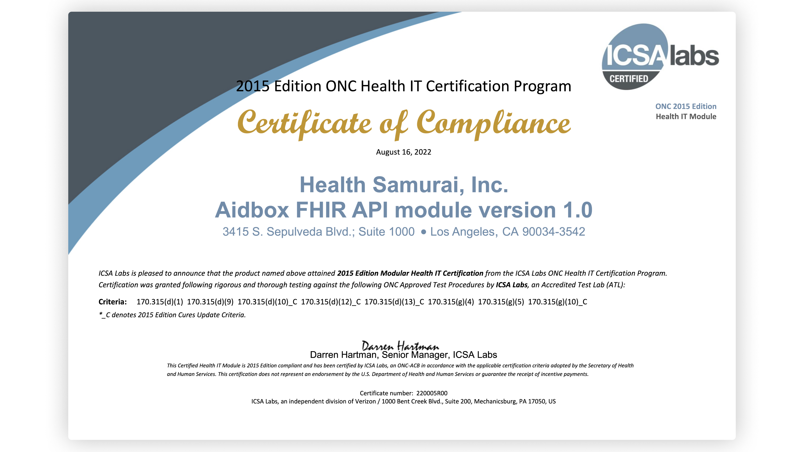

Great news for EHR vendors! We are happy to announce that the [Aidbox FHIR API module](https://www.health-samurai.io/fhir-api) is officially certified for **170.315(g)(10) criteria** by ICSA Labs. This means that you can enrich your existing EHR with it, get compliance automatically and strengthen your current solution with a pluggable FHIR API without any extra effort. **December 31, 2022** is close.

## **Why should you use it?**

The [Aidbox FHIR API module](https://www.health-samurai.io/fhir-api) will save you from

- developing your own FHIR API;
- certifying your existing EHR for [170.315(g)(10) criteria](https://www.healthit.gov/topic/certification-ehrs/2015-edition-cures-update-test-method);
- designing an ecosystem for third-party app vendors;
- deployment and maintaining this element.

You can just plug it into your existing ecosystem to unlock all the benefits.

To explore how the certified Aidbox FHIR API can benefit your organization, try the [free version of Aidbox](https://www.health-samurai.io/aidbox#run). It offers a comprehensive environment to test and integrate the API, providing all necessary tools without any feature limitations.

## **Want to TRY before you buy?**

No problem!We have an online sandbox for you to run online Inferno Tests. We are also happy to share our API documentation.

- [API documentation](https://cmpl.aidbox.app/documentation?_gl=1*jh2yba*_ga*MTQ5OTI2NDE0NS4xNjU4ODI0Njc4*_ga_G1Y6RVRQGD*MTY2MTE2Njk0OC40OS4xLjE2NjExNjY5NDguNjAuMC4w&_ga=2.51973344.872857224.1661166949-1499264145.1658824678)
- [Aidbox API Sandbox for online Inferno testing](https://cmpl.aidbox.app/)

Please reach out if you have [any questions or want to get a demo](https://www.health-samurai.io/fhir-api).

### Certification Details

> HIT Vendor: Health Samurai, IncDate Certified: August 16, 2022  
> Product: Aidbox FHIR API module version 1.0  
> CHPL Product Number: [15.07.07.3119.AI01.01.00.0.220816  
> ](https://chpl.healthit.gov/#/listing/10956)Certified Criteria:   
> 170.315 (g)(10)\_C, 170.315(d)(1), 170.315(d)(9), 170.315(d)(10)\_C, 170.315(d)(12)\_C, 170.315(d)(13)\_C, 170.315(g)(4), 170.315(g)(5)  
> \* *- \_C denotes 2015 Edition Cures Update Criteria*

Follow US
