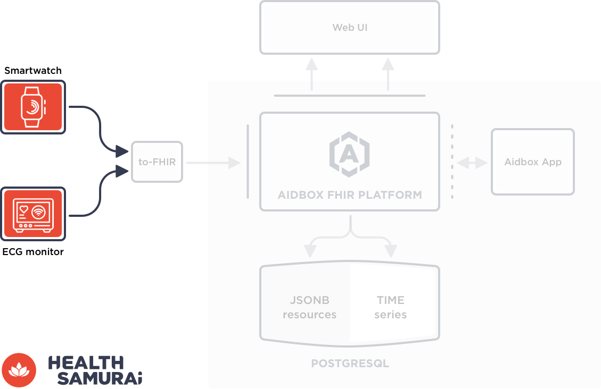
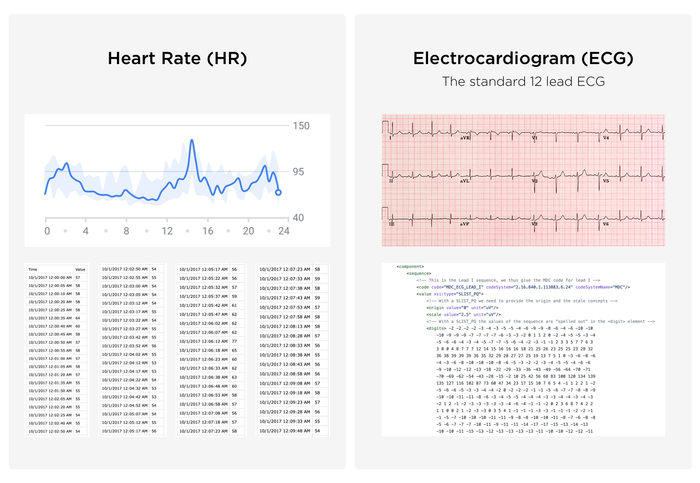
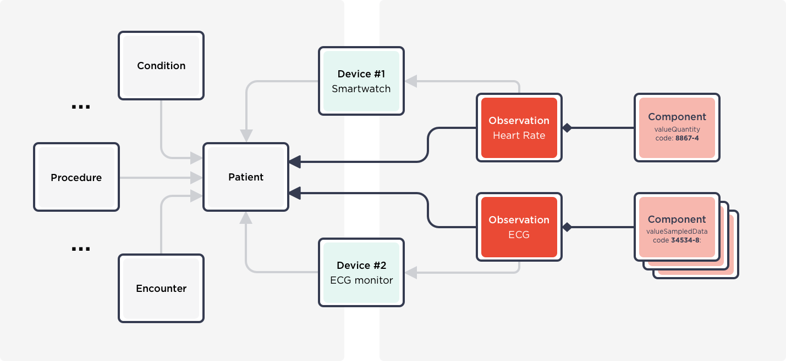
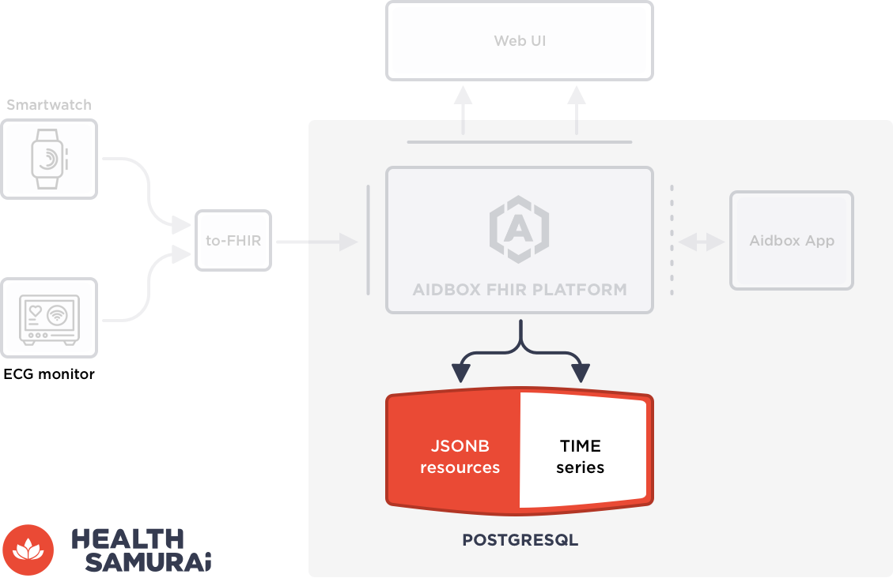
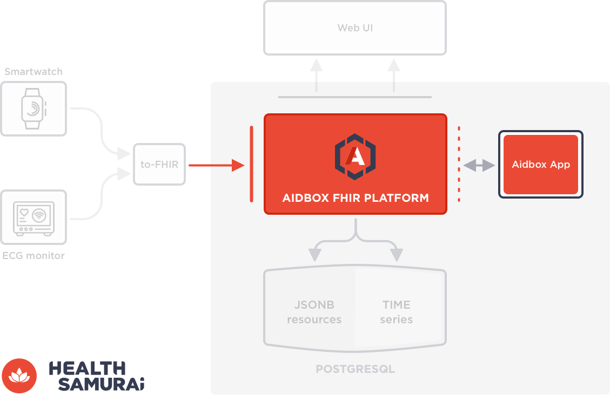
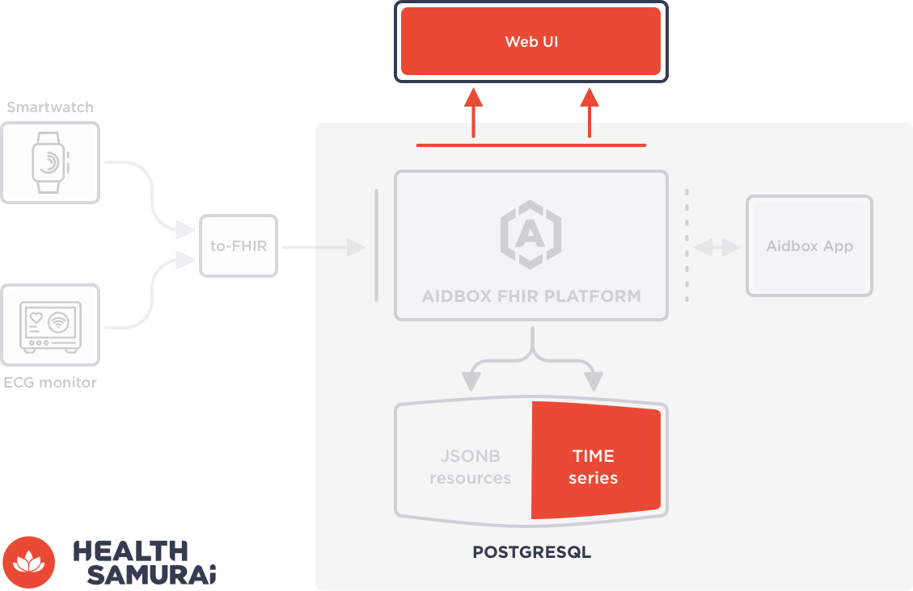
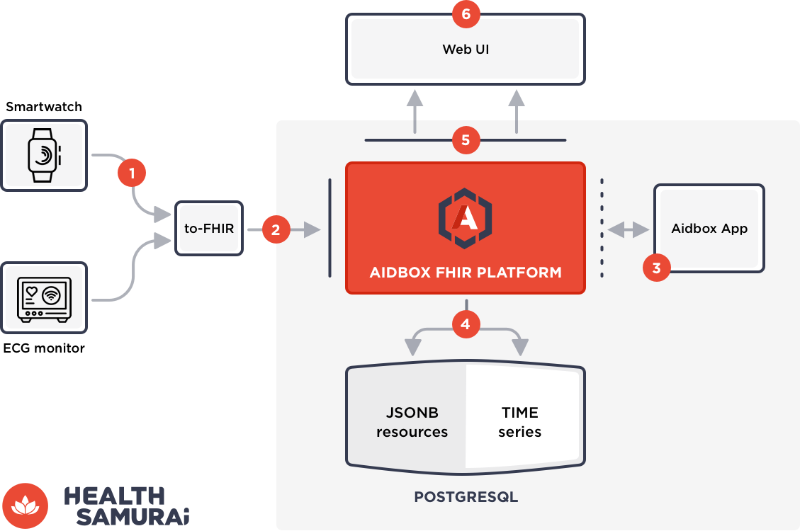
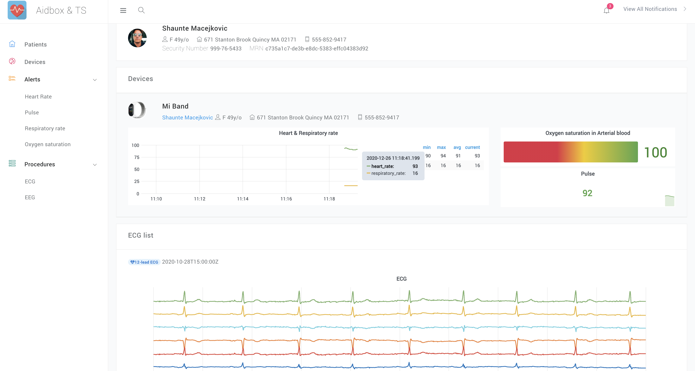

## **Challenge**

Medical IoT devices and wearables produce lots of data that helps to improve health outcomes. This data works only if it is integrated into patients’ medical records and available for comprehensive analytics, real-time alerting systems, and clinical decision support (CDS).

The challenge is that this time-series data has a different nature and structure than other [FHIR data](https://www.hl7.org/fhir/resourcelist.html) like patient data, allergies, diagnoses, etc. Time series data requires a special approach for being handled and stored.

This post demonstrates how to effectively integrate data produced by medical devices into the FHIR solution based on [the Aidbox FHIR platform](https://www.health-samurai.io/aidbox). Here you will find the FHIR model, a guide on how to adjust the Aidbox platform, and a link to the open-source project that illustrates this concept.

## **Solution concept**

Let’s imagine that we need to integrate data from a smartwatch and ECG monitor to the [FHIR medical records](https://www.hl7.org/fhir/resourcelist.html) that we already handle within our [Aidbox-based solution](https://www.health-samurai.io/aidbox). We’re going to receive the following measurements: heart rate (HR), resp rate (RR), SpO2, and ECG diagnostic results.

The raw data looks like this:

### **1. From raw to FHIR data**

Firstly, we need to convert raw data to FHIR. [HL7 FHIR](https://www.hl7.org/fhir/resourcelist.html) recommends using the [Observation Resource](https://www.hl7.org/fhir/observation.html) to exchange vital signs, ECG, and other measurable patient data. A possible solution is to model the data produced in the devices according to the [FHIR Observation Resource](https://www.hl7.org/fhir/observation.html) with the following component attributes:

### **2. From generic to hybrid PostgreSQL**

Secondly, Aidbox is built on top of PostgreSQL and we store FHIR resources as JSONB. For our case, we need to turn powerful Postgres into hybrid storage that can work with both JSONB and time series data effectively. The magic is the [TimescaleDB](https://www.timescale.com/) extension for Postgres. This extension just adds a special table type called [Hypertable](https://docs.timescale.com/timescaledb/latest/) for time series data and several additional options, such as [compression](https://docs.timescale.com/timescaledb/latest/how-to-guides/compression/), [continuous aggregates](https://docs.timescale.com/timescaledb/latest/how-to-guides/continuous-aggregates/), and etc.

As a result, we’re ready to keep storing basic FHIR data as JSONB and Observations as time series data in [hypertables](https://docs.timescale.com/timescaledb/latest/). This data will be referenced and work as a single dataset for external needs.

### **3. From standard to time series-friendly Aidbox**

The third step is to teach our Aidbox to handle and store Observations as time series data in hypertables, and other FHIR data as JSONB through the default mechanism. To achieve that we can override the /Observation endpoint handler from default to custom. Aidbox customers can do this through [the Aidbox Apps mechanism](https://docs.aidbox.app/tools/aidbox-sdk/aidbox-apps) and build a custom handler using a programming language of their choice. There are also [SDKs for Aidbox](https://docs.aidbox.app/tools/aidbox-sdk) and [additional APIs](https://docs.aidbox.app/api-1/reactive-api-and-subscriptions).

> 

> [Explore our comprehensive SDK](https://hubs.ly/Q02y4Vsz0) documentation to learn how to build custom apps and tailor the platform to your specific needs.

### **4. Turn on the power of TimescaleDB for alerts**

Voila – your UI or external systems can retrieve and visualize medical records and observation data through the standard FHIR API.

But the cherry on the cake is the ability to effectively use time series data linked to FHIR data for alerting and clinical decision support (CDS). [TimescaleDB](https://www.timescale.com/) provides a lot of engines on top of hypertables and [the continuous aggregates](https://docs.timescale.com/timescaledb/latest/how-to-guides/continuous-aggregates/create-a-continuous-aggregate/#create-a-continuous-aggregate) engine is one of these. For example, you can track and generate alerts in real-time when HR increases or SpO2 decreases. The conditions for alerts can rely not only on time series data but also on any FHIR data in your solution.

To make these alerts available for your UI or external systems/modules you can extend [the Aidbox API by using custom operations](https://docs.aidbox.app/tools/aidbox-sdk/aidbox-apps#operations). The handlers for these endpoints can be SQL-based or live in your [Aidbox App](https://docs.aidbox.app/tools/aidbox-sdk/aidbox-apps) near the /Observation endpoint handler.

### **5. End-to-end solution overview**

Let’s put all these ideas together in the end-to-end solution.

**#1** - Devices generate raw time series data,  
**#2** - The FHIR converter receives this feed, converts to FHIR Observations and posts them to Aidbox,  
**#3** - Aidbox handles Observations through the overridden /Observation endpoint via the [Aidbox App](https://docs.aidbox.app/tools/aidbox-sdk/aidbox-apps),  
**#4** - Received Observation Resources are stored in a [hypertable](https://docs.timescale.com/timescaledb/latest/how-to-guides/hypertables/) and have an association via patient reference,  
**#5** - The [TimescaleDB](https://www.timescale.com/) engine generates alerts based on predefined conditions,  
**#6** - Aidbox provides [FHIR data](https://www.hl7.org/fhir/resourcelist.html) through the [FHIR API](https://www.hl7.org/fhir/http.html) and alerts through custom endpoints,  
**#7** - The web UI visualizes this data and shows alerts for end users.

## **Bonus**

We love to reinforce words with practice and [opened the source code of the project](https://github.com/Aidbox/timeseries) with the implementation of this concept that one of our team developed within the internal Xmas hackathon for 48 hours. If you have a technical background you can refer to this code and interact with the ideas in practice with no barriers.

Open-source project: https://github.com/Aidbox/timeseries

## **Benefits**

In this post, we have described a very basic solution on how to integrate wearable and medical devices into the FHIR-first ecosystem based on the Aidbox FHIR platform. All parts of this pipeline can be adjusted and improved to support your real system loads. For instance, you can add queues for devices' data feeds or optimized FHIR-like API for Observations, etc.

To explore how Aidbox can facilitate the integration of data from wearables and medical devices, try the [free version of Aidbox](https://www.health-samurai.io/aidbox#run). It provides a complete environment to test and develop these integrations, offering all necessary tools without any feature limitations.

### Benefit summary

**# Simplicity** - monolithic solution with powerful hybrid storage based on PostgreSQL, **# All in one place** - FHIR data and time series data as a single dataset, **# FHIR-first** - minimum internal transformations, with FHIR used to exchange and store data, **# Customizable** - all parts of the solution can be customized thanks to the data-driven paradigm, **# Performance** - storages and engines are strongly optimized for both data types.

Follow US

Author: [**Mike Ryzhikov**](https://www.linkedin.com/in/fhir-solutions/)   
COO at Health Samurai

