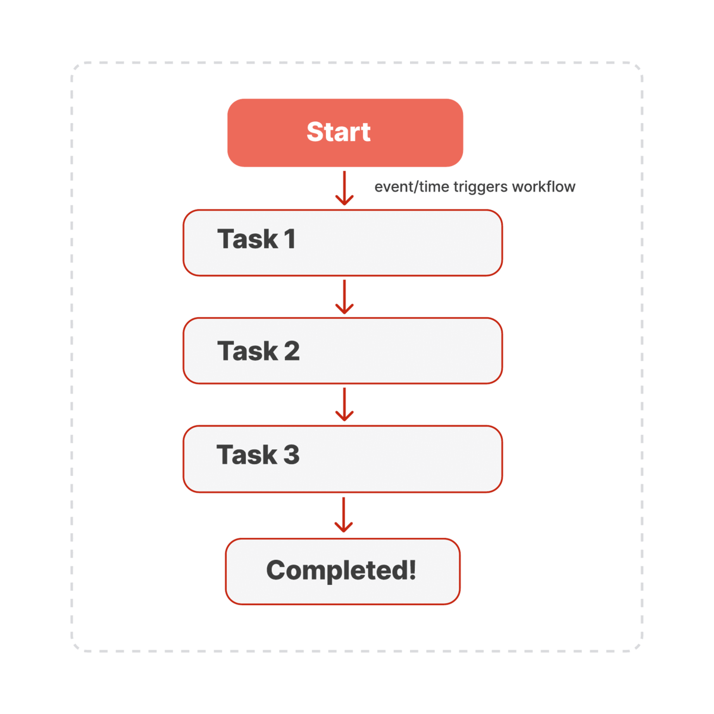
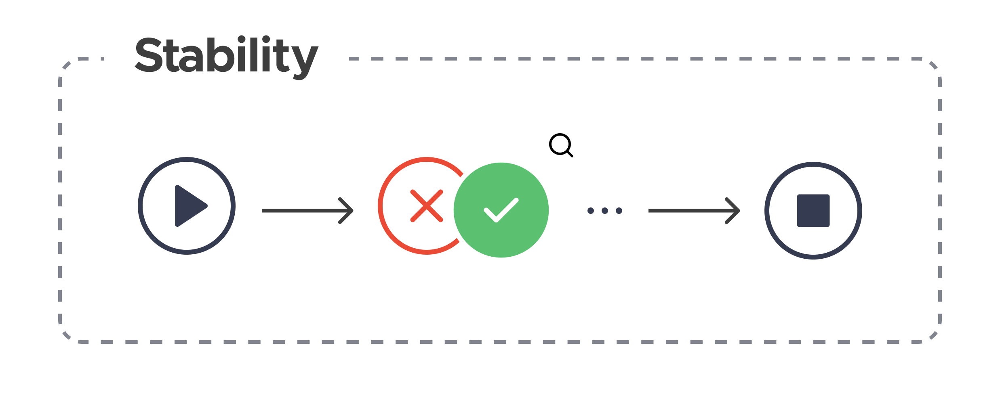
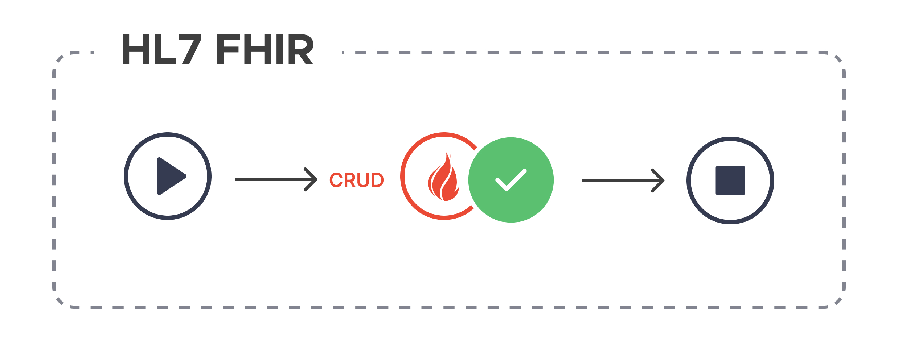
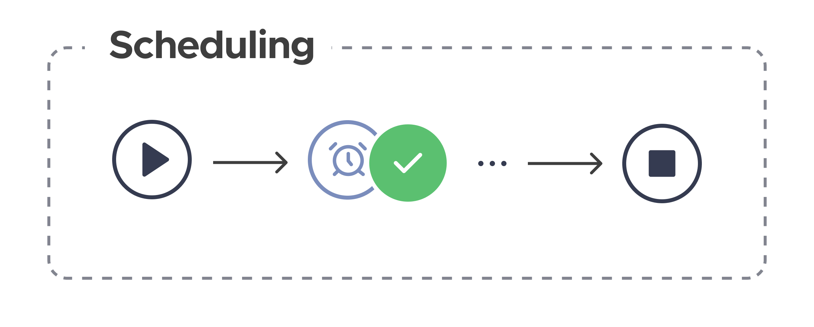
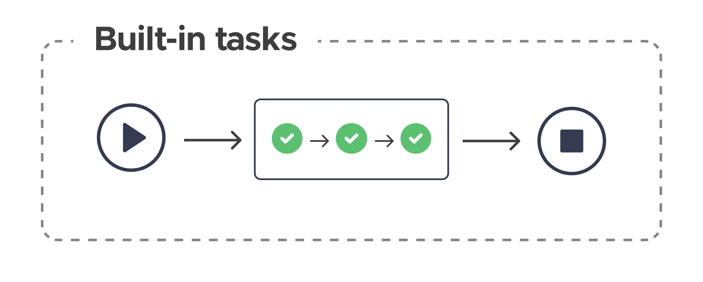
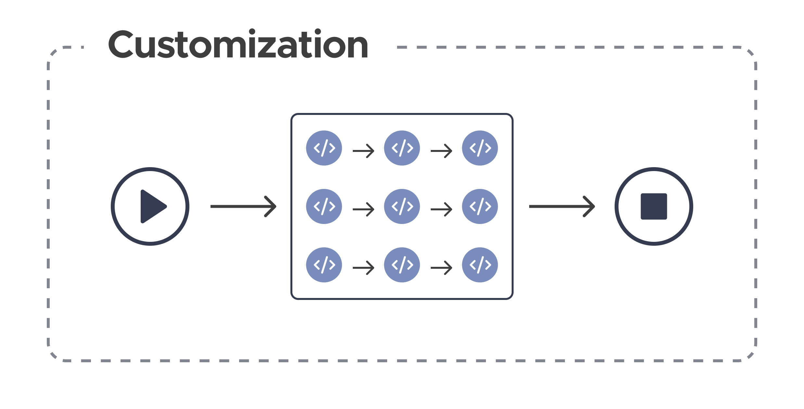
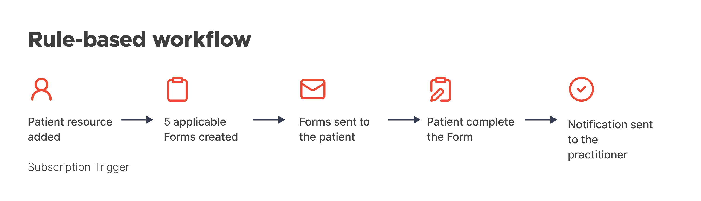
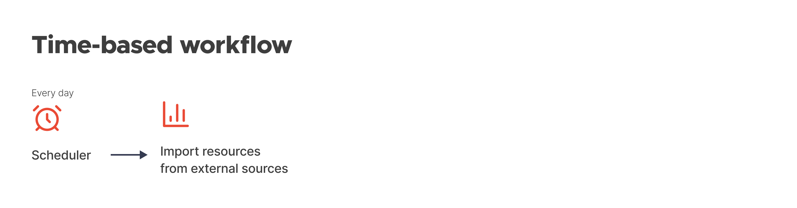
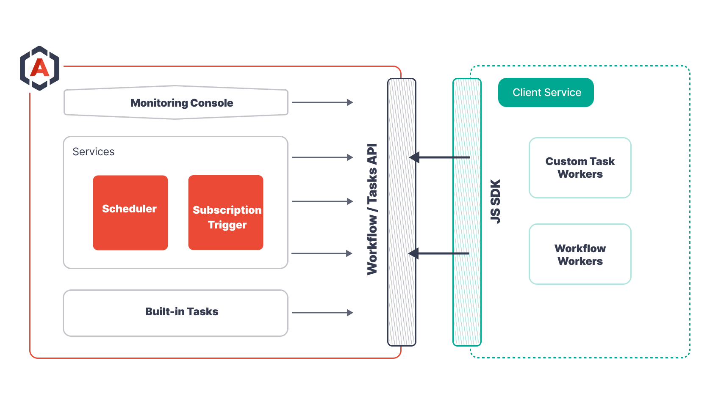
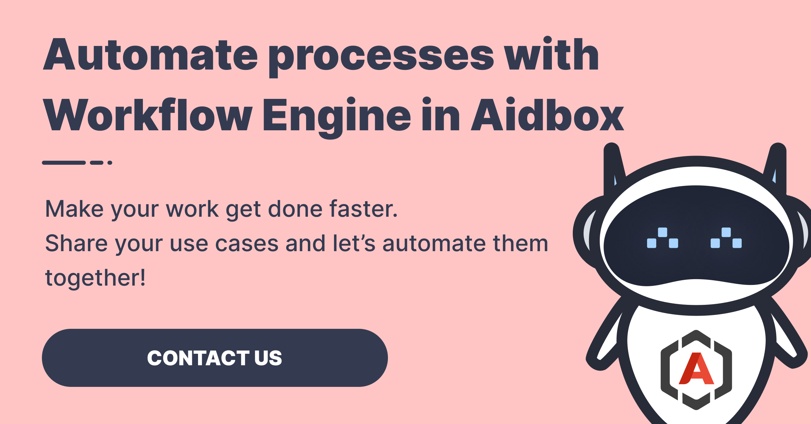

The automation of complex clinical, business and operational processes is vital for healthcare organizations seeking to optimize their workflows and provide high-quality care.

With this in mind, the Aidbox team decided to expand the portfolio with our own [Workflow Engine](https://docs.aidbox.app/modules-1/workflow-engine) designed specifically for digital health. In a nutshell, this resilient tool comes to the rescue when you need to automate numerous processes and claw back a lot of valuable time in order to focus on more important tasks.

## **One tool, many benefits**

Workflow engines, also called orchestration engines or even task managers, offer clear benefits. While their features may vary, both open source and commercial workflow automation tools tend to save significant time and money from a business perspective, and enable employees to focus on core activities that require human intellect.

Here's exactly what you’ll get with Aidbox’s Workflow Engine.

### **Stability and transparency**

Aidbox’s Workflow Engine provides built-in fault tolerance and durability to handle failures, retries, and error recovery without losing progress or data. Its user interface and API allow you to get real-time insight into workflow progress, performance metrics, and log history.

### **FHIR**

The Workflow Engine is seamlessly integrated with [the Aidbox FHIR Platform](https://www.health-samurai.io/aidbox), so you get direct access to FHIR resources and operations. Juggle healthcare data on the fly and automate basic CRUD operations, allowing you to create, read, update and delete resources.

> Get started with the Aidbox [FHIR Server](https://www.health-samurai.io/aidbox) for data storage, integrations, healthcare analytics, and more, or [hire our team](https://www.health-samurai.io/services) to support your software development needs.

### **Flexible workflow scheduling**

Aidbox’s Workflow Engine utilizes two core principles to trigger a workflow:

1. Event-based scheduling via Subscription triggers
2. Time-based scheduling via the Scheduler

Plus, you can always start a task or workflow process via the API for testing purposes or if it’s needed outside of scheduled or triggered events.

### **Built-in tasks**

Aidbox provides a range of preset tasks, including importing resources from AWS or GCP clouds into Aidbox, triggering subscriptions, mapping data, archiving data, launching forms, and more. This saves a ton of time since you’re working with reusable tasks, and the list is constantly growing.

### **Custom tasks and workflows**

You aren’t limited to built-in tasks – create custom workflows of any complexity using the JavaScript SDK or APIs.

## **Examples**

Check out these simple examples of how you can use automations to make your work easier and more efficient:

The workflow begins when a new Patient resource is added. This event triggers five forms to be created and sent to both the patient and the practitioner. The engine waits until the patient fills in the forms. Once all the forms are completed, this event immediately triggers the notification to be sent out to the practitioner.

In the above example of the scheduled workflow, the process initiates daily and imports all resources stored in S3 storage, ensuring the regular and automated transfer of data.

[***Check out the JS SDK***](https://github.com/Aidbox/aidbox-sdk-js/tree/main#workflow-definition) ***for more examples.***

## **Orchestrate anything (and never miss a beat)**

Do you already have an idea of what you want to automate? Follow these 4 steps to implement your workflow:

1. Select from the built-in tasks or implement your own tasks via the SDK
2. Implement workflow processes using the SDK
3. Trigger workflow execution by event or time, or run it manually via your API
4. Check workflow execution using the Monitoring Console

Follow US

To see how the Aidbox Workflow Engine can automate tasks in your organization, try the [free version of Aidbox](https://www.health-samurai.io/aidbox#run). It provides a fully functional environment to develop and test automated workflows, offering all necessary tools without any limitations.

## **Ready to automate workflows?**

The Workflow Engine is now available as part of the Aidbox FHIR platform. To learn more, [read the documentation](https://docs.aidbox.app/modules-1/workflow-engine) or [contact us with your use cases](https://www.health-samurai.io/contacts) and let’s bring them to life!

