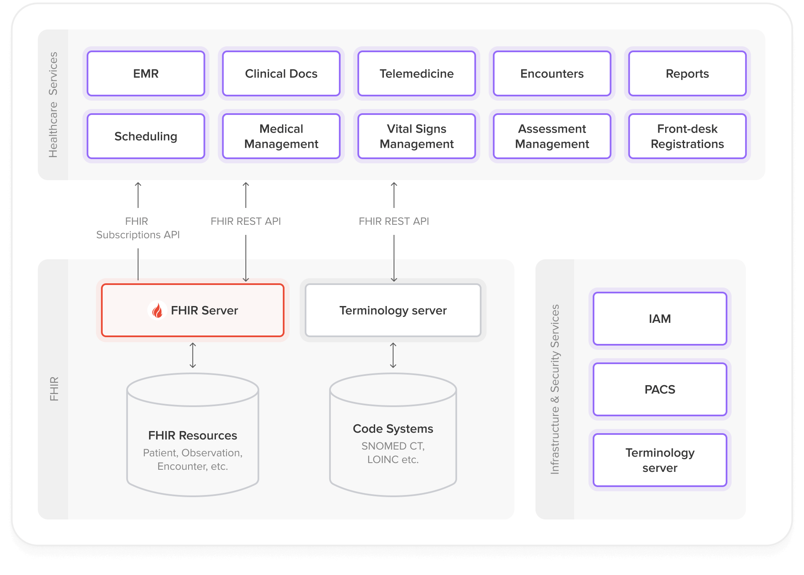
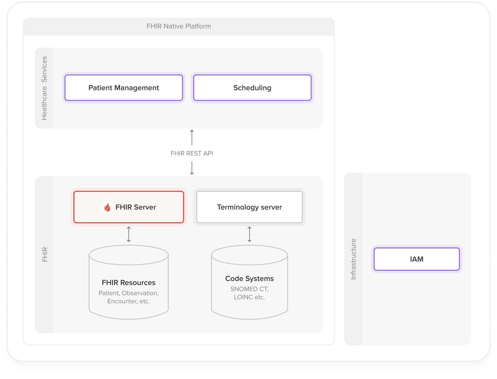
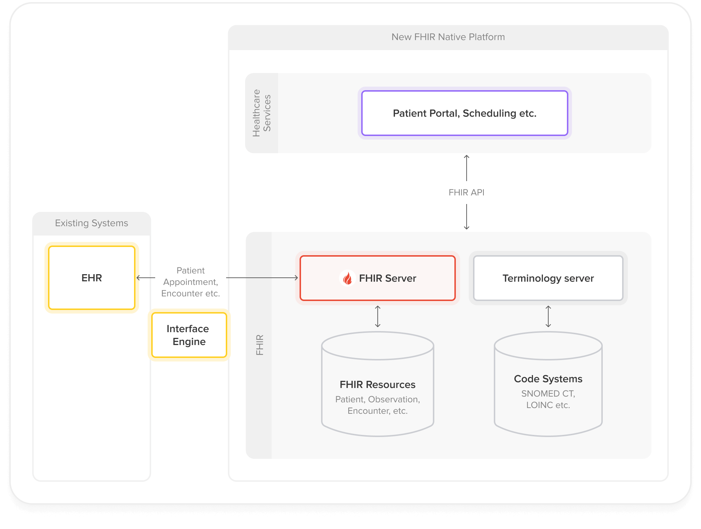
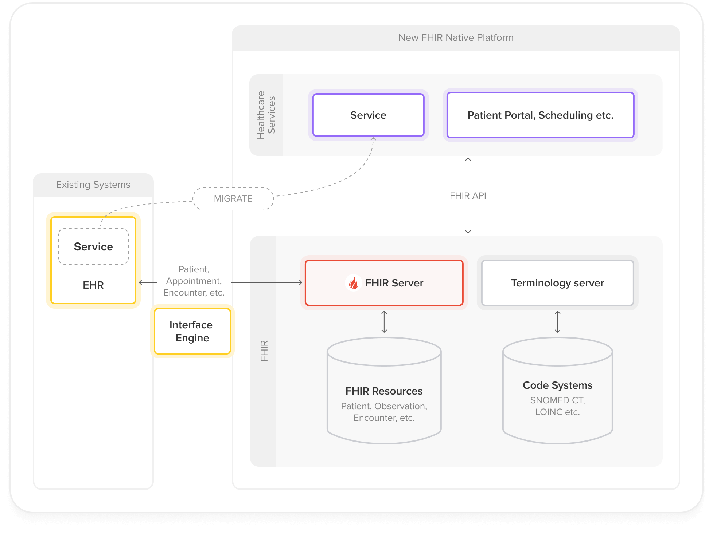
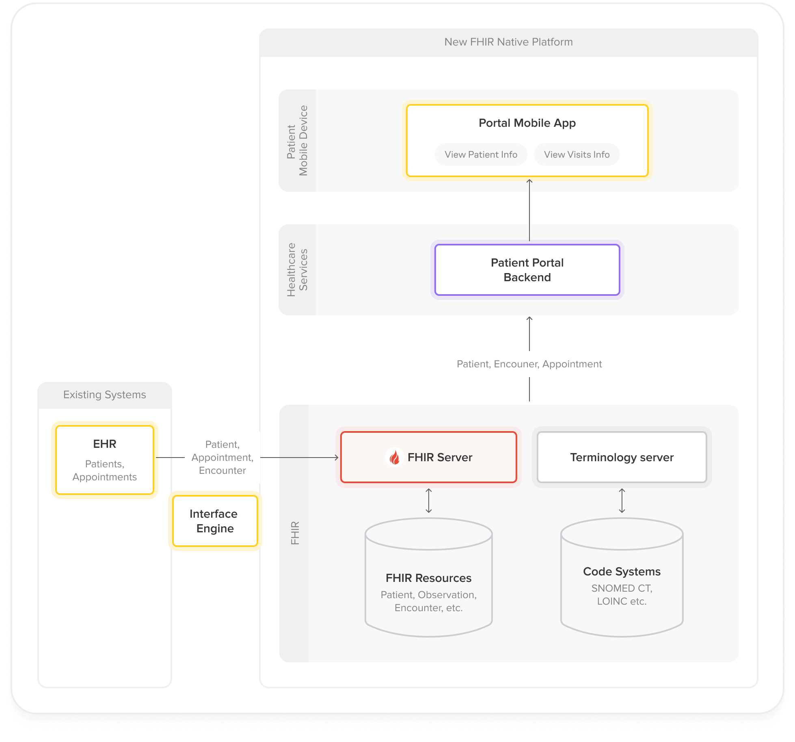
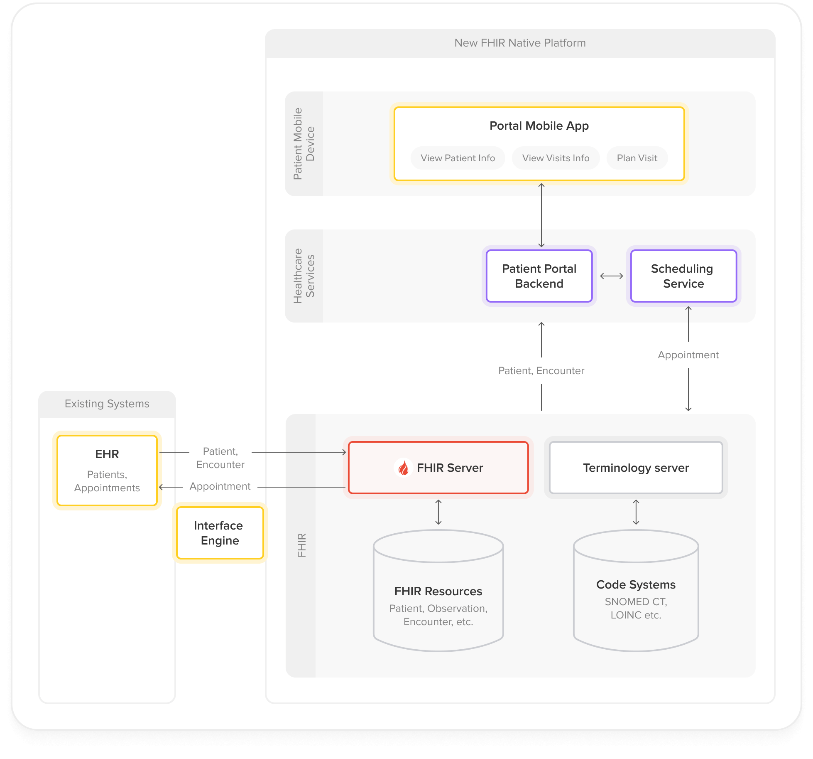
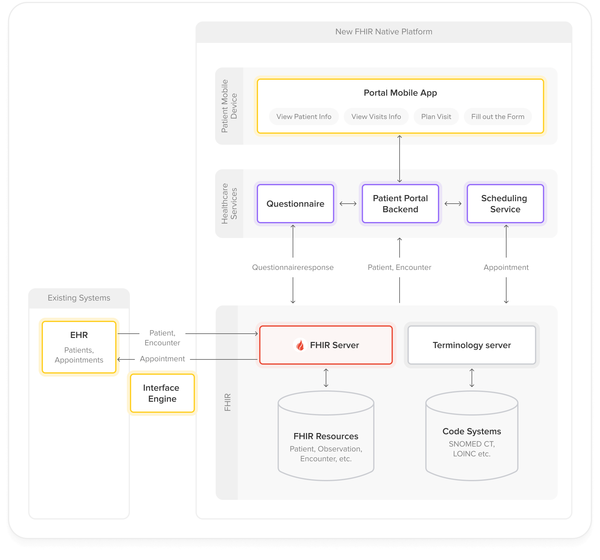

## Healthcare Microservices Architecture

Microservices is a widely adopted architecture pattern that structures applications as a collection of loosely coupled, independently deployable services. This approach enables multiple teams to develop components in parallel using different programming languages. Each team can choose the best technology for their specific service and scale it according to its unique demands without affecting other services.

For example, in a healthcare system:

- The Patient Registration service might be written in Java and handle 1000 requests/minute
- The Appointment Scheduling service could be in Node.js and handle 500 requests/minute
- The Clinical Decision Support service might use Python with TensorFlow to process 2000 patient cases/minute, analyzing lab results and suggesting diagnoses

A key challenge in microservices architecture lies in managing communication between services. APIs must be well-defined and stable to ensure seamless interaction while maintaining service independence.

This is where HL7 FHIR (Fast Healthcare Interoperability Resources) comes in.

## Why FHIR is Good for Microservice Architectures

Initially developed as an interoperability standard, FHIR provides several key advantages that make it especially well-suited for microservices architectures:

**1. Pre-built Domain Model**

Having a well-defined domain model is crucial for microservices architectures. Changing the model might affect the exposed APIs, which requires coordination between teams.

For example, adding a new field "preferredPharmacy" to the Patient resource would require updates to the Patient Management service, Medication service, Patient Portal UI, and all their APIs - requiring careful coordination across multiple teams.

FHIR provides:

- [**Healthcare-Specific Resources**](https://hl7.org/fhir/resourcelist.html): Comprehensive set of 145 ready-to-use resources (Patient, Encounter, Observation, etc.) developed by healthcare domain experts through thousands of hours of collaborative work. Each resource type is an [aggregate root](https://martinfowler.com/bliki/DDD_Aggregate.html) in terms of DDD (Domain Driven Design).
- [**Extensibility Framework**](https://hl7.org/fhir/extensibility.html): Ability to extend and constraint base resources for specific use cases using [Profiling](https://build.fhir.org/profiling.html). E.g. you can add extensions to Patient resource to store information that was not included in the FHIR specification or make some elements in the Patient resource mandatory without breaking the interoperability rules. Check the [US Core Patient Profile](https://build.fhir.org/ig/HL7/US-Core/StructureDefinition-us-core-patient.html) as an example.
- [**Implementation Guides**](https://build.fhir.org/implementationguide.html): Ready-to-use blueprints for implementing specific healthcare domains in FHIR. These guides provide Extensions, Profiles and Operations for particular subdomains (like [Scheduling](https://fhir.org/guides/argonaut/scheduling/), [Oncology](https://build.fhir.org/ig/HL7/fhir-mCODE-ig/index.html), etc).

**2. Standardized Terminology Management**

There are a couple of popular huge code systems in healthcare:

- SNOMED CT (over 350,000 medical concepts)
- LOINC (nearly 100,000 laboratory test codes)
- ICD-10 (around 70,000 diagnosis codes)
- RxNorm (over 100,000 medication codes)
- etc.

It's a challenge to design a way to store and use concepts from these code systems in your microservices. For example, when recording a patient's diagnosis:

- The code "I21.3" in ICD-10 means "ST elevation myocardial infarction of unspecified site"
- The same condition in SNOMED CT is "401303003"
- Different services might use different code systems
- Codes need to be validated and mapped between systems
- Code systems are regularly updated with new versions

FHIR provides:

- [**Built-in Coding Systems**](https://hl7.org/fhir/terminologies.html): Support for standard medical terminologies (SNOMED CT, LOINC, ICD-10, RxNorm, etc.)
- [**Vocabulary Services**](https://hl7.org/fhir/terminology-service.html): Standard APIs for terminology validation and lookup. Example - when a clinician is entering a patient's diagnosis in an EHR system, instead of manually typing the diagnosis, they select from a FHIR terminology service that provides real-time SNOMED CT codes. Once entered, the data can be validated by the FHIR Server before storing it as a [Condition](https://www.hl7.org/fhir/condition.html) resource.
- [**Value Set Management**](https://hl7.org/fhir/valueset.html): Defined approach for managing code sets. Example - you can define a reusable subset of SNOMED CT codes as a ValueSet resource to provide clinicians with a focused list of diagnosis codes relevant to their specialty.
- [**Cross-Version Mapping**](https://hl7.org/fhir/conceptmap.html): Support for terminology versioning and mapping. Example: If ICD-10 updates, the system can map old diagnosis codes to new ones.

**3. Pre-built API Model**

The API management is an essential part of microservices architecture. You need to design the communication patterns for synchronous and asynchronous interactions between services.

For example, consider a patient discharge workflow:

- The Clinical service needs to synchronously check if medications are available
- The Pharmacy service needs to be asynchronously notified to prepare medications
- The Scheduling service needs to be notified to book follow-up appointments
- The Billing service needs to receive the final discharge summary

Without standardized patterns, each of these interactions would require custom API design and implementation.

FHIR did it for you.

- [**RESTful Interface**](https://hl7.org/fhir/http.html): Standard CRUD operations aligned with HTTP methods.
- [**Transaction Support**](https://hl7.org/fhir/http.html#transaction): Built-in support for atomic multi-resource operations that prevent dangerous partial updates. Example: When prescribing medication for a new diagnosis, either both the diagnosis and medication order are saved together, or neither is saved at all. This prevents dangerous situations where a medication exists without its associated diagnosis, or vice versa, which could lead to medical errors. If any part of the transaction fails (e.g., drug interaction check), the entire operation is rolled back automatically.
- [**Search Framework**](https://hl7.org/fhir/search.html): Comprehensive search capabilities with standard parameters. Example - you can create a single FHIR Search query that will return all the Patients that gave the consent to share data with particular Practitioner and include the related Encounter in the search results:

```javascript
GET /fhir/Patient?_has:Consent:patient:actor=<practitioner-id>&_has:Consent:patient:scope=Encounter&_revinclude=Encounter:subject
```

[](https://hl7.org/fhir/subscriptions.html)

- [**Subscriptions Framework**](https://hl7.org/fhir/subscriptions.html): Built-in support for event-based communication - applications can react on resource changes. Example: If a lab result is updated, the doctor's system gets an automatic alert.

## Target Architecture of FHIR-Native microservice solution

The first step to build a FHIR-native microservice solution is to decide on the data storage.

Two popular patterns are:

- [**Database (FHIR Server) per service**](https://microservices.io/patterns/data/database-per-service.html) - where each service has its own isolated FHIR storage
- [**Shared Database (FHIR Server)**](https://microservices.io/patterns/data/shared-database.html) - all services use the shared FHIR Server for storing all the FHIR resource

The **Database per service** architecture helps ensure that the services are loosely coupled. Changes to one service's database does not impact any other services. The downsides are:

- Managing/implementing multiple [FHIR Servers](https://www.health-samurai.io/fhir-server)
- Additional effort to implement transactions that span multiple services
- Implementing search across services is more complex

**Shared Database** appears to be more natural for FHIR-native microservice solution, because of the following benefits:

- **Reduced Implementation Effort**:
  - Pre-built CRUD operations and search capabilities across all resources
  - Built-in transaction support across resources
  - Simplified data consistency management
- **Data Consistency**:
  - Single source of truth for all FHIR resources
  - Atomic transactions across multiple resources
  - Easier referential integrity management
- **Lower Risk of Coupling**:
  - While shared databases often lead to tight coupling, this risk is mitigated in FHIR-native architectures. The FHIR model is inherently stable and extensible, eliminating the need for coordinated schema changes

The following diagram illustrates the target architecture of a FHIR-native microservice solution:



### Main components of the architecture

- **Healthcare Services**

Domain-specific microservices that implement business logic for different healthcare workflows (e.g., patient management, scheduling, clinical documentation). Interact with the FHIR Server through standard FHIR REST APIs and consume events via Subscriptions.

- **FHIR Server  
  **Shared data storage that:
  - Provides FHIR APIs for resource storage, retrieval and search
  - Notifies consumers of resource-related events via subscriptions
  - Handles data validation.

- **Terminology Server**

Manages healthcare vocabularies and code systems (SNOMED CT, LOINC, ICD-10, etc.). Provides terminology validation, lookup, and mapping operations to ensure semantic interoperability across the platform.

- **Infrastructure and Security Services  
    
  **Cross-cutting concerns including:
  - Authentication and authorization
  - API gateway and routing
  - Audit logging and monitoring
  - PACS (Picture Archiving and Communication System)

## Steps to Build a FHIR-Native System using Microservices Architecture

The implementation approach differs significantly between greenfield projects and legacy system modernization. While new systems can be designed with FHIR-native principles from the ground up, existing healthcare systems require a careful migration strategy.

### Greenfield project

For new healthcare systems, you can implement FHIR-native principles from the start using these steps:

1. **Resource-Driven Domain Decomposition**
   - Map business domains to FHIR resources  
     Example mapping:
     - Patient Management → Patient, Person, RelatedPerson
     - Scheduling → Appointment, Schedule, Slot
     - Clinical Documentation → Observation, DiagnosticReport, Condition
   - Define boundaries between microservicesWhile the optimal service boundaries depend heavily on your specific use case and system context, here are some guidelines to help with the decision:
   - FHIR provides some guidance on organizing resources into logical groups: <https://hl7.org/fhir/overview-arch.html#organizing>
   - Review relevant FHIR Implementation Guides (IGs) for domain-specific guidance, e.g. for scheduling: <https://build.fhir.org/ig/IHE/ITI.Scheduling/volume-1.html>
   - The resource definitions in FHIR specification are also a good source of inspiration, as they often provide information on related resources and their intended usage. For example: <https://hl7.org/fhir/appointment.html#scope>
2. **Infrastructure Setup**
   - Deploy a production-grade FHIR server
   - Implement security and authentication services
   - Set up monitoring and logging infrastructure
   - Configure terminology services
3. **Service Implementation**  
   - Start with core services (patient management, scheduling)
   - Use FHIR CRUD and Search APIs of the FHIR Server for working with FHIR resources from the microservices
   - Implement business logic in the microservices by designing and implementing operations on FHIR resources. Take inspiration from the FHIR Specification or Implementation Guides. For example, the [FHIR Scheduling IG](https://build.fhir.org/ig/IHE/ITI.Scheduling/artifacts.html#behavior-operation-definitions) has defined a set of operations for managing appointments

**Example architecture**



4. **Implement Additional Services**
   - Implement additional services (e.g., feedback collection)
   - Add features (e.g., notifications)
   - Use FHIR Subscriptions for event-driven communication

### Legacy System Modernization

1. **Strategic Service Selection**
   - Choose a well-bounded initial service for proof-of-concept (POC)
   - Consider high-value, lower-risk candidates like Patient Portal or Master Patient Index
2. **Integration Architecture**

Establish a two-way integration between legacy systems and the new FHIR-native microservices.



3. **Gradually Expand the FHIR-Native Footprint**  
   Migrate additional services incrementally:
   - Validate the POC service in production environment
   - Identify and prioritize subsequent services for migration
   - Gradually expand the FHIR-native footprint by adding new microservices and migrating existing ones



4. **Example: Patient Portal that Enables Patients to Schedule and Manage Their Visits**

Step 1: Start with a POC – patient portal that allows patients to view their Patient information and appointments.



Step 2: Add a new service for scheduling appointments.



Step 3: Add additional service for collecting patient feedback about the visits.



## Conclusion

While adopting a FHIR-native approach requires an initial investment in learning the FHIR standard and its implementation patterns, the long-term benefits far outweigh the initial learning curve.

A FHIR-native platform is:

- **Futureproof** – Ensuring long-term interoperability with other healthcare systems
- **Effective** – Reducing development time through standardized patterns
- **Robust** – Leveraging a mature, healthcare-specific standard
- **Compliant** – Simplifying adherence to regulations like US Core profiles for 21st Century Cures Act
- **Ecosystem-rich** - Benefits from the growing FHIR ecosystem of tools and implementations

Ready to implement FHIR-native microservices in your healthcare organization? At Health Samurai, we've helped dozens of healthcare organizations successfully transition to FHIR-native platforms. Whether you're starting a new project or modernizing legacy systems, our team can help you.

Connect with me, [Aleksandr Kislitsyn](https://www.linkedin.com/in/aleksandr-kislitsyn-297854112/), on LinkedIn to discuss your specific use case and learn how we can help you achieve your healthcare interoperability goals.
