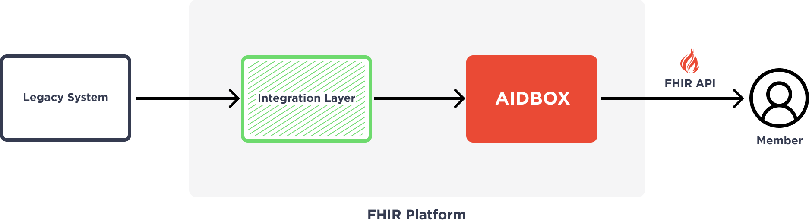
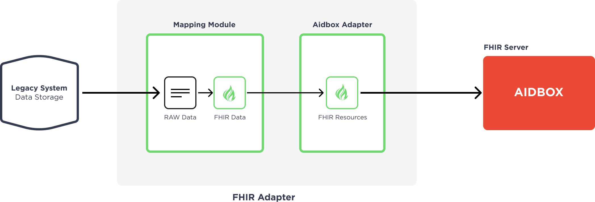
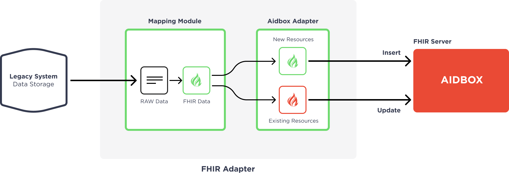
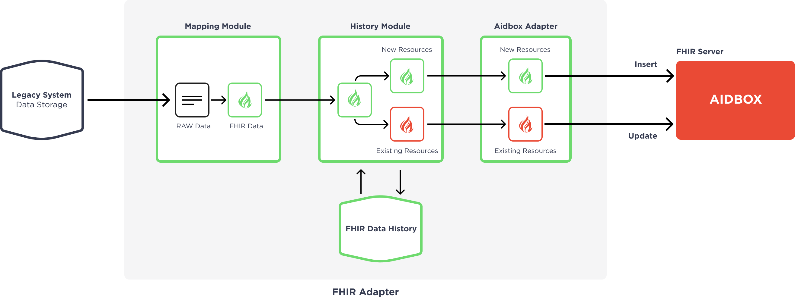
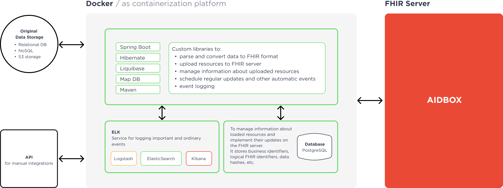
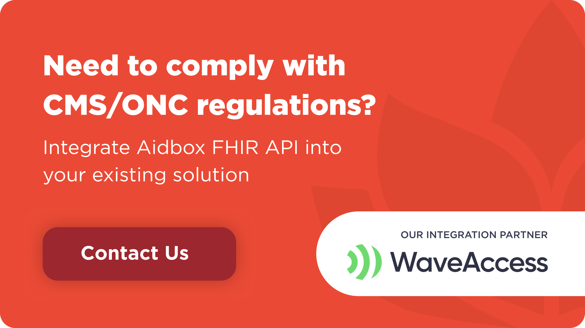

Are you facing the necessity of becoming CMS compliant? In this article, I would like to tell you about our experience making a US health plan’s legacy medical system CMS compliant.

First, let's discuss what CMS compliance actually is. According to the [CMS Interoperability and Patient Access final rule (CMS-9115-F)](https://www.cms.gov/Regulations-and-Guidance/Guidance/Interoperability/index), if a healthcare plan is working with CMS patients it should be compliant with the CMS rules. In short, to become CMS compliant, health plans should share their provider directories, claims, formularies, and clinical data with their members. This means that these health plans should have consistent medical data in the FHIR format as well as providing FHIR-compliant API access to this data.

Now let's look at our real-life experience in dealing with a US health plan and making them FHIR compliant with the new solution based on Aidbox. We will also go over our specific technical challenges and tell you exactly how we solved these problems.

This article will be useful for CTOs, technical managers, project managers, team leaders and other technical experts who are responsible for making their health information system CMS compliant.

Keep reading to find out about:

- The CMS compliance project origin
- Aidbox-based integration solution requirements
- Aidbox functionalities and features used
- Integration challenges
- Integration adapter structure and workflow

And a quick note about myself. My name is **Paul Chayka**. I'm a team leader and project manager at WaveAccess and I work with health information systems and FHIR integration.

# **Project origin**

Let me give you a brief overview of the project origin. The US health plan faced the necessity of becoming CMS compliant and started searching for the FHIR platform. They decided to use Aidbox and asked **Health Samurai** to integrate an [Aidbox-based solution](https://www.health-samurai.io/aidbox) into their existing digital ecosystem and implement FHIR integration of their medical data according to the CMS rules.

The results of the initial research showed that the structure of medical data in the client’s system was proprietary and a custom integration solution was required. So Health Samurai asked WaveAccess, **as a partner company**, to help with the implementation of the custom FHIR integrations and integration of the solution into the client’s environment.

# **Collecting requirements**

The first step is collecting requirements, so our team analyzed the client’s requests and prepared a list of requirements that the future integration solution should follow:

- Medical data should be converted to FHIR resources according to the CMS’ predefined FHIR Implementation Guides
- Medical data should be stored in the FHIR format in [Aidbox](https://www.health-samurai.io/aidbox)
- The integration process should be implemented on a regular basis according to the CMS’ predefined timeframes
- The solution should provide FHIR-compliant API access to this data
- Some datasets should be public and some should be protected

According to these requirements, the basic scheme of the solution is displayed below:

The legacy system sends medical data in the CSV format to the FHIR platform. This data is received by the integration layer that also performs the role of an adapter between the system and Aidbox. In this module, medical data is transformed into FHIR resources and sent to [Aidbox](https://www.health-samurai.io/aidbox), which also provides a FHIR-compliant API. It can be used by the developers of member portals and mobile applications to provide members with access to their data.

# **Aidbox**

Aidbox is a FHIR-based metadata-driven platform. It can be used as a FHIR storage which also provides a FHIR API, as well as a backend for the health information system. Aidbox provides certain functionalities and features that we used on this project. Let’s take a look at them.

### **FHIR storage**

As an advanced FHIR storage solution, Aidbox can be used to store all types of FHIR resources, including resources used in the FHIR Implementation Guides from the CMS rules. Moreover, Aidbox provides additional functionality for resource customization and creating new resources.

### **FHIR API**

Aidbox provides a FHIR API and API gateway. It follows all HL7 FHIR RESTful requirements and has all default search parameters from the FHIR resources. Aidbox users can also customize search parameters and create new ones.

### **Uploading data**

Aidbox provides several ways of uploading data:

1. [REST API](https://docs.aidbox.app/api-1/api). A REST API is a simple solution for creating and updating a resource. But if you need to load multiple records at the same time, this method is not suitable as you will have to make a large number of API calls.

2. [Batch Upsert](https://docs.aidbox.app/api-1/batch-upsert). For multiple records, Aidbox provides batch upsert. This allows users to enjoy all the advantages of the CRUD API, but for multiple records. This method makes it possible to control the upload status of each individual record. Aidbox immediately validates the records’ compliance with the specified profile and keeps a history for each record. If you need to upload a really large amount of data, this method is not optimal, as all the additional functions will slow down the upload.

3. [Bulk Import API](https://docs.aidbox.app/api-1/bulk-api-1/usdimport-and-fhir-usdimport). If you need to upload tens of thousands of records or more, it's better to use the Bulk API. It allows you to upload an unlimited amount of data at maximum speed. However, data validation will not be performed and the history will be disabled by default. You will have to control the quality of the uploaded data in advance. To upload data, you will need to generate a NDJSON file and upload it to a repository with a public link, or with signed URLs by Amazon S3 or Google Cloud Storage. Alternatively, you can add credentials to access the storage in Aidbox.

### **Security**

Aidbox comes with a built-in auth module out of the box, which provides:

- Various authentication server implementations (OAuth 2.0 and OpenID)
- Cross-domain authorization and Group management module
- Sign Up/Sign In workflows with email or phone number
- Sign in with Google, Facebook, Auth0 etc.
- Access by JSON Web Token for Aidbox as a resource server

[Aidbox](https://www.health-samurai.io/aidbox) provides a flexible model to customize request authorization rules. Users are allowed to declare a set of checks for all incoming requests. If the incoming request satisfies those checks, it's considered “Authorized” and processed further. Otherwise, the request is denied and the client gets the “403 Unauthorized” error. These checks are declared using the AccessPolicy resource.

### **Deployment**

Aidbox comes with an **automated** cloud infrastructure that is built on Kubernetes (K8s) for AWS, Azure & GCP and provides solutions for backups, monitoring, and logging out of the box. This infrastructure can be used to deploy other parts of the developing application. You can find a full list of Aidbox infrastructure features in the list below:

- Automated CI/CD pipeline: Drone CI / Kustomize for K8s
- DB replication and backups for high availability and disaster recovery
- Audit log based on Elasticsearch / Kibana / Grafana
- Monitoring based on Prometheus & Grafana
- File storage for storing files and documents
- SSL certificate manager to ensure encryption of data in the transfer
- All other HIPAA technical safeguards

> Get started with the Aidbox [FHIR Server](https://www.health-samurai.io/aidbox) for data storage, integrations, healthcare analytics, and more, or [hire our team](https://www.health-samurai.io/services) to support your software development needs.

### **Summary**

As you can see, Aidbox provides a high-performing FHIR server, cloud-based infrastructure, and secure FHIR-compliant API. It can serve as an end-to-end backend for a modern health information system. In this project, however, we faced additional challenges that required us to extend Aidbox with an additional integration module. In the next section, we will go over these challenges and look at how exactly our custom integration solution solved them.

Follow US

# **FHIR integration adapter**

### **Integration layer**

As I mentioned before, the client’s medical data didn’t follow any industry standard. Aidbox has a built-in EDI adapter for the most common standards of healthcare data, like HL7 v.2 and X12, but in our situation we needed to develop a custom integration solution. To begin with, my team prepared a list of the main functionalities for the future adapter:

- Connecting to the legacy system’s data source
- Converting medical data to FHIR resources
- Connecting to [Aidbox](https://www.health-samurai.io/aidbox)
- Sending FHIR resources to Aidbox

### **Common structure**

In the common case, the architecture of the adapter looked like this:

The Adapter received medical data from the legacy system, transformed it to FHIR resources, and sent it to Aidbox. During the development process, we faced additional challenges:

1. The legacy system contained a considerable amount of data.
2. Existing medical data could be changed over time.
3. There were no primary keys in the medical records.
4. The legacy system didn’t provide fields like “lastModifyDate” or other modification flags.

So we had to improve our adapter to solve these challenges.

### **Data consistency**

The integration processes should run on a regular basis. How can we make sure that the data in Aidbox is consistent? The easiest option is to remove all corresponding data from Aidbox before every integration and upload the data from scratch. The main disadvantage of this approach is the extremely long integration time. Usually, data doesn't change a lot, and if we could find a way to track changes and skip the data that hasn't been changed during the previous period, it would drastically improve the integration time.

At first, we need to split the incoming data into new and modified. The adapter scheme should look like this:

But how can we know what records are new and what records should be updated? Please remember that there were no primary keys in this data. To overcome this challenge, we need to add a new History module that will calculate the hashes of records and store them with the FHIR IDs. In this case, we can differentiate the new record from the existing one. Moreover, we can even tell whether the existing record has been changed and skip unnecessary update operations.

### **Data storage and logging**

To provide the functionality of the history module we need to store records’ hashes with FHIR IDs in the data storage. The adapter uses Aidbox’s PostgreSQL database for this purpose. We have a separate history table for each FHIR profile used in the integrations. For logging functionality, we’re using Aidbox’s ELK stack.

In some cases, the integration adapter needs to be deployed separately from Aidbox, for example where a client doesn’t want to expose their medical data storage outside their inner environment. In this case, the adapter can be installed separately in the secure client environment, while Aidbox can be cloud-based. To increase the adapter’s customization and preserve the client’s security level, we therefore added functionality for installing the adapter as a separate solution. It can use a custom PostgreSQL database for storing history data and a custom EKL instance for logging.

### **Adapter workflow**

The final diagram of our adapter is displayed below:

Firstly, the adapter reads the data from the legacy system’s medical data storage, and the data source can be represented in different forms. For example, the most commonly used is the SQL database.

After the data extraction, the adapter converts it to the FHIR-specified resources in line with the required Implementation Guides. As a result, it will get a set of consistent FHIR resources which should be uploaded to Aidbox.

After the conversion process, the solution calculates different hashes for the resulting resources and compares them against the already uploaded resources’ hashes. The adapter then determines which resources have been uploaded in the previous integration iteration and should be updated, which resources from the previous integration operation are now outdated, and which resources are new.

Finally, the adapter uploads and updates the new and updated resources and deletes the outdated ones. At the same time, it stores the new resources’ hashes in the database. Throughout the whole process, the adapter provides logs with a description of the current step of the integration iteration.

### **Technical details**

The adapter uses the following technology stack:

- Java 11
- PostgreSQL 11
- Spring 5, Spring Boot 2
- Hibernate 5, MyBatis 3
- Maven
- Amazon S3, Google Cloud Storage
- Kubernetes, Docker

The high-level architecture diagram is displayed below:

The Integration adapter is used to extract data from the client’s data source, convert this data to the FHIR standard, and send it to Aidbox. It can use Aidbox’s PG database as a history storage, as well as Aidbox’s ELK stack for logging. Alternatively, this solution can be deployed separately from Aidbox. In this case, the adapter can use its own PG database and ELK stack. It also has a REST API for manual initializing of the integration processes.

### **Technical summary**

We developed our FHIR integration adapter as an integration extension for Aidbox. It’s a customizable solution with a set of developed libraries for the efficient, fast and flexible execution of operations for reading data from various sources, converting it into FHIR resources, and uploading it to Aidbox.

To finish this section, I’d like to list the advantages of the FHIR integration adapter:

- The adapter uses and customizes reliable and evolving libraries. They provide a large number of opportunities for interacting with Aidbox, converting resources and other features, which can significantly reduce development time.
- The adapter provides out-of-the-box opportunities for integration with the most common types of data sources, such as SQL databases, S3 storage and others.
- The adapter provides various ways to interact with Aidbox, be it a single resource download, a batch download, an archive download etc.
- The adapter provides an incremental update capability that allows it to efficiently compute and load only the changed resources during each new update iteration.
- The adapter provides transactional operations and controls data integrity so that Aidbox does not contain inconsistent resources.

# **Conclusions**

In this article, we’ve shared our experience in helping a US health plan client to follow CMS rules. **We partnered with Health Samurai** and integrated [Aidbox](https://www.health-samurai.io/aidbox) into the client's digital ecosystem using the FHIR integration adapter, which was developed by our team. As a result, we have designed a fully customizable FHIR integration solution that can help any organization working with healthcare data to transfer it into the FHIR format and keep it consistent in a timely manner and without stress.

If you’re facing the necessity of becoming CMS compliant, want to integrate with the FHIR standard or just have any questions, contact us. We and the Health Samurai team will be happy to help you.

To explore how CMS compliance can be integrated into your systems, try the [free version of Aidbox](https://www.health-samurai.io/aidbox#run). It offers a comprehensive environment to test and implement compliance measures, providing all necessary tools without any feature limitations.

*Author*:   
**Paul Chayka**,   
Healthcare solution expert | Project Manager and Team Leader at [WaveAccess](https://www.wave-access.com/)

