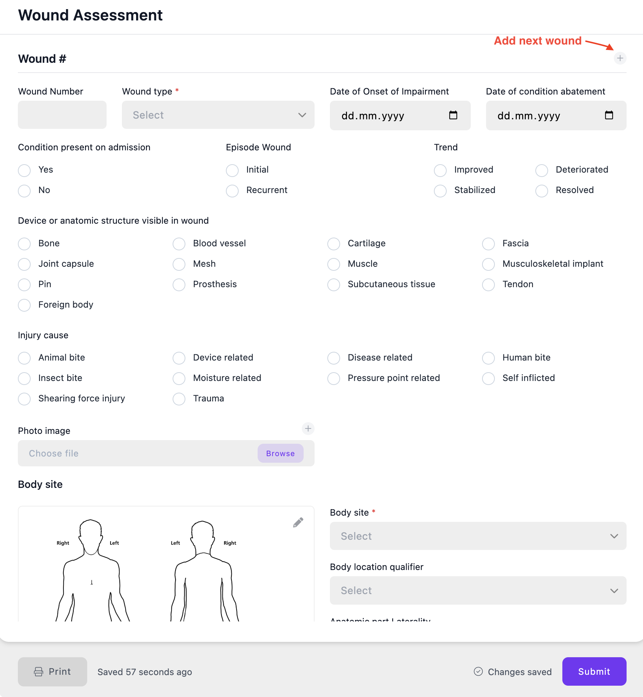
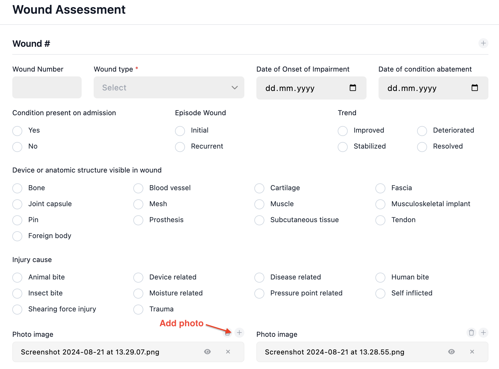
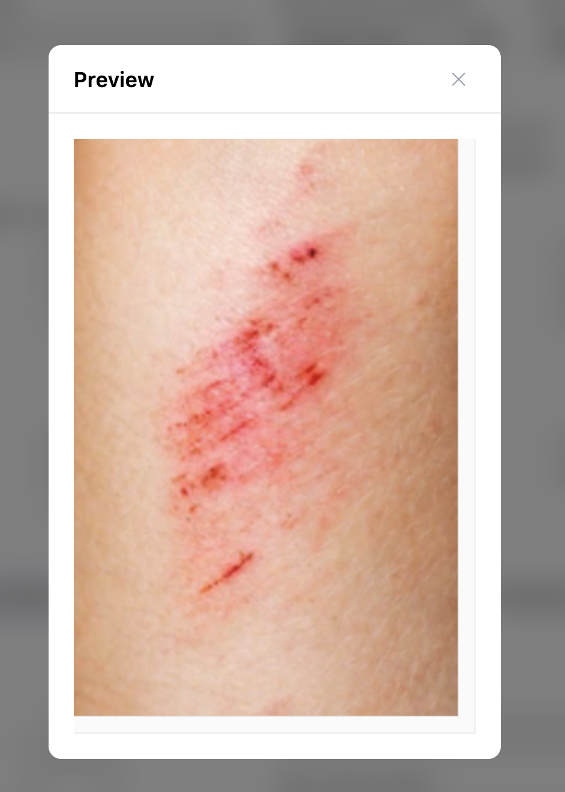
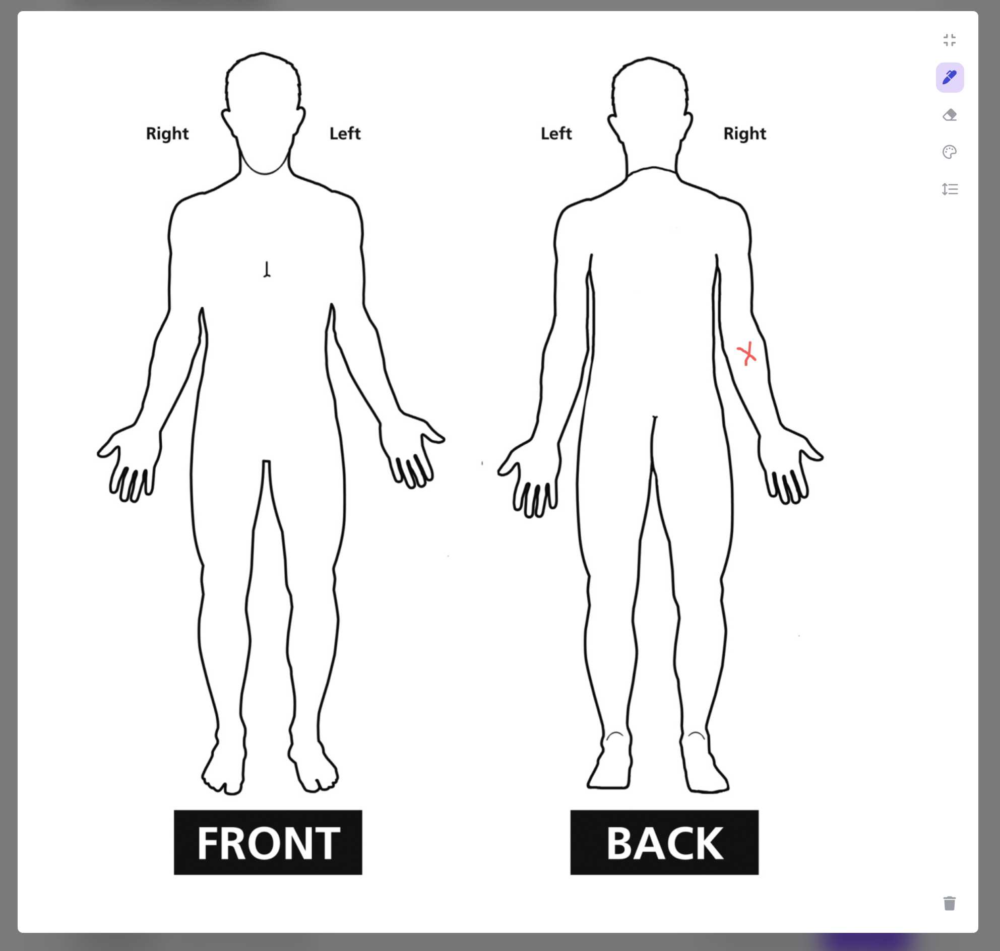
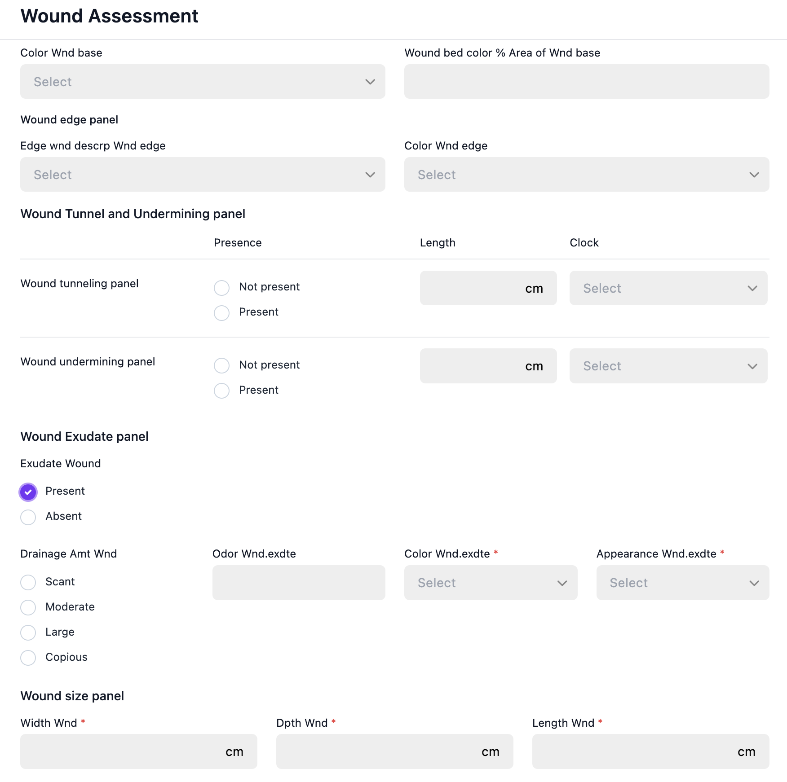

**Let's Design a Form Together!**

Today, let's create a Wound Assessment form to explore the extra features that electronic forms provide and why they shouldn't be mistaken for reports.

A wound assessment form is essential for managing and treating wounds. It helps document wound details, track healing, and guide treatment decisions. Before any treatment, it's crucial to assess the wound's cause, location, and type to ensure proper care.

To save time, I used a pre-built template—Wound Assessment Pnl—published by LOINC and the National Pressure Ulcer Advisory Panel. I customized it by changing the form layout, adding extra widgets for detailed information, and hiding unnecessary fields under conditions.

**Handling Multiple Wounds in One Form**

Since the number of wounds a patient might have is unknown, paper forms usually provide extra slots for 3-5 wounds or separate forms for each wound. Electronic forms, however, can use a group widget with repeat settings. This allows you to add all the necessary fields for wound description and classification, using it as a template for each wound. As the nurse fills out the form, they can simply click a plus button to add another section for the next wound. This approach allows for documenting any number of wounds while the [medical form](https://www.health-samurai.io/forms-product) expands as needed.

Handling Multiple Wounds in One Form.

**Attaching Multiple Wound Photos**

Sometimes, a wound description isn't enough. Photos can be attached using the attachment widget, helping doctors assess the wound's condition and choose the right treatment.

Attaching Multiple Wound Photos

**Marking Wound Locations**

While wounds can be described in the text, using an annotation pad allows for more precise location marking. Using different colors and adding text can provide a clearer picture of the problem.

Marking Wound Locations

**Hiding Fields That Are Only Needed Under Certain Conditions**

Paper forms often contain too many fields, many of which may not be filled out during a visit. Electronic forms allow you to hide unnecessary fields and only reveal them under certain conditions. For example, if wound exudates exist, you may need to describe their color, odor, and appearance. These fields can appear on the form only if exudate is present. I used the "enable when" logic to temporarily hide fields that aren't needed right away. This reduces cognitive load for the nurse, allowing them to focus on what's important.

Hiding Fields That Are Only Needed Under Certain\_Conditions 1

Hiding Fields That Are Only Needed Under Certain Conditions 2

**Don’t Turn Forms Into Reports—Use Other Tools for That**

The main purpose of electronic forms is data capturing. They provide doctors and nurses with a convenient tool to gather maximum information from the patient without spending too much time filling out and uploading data. Forms can be pre-filled with existing data, and the collected information is automatically stored in a structured format. This data can then be used to create reports or visualize it. These are two sequential processes: capture data with forms, then visualize or analyze it.

Forms can display data from previous visits by pre-filling fields and showing them in read-only mode, but their main function is data collection. For reporting, it's better to use specialized tools and visualize them on dashboards in your app. One such tool is SQL on FHIR, which flattens the retrieved data and allows you to create charts in your application using simple SQL queries. For example, you can create charts showing how wound size changes from visit to visit or a color diagram for the wound area.

To learn more about SQL on FHIR, check out a series of articles available [here](https://www.health-samurai.io/article-categories/sql-on-fhir)

By using these advanced widgets and data tools, you can cover various medical scenarios and help healthcare professionals focus on the patient.

Try implementing your scenarios using our free [Public Form Builder](https://form-builder.aidbox.app/), which requires no authorization.

> You can install the [free version of Aidbox](https://www.health-samurai.io/aidbox#run). It enables you to explore and experiment in a fully functional environment, perfect for development and testing.
