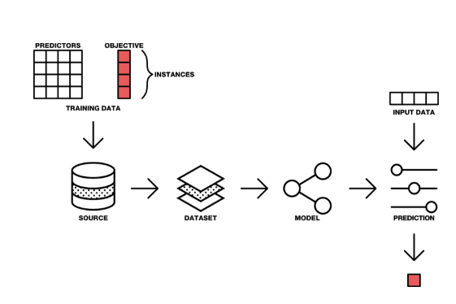

Nowadays healthcare is all about data. Different medical data are being continuously generated about each of us. Doctors and nurses create some of this data, but medical devices and wearables produce much more of it. Besides data that was traditionally collected by EHR (Electronic Health Record) systems, we are seeing terabytes of genomics data that have started complimenting patient records with the rise of precision medicine. The volume of medical data is only increasing with time, and it is becoming tough for people to comprehend this data and derive meaningful insights from it without the help of the automated systems.

> Get started with the Aidbox [FHIR Server](https://www.health-samurai.io/aidbox) for data storage, integrations, healthcare analytics, and more, or [hire our team](https://www.health-samurai.io/services) to support your software development needs.

This is why machine learning is becoming invaluable. Increased computer processing power and storage capabilities have enabled many different use cases for automated systems to help clinicians perform their work faster, and better. Machine learning is not a new technology anymore, as many healthcare organizations have already implemented it in their workflows. The most common use case is [medical image processing](https://mindsharemed.com/) while [signal](http://www.etiometry.com) [processing](http://sentrian.com/) and [genomics](https://www.curematch.com/) have started [gaining traction](https://www.hindawi.com/journals/bmri/2015/370194/) too. There are others use cases arising as well. For example, [audit logs are analyzed with machine learning](https://www.spherinc.com/) to detect intrusions and unusual behavior by medical staff. Machine learning is also used to predict patients who have a higher risk of readmission to the hospital or patients who have a higher chance of not showing up for an appointment or not adhering to prescribed medications. The applications are limitless. To see more cutting-edge applications of machine learning in healthcare you can check [mlforhc.org](https://www.mlforhc.org/) and mucmd.org, which have recordings of all presentations at the annual “Machine Learning in Healthcare” conference from 2011 to now.  
  
**How does machine learning work and where does FHIR come to play?**

A typical machine learning workflow starts with using the existing data for training a model and then applying this model to make predictions on the new dataset:

As you can see, data is the key along the entire path - from training the model to deriving insights and making predictions. So here is where FHIR comes into play. FHIR has become the de-facto standard for accessing data in healthcare. Getting data for an individual patient for making predictions can’t be achieved easier than via FHIR APIs. Moreover, FHIR is continuing to expand its capabilities. The stable (and extensible) data model described by the FHIR specification allows implementation of a FHIR Clinical Data Repository (CDR) for data mining and analytics. Several companies have started offering technology solutions for an efficient way to serialize large amounts of data and represent data in a manner that allows data analytics to be run.

Back in 2014, we created an open source storage for FHIR resources called [FHIRbase](https://www.health-samurai.io/fhirbase) that enables SQL queries to be run against FHIR data. There are [libraries](https://github.com/beda-software/fhir-py) for FHIR that support implementations in Python, which is the most popular language among data scientists who develop machine learning solutions. There are also open source libraries for other technologies as well, e.g., [R on FHIR](http://www.healthintersections.com.au/?p=2740) is getting traction in the community.

In March of 2018, Google opened a [protocol buffer implementation](http://rebrand.ly/PBI-of-FHIR) of the FHIR standard, which supports Java, C++, C#,  Go, and Python. Open source protocol buffers are a mechanism for serializing structured data – think XML, but smaller, faster, and simpler. A user defines how to structure data once, then uses the generated source code to write and read data to and from a variety of data streams. The protocol is suitable for both programmatic access and database queries. One of the examples shows how to upload FHIR data into Google Cloud [BigQuery](http://rebrand.ly/bigquery) and have it available for querying. BigQuery can handle a massive amount of data in a highly paralleled cloud environment. It opens the opportunity to work with big medical data in Google Cloud as well as leverage other Google services such as [machine learning](https://cloud.google.com/products/ai/) (ML).

FHIR and machine learning both have a bright future in healthcare and we will see them converging in the coming years. If you want to contribute to the topic or learn more please join the conversation at the FHIR Community chat at <https://chat.fhir.org>.

