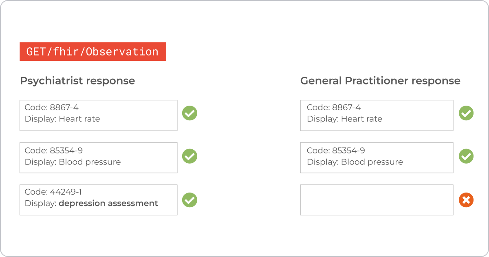
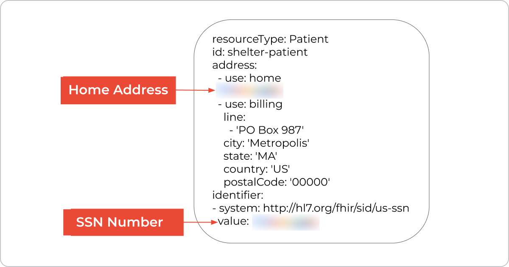
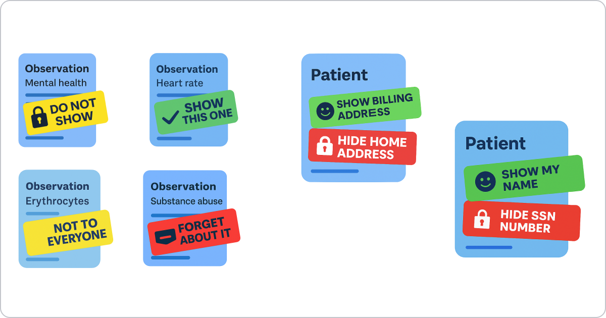
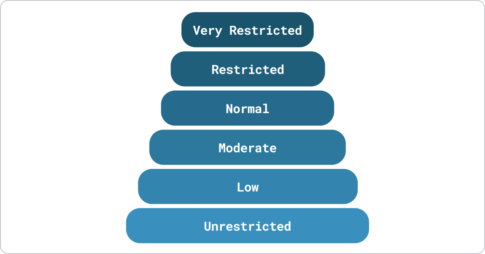
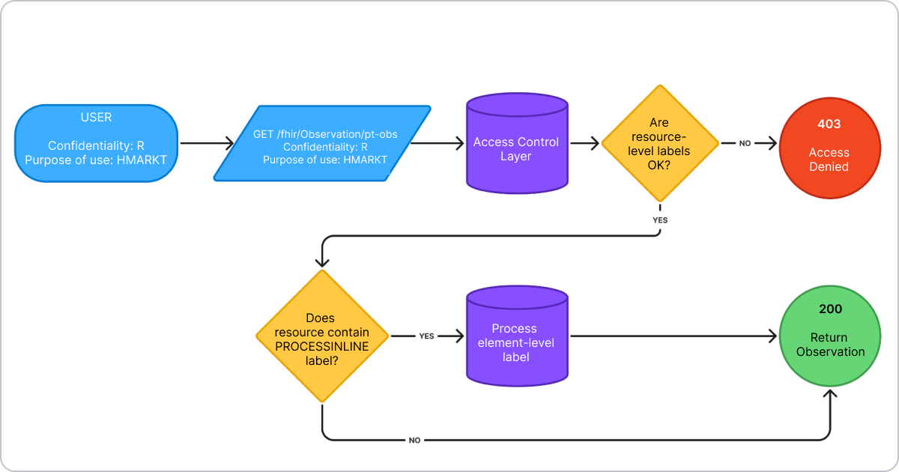
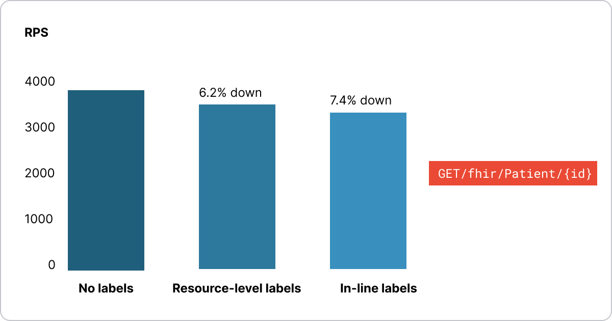

## **The Сore Problem**

Healthcare records are not a single monolithic file; they are a mosaic of lab results, billing identifiers, mental health notes, demographics, and more. The **challenge** is to give healthcare professionals only the data they need to work effectively. The **goal** is to avoid exposing more information than necessary. This 'need-to-know' principle is what security labels are designed to enforce.

Let’s take a look at a specific example. A psychiatrist working with a patient must have access to highly sensitive mental health information alongside general healthcare-related data. A nurse working with the psychiatrist should also have access to mental health notes. However, do you want other nurses reading your mental health notes? I don’t think so. Also, a general practitioner may need to see a patient's vitals but should not have access to mental health information for various reasons. This list can be endless and always depends on specific institutional policies.

Role Permissions Table

| Role | Needs to see | Must *NOT* see |
| --- | --- | --- |
| Psychiatrist | Heart-rate, Mental Health | – |
| Nurse | Heart-rate, Mental Health? | Mental Health (depends) |
| General Practitioner | Heart-rate | Mental Health |
| Medical Biller | Billing address, SSN | Home address |
| Clinical Researcher | De-identified vitals | Names, SSN |

## FHIR Implementer's Point of View

Observations play a key role in healthcare, and in FHIR, the Observation resource is intentionally broad. It can represent anything from a heart rate reading to a blood pressure check or a depression screening — all of these fall under the same resource type.

But not everyone should see the same data. When your app sends a GET request for observations, the FHIR server's response should depend on who's using the app. For example, general practitioners shouldn't see depression assessments, while psychiatrists rely on them. It's the same request and the same Bundle — but different users should get different results.



Take another FHIR resource — the Patient. It holds a lot of information, and often, patients have different addresses for home, billing, or mailing purposes. They may not want to share their home address with everyone. The same goes for their Social Security number — a biller might need it, but others in the clinic don’t.

All of this data lives within the same Patient resource, so we need a way to hide certain fields while still exposing the resource itself. In other words, access control should be configurable not just at the resource level, but at the level of individual elements or properties.

**Can we achieve such access control granularity?**

FHIR’s answer is [Security Label](https://www.hl7.org/fhir/R4/security-labels.html) — a tiny but powerful concept attached to resources.



## FHIR Security Labels

Think of this image as our FHIR database. We can attach tags or labels directly inside the database to each resource or even to specific properties within a resource. These tags tell the FHIR server who is allowed to see what information.



FHIR Security Labels work at two different levels of granularity:

**1. Resource-level labels** are the simpler approach. These labels attach to an entire FHIR resource using the meta.security property. Think of them as tags that say "this whole Patient record is confidential" or "this entire Observation contains sensitive information." Since meta.security is an array, you can attach multiple labels to a single resource - for example, marking a record as both "confidential" and "mental health related."

```javascript
{
  "meta": {
    "security": [
      {
        "code": "R",
        "system": "http://terminology.hl7.org/CodeSystem/v3-Confidentiality"
      },
      {
        "code": "PSY",
        "system": "http://terminology.hl7.org/CodeSystem/v3-ActCode"
      }
    ]
  },
  "resourceType": "Patient",
  ... rest of the resource
}
```

**2. Property-level labels** (also called [inline labels](https://build.fhir.org/ig/HL7/fhir-security-label-ds4p/inline_security_labels.html#inline-security-labels)) provide much finer control. These allow you to protect specific properties within a resource while leaving other properties accessible. To use property-level labels, you first need to add a special PROCESSINLINELABEL flag to the resource's meta.security property. Then, you can attach security labels to individual property using FHIR extensions. For instance, you could protect just the home address in a Patient resource while keeping the billing address visible.

```javascript

{
  "meta": {
    "security": [
      {
        "code": "PROCESSINLINELABEL",
        "system": "http://terminology.hl7.org/CodeSystem/v3-ActCode"
      }
    ]
  },
  "resourceType": "Patient",
  "address": [
    {
      "use": "home",
      "city": "Metropolis",
      "line": [
        "123 Confidential Ave"
      ],
      "state": "MA",
      "country": "US",
      "extension": [
        {
          "url": "http://hl7.org/fhir/uv/security-label-ds4p/StructureDefinition/extension-inline-sec-label",
          "valueCoding": {
            "code": "LOCIS",
            "system": "http://terminology.hl7.org/CodeSystem/v3-ActCode"
          }
        }
      ]
    },
    {
      "use": "billing",
      "city": "Metropolis",
      "line": [
        "123 Non-Confidential Ave"
      ],
      "state": "MA",
      "country": "US"
    }
  ]
  ... rest of the resource
}
```

## FHIR Labels Nature

FHIR Security Labels use standardized HL7 code systems.

The [**v3 Confidentiality**](https://www.hl7.org/fhir/R4/v3/ConfidentialityClassification/vs.html) works hierarchically like security clearance levels. If you have "Restricted" access, you automatically see data with lower levels like "Normal" and "Low."



The [**ActCode**](https://www.hl7.org/fhir/R4/v3/ActCode/cs.html) and [**Purpose of Use**](https://www.hl7.org/fhir/R4/v3/PurposeOfUse/vs.html) are flat - you either have the exact matching code or you don't. Having access to one code doesn't grant access to others.

Knowing the vocabulary is only half the story. Let’s walk through how a FHIR server actually uses these labels at request time—from tagging data to masking properties.

## How Security Labels Work

The security label workflow follows three main steps:

**1. Label your data and users.** Each FHIR resource gets security labels attached, and users are assigned clearance levels that specify what information they can access.

**2. Match user permissions with resource labels.** When a user requests data, the access control engine compares the user’s clearance to the resource’s security labels using its configured label‑matching rules (e.g., dominance levels, all‑vs‑any required tags, purpose constraints). Access is granted only if those rules are satisfied at the resource level.

**3. Check for property-level restrictions.** If a resource contains the PROCESSINLINELABEL flag, the server examines individual properties within that resource. Properties the user can't access get masked using FHIR's standard data-absent-reason extension with the value "masked".



## Implementation Details

Here's how we implemented this workflow in our [FHIR server](https://www.health-samurai.io/fhir-server), Aidbox:

**1. Get user permissions.** When a request arrives, Aidbox first determines the user's access level by checking their security labels in two places: the "scope" claim in the JWT access token and the optional User.securityLabel property in the user record.

**2. Expand hierarchical labels.** For confidentiality codes, the system automatically expands the hierarchy. If a user has "Restricted" access, Aidbox adds all lower-level labels ("Normal," "Low," "Unrestricted") to their permissions.

**3. Apply resource-level filtering.** Under the hood, Aidbox injects the user's security labels into FHIR's \_security search parameter to filter resources. For example, if a user has "R" (Restricted) confidentiality clearance and "PSY" (psychiatry disorder information) label, a simple request like GET /fhir/Observation gets transformed to:

```javascript
GET 
/fhir/Observation?_security=http://terminology.hl7.org/CodeSystem/v3-Confidentiality|R,
http://terminology.hl7.org/CodeSystem/v3-Confidentiality|N,
http://terminology.hl7.org/CodeSystem/v3-Confidentiality|L,
http://terminology.hl7.org/CodeSystem/v3-Confidentiality|U,
http://terminology.hl7.org/CodeSystem/v3-ActCode|PSY
```

Since Aidbox uses PostgreSQL as its database, this FHIR request is transformed into a SQL query. At this point, Aidbox applies resource-level access control because the SQL query will only return resources with matching security labels. Resources without labels or with non-matching labels are automatically excluded from the results.

**4. Handle property-level access.** For resources with the PROCESSINLINELABEL flag, Aidbox examines each property with inline security labels. Accessible properties are returned as-is, while restricted properties get masked with the data-absent-reason extension.

## Upsides

Let's summarize the upsides of Security Labels:

**1. Interoperability.** Security labels use native HL7 code systems.

**2. Resource-level granularity.**  You can tag individual resources with multiple labels rather than building access control based on resource types. This means you can safely query all Observations without worrying about exposing sensitive mental health data to users who shouldn't see it.

**3. Property-level granularity.** Inline Security Labels let you mask a single resource property while exposing the rest of the resource.

## Trade-offs

Security labels come with important trade-offs to consider:

**1. Label visibility can leak information**

When users see data-absent-reason extensions and security labels next to it, a user who might be an attacker can immediately learn what access level is needed to see the hidden data. This could lead to an access control problem. Aidbox offers a [strip labels](https://docs.aidbox.app/access-control/authorization/label-based-access-control#remove-security-labels-from-the-response) flag to remove security labels from the response.

**2. Medical Safety vs Data Leakage**

The disclosure of data absence can itself be a data leak. When masking sensitive properties using data-absent-reason="masked", you're telling the user, "something is here that you can't see." For stigmatizing information like mental health or substance abuse, even knowing data exists can be problematic.

You might say just don't use masking, but instead completely strip the property from the resource as if it does not even exist. However, this introduces another problem—if data access denials are not revealed, it might be interpreted as data not existing, which could lead to wrong medical decisions.

There is no easy solution for this. It really must be a careful decision for each case.

**3. Privacy vs Conformance**

The FHIR specification requires certain resource properties to be present, but privacy requirements might force you to mask them. What happens when we modify a required FHIR property? It means we will return a non-conformant resource in response.

For example, status is a required property in Observation. But if you want to mask it, you will return a resource that is not valid.

```javascript
{
  "id": "bp-001",
  "resourceType": "Observation",
  "meta": {
    "security": [ ...labels... ]
  },
  "_status": {
    "extension": [
      {
        "url": "http://terminology.hl7.org/CodeSystem/data-absent-reason",
        "valueCode": "masked"
      }
    ]
  },
  "code": {
    "coding": [
      {
        "extension": [
          {
            "url": "http://terminology.hl7.org/CodeSystem/data-absent-reason",
            "valueCode": "masked"
          }
        ]
      }
    ]
  }
}
```

While "conformance for the sake of conformance" might be an acceptable trade-off, it becomes a real problem when client applications depend on these required properties being present. So "It's privacy versus conformance, and sometimes privacy has to win."

**4. Performance overhead**

As you may have noticed, security label enforcement adds processing overhead at several points.

We conducted performance tests and compared three Aidbox setups:

1. Without label-based access control
2. With labels on the resource level
3. With inline labels

We measured FHIR read operations, performing GET /fhir/Patient/id requests. The results showed a 6.2% slowdown for resource-level labels and 7.4% for property-level labels. So, if your application doesn’t require every millisecond of performance, this is not a major issue.



## Create & Update Operations

Our [FHIR security labels](https://docs.aidbox.app/access-control/authorization/label-based-access-control) implementation currently only covers read and search operations. Create and update operations require additional handling.

**The Problem**

Consider this scenario: a client requests a Patient resource where the home address is masked due to insufficient permissions. The client sees the billing address and other properties, then wants to update the patient's phone number. How should the FHIR server handle this update without losing the hidden home address data?

**Recommended Approach**

1. **Avoid PUT operations entirely** - PUT replaces the entire resource, which would lose any masked properties that the client couldn't see.
2. **Use PATCH operations instead** - PATCH allows selective updates of specific properties without affecting the entire resource.
3. **Client-side validation** - Implement logic to only allow patching of properties that weren't masked in the original response.

**Resource-level vs Property-level Labels**

- **Resource-level labels** (in meta.security) FHIR [recommends](https://hl7.org/fhir/R4/resource.html#Meta) preserving the labels in meta during create operation, but you still should be careful with updates.
- **Property-level labels** (inline extensions) are more complicated, as they exist within the resource data itself.

This remains an evolving area where FHIR servers need custom logic to safely handle updates while preserving security boundaries.

## No silver bullet

The main takeaway from this article is that **labels are a sharp tool, but they still come with many trade-offs you need to consider.**

## Postman demo

Try Aidbox’s FHIR security label implementation [in Postman](https://aidbox.postman.co/workspace/Team-Workspace~492aebcf-67fe-404f-81a5-24927abd936a/collection/29474015-12395b7a-6103-48ec-bbe8-ba47b23c7803?action=share&creator=29474015). Please read the description in the Postman collection before running requests.

You can use the provided Postman collection to explore different scenarios involving fine-grained access control with FHIR Security Labels. The collection includes sample requests and guidance on how to test masking and filtering of sensitive data properties based on user permissions.

[**Run in Postman**](https://aidbox.postman.co/workspace/Team-Workspace~492aebcf-67fe-404f-81a5-24927abd936a/collection/29474015-12395b7a-6103-48ec-bbe8-ba47b23c7803?action=share&creator=29474015)

[Aidbox FHIR server](https://www.health-samurai.io/fhir-server) is available for free for development and testing purposes, so you can set up your own instance and experiment with security labels in a real environment. This makes it easy to evaluate how security labels work in practice before considering production use.
