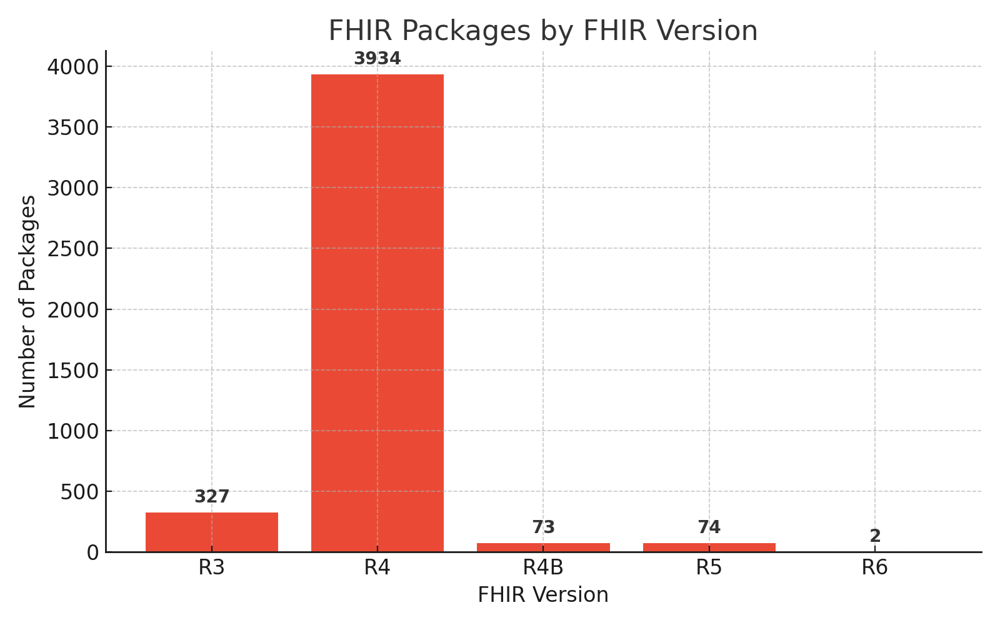

When FHIR implementers ask "Which FHIR version should I use?" newcomers often assume it’s reasonable to choose the latest release. As of October 2025, that would be FHIR R5, which seems like the obvious choice. However, the decision is more complex, as it requires careful consideration of factors such as compatibility, adoption, and stability. This post provides a practical overview of the key details, pros and cons, and lessons from our experience supporting FHIR implementations, with a look ahead to what R6 might bring.

## New Features Introduced in FHIR R5

Overall, FHIR R5 completed over 4,000 changes of different scales compared to the previous version. Follow the [link](https://hl7.org/fhir/R5/history.html#normative) for the list of primary changes made in FHIR R5.

Among these, two stand out as especially significant: new resource types and reworked topic-based subscription feature. Let’s dive deeper into each one.

### New Resource Types

FHIR R5 introduces 20+ new resource types, with 8 types in the new Medication Definition module. This module describes medicines in detail – covering ingredients, packaging, administration forms, regulatory status, and clinical uses. It makes FHIR more useful for drug catalogs, regulatory submissions, and safety systems that need complete product information.

While these new resources enhance FHIR's capabilities, they may not be a "game-changer" in terms of interoperability. Most FHIR servers have addressed some of the gaps in the specification by using custom resources. Those who needed these resource types already found workarounds. Even if you proceed with R5 and adopt new resource types, integration partners may struggle to use them out of the box, since most systems, including major national and vendor ecosystems, are still operating on R4. This negates the benefit of using standard R5 resource types.

### Subscriptions

FHIR R5 completely reworked the subscription framework introducing the Topic-based subscription feature to standardize event-driven notifications which makes it easier to define and subscribe to event types (e.g., "new lab result for patient X") and allows the implementers to enable better real-time workflows, important for EHR alerting, public health, and CDS. This is a win for systems that need real-time alerts. However, you don’t need FHIR R5 to experience this functionality: HL7 introduced an intermediate version – R4B which is basically R4 with backported SubscriptionTopic framework. Moreover, FHIR servers are not limited here, too, and it’s possible to utilize custom resources to enable subscriptions in any FHIR version (like we did in [Aidbox](https://docs.aidbox.app/modules/topic-based-subscriptions/wip-dynamic-subscriptiontopic-with-destinations)).

Now that we’ve seen what’s new in R5, let’s now weigh these improvements against the challenges of upgrading.

## Why Customers Are Hesitant to Use FHIR R5

FHIR R5 is the most recent official version of FHIR, yet adoption rates remain low across the industry, including among our customers. FHIR R5 introduces breaking changes and lacks backward compatibility, making it difficult for organizations to transition from FHIR R4 without significant effort. The reasons fall into two categories.

### Backward Compatibility Issues

One of the biggest concerns with R5 is its lack of backward compatibility. Many organizations have built systems on FHIR R4, which is currently the most stable and widely used version. While some resources like Patient and Observation have undergone minimal changes between R4 and R5, others have been surgically refactored. Let’s take a look at a few examples.

One of the most used resources — AllergyIntolerance — has introduced 3 new properties (including a mandatory one), removed 2 properties, and changed the type element data type from code to CodeableConcept.

So this FHIR R4 AllergyIntolerance resource snippet:

```json
{
  ...
  "type": "allergy",
  "recorder": {
    "reference": "Practitioner/example"
  },
  "asserter": {
    "reference": "Patient/example"
  }
  ...
}
```

Would turn into this in FHIR R5:

```json
{
  ...
  "type" : {
    "coding" : [{
      "system" : "http://hl7.org/fhir/allergy-intolerance-type",
      "code" : "allergy",
      "display" : "Allergy"
    }]
  },
  "participant" : [{
    "actor" : {
      "reference" : "Practitioner/example"
    }
  },
    "actor" : {
      "reference" : "Patient/example"
    }
  }]
}
```

You can judge for yourself how big of a difference is — and this is just one of the dozens of such adjustments. You can check the full list here: <https://hl7.org/fhir/R5/diff.html>

Major EHR vendors like Epic and Oracle Health (formerly Cerner) have heavily invested in R4-based APIs and integrations — Epic with its “Epic on FHIR” platform, and Oracle with the Millennium platform’s FHIR R4 APIs, including bulk data access. Both companies officially **do not support FHIR R5**. This means anyone integrating with those ecosystems is best served working natively with R4 to ensure interoperability. At the same time, upgrading to R5 requires redesigning data models, APIs, and integrations — and undertaking complex data migrations — making such a transition both costly and risky for organizations deeply reliant on seamless FHIR interoperability.

### The Industry Standard: FHIR R4

Given that most of the world currently operates on FHIR R4, it’s likely to remain dominant for years to come. In the US, R4’s position is reinforced by regulation — through the [US Core Implementation Guide](https://build.fhir.org/ig/HL7/US-Core/index.html) and its connection to the [USCDI standard](https://www.healthit.gov/isp/united-states-core-data-interoperability-uscdi), which ONC requires for certified health IT. Similar government-driven programs in other countries have also standardized on R4, pushing vendors and providers toward compliance. Even the [International Patient Summary IG](https://build.fhir.org/ig/HL7/fhir-ips/index.html), [endorsed by WHO](https://www.who.int/initiatives/global-digital-health-certification-network) and adopted in multiple regions to support cross-border health data exchange, is built on FHIR R4.

Our public [FHIR package registry](https://get-ig.org/) containing all the public IGs, provides analytic data that supports these statements as well.



Because of this deep integration, adhering to FHIR R4 enhances compatibility with the vast majority of existing FHIR-based APIs and ecosystems. This widespread adoption makes it easier to connect with other healthcare systems, fostering smoother data exchange and interoperability within both national and cross-border healthcare networks.

These factors explain why some in the FHIR community are debating whether to move to R5 now or wait and jump straight to R6.

## The Future: Skipping R5 for R6?

Some in the FHIR community are suggesting skipping R5 altogether and moving directly from R4 to R6, though this is not an official HL7 position. Since FHIR R5 is a trial-use release with breaking changes and limited adoption across vendors and national implementations, many implementers are reluctant to invest in a version that may soon become obsolete.

**R6 is anticipated to restore some backward compatibility and lock in the changes introduced in R5** by making the most widely used resources [normative](https://build.fhir.org/versions.html#std-process) — meaning stable, production-ready, and guaranteed against breaking changes. The FHIR community is now also striving to avoid further disruptive changes, aiming for stability.

As a result, organizations that prioritize long-term stability and ecosystem alignment may find it more strategic to remain on R4 for now and plan a direct migration to R6 once it achieves broader adoption and tooling support. At Health Samurai, we plan to provide tooling that will enable a smoother direct migration to FHIR R6 in Aidbox.

The [R6 timeline is deliberate](https://confluence.hl7.org/spaces/FMG/pages/256509111/Release+Plan+for+R6): the first “Normative” ballot is scheduled for January 2026, with two additional ballots already planned. Further rounds are expected before a final release, so the standard shouldn’t be completed before 2027. In the meantime, upcoming [FHIR cross-version extensions](https://build.fhir.org/ig/HL7/fhir-cross-version/) will make it possible to adopt select R5 or R6 features while continuing to operate on R4.  This approach lets organizations gain some of the benefits of newer versions without the risks and costs of an early full migration.

## Our Recommendation

While Aidbox supports FHIR R5, our metrics show that only ~5% of users have adopted it. Unless there are compelling, specific requirements that only FHIR R5 can meet, we recommend seriously considering holding off on adopting it for now. Sticking with FHIR R4 provides stability, broad industry and ecosystem support, and a clear integration path with existing FHIR APIs and implementation guides.

FHIR R4 remains the safest and most practical choice. We’ll keep an eye on how the transition to R6 unfolds, but for those considering an upgrade, it’s likely worth waiting rather than adopting R5 prematurely — especially with R6 on the horizon.
