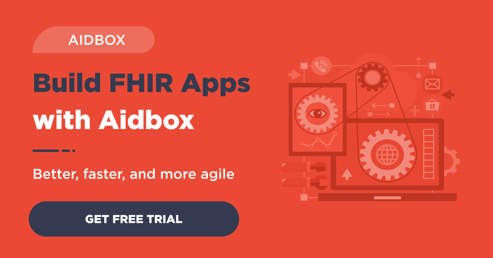

We get asked a lot of questions about what FHIR can be used for. This blog explains what FHIR is great at, what some challenges are, and what it wasn't built to do.

Healthcare domain complexity, data modeling, medical [data storage](https://www.health-samurai.io/fhir-server), and custom integrations with legacy systems are factors that drive lengthy development cycles and high project costs for healthcare technologies. The new HL7 FHIR standard was built to open the doors to innovation by addressing many of the problems associated with the traditional health IT development process.

FHIR (Fast Healthcare Interoperability Resources) is an open, community-driven standard that uses modern web technologies like JSON (JavaScript Object Notation) and application programming interfaces (APIs) to store and exchange administrative, clinical, and financial data. Healthcare data today is stored in non-standardized ways which makes it hard for different information systems to communicate with each other. Most health systems use HL7 v.2 for their data, a standard that was developed in the 1980s before the internet was mainstream. The HL7 v.2 format is not human readable, requires custom interfaces to be built for each system to communicate, and doesn’t allow for granular data exchange. FHIR solves these problems by providing a simple, standardized way to store healthcare data in a human readable format and open APIs to power seamless real-time data exchange. FHIR makes it easy for developers to access the healthcare data they need to build applications fast.

At [Health Samurai](https://www.health-samurai.io), we’ve been using FHIR since 2012 to build cloud EHRs, care coordination systems, patient-facing mobile applications, telemedicine platforms, and data analytics solutions.

## FHIR use cases

With FHIR, you get:

- A strong community of developers to discuss complex problems
- An open standard and a well-documented information model
- Modern web technologies that are easy to implement
- Future interoperability
- Development tools like [open FHIR servers](http://wiki.hl7.org/index.php?title=Publicly_Available_FHIR_Servers_for_testing), [libraries](http://wiki.hl7.org/index.php?title=Open_Source_FHIR_implementations), and [Aidbox](https://www.health-samurai.io/fhir-server)

We’ve learned a lot in the last 12 years, and here’s what you need to know about using FHIR.

## Benefits of FHIR

**What’s great**

1. **Great data models for common medical and healthcare financial data.** FHIR is a great data model for storing clinical and financial data because it has the accumulated wisdom of many experts.
2. **The FHIR community is incredible.** FHIR is an open source standard with a passionate community of experts deeply engaged in discussions of better solutions for complex problems. You can often get your question about FHIR answered by experts in a matter of hours (or even minutes). This might be the most important factor in driving FHIR adoption, and the significant traction of the standard gives the industry a real chance to transform and modernize the health IT ecosystem.
3. **API & Tools that are easy to learn and use for web and mobile apps.** Our clients [Narus Health](https://www.narushealth.com/), [Metro Dermatology](http://metrodermatology.net/us/), and [Tealtech Capital](http://tealtechcapital.com/en/) were able to build enterprise-level solutions in a matter of months with FHIR APIs, cutting months (and even years) of development time.
4. **FHIR facilitates interoperability with legacy standards.** Even if legacy systems aren’t supporting the FHIR standard yet, there are well documented FHIR mappings for legacy interoperability standards such as HL7 v.2 and CCD. Our [Aidbox](https://www.health-samurai.io/aidbox) platform offers a connector for mapping HL7 v2 to FHIR, and our client, Yorn, used these connectors to facilitate their EHR integrations.
5. **The FHIR specification describes an easy way to use** [**terminology services**](https://www.hl7.org/fhir/terminology-service.html)**.** Clients of our Aidbox FHIR platform get easy access to the most commonly used medical terminologies such as RxNORM, LOINC, ICD-10, SNOMED, NPI and others.

FHIR is the real deal that can be applied to solve different clinical, administrative and business problems. It’s a tool that can create miracles in the hands of healthcare innovators.

**What isn’t so good**

Here are a few challenges we came across when working with FHIR:

1. **A generic informational model is not always the easiest and fastest way to implement specific use cases.** You will probably need to extend and adopt FHIR models to your specific needs.
2. **Migration between FHIR versions is painful because of no backward compatibility.**   However, there are promises of backward compatibility starting from the normative version which will be released in 2018.
3. **FHIR Extensions and** [**profiles**](https://www.hl7.org/fhir/profiling.html) **can be complicated to use**. FHIR resources need to be extended when dealing with specialty health data that falls outside of the most commonly used clinical data. We’ve applied a lot of effort to simplify FHIR extensions in Aidbox.

## Who uses FHIR

FHIR is supported by all major EHR vendors, and some of them even offer FHIR marketplaces. But some vendor marketplaces are quite expensive. They also tend to not have friendly intellectual property terms, so the FHIR API is currently limited in its usability and lagging behind the FHIR adoption curve across the industry.

**What FHIR is not**

There are many benefits of FHIR, but like any standard it comes with limitations. FHIR was not built to take care of certain technical requirements (though that might change in the future). This is why we’ve built [Aidbox](https://www.health-samurai.io/aidbox) to compliment the FHIR standard and provide a comprehensive backend solution to meet technical needs of modern healthcare applications.

Here’s what FHIR is not built to do:

1. **FHIR does not address technological concerns such as your system architecture, system to system integration, security, and analytics.** The standard was built to enable interoperability, and not meant to address these technical considerations. These are the problems that we solve with our Aidbox platform, by providing a complete toolkit to work on your projects.
2. **The FHIR standard API is limited and probably won’t be enough for your real app.** Life is always more complicated than we want. With Aidbox, we provide a generic way to extend the FHIR API with additional endpoints, more powerful search, business intelligence tools, and more.
3. **FHIR is not a security protocol, nor does it define any security-related functionality**. The standard wasn’t meant to address security, so you must build HIPAA technical safeguards.
4. **FHIR doesn’t address infrastructure.** Modern healthcare solutions need to be both secure and reliable. That is why we built Aidbox on Google’s Kubernetes platform to provide automated, highly available cloud infrastructure out of the box.

> Get started with the Aidbox [FHIR Server](https://www.health-samurai.io/fhir-server) for data storage, integrations, healthcare analytics, and more, or [hire our team](https://www.health-samurai.io/services) to support your software development needs.

Follow US

**The Future of Health IT**

FHIR is designed to do great things for healthcare. It doesn't impose any limits on the development practices you use, and offers many benefits for data management and interoperability. Despite a few limitations, the benefits it brings makes it a standard that is here to stay. As long as you are aware of what FHIR is built to do and what it isn’t built to do, you will be able to find solutions in the marketplace like Aidbox that compliments FHIR to meet your data and application needs.

