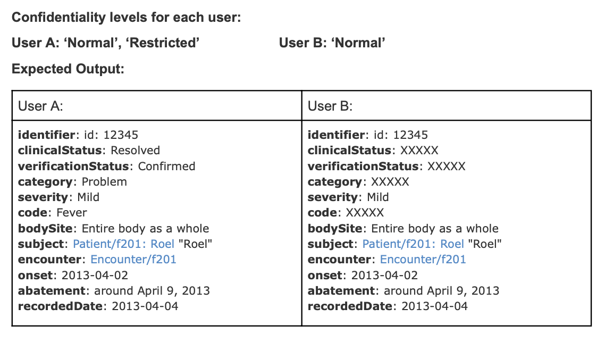

## Access Control

How can confidentiality of data be ensured and access to these data be controlled among system users, considering different access levels and data sensitivity?

FGAC (Fine-Grained Access Control) lets you manage resource access at varying levels of detail. You can start by controlling access to entire resources, but sometimes you need even finer control. For example, you might allow all users to see a resource but hide certain fields from some of them.

With Aidbox Label-Based Access Control (an implementation of FHIR Security Labels), you can apply security labels not only to an entire resource but also to individual fields within that resource, allowing access management on the resource element level.

To achieve this add security labels to the resource fields you want to protect (using an extension). Then assign security labels to your users. When a request is made, Aidbox [FHIR server compares the user’s](https://www.health-samurai.io/aidbox) labels to the resource’s labels and hides any fields that don’t match.  

For details: [documentation](https://docs.aidbox.app/modules/security-and-access-control/security/attribute-based-access-control-abac/security-labels#remove-security-labels-from-the-response)
