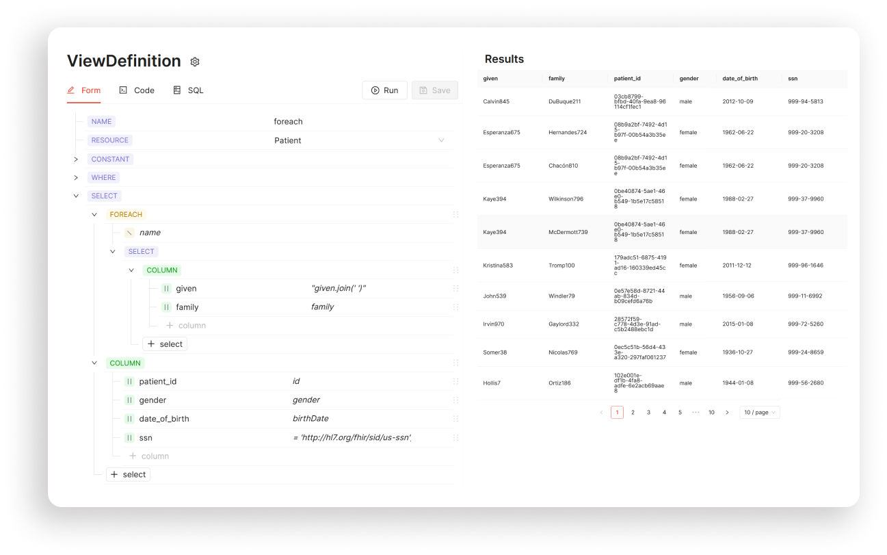
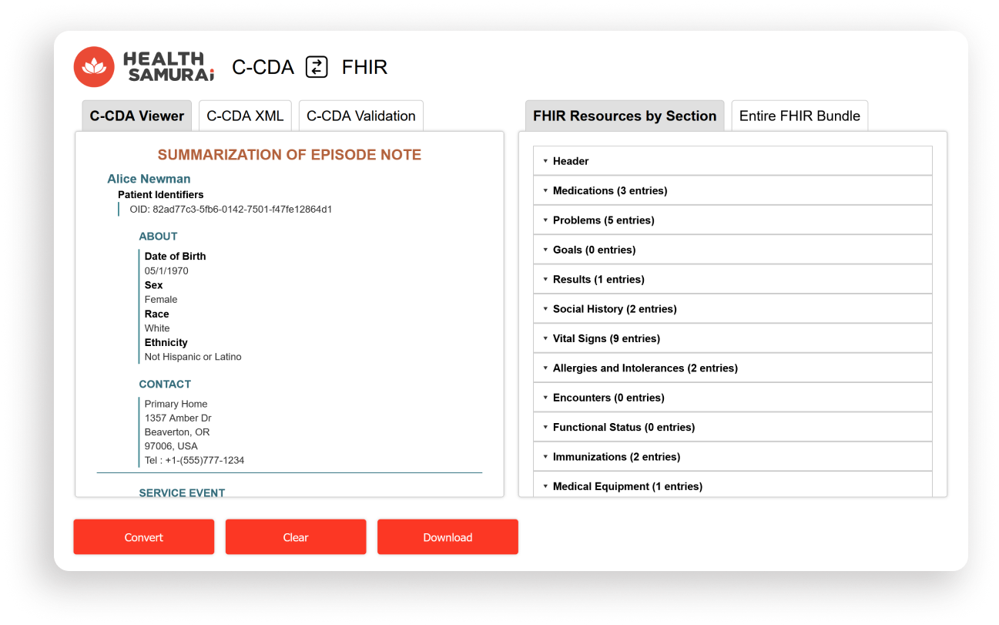
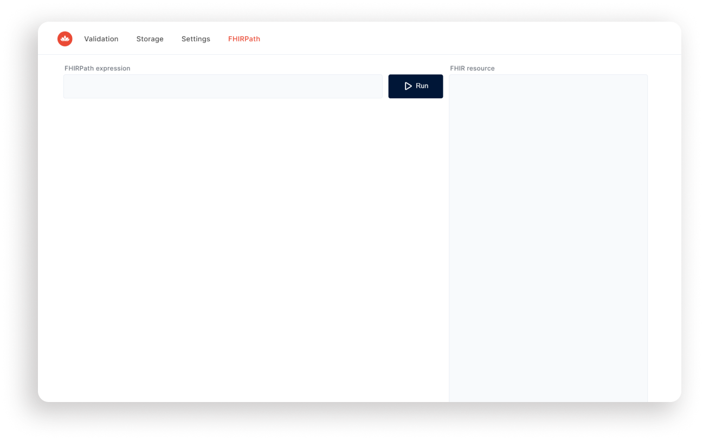

## FHIR Tools

Discover some free FHIR tools that simplify your developers' life without breaking the bank. Whether you're aiming to create medical SDC forms, prepare FHIR data for analytics and reporting (SQL on FHIR), convert CCDA to FHIR and vice versa, or validate FHIRPath expressions, these tools have you covered - all online and totally free.

## Public Form Builder for Healthcare

Creating HIPAA-compliant [digital medical forms](https://www.health-samurai.io/forms-product) is a critical yet challenging task. These forms are essential for collecting patient information, obtaining consent, and documenting medical history. Use this free tool to create, debug, and share FHIR Questionnaires for free, no registration and credit card needed.

**Key features FHIR questionnaire builder:**

- **3000+ Ready-to-Use Forms**: Start with pre-designed form templates or build from scratch.
- **FHIR Compliance**: Ensure data is captured in a well-structured FHIR format for easy reporting and analysis.
- **Customization**: Use the UI Builder to create forms with complex logic, validation rules or assemble the new form using multiple forms as components.
- **Multilingual forms**: Build a single form that supports various languages - no need to create duplicates. Now 16 languages are supported: Chinese, Croatian, Czech, Danish, Dutch, English, Finnish, French, German, Hungarian, Italian, Japanese, Korean, Polish, Russian, and Spanish.

**👉** [**Online Form Builder**](https://form-builder.aidbox.app/)

[**Read more in the Docs**](https://docs.aidbox.app/modules-1/aidbox-forms)

[**Video tutorials on YouTube**](https://youtube.com/playlist?list=PLEOOqZS1Ntwa7hhEmPnO5BhS-8lgevfzQ&si=GRQ3wmZ0IK732GJl)

## ViewDefinition Builder (Analytics on FHIR)

Analyzing FHIR data is crucial for gaining valuable insights that can improve patient care, optimize resource allocation, and enhance operational efficiency. However, FHIR data, stored in JSON format, can be challenging to analyze due to its complex and nested structure. This complexity hinders the ability to extract meaningful insights, leading to missed opportunities for better patient outcomes and operational improvements.

The Public ViewDefinition Builder is a free tool designed to simplify the analysis of FHIR data by converting it into a tabular, flat layout using the ViewDefinition resource. This tool is fully compliant with HL7 FHIR Spec and SQL-on-FHIR IG, ensuring that the converted data is ready for analysis and reporting.

**Key Features:**

- **Easy Data Analysis**: Convert FHIR data into a format suitable for analysis, making it easier to extract insights.
- **Compliance**: Meet HL7 FHIR standards for data conversion, ensuring data integrity and security.
- **Efficiency**: Use pre-configured options for common conversions, saving time and resources.

**👉** [**Online ViewDefinition Builder**](https://sqlonfhir.aidbox.app/)

[**Read more in the Docs**](https://docs.aidbox.app/modules-1/aidbox-forms/aidbox-ui-builder-alpha/building-reports-using-sql-on-fhir)

## CCDA / FHIR Bidirectional Converter

The Consolidated Clinical Document Architecture (C-CDA) has been a widely adopted standard for exchanging clinical documents, but it has limitations that make it less suitable for modern digital health needs. FHIR standard, on the contrary, provides a standardized format for data exchange, making it easier to share and analyze data across different healthcare systems, including EHRs, labs, HIEs etc.

The converter offers a seamless and secure way to convert C-CDA to FHIR and vice versa, so that you can easily exchange data between different systems.

**Key features:**

- **Effortless Conversion**: Convert C-CDA to FHIR and FHIR to C-CDA quickly and securely, with pre-configured mapping rules for most C-CDA sections. No sample on hand? Check out our ready-to-use options.
- **Compliance**: Ensure compliance with industry standards, including the § 170.315(g)(9) ONC criterion for importing and exporting patient data in C-CDA format.
- **Flexibility**: Work [with any FHIR server](https://www.health-samurai.io/fhir-server), and integrate with existing healthcare infrastructure for seamless data exchange

**👉** [**Online CCDA / FHIR Converter**](https://ccda.aidbox.app/v2/ccda-fhir)

[**Read more in the Docs**](https://docs.aidbox.app/modules-1/integration-toolkit/ccda-converter)

## FHIR Validator & FHIRPath Evaluation Engine

Ensuring the accuracy and compliance of FHIR data is critical for maintaining high-quality patient care and operational efficiency. The FHIR Validator and FHIRPath Engine are essential tools designed to validate FHIR resources and FHIRPath expressions, ensuring that data meets the required standards and specifications.

**Key Features:**

- **Comprehensive Validation**: Validate FHIRPath expressions against FHIR resources to ensure accuracy and compliance.
- **Error Detection**: Identify errors in FHIRPath expressions, ensuring that data queries are accurate and reliable.****
- **Accurate Data Analysis**: Ensure that FHIRPath expressions are accurate and compliant, leading to reliable data analysis and better patient outcomes.****
- **Efficient Data Querying**: Validate FHIRPath expressions to optimize data querying and analysis processes.

**👉** [**Online FHIRPath Validator**](https://fhir-validator.aidbox.app/#/fhirpath)

[**Read more in the Docs**](https://docs.aidbox.app/modules-1/profiling-and-validation/fhir-schema-validator)

## Beda EMR by [Beda Software](https://beda.software/)

Beda EMR is an open-source, customizable, and powerful front-end solution for Electronic Medical Records (EMRs). It leverages the HL7 FHIR standard as a data model and the SDC IG for form management, ensuring seamless integration and compliance with industry standards.

**Key Features:**

- **Open-Source**: Beda EMR is open-source, allowing for community-driven development and customization.
- **Customizable**: Tailor the EMR system to meet specific healthcare needs and workflows.
- **HL7 FHIR Standard**: Uses the HL7 FHIR standard as a data model, ensuring interoperability and compliance with modern healthcare systems.
- **SDC IG for Form Management**: Utilizes the SDC IG for managing forms, providing a standardized approach to data collection and reporting.

**👉** [**Open-source Beda EMR on GitHub**](https://github.com/beda-software/fhir-emr)

> Aidbox [FHIR server can be run locally](https://www.health-samurai.io/fhir-server) or in the cloud, providing flexibility to test all these methods. Whether you're exploring custom resources or leveraging existing ones, Aidbox offers a robust platform to enhance your [FHIR server's capabilities](https://www.health-samurai.io/fhir-server). [Free Development licenses](https://aidbox.app/ui/portal#/signin) are also available.
