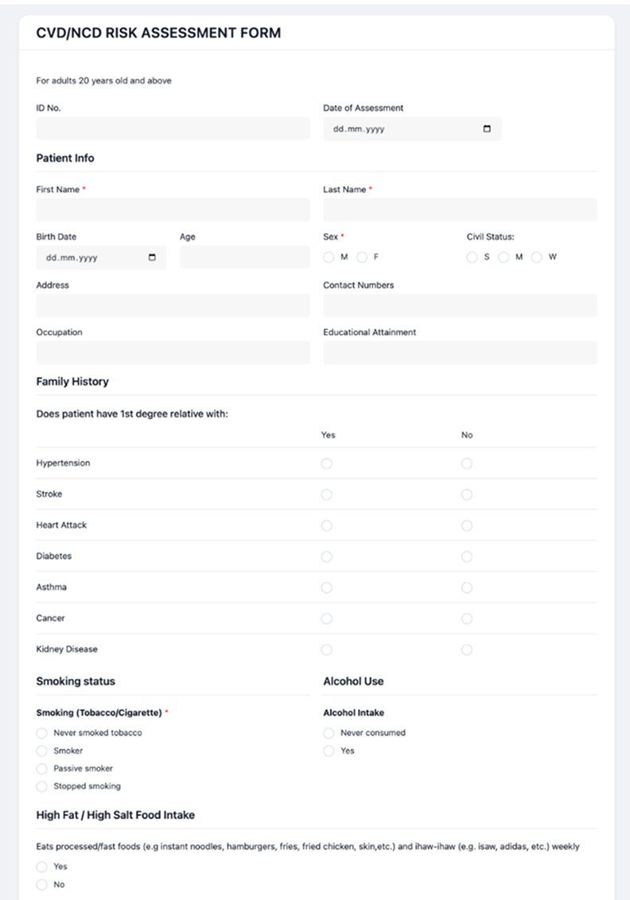
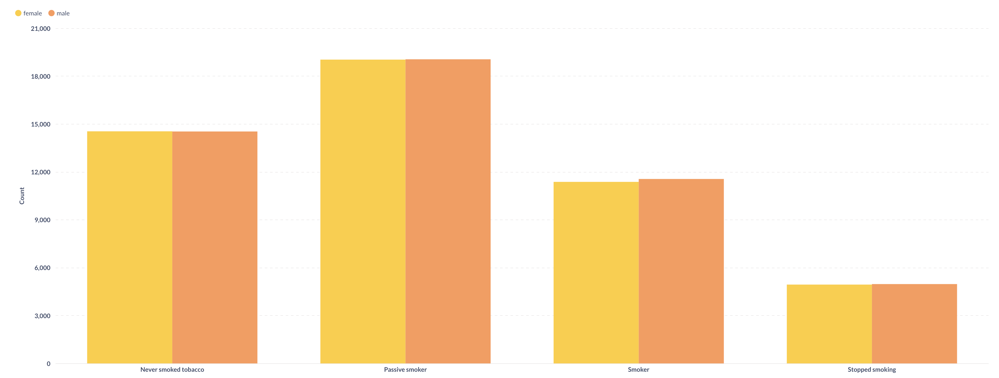
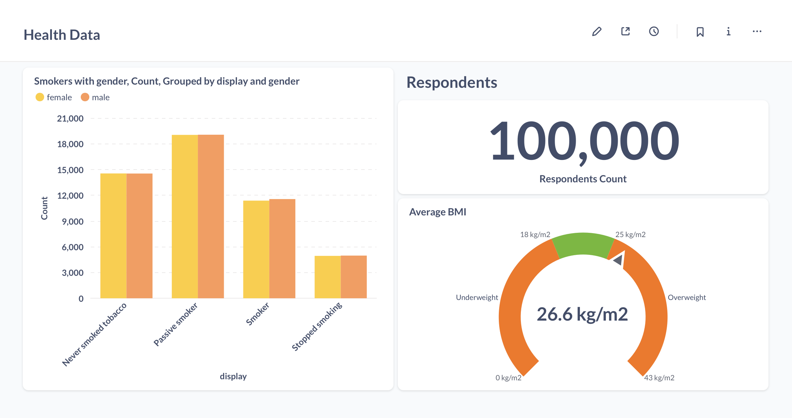

## **Health Data That Works**

High-quality data is the backbone of effective digital healthcare—but capturing and making sense of that data is far from easy. Many healthcare organizations still struggle with fragmented records, inconsistent patient input, and time-consuming manual workflows that hinder decision-making and slow down care delivery. That’s where [Aidbox Forms](https://www.health-samurai.io/medical-form) and [SQL on FHIR](https://docs.aidbox.app/modules/sql-on-fhir) come in. These powerful tools transform how care teams collect and work with data.

Aidbox Forms enables the creation of structured digital forms that use SNOMED CT or LOINC codes to standardize entry, automate calculations such as BMI, and ensure data quality and interoperability—eliminating errors common with paper-based entry. Once collected, SQL on FHIR turns complex FHIR resources into queryable tables, making it easy for healthcare teams to analyze and visualize data without digging through nested structures. Together, these tools streamline workflows, reduce manual workload, and free up care teams to do what matters most—deliver better care.

In this article, we’ll walk you through the full process using a real example: Risk Assessment Form, designed to collect lifestyle metrics such as smoking status, alcohol consumption, physical activity, and dietary habits. The full form can be found in the [Aidbox Form Gallery](https://form-builder.aidbox.app/ui/sdc#/forms/builder?form=40743d56-8e42-40e7-a837-60944dd12fa7). For simplicity, we’ll focus on a subset of this form, covering smoking status and BMI.



## 1. Collecting Data with FHIR SDC

Before meaningful analysis can happen, data needs to be collected in a structured, consistent way—and that’s where [FHIR Structured Data Capture](https://www.health-samurai.io/news/aidbox-forms-demonstrating-fhir-sdc-implementation-at-connectathon-2025) (SDC) comes into play. In FHIR, forms are built as Questionnaire resources, and completed forms are saved as QuestionnaireResponse resources. In other words, the data is structured and standardized in a way that makes it easy to share, understand, and reuse across different healthcare systems—a crucial factor for coordinated care and system-wide analytics. FHIR SDC also brings powerful features, including:

- Auto-populated fields using existing patient data to reduce redundant entry
- Automated calculations, such as BMI from height and weight, or age from date of birth
- Advanced controls and logic to guide users through complex forms intuitively.

Let’s see this in action by creating a digital form using [Aidbox Form Builder](https://form-builder.aidbox.app/). Our example will focus on capturing a few key lifestyle metrics: smoking status, height, and weight, with BMI calculated automatically.  Below, here’s how the Questionnaire resource will look:

```javascript
{
  "resourceType": "Questionnaire",
  "id": "health-metrics",
  "title": "Health Metrics",
  "status": "active",
  "item": [
    {
      "linkId": "smoking-status",
      "text": "What is your smoking status?",
      "type": "choice",
      "answerOption": [
        {"valueCoding": {"code": "266919005", "display": "Never smoked", "system": "http://snomed.info/sct"}},
        {"valueCoding": {"code": "449868002", "display": "Current smoker", "system": "http://snomed.info/sct"}},
        {"valueCoding": {"code": "8517006", "display": "Former smoker", "system": "http://snomed.info/sct"}},
        {"valueCoding": {"code": "266927001", "display": "Passive smoker", "system": "http://snomed.info/sct"}}
      ]
    },
    {
      "linkId": "height",
      "text": "What is your height (in cm)?",
      "type": "decimal"
    },
    {
      "linkId": "weight",
      "text": "What is your weight (in kg)?",
      "type": "decimal"
    },
    {
      "linkId": "bmi",
      "text": "Body Mass Index (calculated)",
      "type": "decimal",
      "readOnly": true,
      "extension": [
        {
          "url": "http://hl7.org/fhir/StructureDefinition/questionnaire-calculatedExpression",
          "valueExpression": {
            "language": "text/fhirpath",
            "expression": "weight / ((height / 100) * (height / 100))"
          }
        }
      ]
    }
  ]
}
```

This form standardizes key lifestyle inputs:

- Smoking status is coded using SNOMED CT, ensuring semantic consistency.
- Height and weight are recorded in metric units.
- BMI is calculated on the fly using a FHIRPath expression, improving efficiency and reducing manual errors.

By leveraging FHIR SDC and tools like [Aidbox Form Builder](https://form-builder.aidbox.app/), healthcare teams can collect high-quality, interoperable data.

## **2. Structuring Data for Analysis**

Collecting data is just the first step—the real value comes when that data is structured for analysis and reuse. In FHIR, completed forms are stored as QuestionnaireResponse resources. This format works well for capturing what a patient submitted, tied directly to the form’s questions. But on its own, it often falls short for real-world healthcare needs.

Here’s why.

A QuestionnaireResponse stores raw data that’s tightly coupled to the original form structure. For instance, it might capture that a patient is a “Current smoker” or has a calculated BMI—but to retrieve that information later, systems need to understand the specific layout of the form. This makes querying across patients or sharing data with other systems much more difficult. On top of that, QuestionnaireResponse isn’t designed to support clinical workflows such as viewing trends over time, populating patient charts, or triggering clinical decision support.

To solve this, key answers can be extracted and converted into structured FHIR resources, such as Observation. This is where Aidbox Forms adds significant value.

When you enable extraction, Aidbox Forms transforms selected answers into standalone, reusable Observations.

For example:

- A smoking status of “Current smoker” becomes an Observation coded with LOINC 72166-2 (Tobacco smoking status) and SNOMED CT for the response value.
- Calculated BMI is extracted using LOINC 39156-5, and height and weight can be handled similarly with standard codes.

This separation offers key advantages:

- **Interoperability**: Observations align with widely used FHIR profiles like US Core, so other systems can interpret them without needing the original form.
- **Flexibility**: Discrete Observations can be queried independently—say, to find all patients with a BMI over 30—without digging through QuestionnaireResponse structures.
- **Contextual Use**: Observations can be linked to patients, encounters, or timestamps, supporting longitudinal tracking or clinical decision-making.
- **Multiple Sources**: Data may come from different sources—questionnaires, wearables, or EHRs. Extracting into Observations standardizes it into a common format, enabling seamless integration and analysis regardless of origin.

With [Aidbox Form Builder](https://form-builder.aidbox.app/), it’s easy to specify which answers should be extracted. You simply configure items in the form to include the observationExtract extension. Here’s the same health-metrics questionnaire from Section 1, now with extraction configured for "smoking-status" and "bmi":

```javascript
{
  "resourceType": "Questionnaire",
  "id": "health-metrics",
  "title": "Health Metrics",
  "status": "active",
  "item": [
    {
      "linkId": "smoking-status",
      "text": "What is your smoking status?",
      "type": "choice",
      "answerOption": [
        {"valueCoding": {"code": "266919005", "display": "Never smoked", "system": "http://snomed.info/sct"}},
        {"valueCoding": {"code": "449868002", "display": "Current smoker", "system": "http://snomed.info/sct"}},
        {"valueCoding": {"code": "8517006", "display": "Former smoker", "system": "http://snomed.info/sct"}},
        {"valueCoding": {"code": "266927001", "display": "Passive smoker", "system": "http://snomed.info/sct"}}
      ],
      "extension": [
        {
          "url": "http://hl7.org/fhir/StructureDefinition/sdc-questionnaire-observationExtract",
          "valueBoolean": true
        },
        {
          "url": "http://hl7.org/fhir/StructureDefinition/sdc-questionnaire-observationExtract-code",
          "valueCodeableConcept": {"coding": [{"system": "http://loinc.org", "code": "72166-2", "display": "Tobacco smoking status"}]}
        }
      ]
    },
    {
      "linkId": "height",
      "text": "What is your height (in cm)?",
      "type": "decimal"
    },
    {
      "linkId": "weight",
      "text": "What is your weight (in kg)?",
      "type": "decimal"
    },
    {
      "linkId": "bmi",
      "text": "Body Mass Index (calculated)",
      "type": "decimal",
      "readOnly": true,
      "extension": [
        {
          "url": "http://hl7.org/fhir/StructureDefinition/questionnaire-calculatedExpression",
          "valueExpression": {
            "language": "text/fhirpath",
            "expression": "weight / ((height / 100) * (height / 100))"
          }
        },
        {
          "url": "http://hl7.org/fhir/StructureDefinition/sdc-questionnaire-observationExtract",
          "valueBoolean": true
        },
        {
          "url": "http://hl7.org/fhir/StructureDefinition/questionnaire-observationLinkPeriod",
          "valueDuration": {"value": 0, "unit": "days", "system": "http://unitsofmeasure.org"}
        },
        {
          "url": "http://hl7.org/fhir/StructureDefinition/sdc-questionnaire-observationExtract-code",
          "valueCodeableConcept": {"coding": [{"system": "http://loinc.org", "code": "39156-5", "display": "Body Mass Index"}]}
        }
      ]
    }
  ]
}
```

Suppose a patient submits:

- Smoking status: “Current smoker”
- Height: 170 cm
- Weight: 70 kg
- BMI: (calculated as 24.22)

The resulting QuestionnaireResponse would look like this (simplified):

```javascript
{
  "resourceType": "QuestionnaireResponse",
  "questionnaire": "Questionnaire/health-metrics",
  "status": "completed",
  "subject": {"reference": "Patient/123"},
  "item": [
    {
      "linkId": "smoking-status",
      "answer": [{"valueCoding": {"code": "449868002", "display": "Current smoker", "system": "http://snomed.info/sct"}}]
    },
    {"linkId": "height", "answer": [{"valueDecimal": 170}]},
    {"linkId": "weight", "answer": [{"valueDecimal": 70}]},
    {"linkId": "bmi", "answer": [{"valueDecimal": 24.22}]}
  ]
}
```

Thanks to the observationExtract extension, Aidbox Forms will automatically generate these Observation resources for the flagged items:

**Smoking Status Observation**:

```javascript
{
  "resourceType": "Observation",
  "status": "final",
  "code": {"coding": [{"system": "http://loinc.org", "code": "72166-2", "display": "Tobacco smoking status"}]},
  "subject": {"reference": "Patient/123"},
  "valueCodeableConcept": {"coding": [{"system": "http://snomed.info/sct", "code": "449868002", "display": "Current smoker"}]}
}
```

**BMI Observation**:

```javascript
{
  "resourceType": "Observation",
  "status": "final",
  "code": {"coding": [{"system": "http://loinc.org", "code": "39156-5", "display": "Body Mass Index"}]},
  "subject": {"reference": "Patient/123"},
  "valueQuantity": {"value": 24.22, "unit": "kg/m2", "system": "http://unitsofmeasure.org"}
}
```

Aidbox Forms automates this extraction, mapping responses to a query-friendly format, so healthcare teams don’t waste time on manual data prep. Height and weight remain in the QuestionnaireResponse here, because they weren’t configured for extraction—but that can be easily changed by adding the same extensions, making them easy to retrieve and share across systems.

## 3. Creating View Definitions for Analysis with SQL-on-FHIR

Analyzing health data should be intuitive. SQL on FHIR lets you query FHIR resources using familiar SQL syntax—for example, to count smokers or track BMI trends. But there is a challenge: FHIR data, like Observations, is stored in a nested, hierarchical format that’s not naturally suited for standard SQL tools. That’s where [ViewDefinitions](https://www.health-samurai.io/articles/what-is-a-viewdefinition), a feature in Health Samurai’s toolkit, become essential.

Without ViewDefinitions, querying FHIR resources directly means navigating deeply nested JSON structures. A typical Observation includes arrays of codings, references to other resources, and embedded data types. For example, trying to find all “Current smoker” entries would require parsing every valueCodeableConcept.coding field, which is tedious and error-prone if you rely on plain SQL. ViewDefinitions solve this by [flattening FHIR data](https://www.health-samurai.io/articles/what-is-a-viewdefinition) into a tabular view, making it act like a traditional database table.

Here’s why ViewDefenitions are valuable:

- **Simplification**: They transform nested FHIR data into rows and columns, so you can query it with simple SQL instead of FHIR-specific tools or custom scripts.
- **Customization**: You define exactly which fields—like patient ID or BMI value—matter for your analysis, filtering out noise.
- **Efficiency**: Predefined views save time, letting teams run consistent queries without rebuilding complex logic each time.

For example, here’s a ViewDefinition for smoking status observations:

```javascript
{
  "name": "observation_smoking_view",
  "resource": "observation",
  "select": [
    {
      "column": [
        {
          "name": "observation_id",
          "path": "getResourceKey()"
        },
        {
          "name": "code",
          "path": "value.ofType(CodeableConcept).coding.first().code"
        },
        {
          "name": "display",
          "path": "value.ofType(CodeableConcept).coding.first().display"
        },
        {
          "name": "qr_id",
          "path": "derivedFrom.first().getReferenceKey()"
        }
      ]
    }
  ],
  "where": [
    {
      "path": "code.coding.where(code = '365981007').exists()"
    }
  ],
  "status": "active",
  "id": "observation_smoking_view",
  "resourceType": "ViewDefinition"
}
```

And here’s one for BMI observations:

```javascript
{
  "name": "observation_bmi_view",
  "resource": "observation",
  "select": [
    {
      "column": [
        {
          "name": "observation_id",
          "path": "getResourceKey()"
        },
        {
          "name": "bmi",
          "path": "value.ofType(Quantity).value",
          "type": "decimal"
        },
        {
          "name": "qr_id",
          "path": "derivedFrom.first().getReferenceKey()"
        }
      ]
    }
  ],
  "where": [
    {
      "path": "code.coding.where(code = '60621009').exists()"
    }
  ],
  "status": "active",
  "id": "observation_bmi_view",
  "resourceType": "ViewDefinition"
}
```

These views transform complex FHIR structures into clean tables that are ready for analysis. The SmokingStatusView pulls patient IDs and smoking status (LOINC 72166-2), while the BMIView extracts BMI values (LOINC 39156-5) with units. You could query them like this:

Smoking:

```javascript
SELECT * FROM SmokingStatusView
```

BMI:

```javascript
SELECT * FROM BMIView 
```

Each query returns a flat, structured dataset that are already convenient to work with:

**BMIView Output:**

Styled Table

|  |  |  |
| --- | --- | --- |
| gen-obs-bmi-1 | 24.064332204316088 | gen-qr-1 |
| gen-obs-bmi-10 | 23.320073211330087 | gen-qr-10 |
| gen-obs-bmi-100 | 30.760773314666764 | gen-qr-100 |
| gen-obs-bmi-1000 | 24.825445454831456 | gen-qr-1000 |
| gen-obs-bmi-10000 | 27.455811393648887 | gen-qr-10000 |

*“SELECT \* FROM BMIView”*

**SmokingStatusView Output:**

Styled Table

|  |  |  |  |
| --- | --- | --- | --- |
| gen-obs-smoking-1 | 77176002 | Smoker | gen-qr-1 |
| gen-obs-smoking-10 | 266919005 | Never smoked tobacco | gen-qr-10 |
| gen-obs-smoking-100 | 77176002 | Smoker | gen-qr-100 |
| gen-obs-smoking-1000 | 266919005 | Never smoked tobacco | gen-qr-1000 |
| gen-obs-smoking-10000 | 160617001 | Stopped smoking | gen-qr-10000 |

*“SELECT \* FROM SmokingStatusView”*

## 4. Visualizing Data with Metabase and ViewDefinitions

Bringing data to life through visualization is where insights truly emerge. By integrating SQL-on-FHIR with tools like Metabase—an open-source visualization tool—you can transform raw queries into dynamic charts and dashboards, without relying on manual spreadsheets. ViewDefinitions, as shown in Section 3, act as the bridge between complex FHIR structures and SQL-based analysis. They transform nested healthcare data into clean, tabular views that visualization tools like Metabase can easily consume. Let’s walk through two practical examples using the smoking status and BMI data we’ve collected earlier.

### Smoking Trends by Gender




A simple bar chart can show how smoking habits differ across genders—for example, revealing that a higher percentage of males report being current smokers. Visuals like this make it easy to spot population-level patterns and guide targeted interventions.

### Health Snapshot Dashboard

A dashboard combining multiple metrics—such as BMI distribution, smoking status, and alcohol consumption—can provide an at-a-glance overview of population health. These views help clinicians and analysts quickly identify risks and trends without digging into raw data.



To make this work in practice:

- The Risk Assessment Form must be configured to extract data into Observation resources.
- ViewDefinitions then convert this data into flat, SQL-queryable tables.
- Metabase connects to the SQL-on-FHIR interface and visualizes the output.

This form, featuring encoded fields and configured data extraction, is available for download from the [Form Gallery](https://form-builder.aidbox.app/#/builder/0f653480-c295-49e0-bc1e-3c170738b1c3).

We also provide a public Notebook in every Aidbox instance with step-by-step guidance on creating ViewDefinitions tailored to this form.

## **Conclusion**

Aidbox Forms and [SQL on FHIR](https://www.health-samurai.io/articles/sql-on-fhir-an-inside-look) streamline the full healthcare data journey—from structured collection to meaningful visualization. Built on FHIR standards and designed for ease, they help healthcare organizations cut through complexity and focus on what matters: better care through better insights. Whether you're collecting lifestyle metrics, building dashboards, or running population health analyses, Aidbox gives you the tools to move fast, stay compliant, and deliver better care.

Ready to see how it fits into your workflow? Explore the Aidbox Forms at [aidbox.app](https://www.aidbox.app/).
