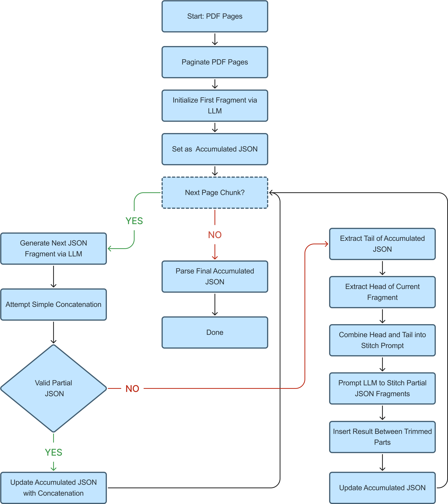

## Introduction: The Enduring Challenge of Medical Documentation

Even with today's advanced medical technology, many healthcare facilities still rely heavily on paper forms for patient information. This ongoing use of paper causes significant challenges. It creates delays between collecting information and getting it into digital systems, leads to mistakes when staff manually type in data, and generally slows down the pace of patient care. Critically, all this paperwork takes up clinicians' valuable time that should be spent with patients, contributing to burnout and affecting the quality of care.

Because of these drawbacks, healthcare is slowly moving toward paperless methods. Electronic forms or online medical forms are the clear solution. They offer a modern, efficient way to handle patient data, addressing long-standing issues related to accuracy, storage, security, and easy accessibility to vital information.

Solving this ongoing paper problem requires practical, real-world solutions to help healthcare go digital. While Aidbox Forms has long provided tools for creating and managing digital forms, the challenge of converting vast archives of existing paper or PDF-based forms remained a significant hurdle for many organizations.

## Introducing the AI Toolkit: Enhancing Aidbox Forms for PDF-to-FHIR Conversion

To address the challenge of digitizing legacy medical forms, the Aidbox Forms team developed a new AI-powered feature. This AI engine is our dedicated solution for converting legacy medical form PDFs into digital forms based on interoperable FHIR Structured Data Capture (SDC) Questionnaires.

The core function of this new AI engine is to analyze diverse medical form PDFs and automatically generate the corresponding FHIR SDC resources. It integrates several AI technologies into a multi-stage workflow specifically for this conversion task:

1. **Input Analysis:** The engine ingests user-uploaded PDFs, differentiating between digitally native formats and scanned paper documents to tailor the processing.
2. **Layout and Content Extraction:** Advanced Optical Character Recognition (OCR) analyzes the visual structure and extracts text, identifies potential fields, and labels essential for understanding the form's layout.
3. **Intelligent Structuring:** Machine learning models interpret this extracted information, classifying elements into field types (text inputs, checkboxes, etc.) and mapping the visual layout to a preliminary logical form structure.
4. **Semantic Interpretation and FHIR Generation:** Large Language Models (LLMs) then process this structured data, understanding the form's instructions, logic (including conditional paths), and leveraging embedded knowledge of healthcare standards to generate the FHIR SDC Questionnaire in JSON format.
5. **Verification Support:** Recognizing the importance of clinical accuracy, the engine outputs the draft FHIR Questionnaire alongside tools that facilitate essential human review, using AI to highlight areas likely requiring attention.

This AI-powered workflow forms the core mechanism of this new Aidbox Forms feature, designed specifically to automate the complex task of converting legacy documents into a modern, standardized digital format. However, translating this targeted capability from concept into a robust, production-ready feature involved navigating numerous real-world technical obstacles, which took us directly into the practical complexities of implementation.

## From Concept to Practice: A Real-World Implementation Journey

While the high-level process may seem straightforward, the road to digitizing [medical forms](https://www.health-samurai.io/articles/top-10-medical-forms) using AI is paved with real-world complexities. Our implementation team faced a clear but difficult task: to convert a wide range of existing patient intake and clinical forms, submitted by medical facilities as PDF documents, into standardized, interoperable digital resources based on the FHIR Structured Data Capture (SDC) Questionnaire format.

### Phase 1: Categorizing the Source Material

The first step involved analyzing the submitted PDFs. These documents fell into two general types:

1. Digitally generated PDFs, created using form technologies like AcroForms, XFA (XML Forms Architecture), and PDF/A variants.
2. Scanned paper forms, saved as PDFs that contained only raster images of printed documents.

We initially focused on the digital PDFs, assuming it would be easier to programmatically extract form structure, metadata, and interactive fields by directly parsing the PDF content.

### Phase 2: Facing the Complexity of PDF Standards

This assumption was quickly challenged. Parsing and interpreting the various PDF standards proved far more complex than anticipated. Each format–AcroForms, XFA, PDF/A – presented unique structures, tooling quirks, and compatibility issues:

- AcroForms often lacked rich semantic context for fields.
- XFA forms, while potentially rich, suffered from inconsistent support across libraries and viewers.
- PDF/A documents, designed for long-term archiving, frequently lack the dynamic form interactivity needed for reliable metadata extraction.

Attempting to build a universal parser robust enough to handle all edge cases would have required an unsustainable engineering effort.

### Phase 3: Introducing LLMs into the Pipeline

Realizing the limitations of traditional parsing, we pivoted to explore AI-driven approaches, specifically capable of document analysis. Our first attempt utilized DocLLM, a model trained for document layout and content understanding. However, the results were underwhelming.

While DocLLM could identify basic visual layout elements – such as sections, labels, and field groupings – it struggled when it came to deeper semantic understanding required for medical form fields, conditional logic (e.g., "If yes, answer question 5"), and mapping these accurately to FHIR-specific data structures.

### Phase 4: Leveraging Generative AI with FHIR Knowledge

The breakthrough came when we moved to general-purpose generative AI tools like ChatGPT and Google Gemini. These models possess not only broad language capabilities but also extensive built-in knowledge of healthcare standards, particularly FHIR and its SDC Questionnaire resource. Crucially, they also provide advanced document understanding capabilities, allowing us to feed PDF pages *as images* directly into the prompt.

Our initial experiments used a simple prompt:

“Generate a FHIR SDC Questionnaire from these document pages.”

This yielded promising results but required significant refinement. The models could interpret form fields and generate JSON output. However, the generated questionnaires often lacked full fidelity to the original form, missing conditional logic, misinterpreting field types, or failing to capture the intended structural hierarchy (e.g., nested question groups).

It was clear that we’re on the right track, but more refinement was needed to achieve consistent, production-level accuracy.

### Phase 5: Scaling the Approach and Overcoming Token Limits

Through iterative prompt refinement, we began achieving consistent and reasonably accurate FHIR SDC Questionnaire outputs – often using zero-shot prompts without needing complex examples. This marked a significant gain in efficiency.

However, as we scaled to process larger, multi-page forms with dense layouts, we hit a persistent roadblock: AI output token limits. When generating the complete FHIR SDC Questionnaire JSON resource, the output would frequently get truncated, hitting the model's maximum token threshold. This resulted in incomplete, invalid JSON, cutting off mid-field definition or within a nested structure.

Our temporary workaround involved parsing the partial JSON up to the last valid element, discarding the incomplete trailing fragment, and reconstructing a syntactically valid (though incomplete) Questionnaire resource. While this salvaged some usable output, it often missed the final questions on longer forms and added substantial overhead during QA and manual patching. This issue made it clear that we need a more robust solution for handling large outputs.

### Phase 6: Prompt Chaining and the Challenges of Continuity

To address token limits, we implemented a prompt chaining strategy. If the model’s output was truncated, we would re-issue the request, providing the last incomplete JSON fragment and instructing the model to continue:

“Continue generating the JSON output, maintaining strict JSON syntax. Do not repeat previous elements.”

We would then concatenate the fragments. In theory, this should have worked smoothly.

In practice, however, maintaining continuity proved difficult. Several issues emerged:

1. **Extraneous Line Feeds:** Minor syntax glitches caused by additional newlines at the start of continuation responses.
2. **Lost Context and Structure Duplication:** A more serious issue where the model lost track of the previous structure, especially if the break occurred mid-string or within nested objects. It might start a new section, duplicate fields, or mismatch brackets.

These inconsistencies often resulted in non-parsable or semantically incorrect outputs. Relying on the LLM to simply "pick up where it left off" for complex structured data like JSON proved unreliable.

### Phase 7: Turning the AI Into Its Own Stitching Engine

The final breakthrough came from using the LLM itself to *stitch together* partial JSON fragments correctly. Instead of manual concatenation or complex parsing logic, we prompted the LLM with a "repair task":

**Prompt:**

“Correctly concatenate these two partial JSONs to make one single syntactically correct partial JSON.

These JSONs represent a FHIR SDC Questionnaire resource. The second JSON may include overlapping data at the beginning with the first one.

You are not allowed to change the beginning of the first JSON and the ending of the second. You output only JSON without any additional text.”

We supplied the last ~10 lines of the first truncated fragment and the first ~10 lines of the second fragment, including overlapping content. The algorithm can be represented as the following pseudocode:

The results were remarkably precise:

- The model respected both the FHIR SDC Questionnaire syntax and semantic structure.
- Overlapping content was intelligently detected and deduplicated.
- The generated connector fragment could be seamlessly inserted between the trimmed parts.

This approach effectively created a resilient, scalable JSON streaming method,  powered entirely by prompt logic. It allowed us to bypass output token limits and reliably generate complete, valid FHIR SDC Questionnaires for large, complex PDF forms, without manual stitching or error-prone post-processing.

## Conclusion: Moving Forward with AI in Healthcare Documentation

Converting legacy paper [medical forms](https://www.health-samurai.io/articles/top-10-medical-forms) into structured digital formats like [FHIR SDC Questionnaires](https://www.health-samurai.io/medical-form) is a complex task, but one with enormous potential benefits. Our experience building this AI-driven feature for Aidbox Forms showed us that powerful models alone aren’t enough. Success comes from designing the right prompts, managing edge cases, and building workflows that work with the limitations of current AI.

We had to solve challenges around inconsistent PDF formats, token limits, and maintaining structural continuity in large outputs. In doing so, we developed specific techniques – like using the AI to accurately stitch partial outputs – that turned a fragile process into a robust system.

This solution can now reliably handle complex, multi-page PDF forms and generate complete, usable FHIR Questionnaires automatically. The result is faster, more accurate documentation workflows that reduce the paperwork burden on clinicians and improve the quality of patient data.

Our experience shows the critical role AI can play in transforming healthcare documentation – and points to a future where intelligent, connected digital tools help clinicians deliver better care.

Curious how this works in practice? Watch a real-life example of a complex medical form, like a Risk Assessment, being converted into a structured FHIR Questionnaire using AI. Watch the video: [How AI Speeds up Converting Paper Forms to Digital](https://youtu.be/Ns3WsYFcgcA?si=FUXlKGlcsbH62N0u).If you are ready to explore the platform: Visit [aidbox.app](https://aidbox.app) and try out Aidbox Forms for yourself.
