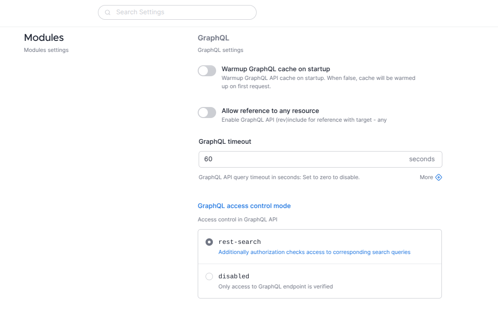

Aidbox is not necessarily used by engineers. We need to make Aidbox and its settings accessible and understandable. We do this in multiple ways.

First, we provide our Settings screen that lists all the settings with their descriptions and values. With that, one can find what they want to change using the search bar and intuitive wordings.

Second, we have expandable information about each setting. The user can open this info to get more understanding about where the setting comes from, how to override it, and what values it accepts. This data may seem overly verbose, but it gives you the agency to change Aidbox in a more significant way if you need to.

And finally, all the settings on this screen are presented as intuitive controls. Boolean settings are on/off switches, enumerated settings are groups of values you can choose from, string settings are free-form inputs. You won’t have to remember special values like “true”, “off”, “none” to change settings, because they are already providing reasonable options for you.

With this interface, you have full control over changing [FHIR server settings](https://www.health-samurai.io/aidbox) without the fear of needing overly technical knowledge for it.

