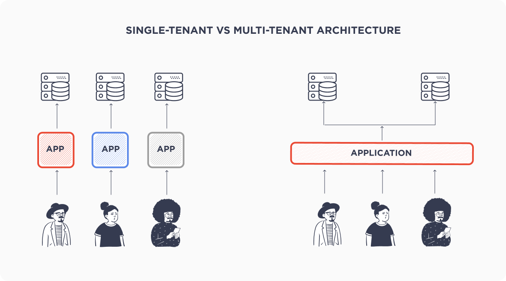
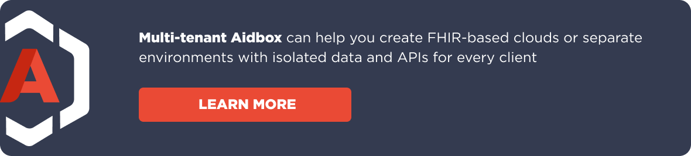
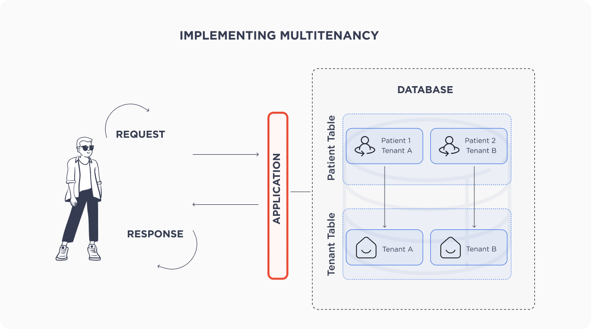
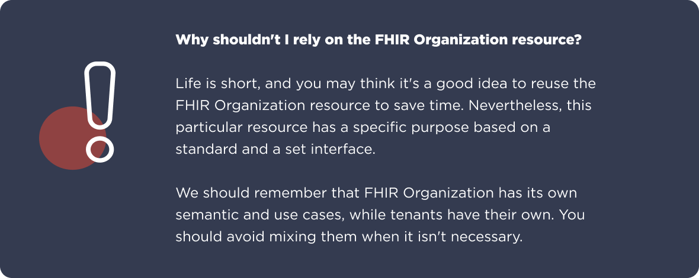
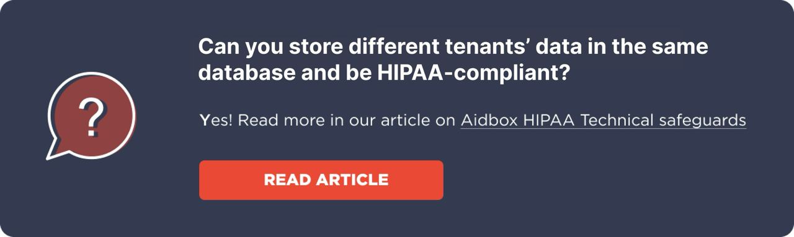
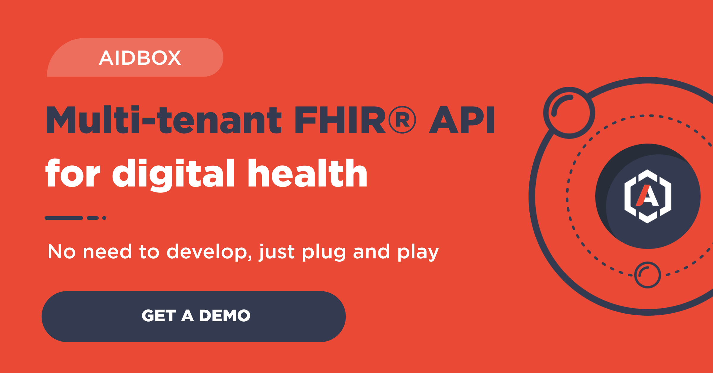

The FHIR trend is still set to dominate in 2024. [The ONC's rules](https://www.health-samurai.io/aidbox/resources/standardized-api-for-ehr-cheatsheet) are proving to be quite a challenge for vendors, as they need to provide a HL7® FHIR API with SMART on FHIR support for every client.

Many EHR vendors still have questions on reducing the burden of having so many FHIR servers. It’s simple: multitenancy is always the right answer.  
  
In this article you will find out the answers to the following questions:

- What is multitenancy? What are the benefits?
- How do you build a multi-tenant FHIR API?
- How do you plug FHIR API into your existing EHR solution?

## **What is multitenancy?**

Multitenancy is a key benefit of SaaS ERP systems. In brief, it’s a way of providing shared resources to multiple customers (tenants), with each customer given their own dedicated environment.

**The tenants are isolated from each other**, meaning that the data of one will not be visible to another in any way. Users can access their own data without infringing on the privacy or data of other tenants.

This makes it an attractive option for businesses that need to share resources across multiple users but also need to maintain individual data privacy and security.

However, when discussing multitenancy, physical isolation should also be taken into consideration. The degree of physical isolation is flexible and can range from complete physical separation to a shared hosting space with each tenant having its own unique platform space.

The degree of physical isolation between different tenants is determined by the underlying technology, but it must generally provide **complete logical isolation** to ensure that each tenant’s data remains secure ([**Gartner**](https://www.gartner.com/en/information-technology/glossary/multitenancy)).

## **What benefits do you get with multitenancy?**

Now let’s look at the benefits of multitenancy for EHR vendors and other platform services:

- **Reduce operational costs:** Just as it's cheaper to share a ride with others, it's cheaper to share cloud resources. So, you get a lot of FHIR servers for the price of one.
- **Scale easily:** Customers have the option of adding or removing resources. This adaptability is ideal for businesses with rapid yet unpredictable growth.
- **Keep your data secure:** While single tenants are more secure, multitenancy is still better at identifying threats and isolating tenant resources.

That being said, no solution is perfect. In terms of the host, multitenancy is more complicated than a single tenancy. We don’t stop at theory, so keep on reading!

> Get started with the Aidbox [FHIR Server](https://www.health-samurai.io/aidbox) for data storage, integrations, healthcare analytics, and more, or [hire our team](https://www.health-samurai.io/services) to support your software development needs.

## **What about FHIR?**

FHIR doesn’t support multitenancy at the specification level. In fact, it doesn’t need to. However, lots of FHIR servers like [**Aidbox**](https://www.health-samurai.io/aidbox) are taking the best of two worlds: FHIR and multi-tenant architecture. [*Learn more about multitenancy in the Aidbox documentation*](https://docs.aidbox.app/modules-1/security-and-access-control/security/multitenancy).

Multitenancy is a matter of internal architectural decisions. FHIR exposes FHIR\_BASE\_URL to make the functionality available to others. Every client of yours should get their own FHIR\_BASE\_URL. We will explain this in more detail later on.

## **Implementing multitenancy**

Here we will explore some techniques which may help you build a highly shared solution. It also goes further in allowing you to migrate to a lower level of multitenancy on demand in the event that some clients need more dedicated resources. In order to implement it, we need to take a look at a few key steps:

- Make tenants explicit;
- Mark data with a tenant ID so that it belongs to a specific tenant;
- Enhance FHIR\_BASE\_URL with the tenant ID;
- Enhance AUTH\_SERVER\_BASE\_URL with the tenant ID.

At the end of the process, your client will have great confidence in their total isolation at the data and API level, which will be justified.

## **Make tenants explicit**

Explicitly defining tenants is crucial for two significant reasons:

- You will inevitably want to know which tenant you have in your system;
- Eventually, you will want to make some customizations for them.

Explicit tenant resources are a good place to track them and enter some specific custom configurations. You may consider introducing extra resources:

> id: my-clinic resource  
> Type: Tenant   
> name: My Clinic

## **The data belongs to the tenant**

This is the reason we’re going for multitenancy in the first place. I suggest making the tenant an explicit property of every resource. It will open up a large space where you can store data, and will also allow you to carry out migration and evolve your infrastructure to meet performance requirements as they grow.

Tenancy is a meta property, so let's take [**Aidbox**](https://www.health-samurai.io/fhir-api)as an example and explore how we store it under the meta field in FHIR resources.

> # Aidbox format  
> meta:  
>  tenant:  
>  id: my-clinic  
> resourceType: Tenant

> # FHIR format  
> meta:  
> extension:  
> - url: <https://aidbox.app/tenant-id>  
> valueReference  
> reference: Tenant/my-clinic

This is an external representation. When it comes to the internal one, we may begin with a simple approach from an infrastructure point of view. We can store data in one database and one table per resource type.

The only strong restriction I can see is that you will have to implement **filtering by tenant on the application level**, which is a pretty reasonable cost for keeping your infrastructure as simple as possible.

In case a tenant requires more resources, produces a huge load and affects other tenants, you are always able to migrate their data into another database and run a dedicated instance of the same application for that tenant.

## **FHIR base URL should contain tenant ID**

When all of your clients have a dedicated FHIR API, you need to provide them with a different FHIR\_BASE\_URL which their virtual FHIR Server will run on. There are two ways to do this:

- You may put the tenant ID in the domain name, like my-clinic.aidbox.app/fhir-api;
- The tenant ID may appear in the URL path, e.g. aidbox.app/tenant/my-clinic/fhir-api.

Both options are OK, though the first looks more precise and cleaner.

If you have full access to your domain and can reserve subdomains for your tenants, you may consider putting the tenant ID into the domain name. Your application should also be able to work with different domains in the same instance, and it usually does.

Having the tenant ID in the URL path is also OK. It doesn’t require you to sacrifice so many domain names, even if you don’t have access to them. The [**FHIR API**](https://docs.aidbox.app/api-1/fhir-api) implements REST style, and the [**REST API**](https://docs.aidbox.app/api-1/api)doesn’t expect any sessions between requests, which means no browser cookies.

### **Auth should belong to the tenant**

Now we have a dedicated FHIR API for every client, and the data in the storage belongs to tenants too. The finishing touch is **dedicating the auth server**. Why is this? You may be curious as to whether it’s possible to have one auth server. I believe that it is not, and here’s why.

Let’s say a user has an account in two different tenants. What do we have then? Can this user be simultaneously logged in to both tenants? Technically, yes. Google is a good example. You may use Google services and switch between accounts in a couple of clicks. But is this the UX (user experience) you’re looking for? I believe not. There two reasons for this:

- Your users will need to pick their accounts every time they work with any of your tenants, even if they have only one account (you can’t be sure whether they have other accounts and you will have to ask every time they want to interact with your FHIR API);
- Being aware that you have different tenants, your users could theoretically interact with external leaks. Our goal is full isolation from the user side.

But this does not stop here, as the auth server must be multi-tenant too. This can be achieved by following the same method we used to separate FHIR APIs for tenants: a dedicated AUTH\_BASE\_URL. It doesn’t matter if the tenant ID appears in the domain name or URL path. The only thing that matters is that tenants may simultaneously be logged in to all your auth servers and interact with your FHIR servers as independent entities.

### **Conclusion**

There are **four simple steps** to achieving multitenancy:

- Make your tenant explicit and first-class;
- Save a link to the tenant in every resource;
- Inject the tenant ID into a FHIR base URL;
- Make your auth server multi-tenant too.

Once you apply those four simple steps, you will be able to make a FHIR server with no extra infrastructure costs, since you need just to create a Tenant resource and virtual FHIR server, meaning that the auth server will be already deployed for it.

If some of your tenants outgrow their allocation, you can easily **dedicate a higher level of isolation**. You simply need to:

- deploy the same application on another server;
- migrate the tenant’s data;
- redirect requests to the new application.

### **Update: Enhanced Organization-Based Hierarchical Access Control**

We have recently enhanced the system by adding organization-based hierarchical access control. This new feature allows for more flexible and precise data access management based on organizational hierarchy. Administrators can now set access permissions at various organizational levels, ensuring that users only see the data they are authorized to view. This improvement significantly enhances the security and manageability of the system, especially in large organizations with complex structures. Detailed information about the new functionality can be found in the [Aidbox documentation](https://docs.aidbox.app/modules-1/security-and-access-control/multitenancy/organization-based-hierarchical-access-control).

To explore the implementation of a multi-tenant FHIR API in your EHR system, consider using the [free version of Aidbox](https://www.health-samurai.io/aidbox#run). It provides a robust environment to test and develop these capabilities, offering all the necessary tools without any feature limitations.

*Author: Vlad Ganshin, Software Engineer at Health Samurai*

Follow US

**If you are looking for a multi-tenant FHIR API that can take you into 2024 and beyond, try** [**the ONC’s certified Aidbox FHIR API module**](https://www.health-samurai.io/fhir-api) **today.**

