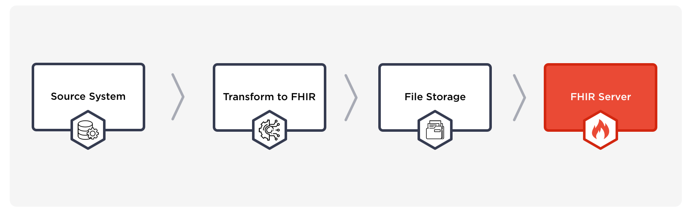
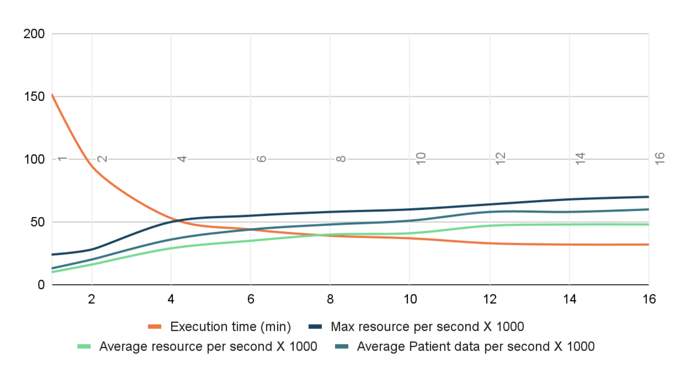
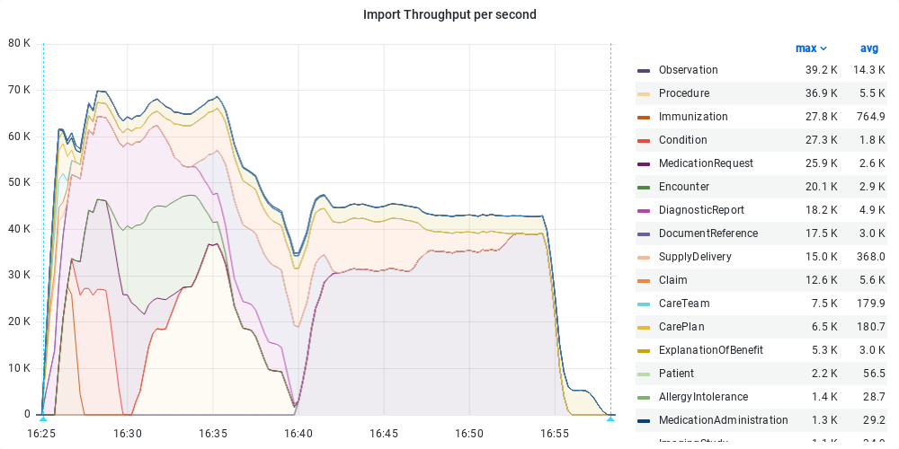
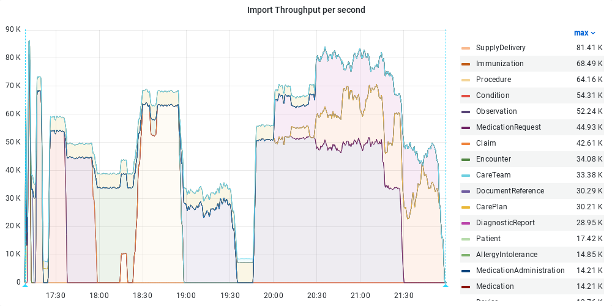
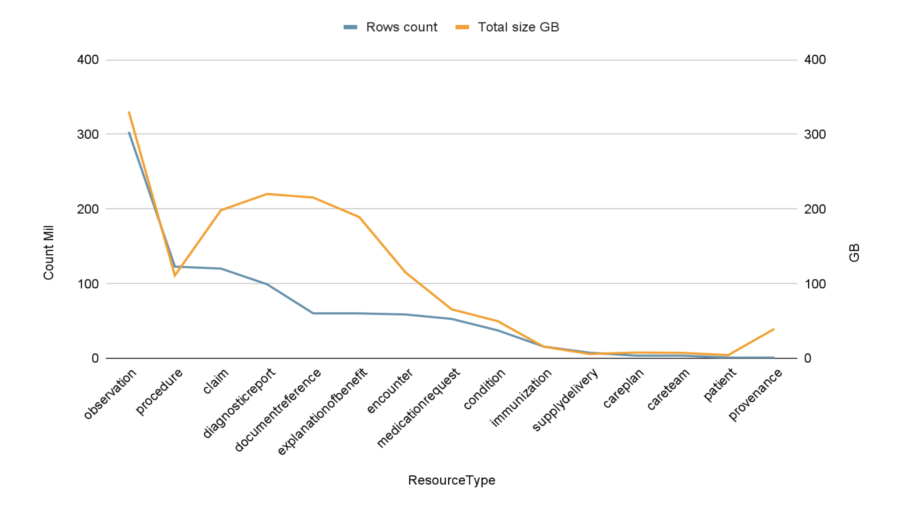
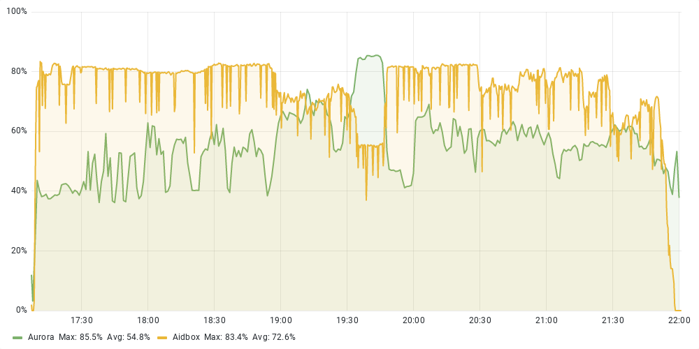

Big data usually means big problems and a lot of work. One of the problems is how to load a lot of data. There is usually some source of big data, and the problem is posed as some kind of legacy system migration or migration of historical data into a [FHIR server](https://www.health-samurai.io/fhir-server).

The typical solution for such problems is to build an ETL (extract, transform, load) pipeline:

Key points for this architecture:

- Transform and upload data to storage. This allows us to split the whole process into two steps: data preparation and data upload.
- Compress storage data: FHIR data contains lots of similar structures, e.g. *{:resourceType “Patient” … }*, so zipping such data is pretty efficient, and the net load can be reduced tenfold as a result.

The task of transformation and storage of the incoming data is highly dependent on the state of the system that the import is done for, thus this information will be omitted from this article. We nevertheless needed a data source for our test. Consequently the [Synthea](https://github.com/synthetichealth/synthea) tool was used, resulting in 40 batches, each containing around 25,000 Patient resources, and their related resources. The script for generation is accessible via the following link: [gen\_synthea.sh](https://gist.github.com/Aitem/10d3b40de67771ecc136be860abfa316).

## Best practices

The task of loading a large amount of data is not exactly new and there are a number of well-established practices for this task that proved to be efficient.

From the perspective of HTTP data transmission via the net, loading the data pieces one by one is obviously not the best approach, as it leads to a significant overhead in connection initialization, receiving the response and so on. Data transmission via batches can dramatically reduce overhead costs and significantly speed up data transfer. Further improvements come with streaming, where all overhead costs wither away.

Use the [PostgreSQL COPY](https://www.postgresql.org/docs/14/sql-copy.html) command to load all the rows in one command, instead of using a series of INSERT commands. The COPY command is optimized for loading large numbers of rows. It is less flexible than INSERT, but incurs significantly less overhead for large data loads.

The database indexes can slow the insertion speed, since each table insert entails updating all indexes of the table to maintain transactionality. Creating indexes on existing data is much faster than incremental updates on each insert. For this reason, it is good practice to turn off (or delete) all existing table indexes before loading data, perform an insert via the COPY command, and turn on (or recreate) the table indexes.

The peculiarity of storing data in [Aidbox](https://www.health-samurai.io/fhir-server) in the form of JSONB and very large FHIR resources may cause difficulties with [TOAST](https://www.postgresql.org/docs/14/storage-toast.html). In essence, the problem arises when the data does not fit into the PostgreSQL page, and the database engine starts to transfer part of the data into the TOAST-allocated table. As for the subsequent reading and writing, reading and writing internally is done for two tables: the toast-allocated and the standard.

There are a number of methods to reduce toasting:

- explicit storage configuration
- compression limit increase

> ALTER TABLE <target\_table> ALTER COLUMN resource SET STORAGE MAIN;  
> ALTER TABLE <target\_table> SET (toast\_tuple\_target = 6000);

## Load from bucket operation

Aidbox has a [load-from-bucket](https://docs.aidbox.app/api-1/bulk-api-1/aidbox.bulk-data-import#aidbox.bulk-load-from-bucket) operation that permits asynchronous upload of FHIR resources from an S3 bucket. This operation has been specially designed for a parallel batch load of tons of FHIR data.

How it works:

- Take the list of files from the bucket
- Disable and temporary save all indexes for target resource tables
- Run *n* parallel loading threads
- For each thread open the stream from one of the S3 bucket for loading files, and on the other side open the [PostgreSQL COPY](https://www.postgresql.org/docs/13/sql-copy.html) stream
- Convert resources in parallel in stream
- After loading all resources, turn back all indexes

> **Note:** Disabling indexes is applied when the *disable-idx?* flag is specified. Load from bucket operation with flag *disable-idx?* is not recommended for use on live production, because this operation disables all indexes for target tables.

## Environment

Infrastructure for this test:

- Aidbox installed on AWS [m5.4xlarge](https://aws.amazon.com/ru/ec2/instance-types/m5/) instance with 16 vCPU
- Database: AWS RDS Aurora on [db.r5.4xlarge](https://aws.amazon.com/rds/instance-types/?nc1=h_ls) instance type with 16 vCPU

## Experiment

First of all let’s try to load around 10% of data and check how Aidbox will respond:

- Total load size (zipped): 17 GB
- Total resource count: 93 million
- Resulting database size: 171 GB

Aidbox [load-from-bucket](https://docs.aidbox.app/api-1/bulk-api-1/aidbox.bulk-data-import#aidbox.bulk-load-from-bucket) RPC operation call example:

> POST /rpc  
> content-type: text/yaml  
> accept: text/yaml  
>   
> method: aidbox.bulk/load-from-bucket  
> params:  
>   bucket: s3://<fhir-data-bucket>  
>   prefixes: ["fhir/1/", "fhir/2/", "fhir/3/", "fhir/4/"]  
>   thread-num: 16  
>   disable-idx?: true  
>   account:  
>     access-key-id: <access-key-id>  
>     secret-access-key: <secret-access-key>  
>     region: <region>

Let's run imports with different numbers of threads (1, 2, 4, ...,16) and see how execution time and average values will change.

As seen from the graph with the increase in threads from 1 to 4, the general data loading performance grows almost linearly. The further increase in threads from 4 to 12 becomes insignificant. The additional increase from 12 to 16 does not affect performance growth. The performance limitations may be caused by the net bandwidth, database throughput or similar. In our experiment there were neither limitations from the database nor from the net bandwidth and the Java performance was the main bottleneck.

*Import throughput per second by resource type running in 16 threads for 10% of data*

From our observations we conclude that the data loading performance is affected by the distribution of the data by volume. Thus, from the chart above, it is clear that small resources like *Procedure* or *Observation* can be loaded with a speed of up to 40,000 resources per second. On the other hand, huge resources like *ExplanationOfBenefit* can be loaded with only up to 5,300 resources per second, resulting in 20% of the entire dataset’s volume. Such data irregularity eventually greatly affects the throughput and the total time of the data import process, and so may vary greatly in projects.

> Curious about the details? Dive deeper into our process and see how you can optimize your FHIR resource loading. [Learn More Here](https://hubs.li/Q02y4Qs40)

## Load 1 billion FHIR resources

Based on the experiments above we chose to load data in 12 threads for the final data import. The total time to complete the import took 4 hours and 48 minutes. About 1 billion resources were created with a total database size of 1649 GB.

Below is a summary of the download result:

- 4 h 48 min execution time
- 183 GB total zipped data size
- 1649 GB resulting database size
- 1 billion total resource count
- 57,000 average resource count per second
- 64 patient data per second

*Import throughput per second by resource type running in 12 threads for 100% data*

This graph illustrates the general import throughput of the data upload. It can be seen that the speed of the process is not constant and can vary from 8,000 to 80,000 resources per second at its peak. The average throughput was 57,000 resources per second, 10% higher than in the previous tests.

The most significant speed drops were detected for the *Provenance* resource. The average record size for this resource was 37 KB, which is very big. Records of such size are processed slowly and cause complexities related to TOAST technology in Postgres. The final throughput stats are highly dependent on the structure and volume of the data: small resources are almost instantly loaded, while the big ones are loaded very slowly.

*Resource count and total size distribution on top 15 biggest tables*

The graph of the distribution looks particularly interesting. We can observe that there are about 300 *Observations* per *Patient* resource on average, and the resources that take up the most disk space are *Claim*, *DiagnosticReport*, *DocumentReference*, and *ExplanationOfBenefit*. The *Provenance* resource deserves special attention. With a total number of entries of 1 million, it takes up 40 GB of disk space with an average resource size of 37 KB.

*Aidbox and Aurora CPU utilization*

The Aidbox and Aurora CPU load graph shows that for almost the entire duration of the data import, the load was in full use of 12 Aidbox cores. At the same time, the average CPU consumption for the Aurora database was 54%. On the graph, you can see a sharp increase in the CPU consumption of the database and a drop for Aidbox. This is due to the transfer of large Provenance resources. At this point, the Aidbox threads began to wait for a response from the database, while the database itself was busy compressing the data in order to store it in TOAST.

To experiment with loading large datasets into Aidbox and experience its scalability firsthand, try the [free version of Aidbox](https://www.health-samurai.io/aidbox#run). It provides a robust environment to test these capabilities, offering all necessary tools without any feature limitations.

## Conclusion

The most obvious solution is not always the optimal one. Sometimes, in order to find an effective solution, one should pose the problem differently or make some technical compromises. In this post we offer our vision of the best practices to upload huge datasets into [Aidbox](https://www.health-samurai.io/aidbox).

Follow US

*Authors: Marat Surmashev, Georgii Ivannikov*

