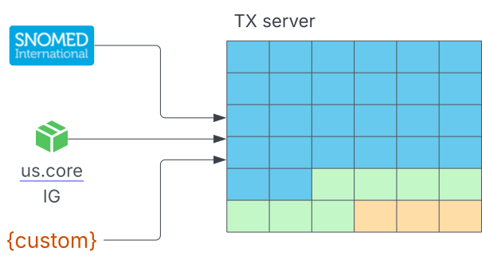
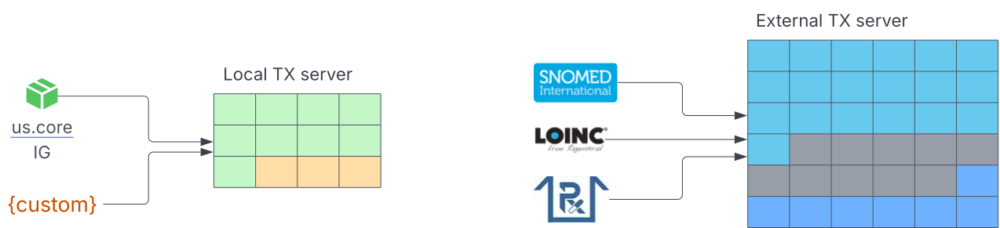
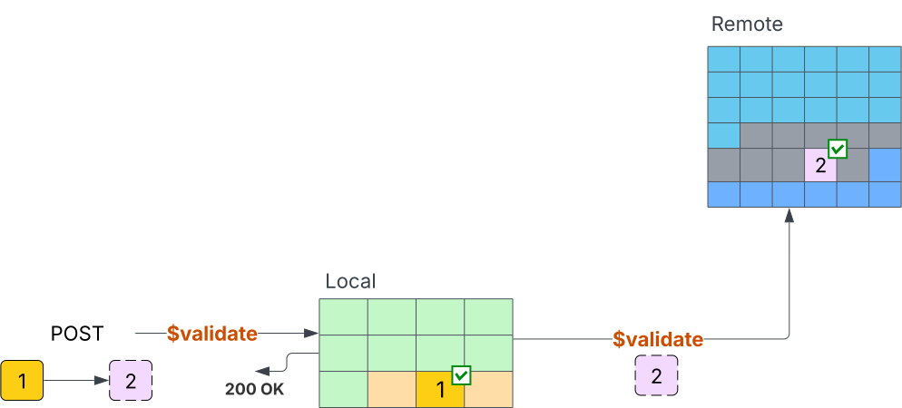
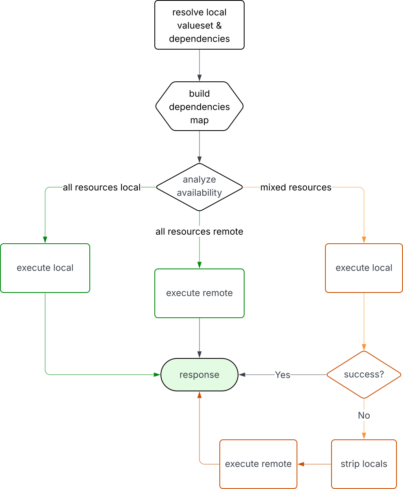
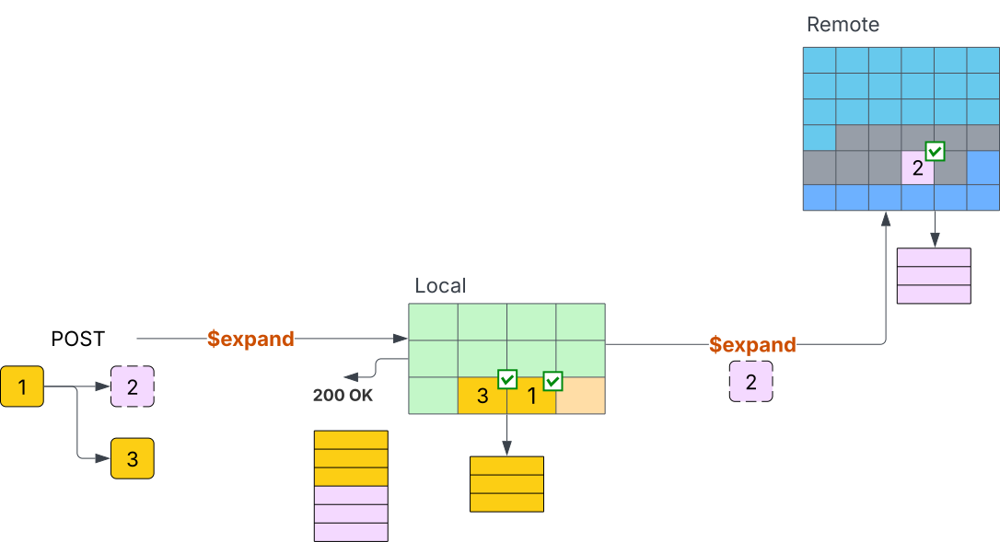
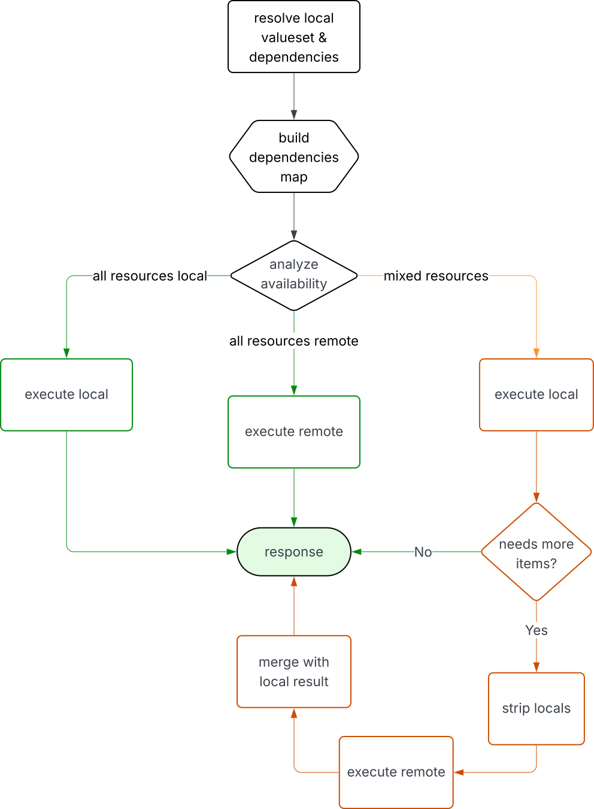

## What is a FHIR Terminology Service?

Terminology servers ([TX servers](https://www.hl7.org/fhir/terminology-service.html)) are FHIR services specialized in managing knowledge artifact resources related to terminology and vocabulary. A single TX server can provide terminology operation capabilities for many FHIR servers. TX servers generally don't manage clinical resources like patients, observations, medications, or diagnostic reports, but rather resources used to integrate knowledge into healthcare systems. TX services help solve issues such as:

- "Is `85354-9` a valid LOINC code?" ([`$validate-code`](https://build.fhir.org/valueset-operation-validate-code.html))
- "Give me all codes for vital signs measurements" ([`$expand`](https://build.fhir.org/valueset-operation-expand.html))
- "What's the display name for ICD-10 code S920?" ([`$lookup`](https://build.fhir.org/codesystem-operation-lookup.html))
- "What's the SNOMED equivalent of this ICD-10 diagnosis?" ([`$translate`](https://build.fhir.org/conceptmap-operation-translate.html))

TX servers commonly manage content-heavy standard terminologies, also called **external terminologies**. These terminologies present massive storage and maintenance challenges:

- [**SNOMED CT International**](https://terminology.hl7.org/SNOMEDCT.html): Over 365K active concepts with complex hierarchical relationships
- [**LOINC**](https://terminology.hl7.org/LOINC.html): Over 100K laboratory and clinical observation codes with extensive properties
- [**RxNorm**](https://terminology.hl7.org/RxNorm.html): Over 200K drug concepts including historical and branded variations
- [**ICD-10**](https://www.who.int/standards/classifications/classification-of-diseases/list-of-official-icd-10-updates): Over 70K diagnostic codes across multiple national variations

TX servers also manage **community terminologies** included in Implementation Guides (IGs) such as [US Core](http://hl7.org/fhir/us/core/) (which contains terminology tailored for United States healthcare practices) and organization-specific **custom terminologies** represented as local CodeSystems and ValueSets.

## The Problem

Organizations implementing FHIR need comprehensive coverage of **external terminologies** in combination with **custom terminologies** and **community terminologies**. They rarely use terminologies in isolation. Let's call this the **mixed terminologies** problem. A typical electronic health record deployment might require:

```javascript
resourceType: ValueSet
compose:
  include:
  - system: http://loinc.org
    filter:
    - property: SCALE_TYP
      op: "="
      value: Qn
  - system: http://example.org/fhir/CodeSystem/custom-vitals
    concept:
    - code: pain-scale-1-10
    - code: mobility-assessment
  - system: http://hl7.org/fhir/us/core/CodeSystem/us-core-category
    concept:
    - code: vital-signs
```

This single ValueSet combines:

- **External terminology** (LOINC) with filtering requirements
- **Custom terminology** for organization-specific measurements
- **Community terminology** from US Core for interoperability

The traditional approach to this **mixed terminologies** requirement is to manage all three kinds of terminologies in the same TX server.



### Local-Only Terminology Servers and the Large Terminologies

Local-only means using the FHIR server for managing both clinical and terminology resources. This approach implies treating the knowledge artifacts related to terminologies similarly to clinical resources, sharing the same engine, the same storage and the same infrastructure.

#### Pros

- **Ease of use**: Everything in one place. No external integrations or orchestration are needed.
- **Full control**: You can change terminology resources immediately, without waiting on external updates.

#### Cons

- **Data management**: Managing **external terminologies** usually requires gigabytes of storage for concept definitions, properties, and relationships, even when clients may depend only on a small subset of the terminology concepts.
- **Lifecycle management**: Requires a mechanism for maintaining terminology up to date with official releases.
- **Poor TX operations support**: Most FHIR servers don't fully support advanced features that TX servers provide, for instance:
  - Implicit ValueSets
  - Terminology-specific query language support (ECL)
  - Supplements support
  - Language packs

### External-Only Terminology Servers and Context-Specific Terminologies

External terminology servers are hosted TX services that give access to large standard terminologies without requiring local storage. Examples include community services like HL7's [tx server](https://tx.fhir.org/r4) and [Ontoserver](https://r4.ontoserver.csiro.au/fhir), as well as commercial SaaS offerings like Health Samurai's [Termbox](https://tx.health-samurai.io/fhir). These services excel at providing comprehensive coverage of massive terminologies like SNOMED CT and LOINC. However, relying entirely on external delegation creates several operational challenges, especially when an organization also needs to manage context-specific terminologies, like those from Implementation Guides or custom local code systems.

#### Pros

- **Full-featured TX services**: Broad coverage of terminology operations.
- **Content lifecycle management**: External terminologies content is guaranteed to be up to date.
- **No local storage**: Use only what you need from the TX server and external terminologies, without storing unnecessary data.

#### Cons

- **Little control**: Clients are not able to apply updates to terminologies, only the terminology owner can provide updates via releases.[1](https://github.com/HealthSamurai/hs-docs/blob/f362cc59518843f81f1e181f58b55cfca26244b6/docs/blog/aidbox-tx-hybrid/article.md#user-content-fn-1-4c3197f18405dd1507d031adeeaffcba)
- **Custom terminologies**: As **mixed terminologies** is a constant requirement, you need to decide on your **custom terminologies**, either publishing them to the external service (making them available to every TX server client) or setting up some intelligent mechanism for routing/coordinating terminology requests based on its characteristics.
- **Increased Fragility**: Delegating every terminology request to an external TX server, makes the system more fragile due to the network dependency and potential connectivity issues.

Both local-only and external-only approaches fall short for the **mixed terminologies** scenario, forcing trade-offs in functionality or performance. *The core issue is that content-heavy terminologies like SNOMED CT, LOINC, and RxNorm have broad applicability, while* ***community*** *and* ***custom*** *terminologies are context-specific and should not affect unrelated terminology service clients*.

Solving the infrastructure challenges of massive terminologies (storage, indexing, updates) requires entirely different approaches than managing small, rapidly-changing local vocabularies (agility, customization, governance). Traditional TX services cannot optimize for both scenarios simultaneously, leading to either over-engineered solutions for simple local terminology or inadequate infrastructure for large standard terminologies.

## The Hybrid Approach

Hybrid terminology service solves this challenge through intelligent request analysis and partitioning. Rather than forcing a binary choice between local and external processing, the hybrid engine examines each request to determine which resources are available locally and which require external delegation, then reassembling the results.



To demonstrate the hybrid algorithm, consider a healthcare organization with:

- **Local CodeSystem**: `http://hl7.org/fhir/test/CodeSystem/simple`
- **Remote CodeSystem**: `http://hl7.org/fhir/sid/icd-10`

**Local CodeSystem Definition**:

```javascript
resourceType: CodeSystem
language: en
url: http://hl7.org/fhir/test/CodeSystem/simple
version: 0.1.0
hierarchyMeaning: is-a
content: complete
concept:
- code: code1
  display: Display 1
```

### Remote Code Validation Example

Let's validate an ICD-10 code that requires external delegation.

**Request**:

```javascript
POST /fhir/ValueSet/$validate-code
```

```javascript
resourceType: Parameters
parameter:
- name: code
  valueCode: S920
- name: system
  valueUri: http://hl7.org/fhir/sid/icd-10
- name: valueSet
  resource:
    resourceType: ValueSet
    url: http://example.org/fhir/ValueSet/vs1
    compose:
      include:
      - system: http://hl7.org/fhir/test/CodeSystem/simple
      - system: http://hl7.org/fhir/sid/icd-10
```

**Response**:

```javascript
resourceType: Parameters
parameter:
- name: result
  valueBoolean: true
- name: code
  valueCode: S920
- name: system
  valueUri: http://hl7.org/fhir/sid/icd-10
- name: version
  valueString: 2019-covid-expanded
- name: display
  valueString: 'Fracture of foot, except ankle : closed'
```

The system detects that `http://hl7.org/fhir/sid/icd-10` isn't available locally and delegates the validation to the external terminology server.



### How This Engine Works?

The hybrid engine processes `ValueSet/$validate-code` request through the following phases:



#### 1. Resolve Local ValueSet & Dependencies

The ValueSet is the entry point to the terminology execution context. The hybrid engine resolves the complete dependency graph locally, including all referenced CodeSystems and nested ValueSets.

#### 2. Build Dependencies Map

It builds a dependency map from the ValueSet’s composition rules. The dependency resolution relies on FHIR's [canonical resolution algorithm](https://build.fhir.org/ig/FHIR/ig-guidance/branches/master/pinning.html#choosing-the-most-recent-version) to pick the most recent compatible versions.

#### 3. Analyze Availability

The hybrid engine analyzes the terminology execution context to detect resource requirements. This analysis examines:

- **CodeSystem content availability**: Systems marked as `content: "not-present"` require external processing
- **ValueSet composition dependencies**: Include/exclude rules referencing unavailable CodeSystems
- **Canonical URL resolution**: Missing resources in the local FHIR Artifact Registry

#### 4. Single Target Processing

If everything is local or everything is remote, it routes to that single target and returns the result.

#### 5. Hybrid Processing

When the analysis determines that portions of the dependency graph require external processing, the request is first executed locally. If the local validation succeeds, the result is returned to the client. If it fails, the hybrid engine strips local components and delegates the remaining request to the configured external terminology server.

### A More Complex Scenario: the ValueSet/$expand Operation

The hybrid algorithm applies similarly to `$expand` operations with one key difference: the capability for merging results coming from different sources. Consider expanding a ValueSet that combines local and remote terminology systems.

**Locally Available ValueSets**

```javascript
resourceType: ValueSet
url: http://example.org/vs-local1
compose:
  include:
  - system: http://hl7.org/fhir/administrative-gender
    filter:
    - property: concept
      op: "="
      value: female
---
resourceType: ValueSet
url: http://example.org/vs-remote1
compose:
  include:
  - system: http://loinc.org
    filter:
    - property: concept
      op: in
      value: 1751-7,2339-0
---
resourceType: ValueSet
url: http://example.org/vs-remote2
compose:
  include:
  - system: http://loinc.org
    filter:
    - property: concept
      op: "="
      value: 2339-0
```

**Request**:

```javascript
POST /fhir/ValueSet/$expand
```

```javascript
resourceType: Parameters
parameter:
- name: valueSet
  resource:
    resourceType: ValueSet
    compose:
      include:
      - valueSet:
        - http://example.org/vs-local1
      - valueSet:
        - http://example.org/vs-remote1
      exclude:
      - valueSet:
        - http://example.org/vs-remote2
```

**Response**:

```javascript
resourceType: ValueSet
expansion:
  total: 2
  parameter:
  - name: used-valueset
    valueUri: http://example.org/vs-local1
  - name: used-valueset
    valueUri: http://example.org/vs-remote1
  - name: used-valueset
    valueUri: http://example.org/vs-remote2
  - name: used-codesystem
    valueUri: http://hl7.org/fhir/administrative-gender|4.0.1
  - name: used-codesystem
    valueUri: http://loinc.org|3.1.0
  - name: used-codesystem
    valueUri: http://loinc.org|2.76
  - name: version
    valueUri: http://loinc.org|2.76
  contains:
  - code: female
    system: http://hl7.org/fhir/administrative-gender
    display: Female
  - system: http://loinc.org
    code: 1751-7
    display: Albumin [Mass/volume] in Serum or Plasma
```

The hybrid engine processes the administrative-gender concept locally while delegating LOINC filtering to the configured external TX server. While `$validate-code` operations require binary validation results, `$expand` operations must combine concept lists from both local and remote sources.



The hybrid algorithm for $expand operations includes two additional steps:



#### 6. Needs More Items?

If local expansion can't fully satisfy the request, the hybrid engine strips local components from the original request and delegates the remaining parts to the configured external terminology server to resolve the remote expansion.

#### 7. Merge With Local Result

The hybrid engine then combines the local and remote expansions, deduplicates concepts, and produces the final expansion metadata with contributions from both sources.

## Hybrid Terminology Engine in Aidbox

Aidbox introduced **The Hybrid TX engine** in release [2507](https://www.health-samurai.io/docs/aidbox/reference/settings/fhir#terminology-engine-a-href-fhir-terminology-engine-id-fhir-terminology-engine-a), with support (as of the publication of this article) for:

- [**CodeSystem**](https://www.health-samurai.io/docs/aidbox/terminology-module/fhir-terminology/codesystem): `$lookup` and `$validate-code` operations
- [**ValueSet**](https://www.health-samurai.io/docs/aidbox/terminology-module/fhir-terminology/valueset): `$validate-code` and `$expand` operations
- [**ConceptMap operations**](https://www.health-samurai.io/docs/aidbox/terminology-module/fhir-terminology/conceptmap): `$translate` operation

See the [capabilities registry](https://www.health-samurai.io/docs/aidbox/terminology-module/aidbox-terminology-module/capabilities) for details.

### Enable Hybrid Engine in v2507+

Run Aidbox locally following the [Run Aidbox locally](https://www.health-samurai.io/docs/aidbox/getting-started/run-aidbox-locally) guide. Notice the downloaded `docker-compose.yaml` file includes environment variables to enable hybrid mode:

```javascript
services:
  aidbox:
    environment:
      BOX_FHIR_TERMINOLOGY_ENGINE: hybrid
      BOX_FHIR_TERMINOLOGY_ENGINE_HYBRID_EXTERNAL_TX_SERVER: https://tx.health-samurai.io/fhir
```

For more configuration details, see [Aidbox terminology module setup](https://www.health-samurai.io/docs/aidbox/terminology-module/aidbox-terminology-module/setup).

### Prepare FHIR resources

Open Aidbox's [REST Console](http://localhost:8080/ui/console#/rest) and send:

```javascript
POST /fhir/ValueSet

resourceType: ValueSet
status: active
url: http://example.org/vs-local1
compose:
  include:
  - system: http://hl7.org/fhir/administrative-gender
    filter:
    - property: concept
      op: "="
      value: female
```

```javascript
POST /fhir/ValueSet

resourceType: ValueSet
status: active
url: http://example.org/vs-remote1
compose:
  include:
  - system: http://loinc.org
    filter:
    - property: concept
      op: in
      value: 1751-7,2339-0
```

```javascript
POST /fhir/ValueSet

resourceType: ValueSet
status: active
url: http://example.org/vs-remote2
compose:
  include:
  - system: http://loinc.org
    filter:
    - property: concept
      op: "="
      value: 2339-0
```

### Run ValueSet $expand operation

Now expand a ValueSet composed of local and remote terminologies.

**Request:**

```javascript
POST /fhir/ValueSet/$expand

resourceType: Parameters
parameter:
- name: valueSet
  resource:
    resourceType: ValueSet
    compose:
      include:
      - valueSet:
        - http://example.org/vs-local1
      - valueSet:
        - http://example.org/vs-remote1
      exclude:
      - valueSet:
        - http://example.org/vs-remote2
```

**Response:**

```javascript
resourceType: ValueSet
expansion:
  identifier: urn:uuid:f087ced0-b9b7-4277-a4d7-e97d23ff44fe
  timestamp: '2025-09-05T14:27:07.118905554Z'
  total: 2
  parameter:
  - {name: used-valueset, valueUri: 'http://example.org/vs-local1'}
  - {name: used-valueset, valueUri: 'http://example.org/vs-remote1'}
  - {name: used-valueset, valueUri: 'http://example.org/vs-remote2'}
  - {name: used-codesystem, valueUri: 'http://hl7.org/fhir/administrative-gender|4.0.1'}
  - {name: used-codesystem, valueUri: 'http://loinc.org|2.76'}
  - {name: version, valueUri: 'http://loinc.org|2.76'}
  contains:
  - {code: female, system: 'http://hl7.org/fhir/administrative-gender', display: Female}
  - {system: 'http://loinc.org', code: 1751-7, display: 'Albumin [Mass/volume] in Serum or Plasma'}
```

See the [Aidbox's terminology module documentation](https://www.health-samurai.io/docs/aidbox/terminology-module/overview) for more examples.

## Putting It All Together

The hybrid terminology engine is a production-ready way to handle what traditional TX services struggle with: delivering broad coverage and local control at the same time.

### Key Advantages Over Traditional Approaches

- **Reduced External API Usage**: Only external resources trigger external server requests.
- **Parallel Processing**: Local and external queries can run concurrently.
- **Intelligent Caching**: Local resources benefit from database optimizations and indexing as well as remote results caching.
- **Gradual Migration**: Move terminologies between local and external at your pace.
- **Custom Terminology Control**: Sensitive or proprietary terminology remains under local control.
- **Standard Terminology Access**: Get comprehensive coverage of external terminologies without local storage burden.
- **Advanced TX server operations support**: The hybrid engine implements the TX service specification near 100% with emphasis on **custom** and **community** terminologies.

### See also:

- [Aidbox Terminology Module Documentation](https://www.health-samurai.io/docs/aidbox/terminology-module/overview)
- [Aidbox Terminology Module - Hybrid mode](https://www.health-samurai.io/docs/aidbox/terminology-module/aidbox-terminology-module/hybrid)
- [Aidbox FAR - CodeSystem](https://www.health-samurai.io/docs/aidbox/terminology-module/fhir-terminology/codesystem)
- [Aidbox FAR - ValueSet](https://www.health-samurai.io/docs/aidbox/terminology-module/fhir-terminology/valueset)
- [Aidbox FAR - ConceptMap](https://www.health-samurai.io/docs/aidbox/terminology-module/fhir-terminology/conceptmap)
- [FHIR Terminology Service Specification](https://www.hl7.org/fhir/terminology-service.html)
