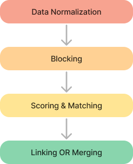
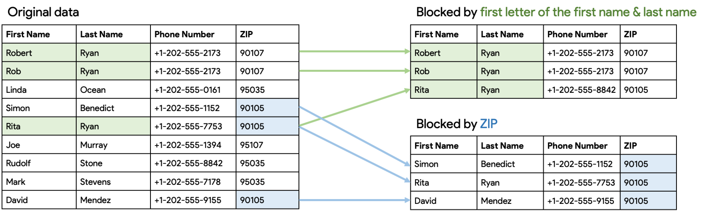
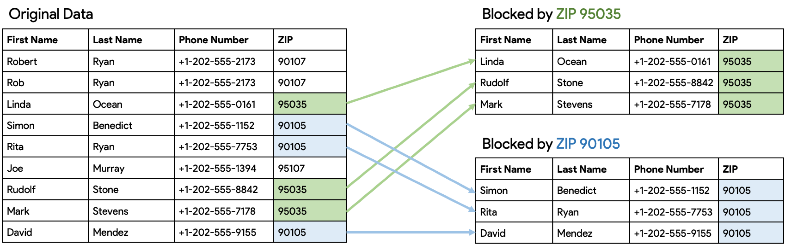
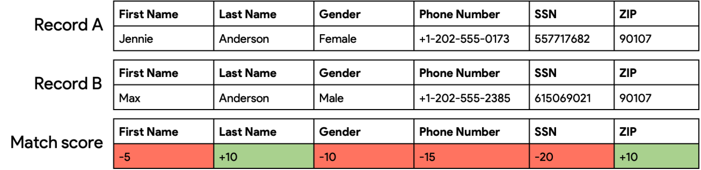
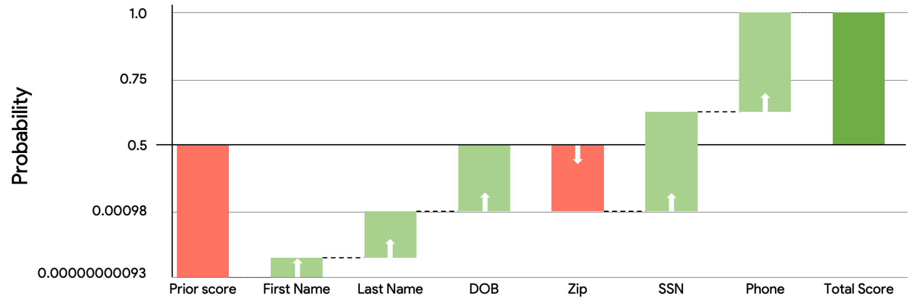

The more information care providers have about a patient, the better the care they can provide.

Standard protocols like FHIR, which are supported by national regulations, make it easier to collect patient data from labs, hospitals, diagnostic centers, etc. But identifying whether different records belong to the same person or contain duplicated data can present a challenge. This can be solved by a Master Patient Index with an appropriate record linkage algorithm.

In this article we will discuss:

- What the Master Patient Index (MPI) & Record Linkage are, and how they work;
- How to implement an MPI and what methods can be used;
- How to choose the right Record Linkage algorithm.

## **What are Master Patient Index and Record Linkage?**

The **Master Patient Index (MPI)** is a software used in healthcare organizations to uniquely identify each patient and link their multiple records together. This helps to ensure that all healthcare providers have access to accurate information about patients.

**Record Linkage** is the process of matching duplicate records. The linkage algorithm (method) is the heart of the Master Patient Index. It calculates the similarity of two records and decides whether they are the same.

**Hint**: If you are seeking a comprehensive tool for managing patient records, the term "**Master Patient Index**" is a useful keyword to search for. If you are more interested in understanding how it works, just keep reading the article and google "**Record Linkage**" later.

## **Implementing Master Patient Index & how it works**

The implementation of Master Patient Index follows a specific pipeline, consisting of several key steps:

- Data Cleansing & Normalization - clean data and standardize its format;
- Blocking - pregroup records to reduce the number of record comparisons for better performance;
- Scoring & Matching - the "heart" of the process: identify the similarity of records and carry out automatic or manual matching;
- Linking or Merging duplicate records.

Now let's examine each step in more detail.

****

## **Master Patient Index: Data Cleansing & Normalization**

First, we clean the data.

Ensure that identifiers (like address, gender, SSN, etc.) are formatted consistently for more accurate results in the end. This can be done by removing punctuation, converting to uppercase, and standardizing values.

Normalize terminologies: while **Gender** may be represented as "Male/Female" in one dataset and "Man/Woman" in another, it should be coded the same way.

If a value is invalid and has been entered just to fulfill a required field (e.g. "Baby boy" in the First Name field or "00000000" for a social security number), it is recommended that the value is reset to "NULL" as the algorithm may be sensitive to such entries.

The ideal situation occurs when your data source provides clean data in the same format (same names for attributes), but this is not always the case and usually you have to convert your data to the same format.

We recommend using **HL7 FHIR** for standard data formats, because we are seeing significant adoption of FHIR and it looks like FHIR will become a lingua franca for healthcare data exchange in the near future. Our Aidbox Record Linkage module is implemented on top of FHIR: https://docs.aidbox.app/mdm/mdm-module.

## **Master Patient Index: Blocking**

Once the data has been cleansed & normalized, we can start the process of blocking records. If an Master Patient Index has one million records, a straightforward comparison of all records would require one trillion comparisons, but you can significantly reduce this number.

This usually involves running the dataset through a series of filters, each time using a different attribute or method to identify possible matches, but there is a tradeoff between **performance** and **accuracy** and it’s important to choose the right key for blocking.

Blocking is typically done by dividing the records into smaller groups – or "blocks" – based on certain **criteria** (filters), for example using weak similarity (like first name, gender, year of birth, ZIP code etc.).

As you can see on the example scheme below, one blocking operation may generate candidate blocks using the **Last Name** attribute and the first letter of the **First Name**, or it could make blocks using other attributes, like **Phone Number** or **ZIP**:

Matching is then done inside the block, or between two blocks within the same attribute:

It is worth noting that different runs of this operation may uncover different true matches, so taking the combination of the results may potentially uncover a majority of the true matches.

The aim is to minimize the number of candidates, therefore the guidelines should be:

1. **Broad** enough to encompass all relevant records within the same block;
2. **Specific** enough to allow for efficient comparison of candidates within a reasonable time frame.

### **Master Patient Index: Scoring & Matching**

The "heart" of the Master Patient Index is the Scoring & Matching process, and in this step it is crucial to determine whether two records are likely to refer to the same individual. Algorithms may classify records into two groups – **Match** or **Not Match** – or a third group, **Possible Match**, where the decision can be delegated to humans.

Matching can be done using different methods:

- **Deterministic** (rule-based) method - uses a set of rules (for example SSN, DOB, and last name match) and is also called exact match logic. Deterministic rules can be designed with a high level of specificity;
- **Probabilistic** (score-based or **Fellegi-Sunter**) method - this method links the records when the sums of all the weighted agreements outweigh the disagreements.

You can use this table to compare the methods quickly and easily:

| Method | Pros | Cons |
| --- | --- | --- |
| Deterministic (rule-based) method  Uses a set of rules (for example SSN, DOB, and last name match), it is also called exact match logic  Deterministic rules can be designed with a high level of specificity | Easy to implement  Easy to write and understand its simple rules | Limited accuracy or requires complicated extensions to improve it  Hard to maintain a set of rules for accurate matching  Very sensitive to data quality  Hard to implement efficiently for big datasets  There is no way to quantify the quality algorithm |
| Probabilistic (score-based or Fellegi-Sunter) method  This method links the records when the sums of all the weighted agreements outweigh the disagreements | Uses all available data points to make a decision (match or not match). Handles missing or invalid data  Can learn from existing and new data statistics  Quality of algorithm (accuracy & sensitivity) can be estimated in numbers  Scales well with blocking for big datasets  Successfully used for population analysis in many projects | Requires configuration and tuning by experts |

The **Aidbox Record-Linking Module** uses the **Probabilistic** **method** (**Fellegi-Sunter** algorithm-based model), which is a type of Bayesian classifier, and compares the values of specific attributes such as first name, DOB, or SSN. If the attributes appear to be the same, this increases the match probability, and if the attributes do not match, the match probability decreases.

So, we use a system that helps us decide how likely it is that the two records are the same. We start by guessing how likely it is that any two records picked randomly match. Then we compare the records to see if they have things in common, like the same birth date, SSN or phone number.

So here is a quick and easy way to explain how the algorithm works: it compares records and accurately evaluates the evidence, so we can determine the likelihood of a match:

- Columns with a larger number of unique values, such as date of birth, SSN or phone number, are more likely to establish a strong **match**, as it is unlikely that these values in the two randomly selected records would match by chance.
- When a column **does not match**, it is usually evidence against a match. We also have to admit that this evidence may not be entirely reliable in cases where external factors, such as a change of name due to marriage, a relocation that would result in the patient having a different ZIP code, or a simple typo in the data entry can result in a mismatch in the column.

If this total **evidence score** meets or exceeds a configurable threshold, known as the cutting value, the records are considered a match and can be matched. If the score falls below the threshold, the records are considered to be separate individuals and are not matched in the Master Patient Index.

A common practice is to examine the distribution of **scores** and choose a **similarity method** that will result in a desired rate of false positives or false negatives. This can help to balance the need for accuracy with the need to minimize the workload of human reviewers.

> Get started with the Aidbox [FHIR Server](https://www.health-samurai.io/fhir-server) for data storage, integrations, healthcare analytics, and more, or [hire our team](https://www.health-samurai.io/services) to support your software development needs.

### **Choosing the matching algorithm**

As a default choice, **Fellegi-Sunter** looks to be the most appropriate option. It requires an expert to set up and configure, but can provide a good outcome.

If you have fewer trusted data sources with intimate relationships, simple deterministic rules will be enough, but there is no way to evaluate their accuracy.

### **Linking Or Merging?**

After the records are matched, it is important to decide whether you should **link** or **merge** the records.

- **Linking the records** means that we keep all duplicate records as they are, but link them to each other. If you have different sources for different duplicates, there will be no issue in updating the records.

This is useful in cases where data is continuously aggregated from different sources, as it allows the Master Patient Index to keep track of the relationships between records without having to continuously resolve merge conflicts.

- **Merging the records** means combining the records into a single, hybrid record.

This involves combining the data from multiple records into a single record that contains all of the relevant information about a patient. This is useful when there is only a single patient record and most interactions with the Master Patient Index involve a set of records.

However, it can be more complex to manage merge conflicts and false-positive links in this type of system.

> Improve interoperability with HL7 FHIR healthcare solutions: [CapMinds FHIR Service](https://www.capminds.com/hl7-fhir/)

### **The "tradeoff"**

If data are continuously aggregated from different sources, a linking strategy looks preferable because there is no need to continuously resolve merge conflicts, while false-positive links could be simply reverted by unlinking.

On the other hand, this system doesn’t only deal with a single patient record, and most interactions deal with sets of records.

In real world systems, it is common to use a hybrid approach, combining both linking and merging. This is because the problem of the tradeoff between **maintaining data integrity & allowing for flexible querying** on the one hand, and **creating a complete & accurate picture of the data** on the other is unresolvable.

Hybridizing makes the whole system more complicated, but it leads to the desired outcome in the end. For example, a system might link matched records first to create a relationship between them, and then merge the linked records into a single, consolidated record.

Alternatively, a system might merge matched records first and then link the resulting consolidated records.

The tradeoff when choosing between linking and merging depends on the specific goals and requirements of the system. If the focus is on maintaining data integrity and allowing for flexible querying, linking may be preferred. If the focus is on creating a complete and accurate picture of the data, merging may be preferred.

To experiment with implementing a Master Patient Index and record linkage, try the [free version of Aidbox](https://www.health-samurai.io/aidbox?utm_source=article&utm_medium=mpi&utm_campaign=link#run). It offers a complete environment to test these functionalities, providing all necessary tools without any limitations.

## **Conclusion**

There are several key points to keep in mind when implementing an Master Patient Index:

- Ensure that the data being used is of good quality and integrity, otherwise it should be cleansed and normalized;
- Chose the most appropriate algorithm based on all of your specific project requirements and the quality of data that you have;
- Establish the tradeoff between merging or linking records, or make a hybrid system.

Our [**Aidbox Record Linkage Module**](https://docs.aidbox.app/modules/other-modules/mdm?utm_source=article&utm_medium=mpi&utm_campaign=link) uses the probabilistic method based on the Fellegi-Sunter algorithm, as it has been highly effective in achieving accurate and efficient results. This algorithm has been extensively studied, optimized for use with relational databases (SQL) and performed exceptionally well on large datasets.

Follow US

*Authors*:   
[**Nikolai Ryzhikov**](https://www.linkedin.com/in/nikolai-ryzhikov-586a6913/), CTO at Health Samurai  
[**Pavel Suverov**](https://www.linkedin.com/in/suverov/), PM at Health Samurai

