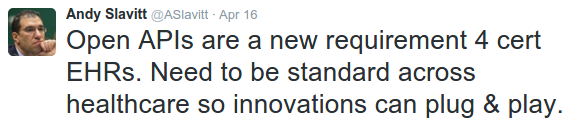

*Published on April 21, 2016 by Pavel Smirnov*

Three new requirements adopted in the [new ONC Health IT Certification Program](https://www.federalregister.gov/articles/2015/10/16/2015-25597/2015-edition-health-information-technology-health-it-certification-criteria-2015-edition-base) are about opening patient health information to third-party applications via ONC-certified API. These requirements are: § 170.315(g)(7) Application access — patient selection, § 170.315(g)(8) Application access — data category request and § 170.315(g)(9) Application access — all data request.

Andy Slavitt, Acting Administrator, Centers for Medicare and Medicaid Services tweeted on Apr, 16th

While the current edition of the certification rule doesn’t enforce use of any interoperability standard for API implementation, it clearly indicates that enforcing of standards is coming very soon.

> *“… we intend to require a standards-based approach to this criterion in the next appropriate rulemaking and we encourage vendors to start piloting the use of existing and emerging API standards.”*

And in 2016 there is no doubt what this standard will be. ONC and CMS rules have a lot of references to FHIR (Fast Healthcare Interoperability Resources) standard and project Argonaut. FHIR is included into ONC Interoperability Roadmap. FHIR is receiving a lot of support from all major EHR vendors such as Epic, Cerner, athenahealth etc They all participate in testing of FHIR API developed for their EHRs in the project Argonaut. You can see a full list of organizations participating in Argonaut [here](https://www.hl7.org/implement/standards/fhir/2015Jan/argonauts.html).

While compliance with FHIR is not required by ONC certification yet, it will be a mistake to depart from the standard and implement any proprietary API even temporary. Certification of the API is not the final step in the Meaningful Use demonstration. Provider organizations will have to provide their patients with access to an ONC-certified API that can be used by third-party applications. And you know what API the majority of third-party applications will expect. Engagement of patients into their health care has always been a challenge. To overcome this challenge a provider organization needs to have access to the best applications on the market. It simply can’t afford locking itself into limited set of applications developed for a non-standard API.

> *Patient Electronic Access to Health Information*

> *Measure 1****— More than 80% of all unique patients seen by the EP****(i) The patient (or patient-authorized representative) is provided access to view online, download, and transmit their health information within 24 hours of its availability to the provider; OR (ii)****The patient (or patient-authorized representative) is provided access to an ONC-certified API that can be used by third-party applications or devices to provide patients (or patient-authorized representatives) access to their health information, within 24 hours of its availability to the provider.***

You need FHIR API for your health care application. Epic, Cerner and other big guys have been working on it for at least a couple of years. First phase of the project Argonaut started in January of 2015. They’ve already spent significant time and resources building a reliable FHIR API and testing it with other organizations. But what if you haven’t had resources for doing this since 2015? Is there a way to get a quality result without spending months of valuable development time.

> *Some commenters expressed concern about the potential cost associated with API implementation.*

> *The estimated development hours for API requirements published by ONC constitute 900–1200 hours not including relevant security requirements and 1200–1800 hours including relevant security requirements*

Actually there is a way! Health Samurai has been developing an enterprise grade FHIR server Aidbox since 2012. Aidbox is up to date with the most recent stable FHIR specification. Aidbox implements OAuth 2.0 authorization provider and policy-based access control. Aidbox works over HTTPS and has a complete audit of all events in the system. It satisfies all the security requirements for the ONC-certified API too:

- Section 170.315(d)(1) “authentication, access control, and authorization;”
- Section 170.315(d)(9) “trusted connection;” and
- Section 170.315(d)(10) “auditing actions on health information” or § 170.315(d)(2) “auditable events and tamper resistance.”

Aidbox has been tested in the project Argonaut since its conception. Health Samurai offers Aidbox on a subscription basis and the subscription is not expensive.

Health Samurai will provide you with a quality FHIR server and assist your developers with connecting your application’s database to our FHIR backend Aidbox. You will get a ONC-certified API for your healthcare application and get ready for Meaningful Use Stage 3 in less than a month.

Health Samurai actively participates in HL7 FHIR workgroup and contributes to HL7 FHIR standard. Health Samurai keeps [Aidbox](https://www.health-samurai.io/fhir-api) up to date with FHIR specification and you will never have to worry about updating your ONC-certified API.

If you are interested to get help with an ONC-certified API for your healthcare application please contact us at [hello@health-samurai.io](http://hello@health-samurai.io) or give us a call at +1.818.731.1279.

