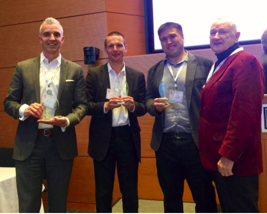

*Published on October 14, 2017 by Pavel Smirnov*

[HL7](http://www.hl7.org/) put together the second FHIR Applications Roundtable at Duke University to showcase the latest and greatest applications built with FHIR. I had the opportunity to [present](https://www.youtube.com/watch?v=j1JYWzo-JvI) Health Samurai’s enterprise FHIR product, [Aidbox](https://www.health-samurai.io/aidbox), to a crowd of more than 200 healthcare professionals and innovators from different backgrounds. This event drew a substantially larger crowd than the previous FHIR Applications Roundtable at Harvard University and shows the momentum that FHIR is building in the healthcare industry.

**Health Samurai Presents: Aidbox**

My company has been developing healthcare IT solutions for over a decade and has been active in the FHIR community since 2012. So I was very happy to have the chance to share what we’ve been working on with everyone. I also showed a short demonstration of interactive tutorials we developed that will contribute to ongoing FHIR education and lower barriers for entry into development with Aidbox. But mainly I talked about some major features of Aidbox, our cloud-based BaaS (backend-as-a-service) platform for mobile and web healthcare applications, and what is soon to come on the platform.

We started working with FHIR data models back in 2012 and have contributed to several open source FHIR solutions such as [FHIRbase](https://www.health-samurai.io/fhirbase) and [FHIR.js](https://github.com/FHIR/fhir.js/blob/master/README.md). We quickly learned what worked and what didn’t, and transitioned to building applications that used a FHIR clinical data repository as a back-end. After successfully completing several projects for various clients, we realized the value of the FHIR clinical data repository as a service and brought it to market as an enterprise-ready platform. Ever since then, we’ve continued to add additional features to the platform to create more value to our clients.

Aidbox has various use cases, and works as a turnkey clinical data provisioning solutions and development platform that modern web and mobile healthcare applications can be built on. Its infrastructure is fully automated and all services are dockerized. As a cloud-based platform, Aidbox helps to enable interoperability and supports an ecosystem of connected products. Building with Aidbox cuts time to market and development costs for new digital health products, and we’re shaping Aidbox into a developer-friendly platform to allow people who don’t come from healthcare IT backgrounds can still use it. This is because we’ve noticed that many developers find FHIR profiles to be too complicated, so instead we let them work with a familiar JSON schema format that can be translated later into FHIR profiles.

A platform is only as good as the applications you develop on top of it, and the applications our clients and partners developed on the Aidbox platform deserve the real spotlight. Here are highlights from a few of our partners who also presented at Duke’s FHIR roundtable.

**Partner Presentations**

Three of our partners had the opportunity to present their solutions built on top of Aidbox:

- [Narus Health](https://www.narushealth.com/), a palliative care management company, [presented](https://www.youtube.com/watch?v=y4uJwWC_vro) a live demo of their care coordination and EHR software composing of two products: a provider-facing web application called [Compassion](https://www.narushealth.com/solutions) and a patient-facing mobile application called [mPower](https://www.narushealth.com/solutions). Through these technologies, dynamic care plans can be created, maintained and accessed in real-time and patients can access important health documents and communicate with healthcare providers safely, efficiently and quickly. These two products have beautiful user interfaces and work together to enable synergistic workflows that show the power of having an interconnected system of healthcare applications. Narus Health was able to use various Aidbox features (HIPAA infrastructure, clinical data repository on FHIR, terminology server, etc.)  to create a care model of the future. This is a great example of the immense potential of FHIR and how digital companies can leverage Aidbox’s platform to develop enterprise-ready systems.

- [Chris Sprague](https://www.linkedin.com/in/spraguer/) of LeapFrog Technology [presented](https://www.youtube.com/watch?v=_aUdkmiubYY&t=405s) the [IRIS Chatbot](https://www.youtube.com/watch?v=_aUdkmiubYY&t=405s), a product that enables patients to have the convenience and ease of scheduling appointments and refilling medications from their favorite messaging apps (i.e. Facebook messenger). This was built using Aidbox as the FHIR API facade to connect to a provider EHR system. LeapFrog chose Aidbox because it offers FHIR sandboxes with API and OAuth 2.0 authentication that could proxy as a FHIR API facade for legacy EHR software. This use case of Aidbox is inspired by Meaningful Use Stage 3 requirements. This integration of the chatbot with Aidbox was seamless and Chris’ company is also developing a patient-facing mobile application that uses Aidbox as a backend for integration with hospital EHRs. Messaging bots are already popular in customer support workflows, so as FHIR APIs continue to standardize common administrative workflows, patients will continue to be more empowered to take control of their own health. Messaging apps are also beginning to enforce end-to-end encryption which will open up more opportunities for messenger bots to deliver value by adding elements of flexibility, efficiency and availability to our current healthcare delivery model.

- [Eliot Muir](https://www.linkedin.com/in/eliotmuir/) and [Pearce Herchenrader](https://www.linkedin.com/in/pearce-herchenrader-97403849/) of iNTERFACEWARE [presented](https://www.youtube.com/watch?v=zmuV-9XZqIQ) an integration project they completed in collaboration with Kainos Evolve that used Health Samurai’s FHIRbase solution. The most exciting part of the project was the incredibly fast integration with FHIRbase achieved by iNTERFACEWARE without any help from Health Samurai. Their project demonstrates that FHIR is maturing as a true standard that will bring economic benefits, enable interoperability, minimize any potential vendor lock-in and cut development time significantly. We considered this success another stamp of approval for the quality of Health Samurai’s FHIR solutions and the future of FHIR as an industry standard.

The audience voted on their three favorite presentations at the end and Health Samurai humbly won an award along with LeapFrog Technology!

You can see our happy award-receiving faces here

Needless to say, it’s an exciting time for FHIR and healthcare innovation. We are at the beginning of an unprecedented wave of disruption in digital health and I can’t wait to see all the new products that will be built by our best and brightest minds.

Feel free to reach out with any questions at [pavel@health-samurai.io](mailto:pavel@health-samurai.io)!
