Demo the ELT implementation for PostgreSQL using [Aidbox](https://health-samurai.io/aidbox?utm_source=web&utm_medium=artsqlinside&utm_campaign=nikolai), open-source [**ViewDefinition Builder**](https://sqlonfhir.aidbox.app/?utm_source=web&utm_medium=artsqlinside&utm_campaign=nikolai), and Grafana.

Let's face the facts – FHIR has firmly established itself with increasing amounts of health data put into the FHIR format. But what’s the most efficient way to get insights from this data?

In this blog post, we'll explore how to bridge the gap between FHIR and SQL using the new SQL on FHIR v2 specification, making FHIR data not only interoperable, but also queryable and analyzable.

As you read, you'll discover:

- What is SQL on FHIR?
- How to use it in the wild?
- How will this technology evolve?

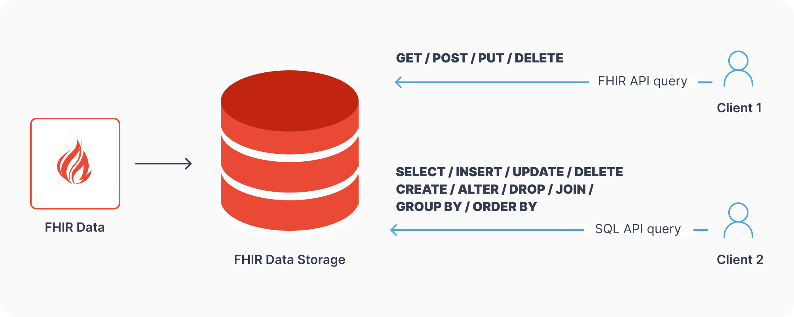

## **Challenge**

FHIR comes with a built-in search API, but it's not sufficient for performing advanced queries on FHIR data. It lacks essential features such as aggregations, joins and other database tools you might need.

The main challenge is that FHIR data is nested, which is a departure from the traditional flat relational database approach. This difference makes it hard to perform standard SQL queries straight away. We could compare it to trying to fit a square peg into a round hole.

Of course, there are advanced database technologies like JSONB in PostgreSQL or Parquet in Spark SQL that can handle nested data structures. Both users and tools, however, are used to working with flat tables that are traditional for SQL.

To work around this, developers may need to create flattened views of the data or use specific database features that support nested data structures.

That’s where SQL on FHIR comes into play.

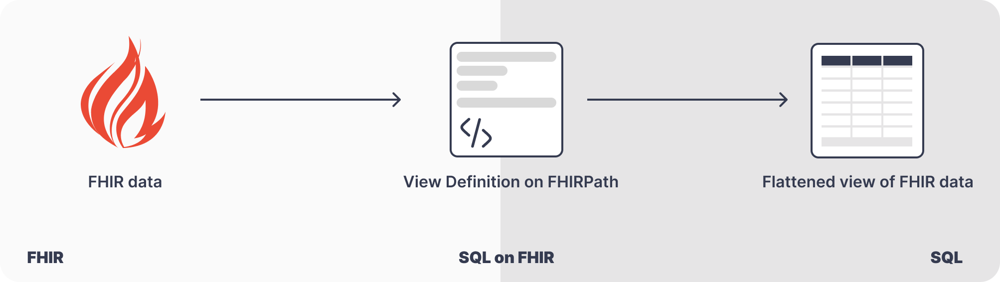

## Bridging Two Worlds to Unlock FHIR Data

SQL on FHIR spec proposes to define flattened views of FHIR data in a standard way to make it portable between systems. This means you can easily perform standard SQL queries on these flattened views. Simply put, it unlocks the data for the SQL ecosystem, much like a toolbox that works for both round and square pegs.

> The SQL on FHIR engine in Aidbox is currently in preview, but available for testing and feedback. [Learn more](https://hubs.li/Q02xxk3W0)

### **What is a flattened view?**

In the context of SQL, a flattened view is a table that presents data in a simplified, single-layer structure. Developers and data engineers can define flattened views using a subset of standardized FHIRPath expressions. This allows consumers to get the data they are more familiar with.

> Use our free online [ViewDefinition Builder](https://sqlonfhir.aidbox.app/) to convert FHIR data stored in JSON representation into a tabular, flat format for convenient data analysis. [Go to ViewDefinition Builder](https://sqlonfhir.aidbox.app/)

As we mentioned, FHIR nested data is organized in a hierarchical structure, where pieces of information are contained within other pieces, creating layers of related data.

Here's how a Patient resource is structured in FHIR:

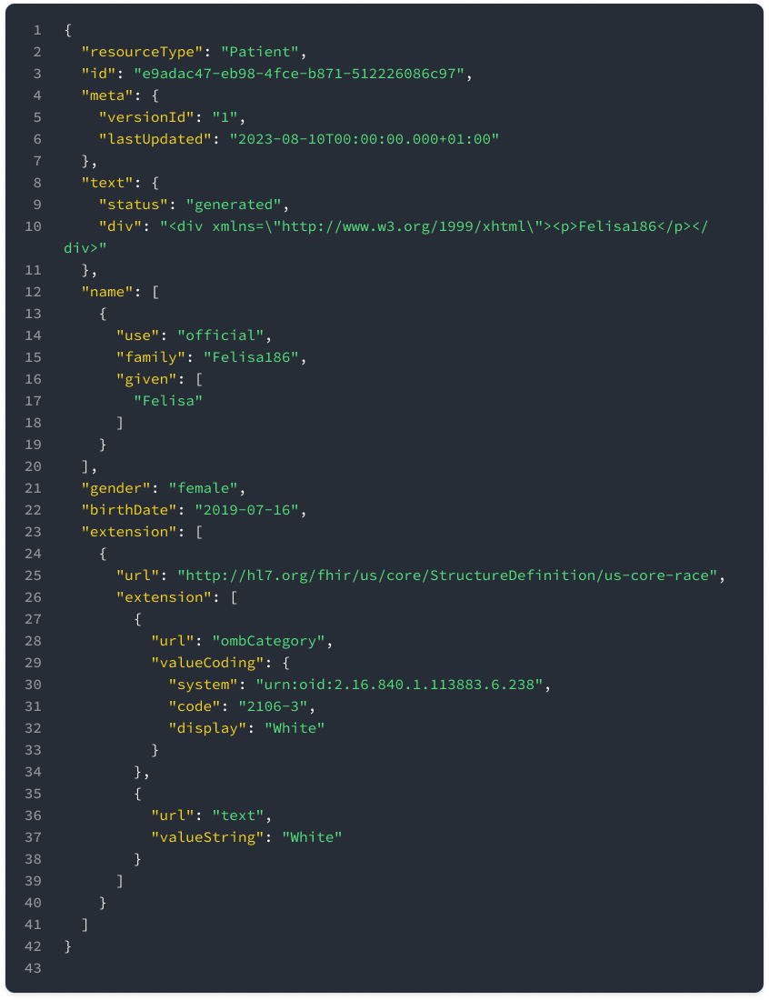

Let's look at how to "translate" complex FHIR data into a table-like format. For that, we need to create a flattened View Definition for a Patient resource. In our case, the view will contain patient id, birthdate, gender, race and name parameters.

1. Specify the resource type you want to flatten in the "from" row.
2. Use the "select" row to define columns along with their associated FHIRPath extraction expressions.

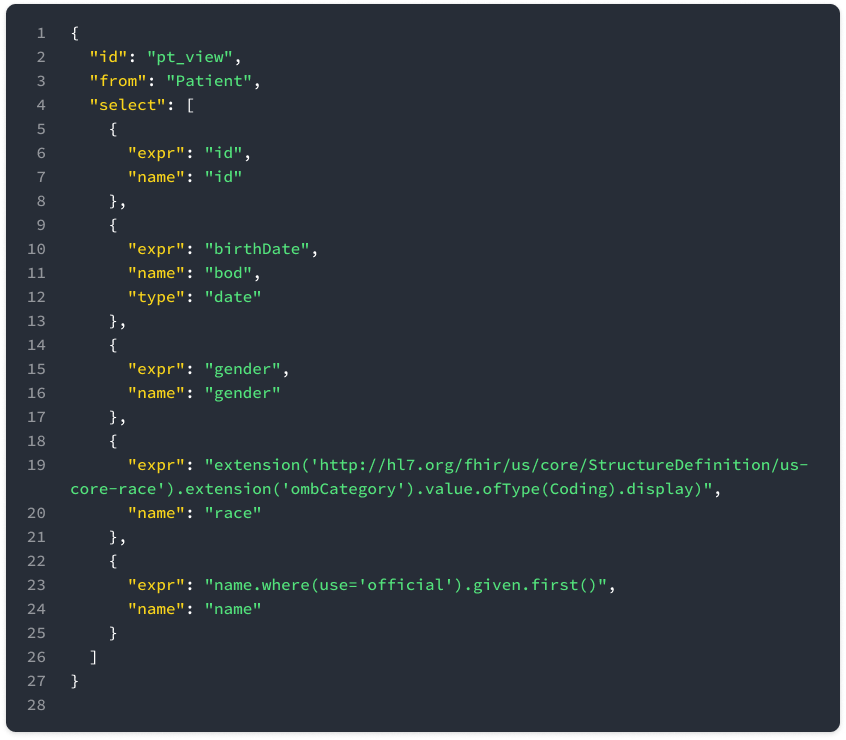

As a result, we will create the following flat table:

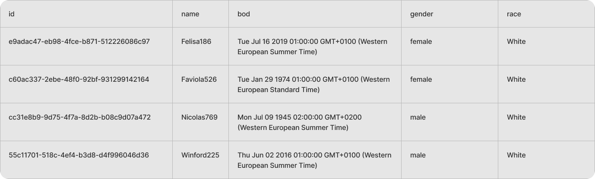

Let's take one more FHIR resource – Condition:

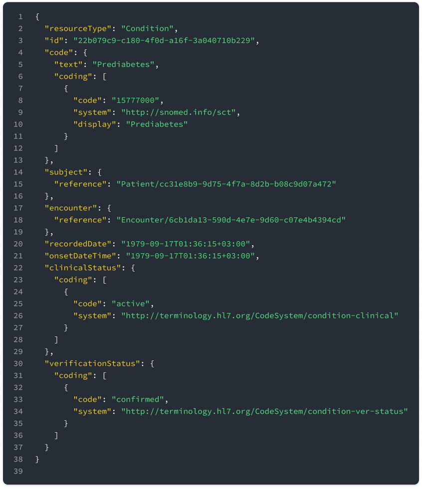

Let’s flatten the Condition resource just the way we did with the Patient resource. The view will contain id, patient id, code, status, verification status and recorded date parameters:

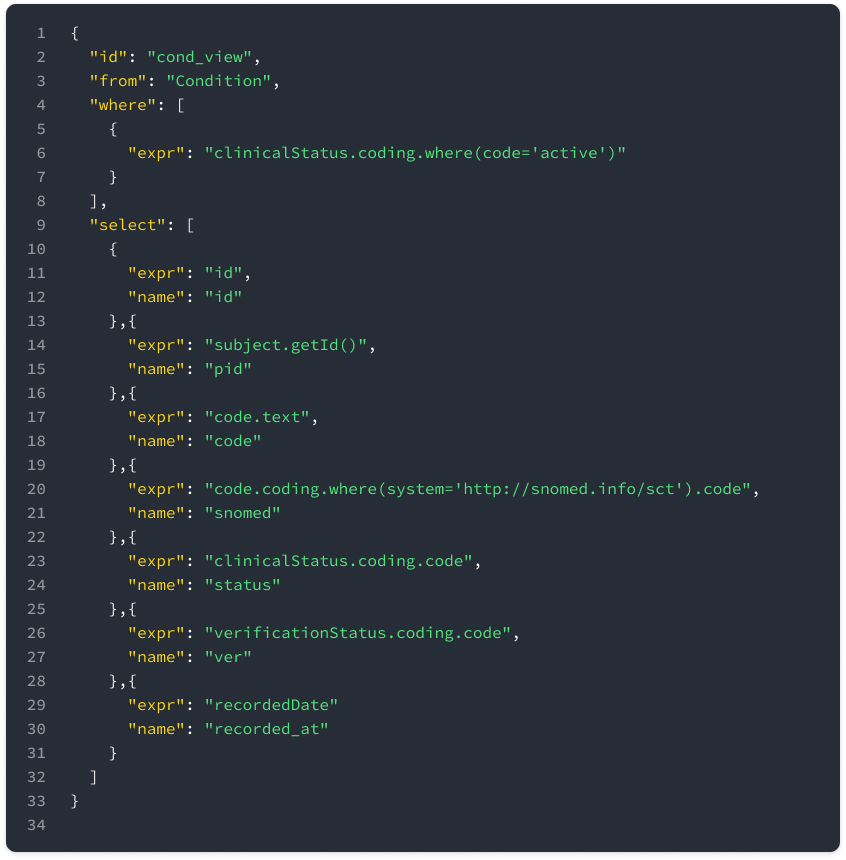

As a result, we will get the following flat table:

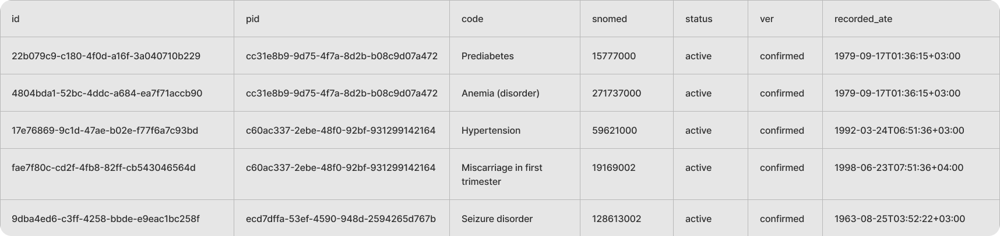

> Get started with the Aidbox [FHIR Server](https://www.health-samurai.io/aidbox) for data storage, integrations, healthcare analytics, and more, or [hire our team](https://www.health-samurai.io/services) to support your software development needs.

### Standardized SQL on FHIR data

Once we have flat tables, we can run complex queries that allow us to join, filter, sort, and aggregate data in various ways. You can also use subqueries, window functions, and other advanced features to extract the exact information you need.

For example, let's use the previously flattened Condition view and find all patients with a prediabetes condition using a simple SQL query:

As a result, we will get the following flat table:

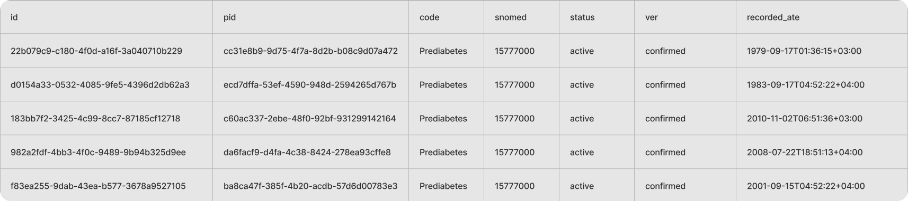

Now we're going to use both Patient and Condition views to get even more insights. Let’s count how many men and women have a prediabetes condition:

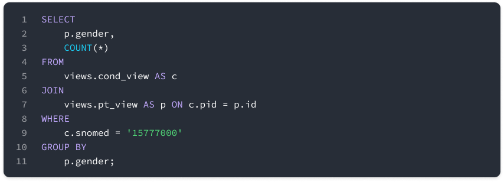

Here's what we get:

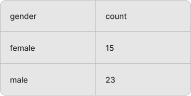

Now let’s find out the condition duration:

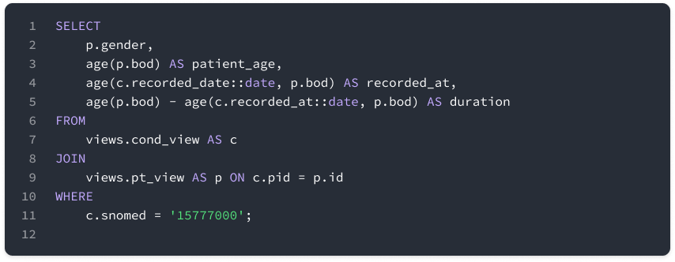

The resulting flat table looks as follows:

Now let’s find the average prediabetes duration for men and women:

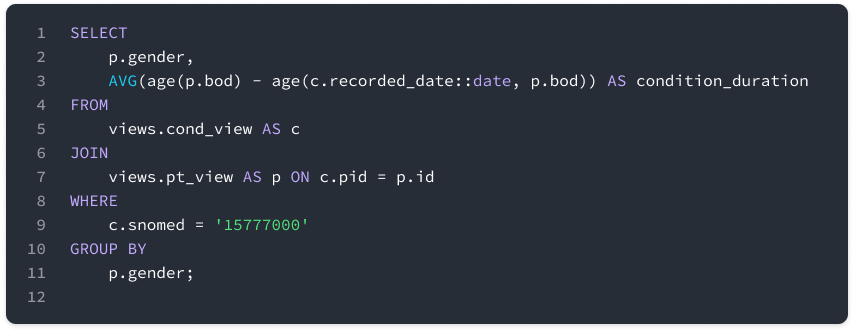

As a result, we find out the average condition duration for each gender:

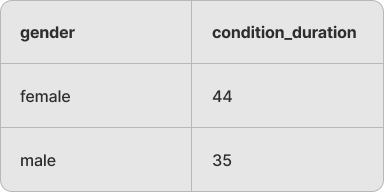

## **Summing Up**

SQL on FHIR is a powerful approach that amalgamates the power of SQL and FHIR, allowing you to work with complex health data stored in FHIR resources while using familiar SQL query tools and frameworks.

Here’s a short summary of the benefits:

- **Smart Decisions:** It excels at extracting meaningful insights from complex FHIR datasets.
- **Familiar Territory:** If you know SQL, you'll get it easily.
- **Portability**: SQL on FHIR uses FHIRPath to define views that can be used across different systems. The FHIR community can define flat views and queries that can be executed in any SQL-based ecosystem.

Overall, SQL on FHIR bridges the gap between FHIR nested data and SQL, offering a streamlined way to manage and utilize health data effectively.

**\*\*Disclaimer\*\***

It's important to note that using SQL on FHIR doesn't replace the need for FHIR APIs, which are essential for data exchange between healthcare systems and for implementing interoperability standards. SQL on FHIR complements these capabilities by providing a way to interact with healthcare data in the FHIR format more effectively for analytical, research, and reporting purposes. It's like having a universal key that can open many doors, making it easier to work with FHIR data across different technologies.

To explore how SQL on FHIR can be applied in your projects, consider using the [free version of Aidbox](https://www.health-samurai.io/aidbox#run). It offers a comprehensive environment to test and experiment with these capabilities, providing all the necessary tools without any feature limitations.

## **The Near Future**

The SQL on FHIR draft will be presented in September 2023 at [HL7 FHIR Connectathon 34](https://confluence.hl7.org/display/FHIR/2023+-+09+Connectathon+34) in Phoenix, Arizona.

SQL on FHIR v2 is an open initiative and welcomes involvement from interested parties. Join the SQL on FHIR working group, participate in discussions, and contribute to the development of this solution.

- [Read the SQL on FHIR v2 spec](https://build.fhir.org/ig/FHIR/sql-on-fhir-v2/)
- [Join the discussion on GitHub](https://github.com/FHIR/sql-on-fhir-v2/discussions)
- [Ask any questions in the Zulip chat](https://chat.fhir.org/#narrow/stream/179219-analytics-on-FHIR)
- [Watch on YouTube](https://youtube.com/playlist?list=PLEOOqZS1Ntwa7HnP3PgTLT7zPDJydsdx1)

Health Samurai is actively driving the SQL on FHIR Working Group, which is also represented by Google, CSIRO, Microsoft, Philips, NCQA, CQLab, Center Square Solutions, and Vermonster. The working group is focused on early implementations to build a standardized solution with zero lock-in.

Health Samurai's SQL on FHIR engine is available for preview and testing. If you have any questions or specific use cases in mind, please feel free to share them. [**Book a meeting to see it in action.**](https://bit.ly/sql-on-fhir-meet)

[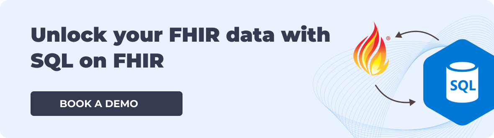](https://bit.ly/sql-on-fhir-meet)

Follow US
