# SQL on FHIR in PostgreSQL

Two types of SQL on FHIR View Runners - ETL (in-memory) & ELT (in-database) and demo the ELT implementation for PostgreSQL using:  
[**Aidbox**](https://www.health-samurai.io/aidbox?utm_source=Article&utm_medium=persNikolai&utm_campaign=conf)  
Open-source [**ViewDefinition Builder**](https://sqlonfhir.aidbox.app/?utm_source=Article&utm_medium=persNikolaiview&utm_campaign=conf)  
Grafana

[The slides](https://docs.google.com/presentation/d/1XHjzNeooGogpo4quoRaf3KuCKdu7Q2eLT936lDzuA8o/edit?usp=sharing)

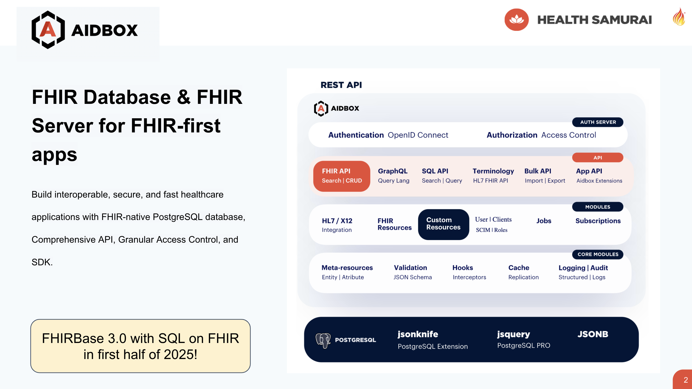

**FHIR Database & FHIR Server for FHIR-first apps**

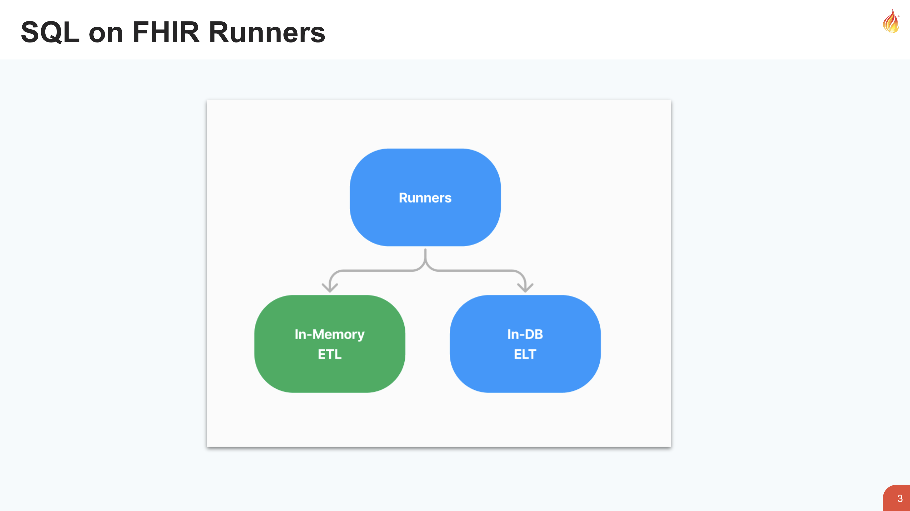

**SQL on FHIR Runners**

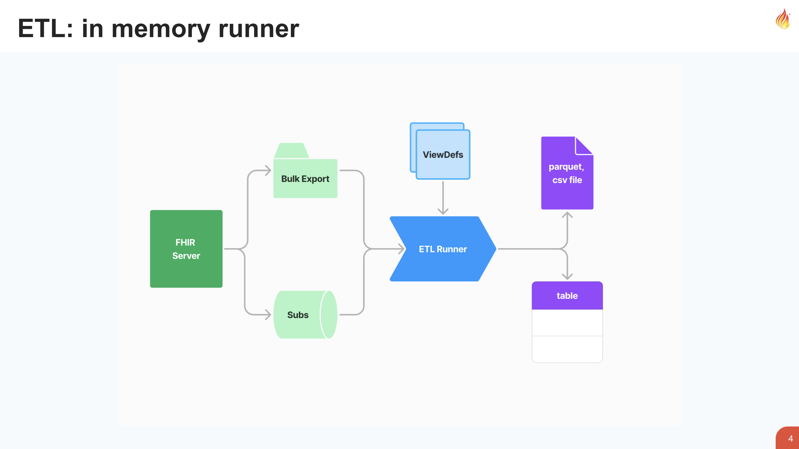

**ETL: in memory runner**

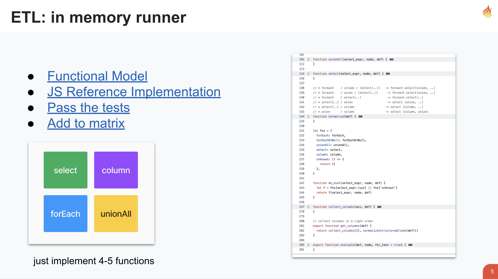

**ETL: in memory runner**

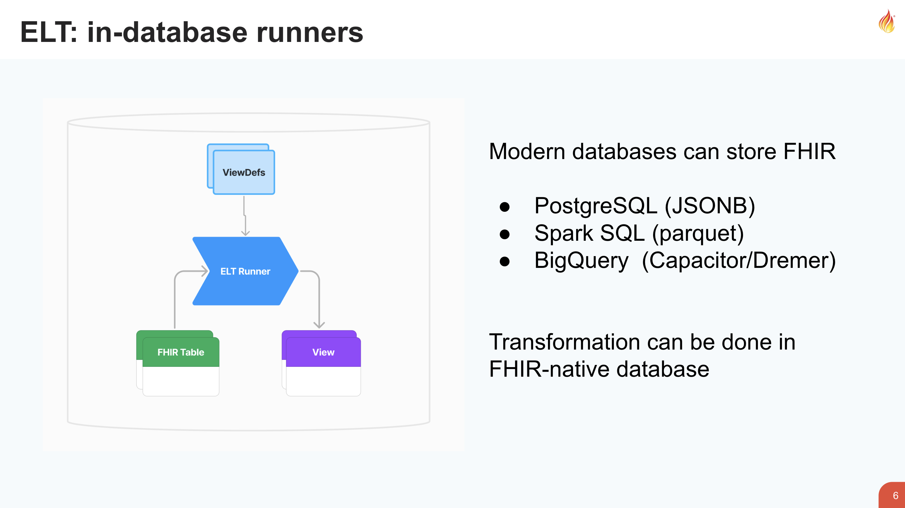

**ELT: in-database runners**

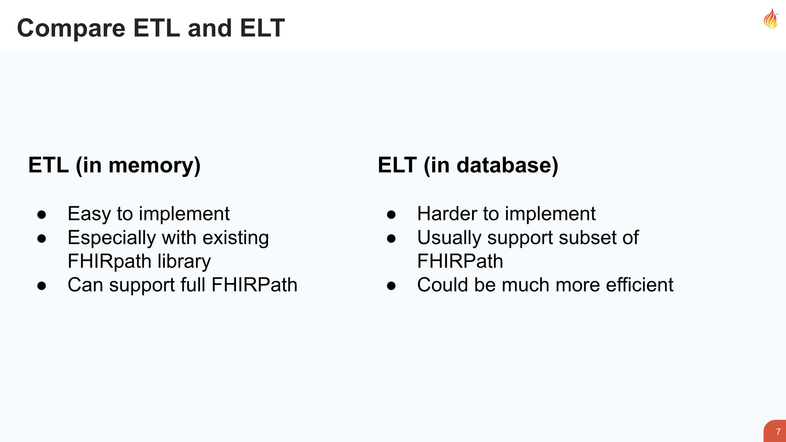

**Compare ETL and ELT**

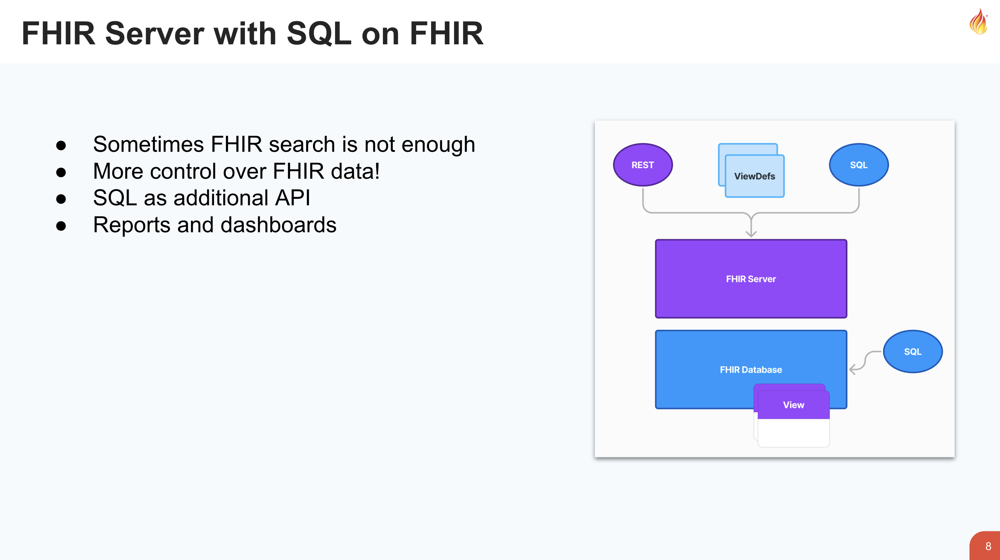

**FHIR Server with SQL on FHIR**

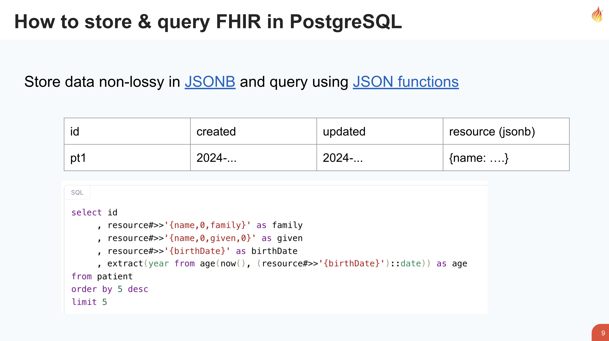

**How to store & query FHIR in PostgreSQL**

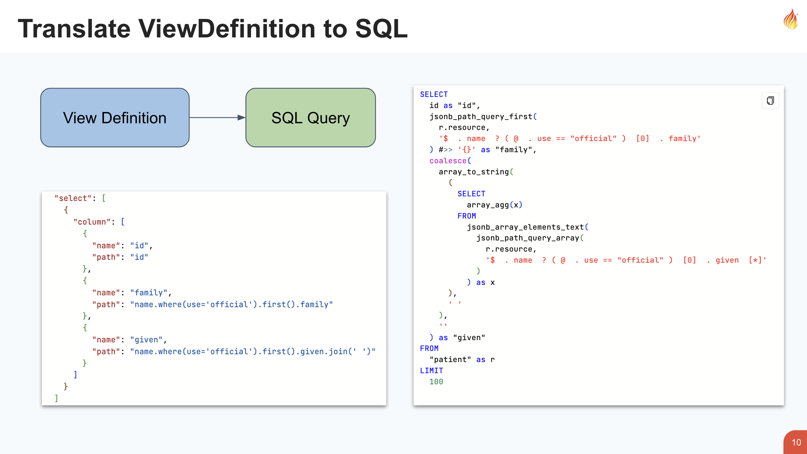

**Translate ViewDefinition to SQL**

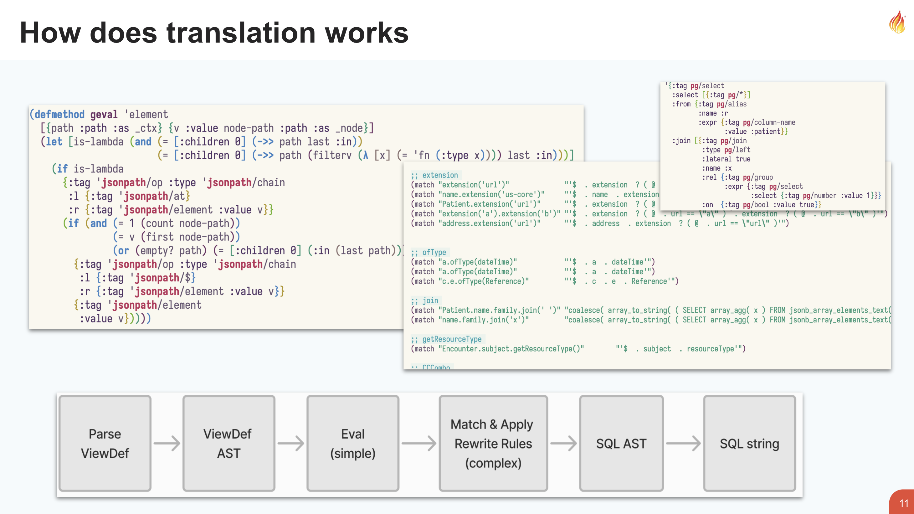

**How does translation works**

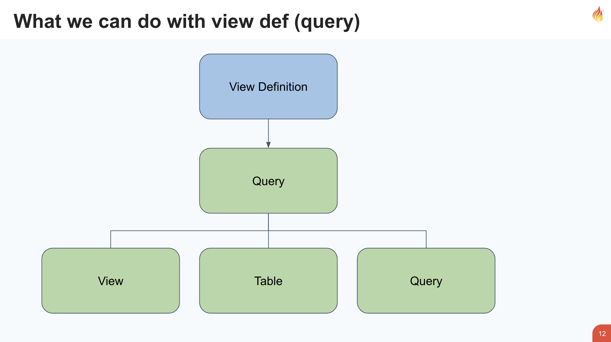

**What we can do with view def (query)**

**Run aidbox:**

> mkdir aidbox && cd aidbox   
> curl -JO https://aidbox.app/runme && docker compose up

in aidbox sandbox - [https://aidbox.app](https://aidbox.app/?utm_source=article&utm_compaign=conf&utm_medium=persNiksql)

in viewbuilder - [https://sqlonfhir.aidbox.app](https://sqlonfhir.aidbox.app/?utm_source=article&utm_compaign=conf&utm_medium=persNiksql)

Related article - [SQL on FHIR: What is a ViewDefinition, and how does it work?](https://www.health-samurai.io/articles/what-is-a-viewdefinition?utm_source=article&utm_medium=persNiksql&utm_campaign=conf)

Author:  
[Nikolai Ryzhikov](https://www.linkedin.com/in/nikolai-ryzhikov-586a6913/),  
CTO at Health Samurai
