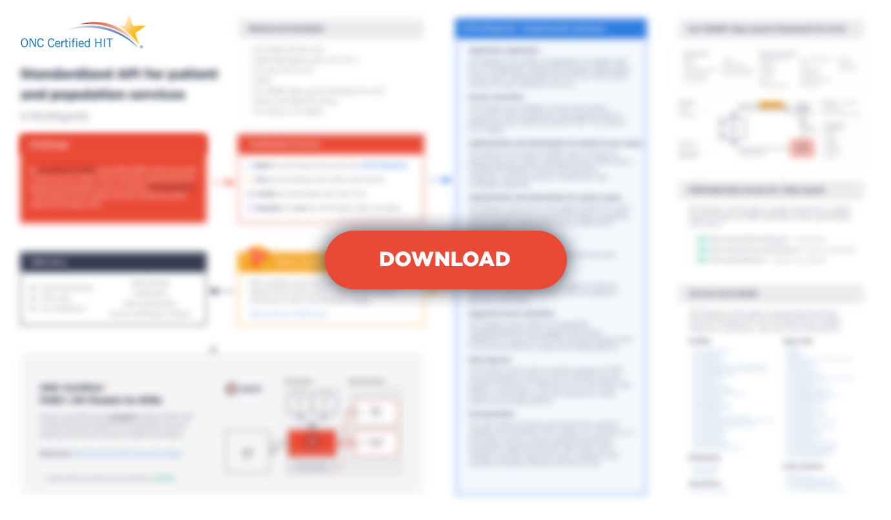

Hey! Good news – Aidbox is in the process of being ONC certified for §170.315(g)(10) - 2015 Edition Cures Update Criteria, and we plan to finalize this process by the beginning of July 2022.

First of all, this should be of interest to EHR vendors in the US because they need to comply with the 21st Century Cures Act Final Rule **by December 31, 2022** and provide secure HL7 FHIR® API for patients (third-party apps) and population services on top of their EHRs.

In the process of preparing for certification, we systematized the information and have decided to share our handy cheat sheet (PDF) with you.

Please feel free to [download](https://www.health-samurai.io/aidbox/resources/standardized-api-for-ehr-cheatsheet) it.

To explore how a standardized API can be integrated into your EHR systems, try the [free version of Aidbox](https://www.health-samurai.io/aidbox#run). It offers a comprehensive environment to test and implement API solutions, providing all necessary tools without any feature limitations.

Follow US

P.S. Here are some useful resources covering the 21st Century Cures Act Final Rule

- [The 21st Century Cures Act Final Rule - Official](https://www.federalregister.gov/documents/2020/11/04/2020-24376/information-blocking-and-the-onc-health-it-certification-program-extension-of-compliance-dates-and)
- [2015 Edition Cures Update Test Method](https://www.healthit.gov/topic/certification-ehrs/2015-edition-cures-update-test-method)
- [§170.315(g)(10) - Standardized API for patient and population services](https://www.healthit.gov/test-method/standardized-api-patient-and-population-services#ccg)
- [ONC Health IT Certification Program API Resource Guide HL7® FHIR® API criterion - (g)(10)](https://onc-healthit.github.io/api-resource-guide/g10-criterion/)
- [Inferno | Standardized API Test Kit](https://inferno.healthit.gov/)
- [AEGIS Touchstone: FHIR Testing Platform](https://touchstone.aegis.net/touchstone/)
