### **Introduction**

****When we set out to build a terminology solution for Aidbox and started work on the Babylon project, we decided to take a closer look at the state of the terminology data within the FHIR community. We focused on the FHIR IG Registry as it offers a comprehensive dataset. By doing this, we aimed to identify the most pressing issues, challenges, and use cases we were likely to encounter. This article presents our findings, including general insights, data quality issues, specific patterns observed in the dataset, and challenges faced during implementation.

  
As our data source, we used the [FHIR package server](https://packages2.fhir.org/packages/catalog) [[1](#Appendix)]. We downloaded all available packages, extracted the terminology-related resources [[2](#Appendix)], and loaded them into a Postgres database. For visualization purposes, we created Grafana dashboards, which are included in the appendix. This analysis was conducted on June 14, 2024.

### **Insights**

**Some Numbers**

We downloaded **2,357** different packages from the registry, representing **468** unique package names and their versions. As shown in Fig 1 (note that we're using a logarithmic scale), the package with the largest number of terminology resources was, by far, *us.nlm.vsac*, mostly comprised of ValueSets; followed by *hl7.terminology.\** and *hl7.fhir.\**.

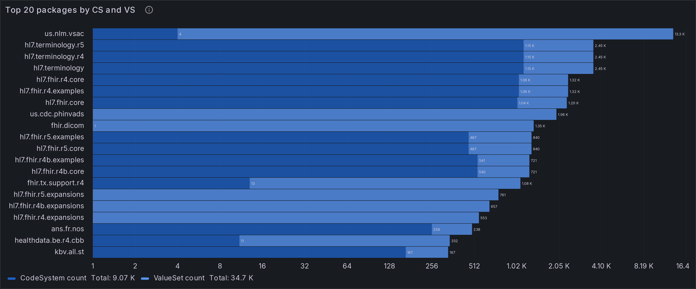

Fig 1. Top 20 Packages by resource (log scale)

After loading the resources, we found **75.8K** CodeSystem resources, comprising **6.36K** unique canonical urls. From these, we were able to extract **15** million individual concepts, of which **3.89** million are unique [[3](#Appendix)]. Additionally, we loaded **454K** ValueSet resources, with **33.7K** being unique.

  
Most resources don't have a publisher name, among the ones who do, HL7 is the top publisher, although the naming is not always consistent, see Fig 2.

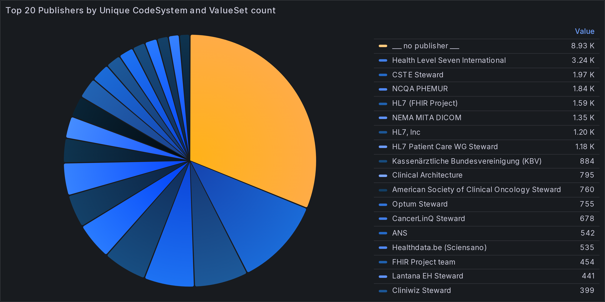

Fig 2. Top 20 publishers

When analyzing the publishing of new resources over the years [[4](#Appendix)](Fig 3), we notice that there is a spike in new resources in 2014, which coincides with DSTU 1.

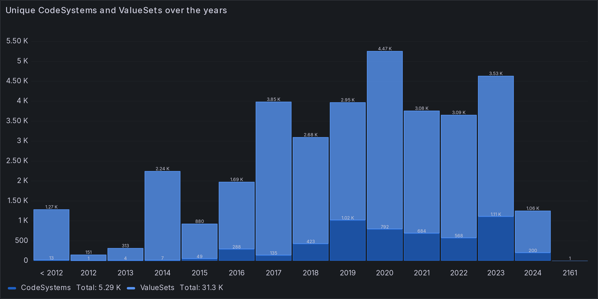

Fig 3. Resources over the years

Looking at the top publishers over time (Fig 4)

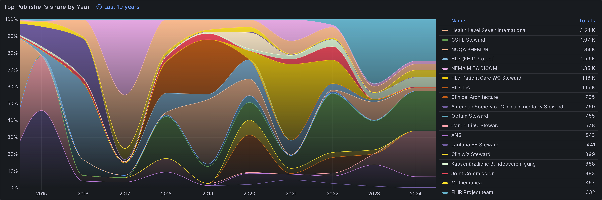

Fig 4. Top Publishers' share over the years

#### **Data Quality Issues**

Our analysis of the FHIR terminology data revealed several data quality issues that could impact the usability and reliability of these resources. These issues make it harder for implementers to reliably support operations such as validation, lookup, expansion, etc. Here, we outline some of the primary issues we encountered.

#### **Invalid Resources**

One challenge we faced while loading the resources was that sometimes the resources wouldn't conform to the base FHIR spec, e.g., missing required fields, invalid data types, and constraints violations. Some of these issues are corrected in subsequent versions of the packages, but others are still invalid in the latest versions.

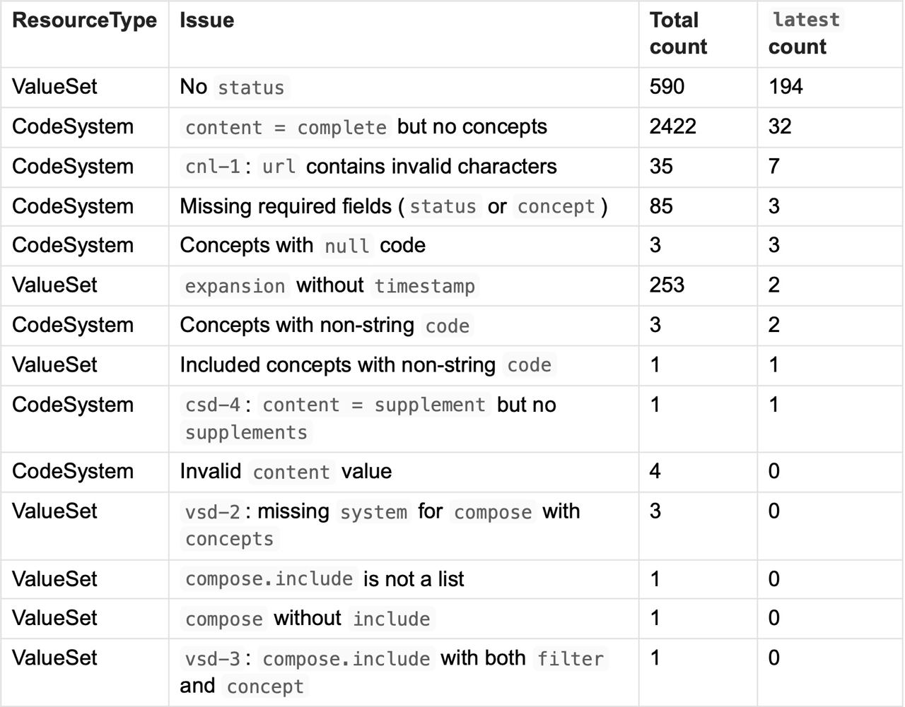

In some cases, these problems make it almost impossible to fully load the data, since there doesn't seem to be a strategy or workaround to deal with these resources. In some [extreme cases](http://app://obsidian.md/(https://simplifier.net/packages/ca.on.ppr.r4/1.2.0/files/2360389/~json)) we only get a list of concepts, nothing more; in others, such as the null codes, there's just no fallback value [[5](#Appendix)].

  
We also noticed another category of issues. While these wouldn't make a resource invalid or non-conformant to the constraints, they would still pose a problem from an implementation standpoint. Specifically, we found code systems with or malformed URLs. Fortunately, on the latest version of the packages, only one of these remain [[6](#Appendix)].

#### **Duplicates and Conflicts**

Sometimes, the exact same resource is published across different versions of the same package. In other cases, the resource is transferred to a different package, but the version remains the same. These scenarios shouldn't be problematic as long as the resource stays the same, but this is not always the case. Especially when the changes are conflicting [[7](#Appendix)].

  
The most impactful types of conflict appear in the concepts, since they represent the actual content of the code system. Oftentimes we load two concepts coming from the same logical code system (same `url` and `version` ), they have a matching `code` but either their `display, definition` or `property` don't match.

  
One possible strategy to follow is to always trust the more recent changes, but this is not always successful, as an example, we can look at `eng.fhir.profile.dev` , from version `0.0.4-beta` to `0.0.7-beta` one of the displays was changed as follows:

- Oscuramento del oscuramento

+ Oscuramento del documento

Seemingly, a regression of a typo fix.

  
It's common to find conflicting code systems where the concepts with differing properties are not actually content conflicts but rather presentation conflicts (i.e., they retain the semantics but the syntax changes). Some of the most common cases are as follows:

  
- datatype change, e.g., `valueString` to `valueCode` .  
- locale/configuration change, e.g., `valueDateTime: "2009-08-20"` to `valueDateTime:  
     "2009-08-20T00:00:00-04:00"`  
Sometimes, a CodeSystem can have two concepts with the same code, thus violating [csd-1](https://www.hl7.org/fhir/codesystem.html#invs) , this would be a simple data error if it were just a duplication mistake, but these codes could be representing different concepts semantically, making the problem significantly worse.

#### **Semantic conflicts: ISO-3166 (Country Codes)**

We can have a CodeSystem with some concepts that share a code but essentially represent different concepts, this is especially challenging for implementation since semantic uniqueness of the concepts is one of the core axioms of FHIR terminology.

Let's look at [ISO-3166](https://www.iso.org/iso-3166-country-codes.html) (urn:iso:std:iso:3166|57), the CodeSystem loaded from [`fhir.tx.support.r4`](https://simplifier.net/packages/fhir.tx.support.r4/0.18.0/~files) until version `0.18.0` , contained a list of concepts from ISO-3166 mixing Alpha-2, Alpha-3 and Numeric codes as the concepts' `code` and adding a property `canonical` with the Alpha-2 code.

Now, for some countries that have changed name (e.g., Burma to Myanmar, Zaire to DRC, Yugoslavia to Serbia and Montenegro, etc), the numerical code is maintained, only the Alpha codes change. So they represent two different concepts in ISO-3166 but have the same code in the FHIR resource.

#### **Some more numbers**

In this section, we explore the quantitative aspects of the FHIR terminology dataset, examining totals, distributions, and patterns.

#### **Code Systems**

In Fig 5 we can see that, from the code systems that explicitly list their concepts, most of the largest ones are compendiums of geographical data, the largest one being Quebec's postal codes with over **200k** concepts, followed by a few versions of ICD10.

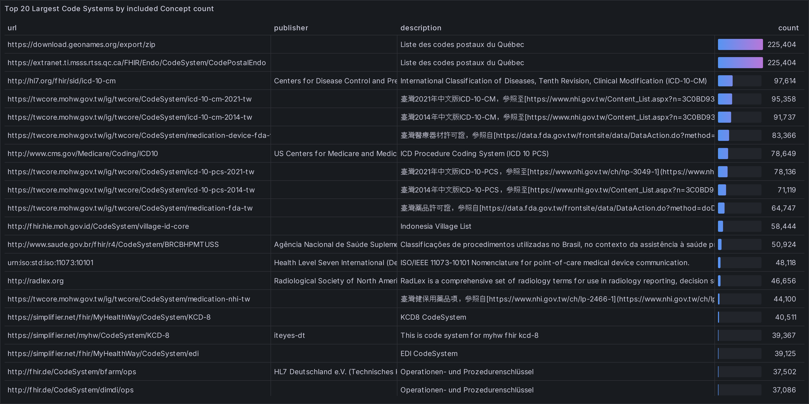

Fig 5. Top 20 largest code systems

In terms of popularity, the most referenced code system is, unsurprisingly, SNOMED. Following SNOMED, other frequently referenced systems include LOINC, ICD10, ICD9, RxNorm, DICOM, and CPT (See Fig 6).

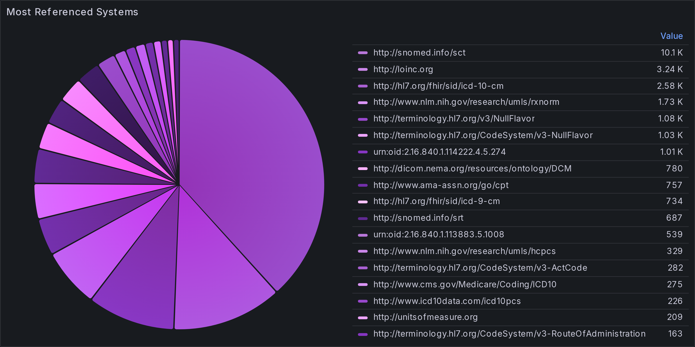

Fig 6. Most referenced code system

From Fig 7 we can see that the majority of code systems explicitly include all their concepts in the resource [[8](#Appendix)]. Only 41 are supplement, even though this seems like a very useful way of augmenting existing concepts, it's not very widely used, most of them are translations [[9](#Appendix)].

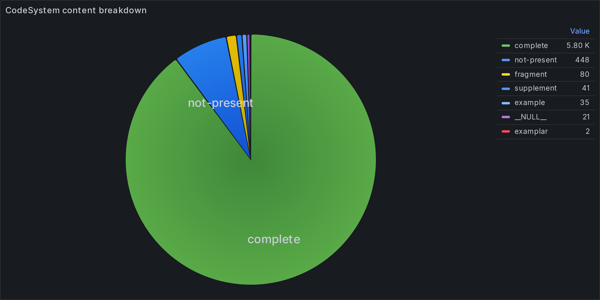

Fig 7. Code System content breakdown

#### **Value Sets**

When analyzing value sets, their most interesting aspect is, arguably, their `compose` rules. We classified the value sets in 5 main categories [[10](#Appendix)]:

- **Extensional**: Explicit enumeration of concepts
- **Intensional (copy)**: Copy from existing code system or value set
- **Intensional (filter)**: Algorithmically defined based on selection rules on an existing code system
- **Mixed**: mixture of previous techniques
- **No Compose**: `compose` field is not present

Interestingly, the majority (Over **60**%) are classified as extensional and only **10**% use the ValueSet filtering capabilities, see Fig 8.

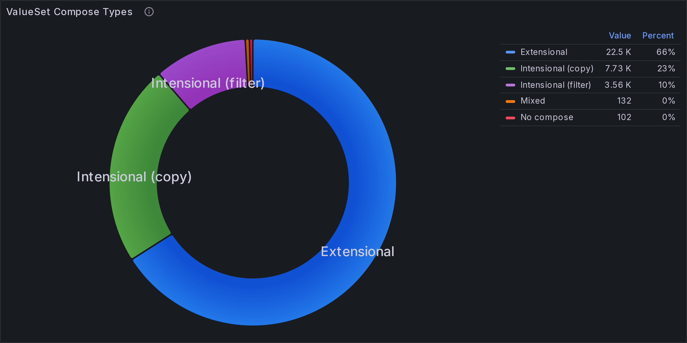

Fig 8. Value Set Classification by Compose

While the majority of value sets are not expanded (see Fig 9), almost **40**% appear pre- expanded in their packages.

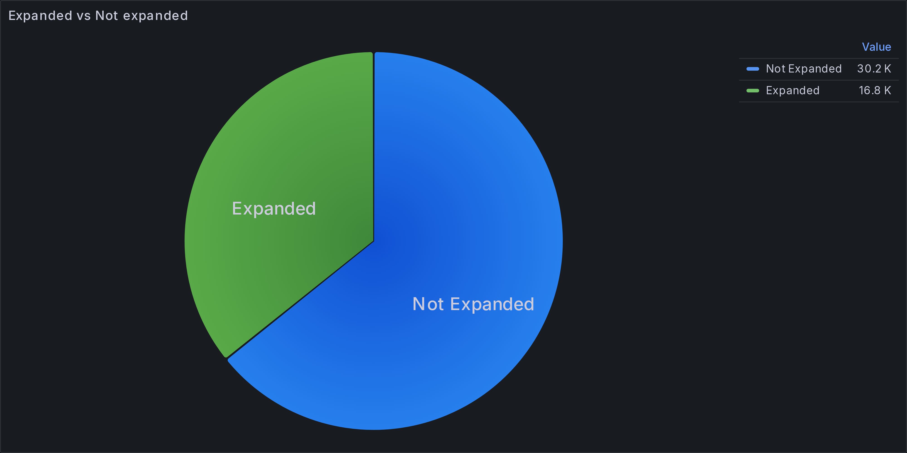

Fig 9. ValueSet expansion breakdown

#### **Filter Analysis**

FHIR [provides](https://build.fhir.org/valueset.html#compositions) a powerful and extensible mechanism to define selection criteria to define value sets algorithmically using existing code systems. The main tool to express these rules are [filters](https://build.fhir.org/valueset.html#filters).

**Re: `valueset-rules-text` and `valueset-expression`**  
  
Although value sets can be defined in [two more ways](https://build.fhir.org/valueset.html#compose), only one of them is really used apart from example resources.  
  

- **`valueset-expression`**  
  > [...] An expression that provides an alternative definition of the content of the value set [[11](#Appendix)]
- **`valueset-rules-text`**  
  > [...] instructions that could only be followed by a human. [[12](#Appendix)]

This is maybe good news for implementers, since the other two options seem challenging for interoperability.

Value sets can use the set of [base filters](https://build.fhir.org/codesystem.html#filters) defined for all code systems as well as any additional filters defined in `CodeSystem.filter`. In Fig 10 we can see that the most commonly used `filter + op` combination is, unsurprisingly, `concept is-a` , since it's an easy way of leveraging the hierarchical nature of many terminologies.

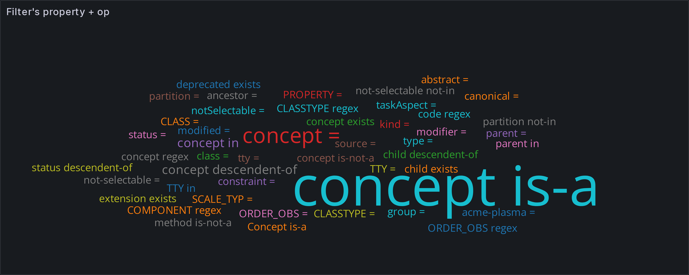

Fig 10. Property + op by usage

#### **Popular Code Systems**

We also analyzed some of the most popular code systems in order to find insights on patterns and use cases. In Fig 11 we can see a comparison of totals, please notice that we're using a logarithmic scale [[13](#Appendix)].

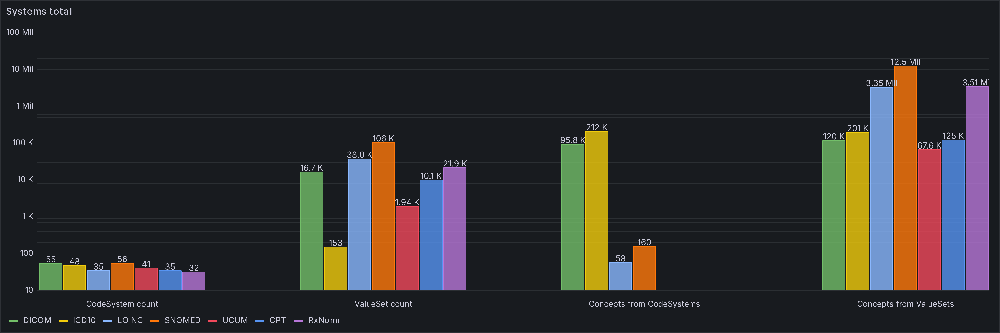

Fig 11. Popular Code Systems totals comparison

For many of these code systems it's impractical to list their concepts explicitly in the resource definition, that's why most of them just list `not-present` and it's up to the implementer to provide an indexed source to serve requests. In Fig 12 we can see that the only `complete` code systems are ICD-10 and DICOM (SNOMED shows up in the chart as `complete` but it's not actually there, it's an error in some of the CodeSystem resources)

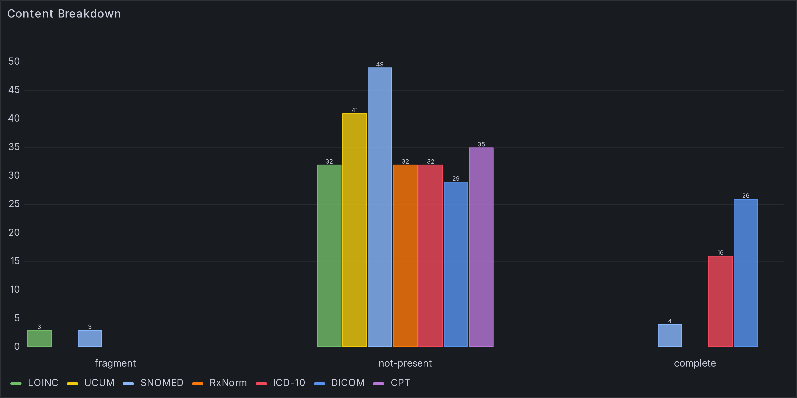

Fig 12. Popular Code System content breakdown

#### **Filters**

Fig 13 shows a comparison of the usage of custom filters vs FHIR's predefined base filters, e.g., SNOMED's ECL. We also show a comparison of the expressions, using orange for the custom filters. We can notice that the vast majority of expressions use FHIR's base filters even though some of these systems provide a proper ontology with powerful semantics and, in the case of SNOMED, a mature query language.

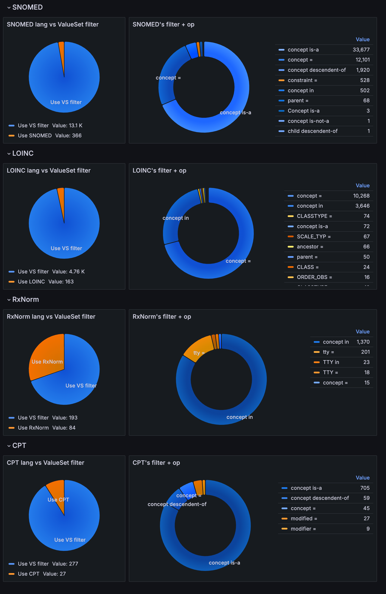

Fig 13. Popular Code Systems filter analysis

#### **Typos**

When analyzing these code systems, we found that some value sets had typos or subtle errors on the canonical url definition, this can cause unexpected errors when using these value sets. Some of these errors still appear in the latest versions of some packages.

#### **Some examples**

- http://snomed.info/sct - `notice the leading blank space`
- http://snomed.info/sct/731000124108
- snomed-ct
- https://loinc.org - `https` instead of `http`
- http://loinc.org/ - `trailing slash`

#### **SNOMED srt**

Initially, DICOM codes were listed in the *fhir.tx.suppor*t package. The SNOMED canonical url used in those cases was *http://snomed.info/srt* (srt instead of sct). Once they were moved to the *fhir.dicom* package, the url was fixed.

To delve deeper into FHIR terminology and test its capabilities, you can install the [free version of Aidbox](https://www.health-samurai.io/aidbox#run). It enables you to explore and experiment with these advancements in a fully functional environment, perfect for development and testing.

#### Appendix

1. [Packages2](https://packages2.fhir.org/packages/catalog) and [Simplifier](https://simplifier.net/) are in sync, sometimes we'll use simplifier urls to link to a package since it provides an interface to visualize the package contents.  
2. Codesystem, ValueSet, and ConceptMap  
3. We consider a concept uniqueness is given by its system, code, and version  
4. There's a resource published in 2161, which is likely a typo or maybe a future ValueSet, it's published by the United Federation of Planets, it contains the Milky way quadrants.  
5. In some of these cases, it seems that authors are using placeholder concepts for grouping and don't have a proper value to use as code for the group indicator.  
6. ValueSet HealthCareProviderTaxonomy from package [hl7.fhir.us.directory-attestation](https://simplifier.net/packages/hl7.fhir.us.directory-attestation/1.0.0-ballot/files/679807/~json)  
7. Changes that lose information instead of additions.  
8. This is not always the case, some code systems have content = coplete but don't include any concepts. See table 1.  
9. From the ones we analyzed, it looks like all of them are translations to different languages.  
10. Intensional and Extensional come from the regular [FHIR definition](https://www.hl7.org/fhir/valueset.html#int-ext)  
11. <https://build.fhir.org/ig/HL7/fhir-extensions/StructureDefinition-valueset-expression.html>  
12. <https://build.fhir.org/ig/HL7/fhir-extensions/StructureDefinition-valueset-rules-text.html>  
13. In order to visualize very different counts in one chart, we're using a log\_10 scale, this might mislead expectations, as the differences between high values are not as visually pronounced as they are in the data, particularly when compared to smaller totals.

Follow US
