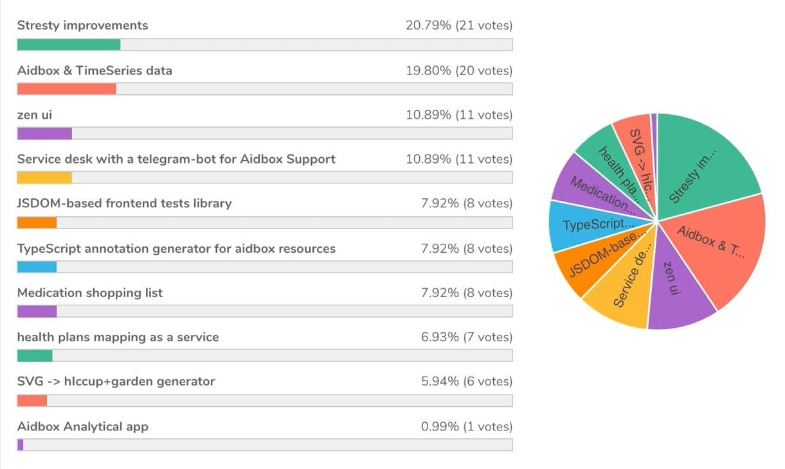
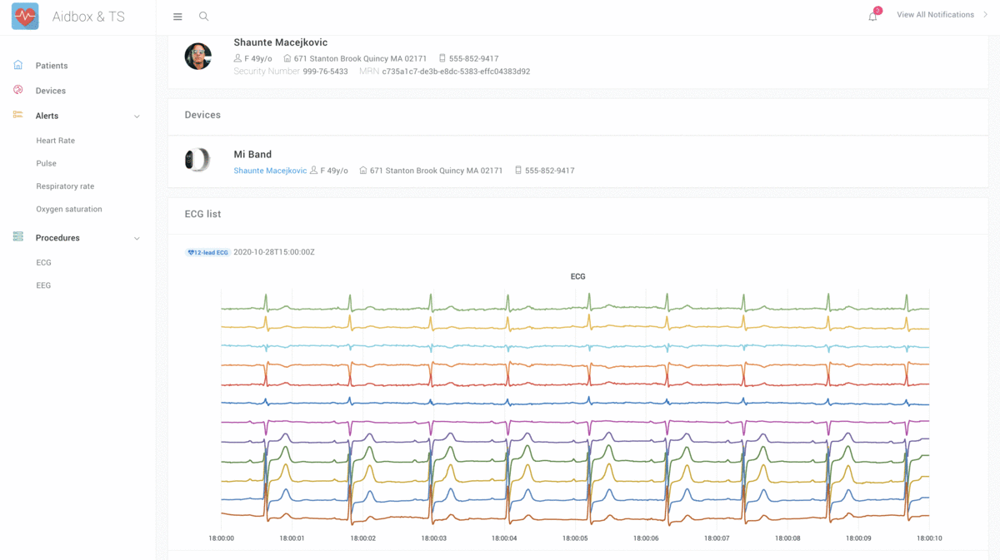

Launched 5 years ago for the first time, The X-mas **Hackathon** is a two-day event that brings healthcare enthusiasts together to build solutions that tackle a wide variety of problems.

We would like to thank our co-partners: **BedaSoftware** and **Medlinks** for their support and the contribution they make to The Annual X-mas Hackathon event. Thank you for meeting virtually this year!

The preparation process started in November 2020, when people willing to participate were asked to either think of an idea they would like to work on during the Hackathon or, alternatively, join the existing team. Unlike previous Hackathons, this year it was possible to work on any idea, although teams that handled healthcare-related challenges were given an extra 1 point. Individual participation was allowed as well but penalized by removing 1 point from the final result.

By Thursday, December 24, the total number of [ten teams listed their projects](https://github.com/HealthSamurai/xmas-hackathon-2020). For two days, teams passionately worked on their projects, and on Saturday, December 26, they presented the final results. At the end of the event, the winner was chosen by voting. The Grand Prize was awarded to the **"Stresty improvements"** project, and The Judges Choice was the "**Aidbox & TimeSeries data**" project.

### Projects

Below is the short description of projects and links to demonstrations with useful resources provided by teams.

#### #1. **Stresty improvements (Researcher's Console)**

Originally Stresty was a tool for writing and running tests and creating documentation. But due to its inconvenience, it hasn’t been actively used. During the Hackathon, the team’s main task was to build a useful tool for creating new Stresty cases by extending the capabilities of the Aidbox Console.

Team: [Vlad Ganshin](https://github.com/vganshin), Stas Buldakov  
Github: <https://github.com/Aidbox/stresty>  
Presentation: <http://bit.ly/3siQHh6>  
Demo: <http://bit.ly/3bE7ViO>

#### #2. **Aidbox & TimeSeries data**

The goal of this project was to adapt Aidbox for TimeSeries data while keeping the FHIR api. The TimeScale DB database was chosen for implementation in order to efficiently store this kind of data, process it, build various charts, and implement a performance monitoring system.

Team: [Marat Surmashev](https://github.com/Aitem), Nikolay Artamonov, [Alexandra Pavlyshina](https://github.com/Semalexa)Github: <https://github.com/Aidbox/timeseries>  
Presentation: <http://bit.ly/3nCdJvV>  
Demo: <http://bit.ly/3nDRhSZ>

#### #3. **zen ui**

The team of **Zen ui** was working on a block editor for zen with autocomplete and validation.

Team: [Nikolay Ryzhikov](https://github.com/niquola), [Ilya Beda](https://github.com/ir4y), [Roman Ushakov](https://github.com/Romez)Github: <https://github.com/zen-lang/zen-ui>  
Presentation: <http://bit.ly/39k49IO>

#### #4. **Medication shopping list (CalenDrugs)**

The members of this team set themselves the task of making a calendar organizer for medications. CalenDrugs allows you to add, track your prescriptions, and schedule your medication intake.

Team: [Yurii Makhotkin](https://github.com/KGOH), Alexandуr Bondarev  
Github: <https://kgoh.github.io/shopping-list/>  
Demo: <http://bit.ly/3oCoS0Y>

#### #5. **Aidbox Analytical app**

The goal of the project was to develop an information system for visualization of medical data, which can be used by pediatric cardiovascular surgeons, cardiologists, and healthcare administrators. The system uses the FHIR standard for data storage, Aidbox as the FHIR backend, Microsoft Power BI Embedded as a product for creating and publishing interactive reports and dashboards.

Team: [Alex Pavlushkin](https://github.com/pavlushkin), Dmitry Shutov, [Sergey](https://github.com/ufocoder)

#### #6**. Service desk with a telegram-bot for Aidbox Support**

This team concentrated on creating a Service Desk extension that would allow collecting user requests through several support channels and work with them in the service desk mode. It is possible to create a ticket from a user's question in a telegram chat or directly from the interface of the system built on Aidbox.

Team: [Vladimir Lapardin](https://github.com/lapardin), [Maxim Putintsev](https://github.com/mput), Evgeny Mukha, Nikita Domnitsky  
Presentation: <http://bit.ly/2MX9xKs>  
Demo: <http://bit.ly/3bCybdL>

#### #7. **JSDOM-based frontend tests library**

The central objective of this project was to develop a prototype of a web application integration testing system without a browser. The absence of a browser makes the system less resource-intensive and more convenient to run on a CI server.

Team: Gennady Alemsky, Victor Gusakov, [Mikhail Lapshin](https://github.com/mlapshin), [Mikhail Pravilenko](https://github.com/TheZorkij)Presentation: <http://bit.ly/39k4POm>

#### #8. **SVG -> hIccup+garden generator**

The svg-to-html is the service that solves the problem of quick development of html pages from vector sources created in popular software for designers – Sketch and Figma (as well as any other that supports export to SVG).

Team: [Evgeny Potapenko](https://github.com/potapenko), Egor Shundeev, Olim Saidov, Oleg Sugatov  
Github: <https://github.com/svg-to-html/svg-to-html-server>

#### #9. **Health plans mapping as a service**

When building an EHR billing module or a billing service, there is always the task of mapping the client (a medical provider, for example) payer list to the list of payers of the chosen clearing house (for eligibility checks and claims submission). The goal of the project was to create a basic version of the health plans mapping engine and test it on the data of the existing medical billing system. Such mapping engines can be used to route insurance claims/eligibility requests automatically.

Team: Alexander Ivanov, Ilya Eremeev, [Varvara Semenova](https://github.com/VarvaraSemenova)  
Presentation: <http://bit.ly/3nBmvKC>

#### 10. **TypeScript annotation generator for Aidbox resources**

The aim of this project was to develop a tool that allows you to generate relevant TypeScript annotations for all resources defined in Aidbox. This makes it easy to synchronize your application code with Aidbox so that you can catch errors at the compilation stage later.

Team: [Vadim Laletin](https://github.com/ruscoder)Github: <https://github.com/beda-software/aidbox-ts-generator>   
Presentation: <http://bit.ly/38yklqL>

### **2021 Hackathon goes viral!**

The next Hackathon event will be held in an open format to connect everyone interested in technology and innovation for collaborative project development. Join us to experiment, introduce your solutions, share ideas and meet new people!

----

If you need an application on FHIR or you are ready to use Aidbox, please contact us [here](https://www.health-samurai.io/contacts).

We build cloud EHR systems, care coordination systems, patient-facing mobile applications, data analytics products, and HL7 v2/CCD/FHIR integration platforms.
