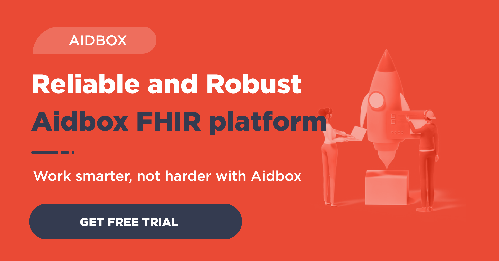

*Written by Health Samurai CTO, Niquola Ryzhikov.*

I wanted to share an introduction of FHIR (Fast Healthcare Interoperability Resources) for CTOs and technology leads interested in modern health technologies that will be around long-term.

Overview of [FHIR](http://hl7.org/fhir/):

- FHIR is an interoperability standard created by the the HL7 international organization to exchange medical and other related healthcare information between systems. It's quickly becoming the de facto healthcare data exchange standard.
- FHIR has strong public and private support from EHR leaders like Epic & Cerner, Apple & Google and governments (US, Australia, etc)
- FHIR is an open community of health IT experts. Here is a simple way to join in the conversations right now: <https://chat.fhir.org/>. You can also visit FHIR connectathons and connect offline with the FHIR community.
- FHIR is open source and has a commercial ecosystem of servers, reference libraries

and other tools for fast development.

There has been unprecedented adoption of FHIR across the industry, and it looks like FHIR will become the go-to standard of health IT during the next 5 – 10 years.

**What is FHIR from a technical perspective?**

FHIR is a machine readable specification of a REST server. FHIR is like the Swagger/OpenAPI for health IT. While Swagger gives you generic tools to specify any REST API, FHIR goes a couple of steps further and gives you ready-to-use informational models and operational semantic along with ways to extend the data models for your specific use case.

**Informational Model - FHIR Data**

FHIR introduces the notion of [Resource](https://www.hl7.org/fhir/resource.html) as the main unit of information to transfer and store data. Each resource has a resourceType label (aka class in OOP), which defines its structure and meaning. FHIR comes with over a hundred [resource definitions](https://www.hl7.org/fhir/resourcelist.html) that are designed by specialized working groups. The Resource structure (schema) is described by [StructureDefinition](https://www.hl7.org/fhir/structuredefinition.html), which is machine readable and can be used for code generation or metadata driven systems. Resources were designed at addressing the most common data needs, adhering to the 80/20 rule.

If you have been working in health IT for some time, you probably understand the cost of a good domain model and how easy it is to get it wrong. Custom data formats with no standardization also creates silos between systems and restricts information flow. The essential complexity in our industry is in data modeling, and FHIR gives us good standardized data models to work with.

**Terminology**

Another essential part of semantics in health IT is coded values/attributes. We use specialized terminologies for drugs, diagnosis, lab tests etc. FHIR comes with a [unified approach](https://www.hl7.org/fhir/terminologies.html) to all coded values in resources and specification of [terminology service](https://www.hl7.org/fhir/terminology-service.html) for routine terminology operations.

**Operational Model - API**

FHIR defines a set of standard [REST endpoints](https://www.hl7.org/fhir/http.html) (Operations), which are manifested for dynamic discovery in [CapabilityStatement](https://www.hl7.org/fhir/capabilitystatement.html) and have predefined meaning. For example, endpoints for CRUD (create, read, update and delete), History, Batch/Transactions & Search. You can also extend the FHIR API with custom operations.

**How can I use FHIR?**

**1.  As inspiration**

A lot of wisdom and experience were contributed to FHIR by passionate experts. You can use FHIR as an inspiration or a guide while designing your system. You can go to the FHIR community to ask tricky questions and verify your hypothesis with people who are using successfully building modern health IT systems.

**2. As the OpenAPI to external systems**

If your system needs to get patient data to operate, you can expect in a few years to see FHIR APIs from most EHR vendors and other data sources. FHIR is gaining momentum fast and has proven itself to be a technology that will be here to stay. Its adoption means it will be easier to get the data you need over time.

**3. As external API to your existing system**

You can provide a FHIR API to your existing system to make your system extensible and easy to integrate with. If your system is like an EHR, you can also integrate the SMART on FHIR ecosystem and application marketplace, turning your system into a dynamic platform with a variety of apps to choose from.

Technically, there are several ways to implement a FHIR API on top of existing systems:

- Facade - write middleware to convert your internal data on the fly and methods into FHIR resources and operations. It's good that your FHIR layer will be intimately connected to your current system and you can reuse its code and technology. It's bad that you have to implement the essential part of FHIR specification from scratch to your system.
- Adapter - you can replicate data from your system into an existing FHIR server. Usually this can be simpler than the facade, because you decouple the FHIR implementation from translation of your data model into FHIR. There are requirements: you system should be able to provide a feed of changes to transform and replicate. The adapter can work in one or both directions: from your system to FHIR and/or backwards. But two way integrations are tricky as with any multi-master system.

**4. Build a native FHIR system**

If you are creating a new system from scratch and want to make it FHIR compatible, you can decide to implement a native FHIR system by using FHIR as the core of your system. You can leverage the FHIR informational model and existing servers and tools on the marketplace. This approach gives you a clean and extensible architecture and saves you from double modeling and translations.

Stable and well-documented models will also help you to keep your system futureproof and more

resistant to changes. FHIR gives you a matured and clean informational model, which can be used as a good foundation for implementations and interfaces.

But there is no free lunch and you definitely have to pay some price for FHIR:

1. For simple use cases, FHIR's generic models may require mental and technical overhead that is not worthwhile. So if your system doesn't need to be very deep in domain, you can use FHIR only as an inspiration.

2. You have to invest in FHIR education and implementation. You can lower the price by hiring/contracting engineers who know FHIR and using open source and commercial products. We believe that the FHIR ecosystem will continue to grow and reduce the overall cost of implementation.

3. For very specialized use cases, the FHIR specification may not be enough. The FHIR committee used the [80/20 rule](http://www.healthintersections.com.au/?p=1924) to prioritize modeling the most common use cases. So your specialized use case is probably in queue. The good news: you can join the open FHIR community and facilitate or start interesting conversations for your subdomain. The bad news: you have to wait to finish this process. While you can extend the existing resources, FHIR is closed in terms of new resources (i.e. you are not allowed do define your resource type). This limitation was done with the intention of dispatching all new resources through the community and to provide a certain quality level. But if you are building a real system, you do not have time to wait. That’s why in our [Aidbox FHIR backend](https://www.health-samurai.io/aidbox) we allow you create non-FHIR custom resources.

**5. CDS (Clinical Decision Support) Hooks**

Another interesting trend in FHIR is [CDS hooks](https://cds-hooks.org/) an API specification that invokes decision support from within a provider EHR workflow through triggered calls that return relevant info and suggestions and can launch a SMART app within the EHR. This is a non-disruptive way to help the clinician deliver data-driven care in real time by automatically calling relevant apps and information for each patient interaction.

**6. Data analytics on FHIR**

Standardized and well-documented model as well as support for JSON-like formats by modern databases (PostgreSQL, BiqQuery, Spark) make FHIR an interesting choice as the basis to build analytical, BI and AI systems. FHIR servers can be used to aggregate data from different sources and as a Clinical Data Repository.

We are seeing rising interest across the industry in using FHIR for analytics:

- [Google AI Blog](https://ai.googleblog.com/2018/03/making-healthcare-data-work-better-with.html)
- [ONC](https://www.healthit.gov/techlab/ipg/node/4/submission/1736)
- [doc.ai](https://medium.com/@_doc_ai/doc-ai-is-on-fire-oops-we-mean-fhir-ea2912b2864b)

**Summary**

If you are the person behind technical decisions, FHIR is worth paying attention to. It can become an essential part of your architecture and provide you with a solid and future-proof foundation, tooling and community.

If you have any ideas or questions  - join our FHIR community and reach out to me (nicola in [FHIR chat](https://chat.fhir.org/) or [niquola@health-samurai.io](http://niquola@health-samurai.io)).

> Get started with the Aidbox [FHIR Server](https://www.health-samurai.io/aidbox) for data storage, integrations, healthcare analytics, and more, or [hire our team](https://www.health-samurai.io/services) to support your software development needs.

