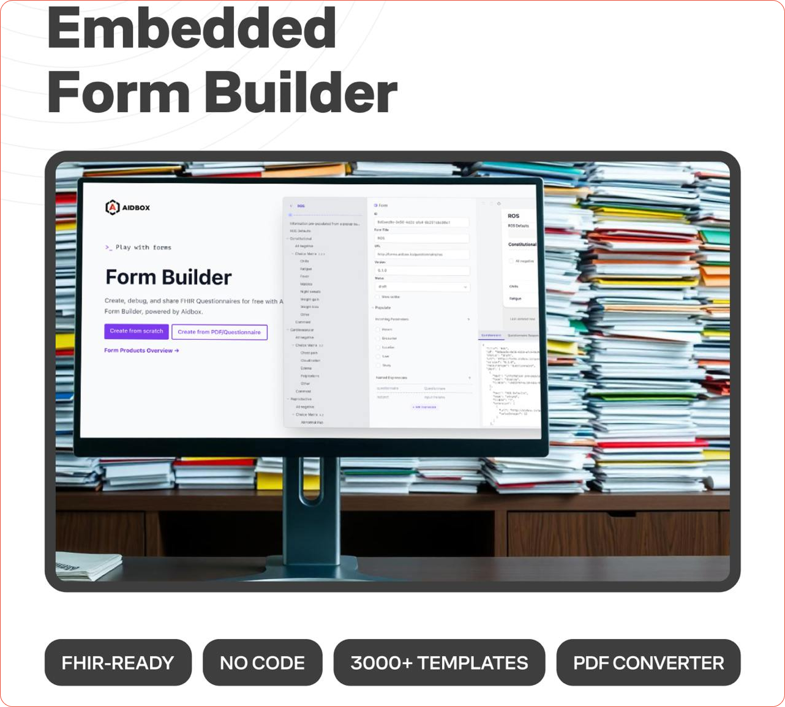
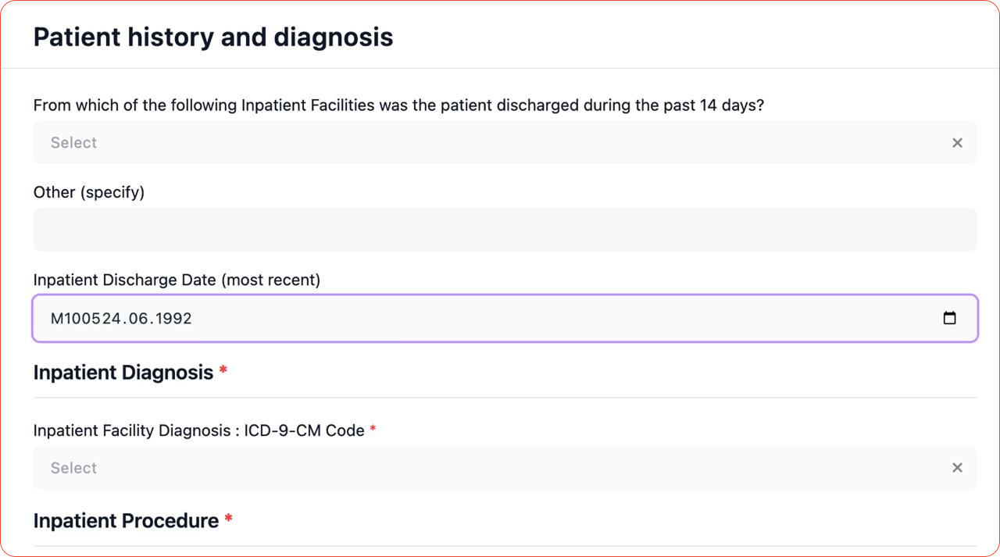
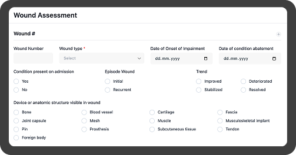

## Public Form Builder

• Access over 3,000 ready-to-use form templates.  
 • Upload questionnaires or create new ones using drag-and-drop functionality.  
 • Generate FHIR-compliant forms in minutes.

[Try Form Builder now](https://form-builder.aidbox.app/?utm_source=article&utm_medium=top10&utm_campaign=forms)

Public Form Builder

## Top 10 Medical Forms:

## Patient history and diagnosis medical form

This comprehensive document captures crucial details about a patient’s medical background, including past illnesses, surgeries, allergies, and current medications. It also encompasses family medical history, lifestyle factors, and relevant social history. The form provides a detailed account of the patient’s diagnosis, treatment plans, and any ongoing medical conditions, ensuring healthcare providers have a complete understanding of the patient’s health status to deliver informed care.

[Use patient history and diagnosis form](https://form-builder.aidbox.app/#/builder/69324-2)

## Patient registration medical form

This thorough document contains essential identification details, including the patient’s name, birth date, gender, race, and address. Additionally, it features vital contact information, such as emergency contacts, personal phone numbers, and insurance information.

[Use patient registration form](https://form-builder.aidbox.app/#/builder/67868-0)

## Medical History medical form

This detailed document outlines a patient’s comprehensive medical background, including past medical conditions, surgeries, hospitalizations, and allergies. It also covers current medications, lifestyle habits, and family medical history, providing healthcare providers with a thorough understanding of the patient’s health status to inform diagnosis, treatment, and ongoing care.

[Use Medical History Form](https://form-builder.aidbox.app/#/builder/62890-9)

## Multi-Page Forms or Forms with Navigation Tab

## PHQ2/PHQ9 Depression medical form

## Risk Assessment medical form

This form helps assess lifestyle-related risk factors, including diet, physical activity, smoking, alcohol use, stress, and family history. It is designed to support preventive care by identifying individuals at risk for chronic conditions.  
 • The form layout is structured for ease of use, with some fields appearing only when relevant based on previous answers.  
 • Coded fields are included for tobacco use, alcohol consumption, and overweight/obesity, with extraction logic to \*\*FHIR Observation\*\* resources.  
 • BMI is automatically calculated based on entered values.

[Use Risk Assessment form](https://form-builder.aidbox.app/#/builder/0f653480-c295-49e0-bc1e-3c170738b1c3)

## Wound Assessment medical form

Wound Assessment medical form

A structured form for documenting wounds, tracking healing progress, and supporting treatment decisions. It is based on the LOINC Wound Assessment Pnl and customized to improve usability.  
 • Allows multiple wounds to be documented within a single form.  
 • Supports attaching multiple wound photos.  
 • Includes options for marking wound locations.  
 • Some fields are displayed only when needed based on conditional logic.  
 • All fields are coded using LOINC terminology.

[Use Wound Assessment form](https://form-builder.aidbox.app/#/builder/5e079590-6cdd-4982-850c-cb9731fc7919)

## Multilingual Medical forms

Supporting multiple languages in medical applications can be challenging. Instead of manually duplicating forms, AI-assisted translation allows you to create a single form in multiple languages effortlessly.

How it works:  
 • Create a form in the default language.  
 • Use AI assistance to add translations seamlessly.  
With this feature, localization becomes fast, efficient, and accurate, ensuring a smooth experience for users across different languages.

## Discharge Summary medical form

[Use Discharge Summary form](https://form-builder.aidbox.app/#/builder/59271-7)

## Immunization Record medical form

This essential document tracks a patient’s vaccination history, detailing the types of vaccines administered, dates of immunization, and dosages received. It also includes information about any adverse reactions to vaccines and provides a record of booster shots and follow-up vaccinations, ensuring healthcare providers can assess the patient’s immunity status and recommend necessary vaccinations to maintain optimal health protection.

[Use Immunization Record Form](https://form-builder.aidbox.app/#/builder/60484-3)
