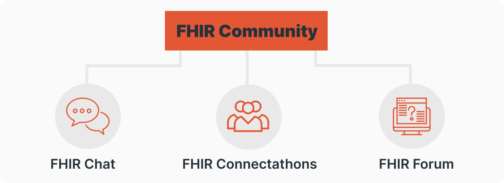
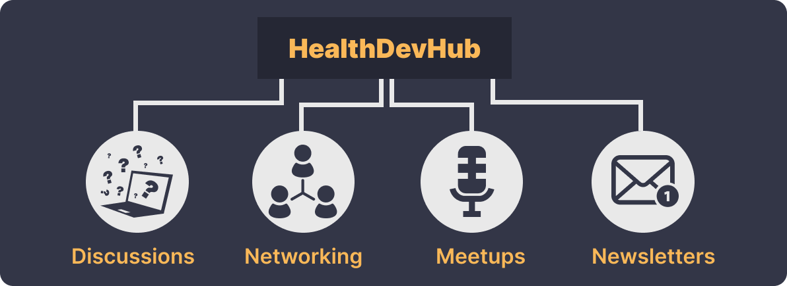
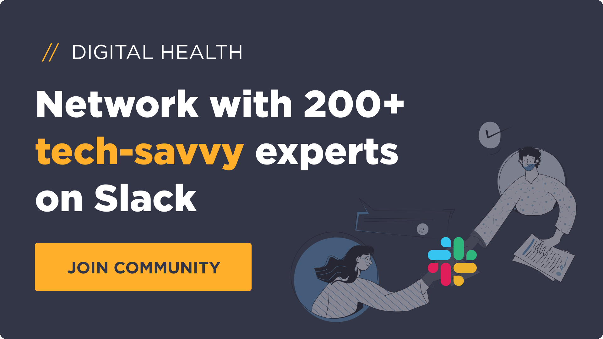

The digital health world is complex and becoming ever more so. Tech leaders and engineers often have concerns about HL7 FHIR, integrations, systems design, etc. These topics raise a tonne of questions that even Google can’t answer in depth. But professional communities can!

Let’s say you build complex digital health products. Why not go digital yourself? There are plenty of unmistakable benefits, such as keeping your finger on the pulse of trends, networking, and sharing ideas with like-minded folks who have experienced the same challenges.

With the wealth of choice out there, however, finding the right community can be tough, especially if you’re new to the space.

To help, we’ve cherry-picked our favorites.

> Get started with the Aidbox [FHIR Server](https://www.health-samurai.io/aidbox) for data storage, integrations, healthcare analytics, and more, or [hire our team](https://www.health-samurai.io/services) to support your software development needs.

## **FHIR Community**

**Community type:** Zulip community **Who it’s for:** FHIR implementers and enthusiasts **Cost:** Free **Sign-up link:** [Zulip](https://chat.fhir.org/#) **Member count:** 23,000

If we could name just one go-to community for timely, useful and admirably readable FHIR advice, this would be it.

The brains behind FHIR Community are experts themselves: FHIR Project Lead **Grahame Grieve,** Principal Consultant at LM&A Consulting Ltd. **Lloyd McKenzie**, and Chief Architect at Microsoft Healthcare **Josh Mandel**.

Within the community are 3 channels: [FHIR Community Chat](https://chat.fhir.org/#), [FHIR Community Forum](http://community.fhir.org/) and [FHIR Connectathons](https://confluence.hl7.org/display/FHIR/Connectathons).

### **FHIR Community Chat**

This is the main free hub for FHIR implementers, informaticians and anyone interested in FHIR.

With over 23,000 members, there’s a whole lot to take in. Given the breadth and depth of topics on the table, the engagement is incredibly high with an average of 20 new conversations happening every day. It can be hard to keep up, so you can subscribe to [the free HDH community](https://bit.ly/slack-hdh-community) to receive FHIR digests weekly.

Discussions are split into 350+ streams, including major ones like #implementers for discussing tech questions and issues, #social for general discussions about the FHIR world and job postings, and #announcements for events and useful materials.

Overall, there are plenty of meaningful conversations on patient classification, validation, FHIR servers etc. If you’re willing to learn, [FHIR chat](https://chat.fhir.org/#) is perfect for you.

### **FHIR Community Forum**

This workspace has three channels, counting some 1,500-strong users.

You can expect up to three new threads a day, with discussions centring on the FHIR specification, the US Core Implementation Guide, and more technical stuff like FHIR search queries, authentication etc.

Getting into [the FHIR Community Forum](http://community.fhir.org/) is as easy as providing your email address. Users are generally more than willing to answer questions, [so sign up](http://community.fhir.org/) and ask away.

### **FHIR Connectathons**

[Connectathons](https://confluence.hl7.org/display/FHIR/2023+-+01+Connectathon+32) are the backbone of the FHIR events industry. They are held regularly throughout the year, offering a great opportunity to work directly with FHIR developers and senior members of the FHIR standards development team.

Each event comprises various tracks, from C-CDA to FHIR mapping, International Patient Access (IPA) to bulk import and the Da Vinci Burden Reduction to name just a few.

As a participant you need to register, select a track, and work with others to test out and improve the FHIR specification.

Reduced event costs are available for FHIR community members and those who buy tickets in advance. Significant discounts for full-time students are also available.

## **HealthDevHub**

**Community type:** Private Slack community **Who it’s for:** Engineering leaders **Cost:** Free **Sign-up link:** [Slack](https://bit.ly/slack-hdh-community) **Member count:** 200+

You know you’ve landed on something good when a community has members from well-known digital health companies including Health Samurai, Roche, Neblar, Zus Health, Lyniate, Innovaccer, and etc.

[HealthDevHub (HDH)](https://bit.ly/slack-hdh-community) is a free private Slack group for CTOs, VPs and lead engineers in digital health. Their goal is to connect you with other experienced executives for networking, discussions, monthly meetups and problem solving.

As its name suggests, HDH covers diverse areas such as CMS compliance, SMART on FHIR, FHIR, HIPAA, ONC/CMS rules, systems design and technologies.

### **Discussions**

If you have a tough question or a big idea, share it on #discussions, where the responses are timely and insightful! There are a lot of expert articles and questions you can browse as well.

For a taste of what to expect, go to #intros to say "Hi" or scroll through the high-profile names who are already a part of HDH. Check out #news for the latest industry trends or the weekly FHIR digest of the most popular topics on the FHIR Chat.

### **Monthly meetups**

The HDH founders want the digital health community to thrive, which is why they host a variety of free monthly meetups for their members. Recent topics include: [MPI and Record Linkage](https://www.healthdevhub.com/meetups/meetup-9), [FHIR at Scale](https://www.youtube.com/watch?v=qv8IzjkV_Sw), [FHIR Terminology](https://www.youtube.com/watch?v=1WalljTHuus), [Profiling and Structured Data Capture (SDC)](https://www.youtube.com/watch?v=3ZZ76Dobjto). You can view these activities on [the Meetups](https://www.healthdevhub.com/#hd-meetups) web section or on #events channel.

### **Industry news**

Members get additional perks, such as HDH's weekly newsletters, aggregating the best engineering leadership wisdom with recent industry news, stats and top discussions.

The idea of HDH is to keep it small and targeted with strict vetting standards. No marketing, no advertising, no self-promotion. With that in mind, the community has over 200 active tech-savvy experts.

If you're an engineering leader, you're welcome [to apply for membership](https://bit.ly/slack-hdh-community)!

## **Final thoughts**

Joining a community can be a great move. In this article, we explored some of the digital health communities that deliver real value:

- With [the FHIR Community](https://chat.fhir.org/#), you can get advice and mentorship directly from experienced FHIR implementers.
- [The HealthDevHub community for tech leaders](https://bit.ly/slack-hdh-community) is an excellent source of inspiration, so you can say goodbye to dozens of tabs and unnecessary email subscriptions. The quality of discussions is high, and there are zero spammers or promotions.

***P.S.*** *Looking for more digital health communities?* [*Check out this list*](https://www.tellescope.com/blog/must-join-digital-health-communities) *created by Derek Strauss, COO at Tellescope. Some of our personal picks are:*

- [HealthTech Founders](https://healthtechfoundershq.slack.com/join/shared_invite/zt-sckud3p2-7bLewJUeU7FlbD4n83Iqzg#/shared-invite/email): top nonprofit events, job postings, and opportunities for investors and startups
- [Mental Health Startup Community](https://mhealthstartups.slack.com/join/shared_invite/zt-xkcsoxk2-RR6K4UWQ_bo~j8CGZi2RoA#/shared-invite/email): relevant research, conversations and sustainable partnerships for mental health companies and startups
- [PMs in Healthcare](https://healthcare-pms.slack.com/join/shared_invite/zt-1mjvs6efp-TEwyjoKMjPkwJQ0jYWEw8A#/shared-invite/email): discussions, networking and community resources for top product leaders in digital health

*\*\* The blog post illustration by Alisa Zahoruiko / iStock*

Follow US

Author:  
[Svetlana Golubeva](https://www.linkedin.com/in/golubevas/)   
Marketing Manager at Health Samurai

