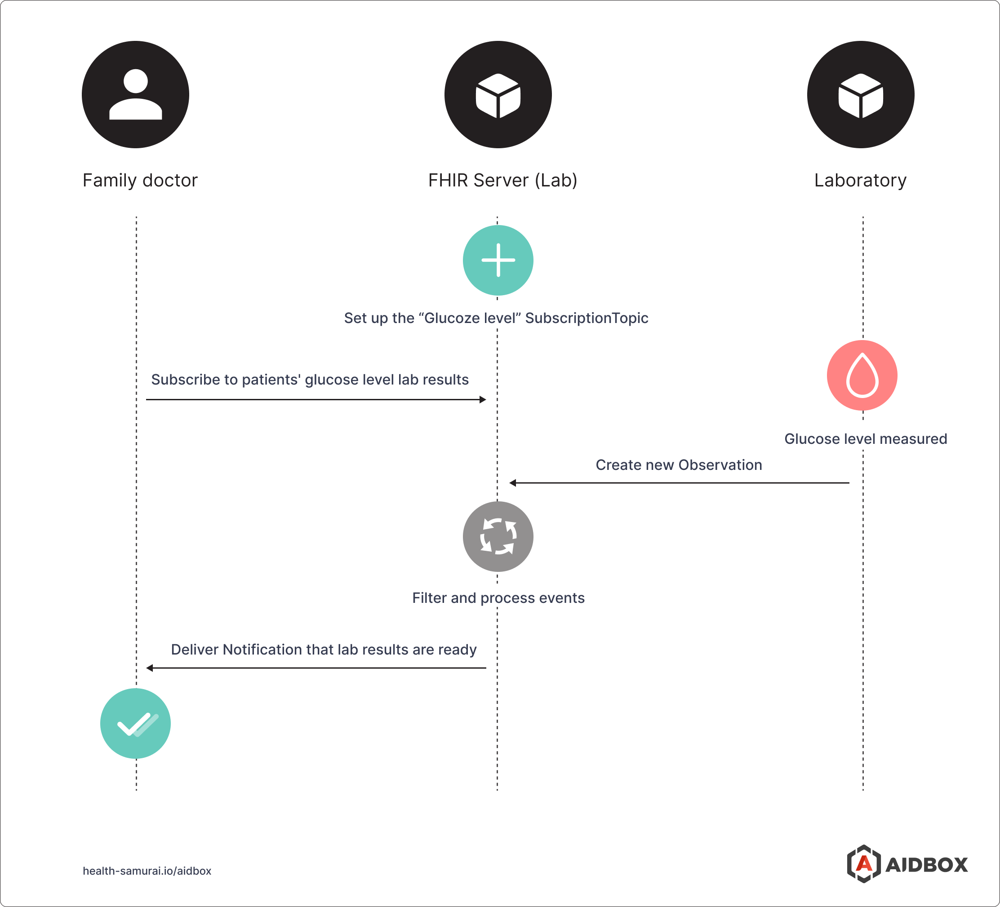
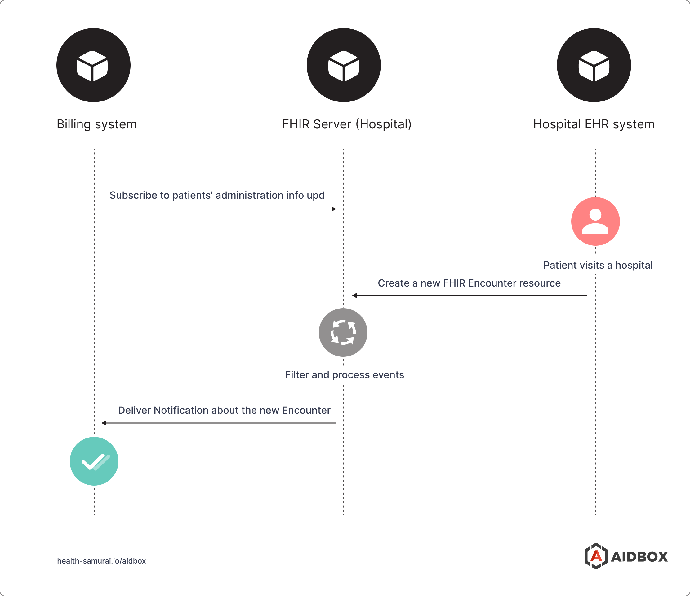
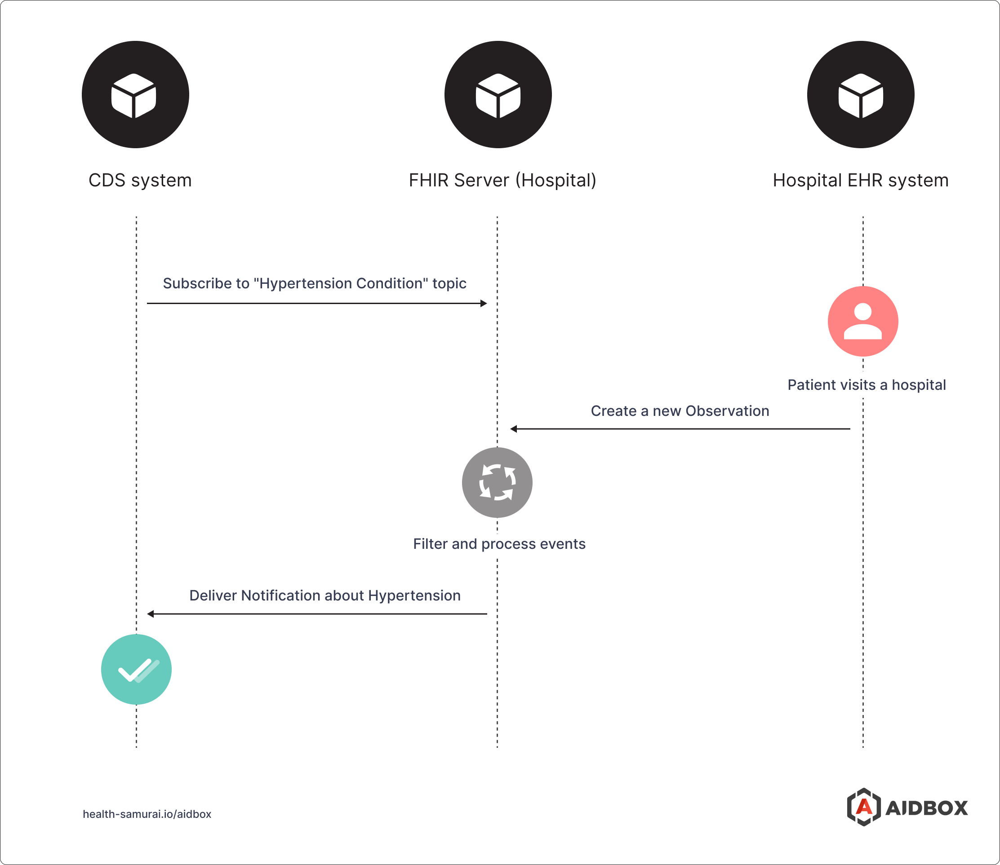
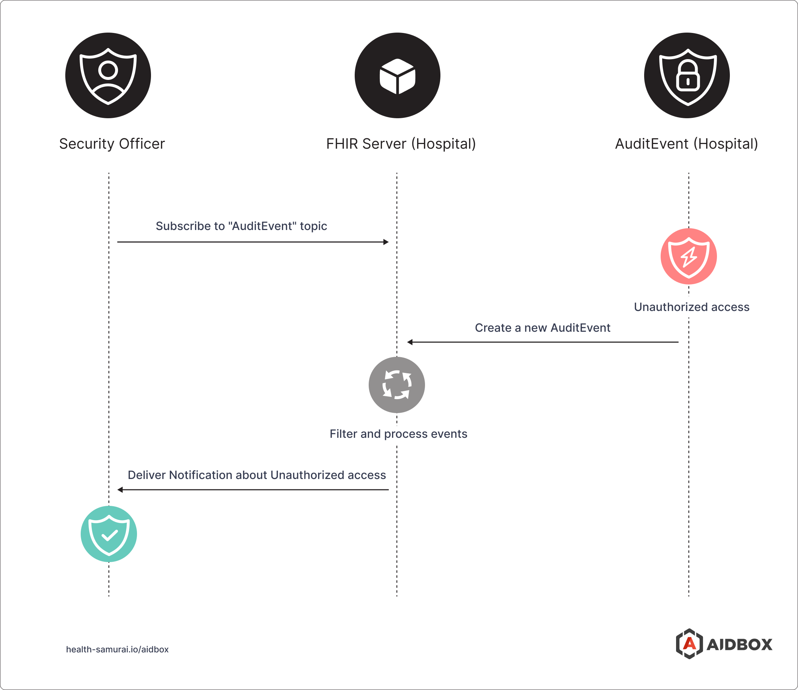
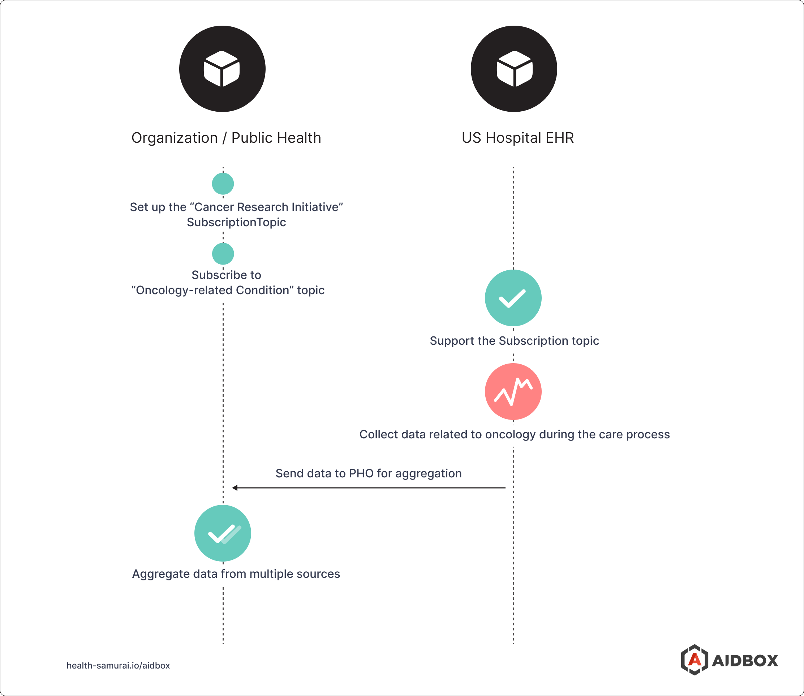

While everyone's talking about Topic-based subscriptions, not many healthtech and medtech specialists really know how to use them day-to-day. We're here to help our users — and anyone else curious — figure out the best ways to bring FHIR subscriptions into their practice.

Topic-based subscriptions are indeed a powerful tool in the FHIR world. To get up close and, eventually, maximize its benefits, the best approach is to explore where and how you can apply them.

We’ve recently asked Aidbox users where they see the most benefit from Topic-based subscriptions based on the current projects in development and potential implementations.

In this short blog post, you'll find five use cases demonstrating how FHIR subscriptions can enhance healthcare services and operations.

## Brief Overview of the FHIR Subscriptions

Before we dig into the details, let's break down what Topic-based subscriptions actually mean.

In simple terms, Topic-based subscriptions in FHIR (Fast Healthcare Interoperability Resources) are like personalized alerts for specific information. In healthcare, end users or systems get to know when something specific, like a change in a patient's vital signs, happens. It's a way to stay informed without constantly checking.

## Patient Care

**Scenario:** Healthcare professionals subscribe to receive notifications for their patients' medical data.

**Example:** Simon is diagnosed with diabetes. His family doctor subscribes to real-time updates for glucose lab results. Instant notifications empower the doctor to promptly adjust medication or provide personalized advice, ensuring optimal care for Simon.

**Benefit:** This use case is particularly valuable for chronic disease management. With real-time alerts, healthcare professionals can proactively monitor and intervene when necessary, ensuring timely care adjustments.

## EHR Integration

**Scenario:** A healthcare organization utilizes subscriptions to synchronize Electronic Health Records (EHR) with other systems. Whenever a new record is added or an existing one is updated in the EHR system, the relevant data is automatically communicated to secondary systems, such as billing, data analytics or telemedicine platforms.

**Example:**  Emerson visits a hospital. When his Encounter is finalized in the Electronic Health Record (EHR) system during the visit, the billing system is instantly aware, avoiding delays and potential inaccuracies in financial transactions.

**Benefit:** This use case streamlines and automates data synchronization processes. With Topic-based subscriptions, secondary systems stay seamlessly up-to-date, reducing manual efforts and ensuring accurate and timely information across various components of the healthcare infrastructure.

## Clinical Decision Support

**Scenario:** A hospital employs a Clinical Decision Support (CDS) system that seamlessly interacts with the hospital's Electronic Health Record (EHR), delivering personalized guidance to doctors.

**Example:** The CDS system is subscribed to the "Hypertension Condition" topic. Upon receiving EHR notifications regarding changes in the patient's conditions, the system activates algorithms tailored to the specific event.

**Benefit:** The CDS system immediately responds to triggers from the EHR, notifying practitioners when a patient's condition changes, sending results and helpful guidance right away.

## Compliance and Auditing

**Scenario:** A healthcare organization subscribes to AuditEvent resource updates. This allows for automated compliance checks and immediate detection of unauthorized access attempts.

**Example:** The IT security team in a healthcare organization subscribes to AuditEvent. When a user attempts to access sensitive patient data without proper authorization, the system immediately sends an alert to the security team.

**Benefit:** This use case strengthens security measures within the healthcare organization.

## Population Health

**Scenario:** A public health organization (PHO) seeks data for research and statistical purposes, specifically focusing on oncology. It releases the oncology topic and anticipates hospitals to endorse and facilitate the provision of this data for research institutions.

**Example:**  A PHO is dedicated to advancing oncology studies. They introduce the "Cancer Research Initiative" topic and encourage hospitals to participate by providing relevant data. Hospitals implement this topic and then deliver anonymized cancer-related data, contributing to a collaborative effort in understanding and combating cancer more effectively.

**Benefit:** This use case facilitates comprehensive population health management. By creating and sharing this Topic Definition, a PHO can gather important data from hospitals. This helps identify patterns, trends, and areas for intervention to improve the health of a community or specific population.

To explore how topic-based subscriptions can be integrated into your systems, try the [free version of Aidbox](https://www.health-samurai.io/aidbox#run). It provides a comprehensive environment to test and implement these features, offering all necessary tools without any limitations.

## The Sky’s the Limit

The possibilities of Topic-based Subscriptions are limitless.

The five examples we talked about are already helping the digital health industry be more efficient in many ways. We hope these cases make Topic-based subscriptions less confusing and show you how you can use them to make your daily work smoother.

Explore further details about our implementation of Topic-based subscriptions [in the Aidbox docs](https://docs.aidbox.app/modules-1/topic-based-subscriptions).

If you're interested in leveraging Topic-based subscriptions for your specific use case, feel free [to reach out to us](https://www.health-samurai.io/contacts).

## Bonus

While reading is beneficial, witnessing the practical implementation adds another layer of understanding. Watch the videos from the recent [HealthDevHub FHIR meetup](https://www.healthdevhub.com/), hosted by Health Samurai, to hear experts share everything you need to know about Topic-based subscriptions.

- [FHIR Subscriptions: Server-driven workflows](https://youtu.be/gG4PExsZuBA?si=Db7151sXZwuuLw0I) by Gino Canessa, Principal Software Engineer at Microsoft
- [FHIR Subscriptions: Practical Implementation](https://youtu.be/a_nhynhgK0c?si=BxDrxoJbxCqExHB5) by Maxim Putintsev, Lead Software Developer at Health Samurai

Follow US
