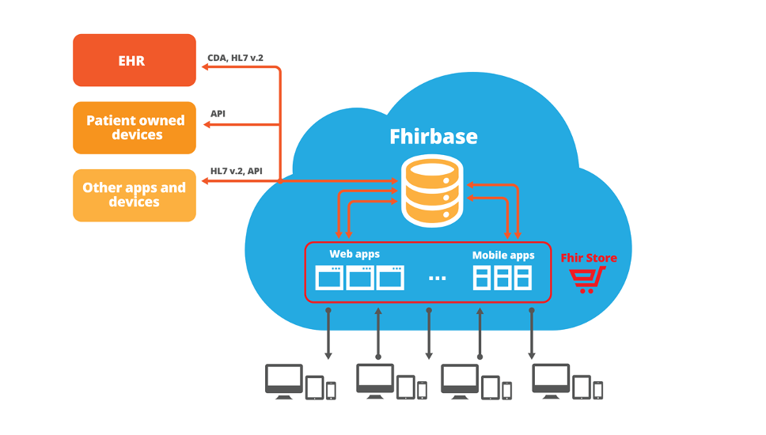

When purchasing an electronic health record (EHR) from a large vendor, you receive all the modules - the good modules as well as the bad ones. Сhoosing a system like this is always a compromise since no single health information system or technology can satisfy all user requirements in a healthcare organization.

**Is this something that we can improve?**

We at Health Samurai believe that monolithic architectures in healthcare information systems will eventually give their place to platforms and app stores just like we see in other industries. Apps in the app store have to be connected to be able to communicate with each other (share data). Only using a common interoperability standard can enable the storage and data exchange capabilities needed for a modern, robust healthcare app store.

Health IT has a long way to go, but the transition has already begun. The international standards organization, Health Level Seven (HL7), has drafted a new interoperability standard called HL7 FHIR (Fast Healthcare Interoperability Resources). The standard is free, open source, and was designed using modern IT and web practices. HL7 FHIR leverages web technologies and is focused on implementers, which are the key driving force behind any successful standard. FHIR has a growing community and the potential to take interoperability to a whole new level by introducing RESTful APIs (application programming interfaces), and bring connected, real-time interoperability capabilities to healthcare.

We joined the FHIR community back in 2012, and made a reference implementation of the HL7 FHIR server for hospital-scale production environments. This implementation of the HL7 FHIR server is called [FHIRbase](https://www.health-samurai.io/fhirbase), and FHIRbase is built on top of the most advanced open source database — [PostgreSQL](https://www.postgresql.org/). We collaborated directly with PostgreSQL’s core developers to build this production-quality storage for FHIR resources.

The HL7 FHIR standard is just starting its journey, but already has a great foundation of open source products available for building future health information platforms. The transition from monolithic architectural systems to platforms and app stores may take time, but this inevitable transition is already well underway globally. We’re happy to be standing behind a healthcare data interoperability standard that will be here to stay.

> Get started with the Aidbox [FHIR Server](https://www.health-samurai.io/aidbox) for data storage, integrations, healthcare analytics, and more, or [hire our team](https://www.health-samurai.io/services) to support your software development needs.
