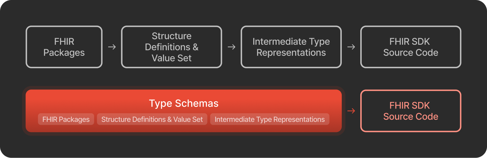

FHIR has become the primary standard for exchanging healthcare data. To get started with FHIR, developers need to read the FHIR specification and implementation guides (IGs, such as US Core, MCODE, etc.), and then implement them in their programming language. FHIR SDKs simplify this process by offering well-documented tools that work naturally within a developer’s programming language.

In this post, we'll explain what a FHIR SDK is, why creating your own SDK can be better than using a universal one, and how Type Schema, an open-source tool, helps you generate a custom SDK tailored to your specific FHIR resources.

## What is Inside of a FHIR SDK?

To build a useful FHIR SDK, it's important to understand its core responsibilities – how it communicates with the [FHIR server](https://www.health-samurai.io/fhir-server) and how it handles structured data. Let's break down what a typical SDK includes:

1. **Operations**, like CRUD, searching, and other ways to interact with data.
2. **Resources** and data types, like Patient, Encounter, Marital Status Code, etc.

**On the operation side**, the SDK provides methods to communicate with a [FHIR Server](https://www.health-samurai.io/fhir-server). It includes functions for building URLs, marshaling data, handling pagination, logging in, authentication, and more. For example:

```javascript
const patient = await fhirClient.read('Patient', '123');

const observations = await fhirClient.search('Observation', {
  patient: 'Patient/123',
  code: 'http://loinc.org|8867-4',
  date: 'gt2022-01-01'
});

const result = await fhirClient.create(newPatientResource);
```

*Implementation note*: These parts work closely with your programming language's tools, like HTTP libraries and how it handles tasks that take time. Ideally, the SDK should be native to your project stack.

**On the resource side**, an SDK provides types or classes that match FHIR resource definitions, including their fields and constraints (over 150 in the basic FHIR spec). They should be native to use in your language:

```javascript
const patient = new Patient({
  name: [
    new HumanName({
      family: "Smith",
      given: ["John"]
    })
  ],
  birthDate: "1970-01-01"
});
```

*Implementation note*: Given the number of resources, code is usually generated automatically. Resource types may also integrate with the operation part of the SDK (e.g., active record pattern).

## Why Generate SDK Instead of Using a Universal One?

A universal FHIR SDK (one that works with all FHIR features and versions) presents several challenges:

1. It's not feasible to combine all profiles because each IG has unique structural and validation requirements.
2. Custom resources and operations often aren't covered by standard FHIR.
3. Real-world projects have specific technology stacks. Adding a huge framework can create conflicts.
4. Including all FHIR features would make the SDK too complex for most real projects.

At the same time, building a FHIR SDK from scratch is hard for someone new to FHIR (like trying to build an ORM after just learning SQL). The biggest challenges are:

- Mapping complex data structures and profiles to a programming language, including unusual features like Choice Types or Extensions
- Managing FHIR packages and resolving version conflicts
- Representing ValueSets (i.e., lists of allowed values)

Most challenges belong to resources/types layer of the SDK. To simplify FHIR SDK development, we created **Type Schema**.



## What is Type Schema?

Type Schema is a community-driven tool that makes FHIR SDK development easier.

**FHIR Schema Specification** is a JSON format that represents FHIR data in a way that's easy to learn and generate code from. Here's why:

1. *Unification*. Type Schema represents all FHIR elements (Resources, Types, ValueSets, etc.) in a consistent way that's easy to turn into code.
2. *Flattening*. Type Schema gives you direct access to fields and their types, avoiding complex paths. All schemas can be stored simply in a dictionary for one-path code generation.
3. *Enrichment*. It includes additional information needed for code generation, such as possible values from ValueSets and all dependent types.

**FHIR Schema Tools** are open-source utilities (MIT licensed) that create Type Schemas for FHIR, IGs and your custom resources.

The main tool is [Type Schema](https://github.com/fhir-clj/type-schema), which takes packages and custom resource definitions and generates Type Schemas ready for code generation.

You can also read more here:

- [JSON Schema](https://github.com/fhir-clj/type-schema/blob/main/docs/type-schema.schema.json)
- [Examples of Type Schemas](https://github.com/fhir-clj/type-schema/tree/main/docs/examples)
- [Example SDK generators for TypeScript, Python, C#](https://github.com/fhir-schema/fhir-schema-codegen)

## How to Generate Types with Type Schema?

Let's look at an example. We'll start with the Patient resource from `hl7.fhir.r4.core` in TypeScript and show how to generate this code from Type Schema step by step.

Full code examples are available here:

- Input: [Patient.ts.json](https://gist.github.com/ryukzak/18b40b542f2714fbd36e3cd5e72c612c) (made by [fhir-clj/type-schema](https://github.com/fhir-clj/type-schema))
- Output: [Patient.ts](https://gist.github.com/ryukzak/b6004a18700ebcee35a79a7817d17c55) (made by [fhir-schema/fhir-schema-codegen](https://github.com/fhir-schema/fhir-schema-codegen))
- TypeScript types for Type Schema: [typeschema.ts](https://github.com/fhir-schema/fhir-schema-codegen/blob/main/src/typeschema.ts)

### Import Type Dependencies

Since `hl7.fhir.r4.core` includes many resources and types, placing them in one file isn’t practical.Instead, we import them:

```javascript
import { Address } from './Address';
import { Attachment } from './Attachment';
// ...
```

You can generate imports with:

```javascript
const deps = schema.dependencies
    // other types will be inlined or defined in this file
    .filter((dep) => ['complex-type', 'resource'].includes(dep.kind))
    .sort((a, b) => a.name.localeCompare(b.name))
    .map((dep) => `import { ${this.uppercaseFirstLetter(dep.name)} } from './${dep.name}'`)
    .join('\n');
```

All files can be generated in the same way as for the Patient resource.

### Nested Type Definition

FHIR Resources have complex nested structures. Since many languages don’t support nested type definitions, we generate local types:

```javascript
export interface PatientLink extends BackboneElement {
    other?: Reference<'Patient' | 'RelatedPerson'>;
    type?: 'replaced-by' | 'replaces' | 'refer' | 'seealso';
}

export interface PatientCommunication extends BackboneElement {
    language?: CodeableConcept;
    preferred?: boolean;
}

export interface PatientContact extends BackboneElement {
    address?: Address;
    gender?: 'male' | 'female' | 'other' | 'unknown';
    name?: HumanName;
    organization?: Reference<'Organization'>;
    period?: Period;
    relationship?: CodeableConcept[];
    telecom?: ContactPoint[];
}
```

You can generate this from the `.nested` field, with all dependencies already imported:

```javascript
for (const subtype of schema.nested) {
    this.generateType(subtype);
}
```

where `generateType` is a function that receives a type schema and makes a type definition. Details are in the next section.

### Type Generation

What do we have at this step?

- Imported all external types
- Defined all nested files

Let's look at a few cases (skipping extensions and most fields):

```javascript
export interface Patient extends DomainResource {
    active?: boolean;
    link?: PatientLink[];
    gender?: 'male' | 'female' | 'other' | 'unknown';
    multipleBirthBoolean?: boolean;
    multipleBirthInteger?: number;
    // ...
}
```

The first line of type definition is simple: we take the type name from `.identifier.name` and base type from `.base.name`.

```javascript
export interface Patient extends DomainResource {
```

```javascript
{
  "identifier": { "kind": "resource", "package": "hl7.fhir.r4.core", "version": "4.0.1",
                 "name": "Patient", "url": "http://hl7.org/fhir/StructureDefinition/Patient" },
  "base": { "kind": "resource", "package": "hl7.fhir.r4.core", "version": "4.0.1",
            "name": "DomainResource", "url": "http://hl7.org/fhir/StructureDefinition/DomainResource" }
}
```

Fields are generated by analyzing .fields, and mapped based on type:

- Primitive types are mapped directly to native types in the target language. For example: `const typeMap = { boolean: 'boolean'... }`
- Complex/nested types use their defined names because we already import or define them.
- Arrays are suffixed with `[]` to the end of the name.

```javascript
    active?: boolean;
    link?: PatientLink[];
```

```javascript
{
  "active": {
      "type": { "kind": "primitive-type", "package": "hl7.fhir.r4.core", "version": "4.0.1",
                "name": "boolean", "url": "http://hl7.org/fhir/StructureDefinition/boolean" },
      "array": false,
      "required": false, "excluded": false
    },
  "link": {
    "type": { "kind": "nested", "package": "hl7.fhir.r4.core", "version": "4.0.1",
              "name": "link", "url": "http://hl7.org/fhir/StructureDefinition/Patient#link" },
    "array": true,
    "required": false, "excluded": false
  }
}
```

For fields with **ValueSet binding** (lists of allowed values), Type Schema provides possible values so we can add them directly to our type:

```javascript
    gender?: 'male' | 'female' | 'other' | 'unknown';
```

```javascript
{
  "gender": {
    "type": { "kind": "primitive-type", "package": "hl7.fhir.r4.core", "version": "4.0.1",
              "name": "code", "url": "http://hl7.org/fhir/StructureDefinition/code" },
    "array": false,
    "required": false, "excluded": false,
    "enum": [ "male", "female", "other", "unknown" ]
  }
}
```

For choice types (fields that can take on different types), this example uses a simple approach by creating separate fields without additional validation. For other options see: [Choice Type Representation](https://github.com/fhir-clj/type-schema/blob/main/docs/choice-type.md).

```javascript
    multipleBirthBoolean?: boolean;
    multipleBirthInteger?: number;
```

```javascript
{
  "multipleBirth": {
    "choices": [ "multipleBirthBoolean", "multipleBirthInteger" ],
    "array": false,
    "required": false, "excluded": false
  },
  "multipleBirthBoolean": {
    "choiceOf": "multipleBirth",
    "type": { "kind": "primitive-type", "package": "hl7.fhir.r4.core", "version": "4.0.1",
              "name": "boolean", "url": "http://hl7.org/fhir/StructureDefinition/boolean" },
    "array": false,
    "required": false, "excluded": false
  },
  "multipleBirthInteger": {
    "choiceOf": "multipleBirth",
    "type": { "kind": "primitive-type", "package": "hl7.fhir.r4.core", "version": "4.0.1",
              "name": "integer", "url": "http://hl7.org/fhir/StructureDefinition/integer" },
    "array": false,
    "required": false, "excluded": false
  }
}
```

This is just a glimpse into generating FHIR SDK code with Type Schema, but as you can see, it’s straightforward if you know what you’re aiming to produce.

### Try it Yourself

To generate SDK types:

1. Install code generator:

```javascript
npm install -g @fhirschema/codegen
```

2. Generate types for

**•** TypeScript:

```javascript
npx @fhirschema/codegen generate -g typescript -p 'hl7.fhir.r4.core@4.0.1' -o out
```

**•** Python:

```javascript
npx @fhirschema/codegen generate -g python -p 'hl7.fhir.r4.core@4.0.1' -o out
```

**•** C#:

```javascript
npx @fhirschema/codegen generate -g csharp -p 'hl7.fhir.r4.core@4.0.1' -o out
```

For more detail please check: [fhir-schema-codegen](https://github.com/fhir-schema/fhir-schema-codegen).

## Conclusion

In this post, we introduced Type Schema as a tool to simplify FHIR SDK development. By providing a standardized format for FHIR data entities, developers can generate custom SDKs tailored to their needs without starting from scratch.

### Future Plans

Type Schema is still in early development. Upcoming improvements include:

1. Better support for Profiles, ValueSets, Extensions, Operations, etc.
2. A “FHIR SDK Cookbook” with examples showing how to map FHIR to different programming languages.
3. Improved tools for handling multiple packages and resolving conflicts.

### Join Our Community

Help us to make Type Schema better:

- Start a discussion or report problems: [GitHub Issues](https://github.com/fhir-clj/type-schema/issues)
- Add your own examples, features, or fixes: [GitHub Repo](https://github.com/fhir-clj/type-schema)
- Chat with us: [Zulip](https://chat.fhir.org/#narrow/channel/498057-Type-Schema)
