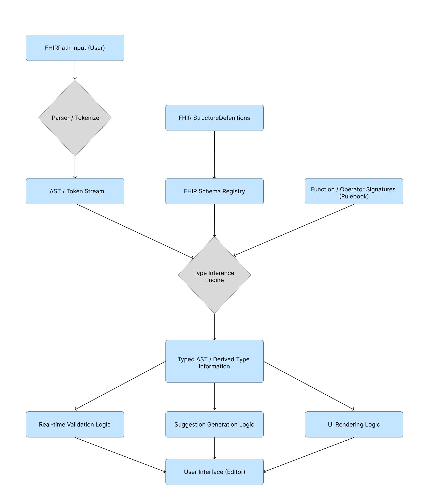
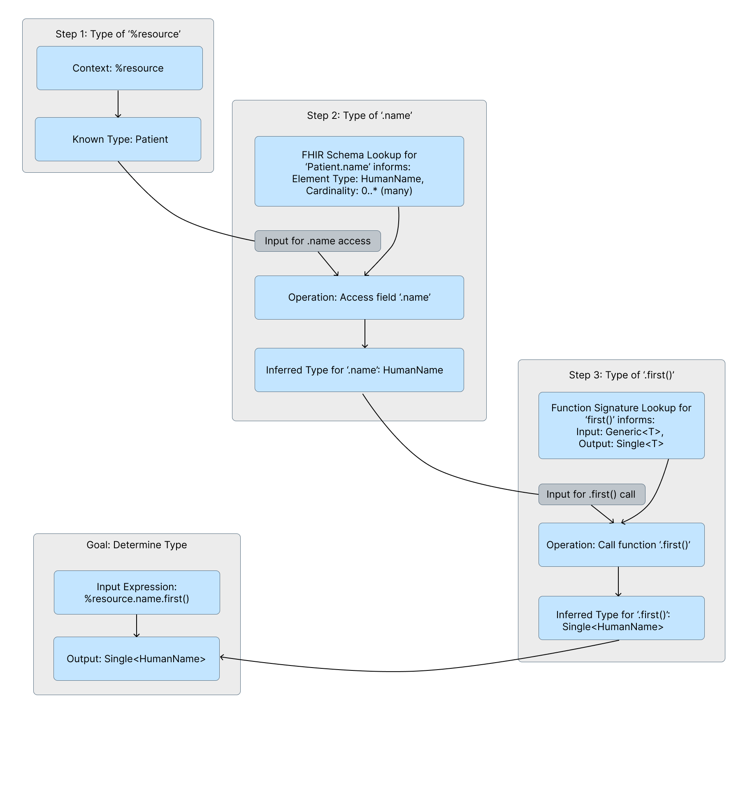

FHIRPath is a powerful language for navigating and extracting data from FHIR resources, but its flexibility can lead to complex expressions that are prone to runtime errors. This article explores the architecture and benefits of implementing a static type analysis system for FHIRPath. By deeply integrating with FHIR schemas and employing a sophisticated internal type representation, such a system can enable rich low-code editor features – such as real-time validation, intelligent suggestions, and type-driven UI – significantly improving the developer experience and expression reliability.

### 1. Introduction

The Fast Healthcare Interoperability Resources (FHIR) standard relies heavily on FHIRPath for querying, data extraction, and defining invariants. As FHIR adoption grows, so does the need for effective tooling to help developers and informaticians craft correct and efficient FHIRPath expressions. Without assistance, writing complex FHIRPath can be an error-prone process, often with errors only surfacing at runtime.

This article is intended for software developers, FHIR implementers, and designers of healthcare IT tools who are interested in understanding how static analysis techniques can be applied to FHIRPath. We will delve into the core components of a type system tailored to FHIRPath, demonstrating how it parses expressions, infers types, and leverages FHIR's structural definitions to provide a foundation for advanced editor functionality. Readers will gain insight into an architectural approach for building more intelligent and reliable FHIRPath editors.

### 2. The Foundation: Understanding FHIRPath and Static Analysis

Before diving into the specifics, it's important to understand a few key concepts:

- **FHIRPath:** A path-based navigation and extraction language designed specifically for FHIR data. It enables the selection of data elements, filtering of collections, and execution of various operations on them. Its syntax is reminiscent of XPath but is carefully tailored to FHIR's unique data model. For more details, refer to the [official FHIRPath specification](http://hl7.org/fhirpath/N1/).
- **Static Analysis:** The process of analyzing computer code without actually executing it. In programming, static analysis typically includes type checking, linting for style issues, and identifying potential bugs or anti-patterns before runtime.
- **Type System:** A fundamental component of static analysis, a type system consists of rules that assign a property called "type" to various constructs within a program, such as variables, expressions, functions, or modules. Its primary role is to help ensure that operations are performed on compatible kinds of data, preventing many common errors.

### 3. Architecting a Static Type System for FHIRPath

Building a robust static analysis engine for FHIRPath involves several key architectural components, as illustrated in the high-level architecture (see Diagram 1).

#### 3.1. Representing Types: The Internal Language of the System

The cornerstone of the system is a rich internal representation for all possible types an expression or its sub-parts can evaluate to. This is typically achieved using a discriminated union structure, enabling the system to model a diverse range of type concepts:

The system must be able to represent **FHIRPath's System Types**, which are the basic data types inherent to the language, including Integer, Decimal, String, Boolean, Date, DateTime, Time, and Quantity. These correspond to the literal values one can use directly in expressions (e.g., `10`, `'hello'`, `@2023-10-26`).

Beyond these, **Special Semantic Types** are crucial. A `Null` or `Empty` type is needed to represent empty collections or the absence of a value. An `Invalid` type explicitly signals type errors discovered during analysis, often carrying a descriptive error message to guide the user. Furthermore, a `Type` type represents a type itself as a value, which is used in operations like `is` or `as`.

A pivotal design decision in modeling FHIRPath types concerns **Collection and Cardinality Awareness**. The FHIRPath specification states, "Evaluation of a path expression always results in a collection of items, even if that collection is empty or contains a single item." This "everything is a collection" philosophy means that simply having a `Collection<T>` type to wrap singular types like `Integer` into `Collection<Integer>` would make almost every type a collection type – diminishing the utility of such a wrapper for conveying specific cardinality constraints.

Instead, a more nuanced approach is often adopted, where base types (like `Integer`, `String`, or a FHIR `Patient` type) inherently represent a *potential* collection of zero-to-many items of that type. To explicitly denote a collection that is guaranteed to contain at most one item, a special wrapper type, let's call it `Single<T>`, is introduced. This `Single<T>` type becomes critical for static analysis because, as the FHIRPath specification highlights, many functions and operators have specific expectations about the cardinality of their inputs or arguments. For example:

- Arithmetic operators (e.g., `+`, `-`) typically require their operands to be single-item collections.
- Functions like `first()`, `last()`, or an indexer `[...]` are guaranteed to return a single-item collection (or an empty one).
- Other functions might require an argument to be a single value.

By using `Single<T>`, the type system can explicitly track and enforce these "single item" constraints. If an operator expects a `Single<Integer>` but receives an `Integer` (implicitly a collection of potentially many integers), the static analyzer can flag this as an "unsafe use," as per the specification's terminology. This design choice directly addresses the specification's concern about functions or operators being "called on an output that is not guaranteed to have only one item." The absence of `Single<T>` implies a general collection, while its presence provides a stronger cardinality guarantee crucial for preventing runtime errors.

To handle the flexibility of FHIRPath and FHIR data, **Polymorphism and Generics** are indispensable:

- **Choice Types** represent elements that can be one of several types, such as FHIR's `deceased[x]` which can be either a boolean or a datetime. The system often includes mechanisms for normalizing these choice types to simplify comparisons and processing.
- **Generic Types**, represented as placeholder types (e.g., `T`, `R`), are essential for accurately typing generic functions. A classic example is `someCollection.select(projection: T -> R): Collection<R>`, where T is the element type of `someCollection`. (Note: the result is a general collection, not necessarily `Single<R>`).

For functions like `where()` or `select()` that take expressions as arguments, **Higher-Order Types (Lambdas)** are necessary. A `Lambda` type captures the expected return type of the lambda expression and, importantly, the type of the context item (`%this`) available within that lambda. This context item within a lambda operating on `Collection<T>` would typically be typed as `Single<T>`.

Finally, the system must deeply understand **FHIR-Specific Structural Types**, and here a key distinction arises:

- **Primitive FHIR Types** (e.g., FHIR `string`, `boolean`, `code`, `id`, `uri`, `decimal`) are more than just simple values. While a FHIR `string` element certainly has a string *value*, the element itself within a FHIR resource can also possess an `id` attribute and `extension` elements. This duality means that a FHIR primitive type in FHIRPath can behave in two ways:

1. **As a Value:** It can be used directly in operations expecting its underlying value type (e.g., a FHIR `decimal` in an arithmetic operation).
2. **As a Traversable Object:** One can navigate from it to access its id or `extensions` (e.g., `Patient.birthDate.extension.where(url='...')`). To model this, the internal type system often defines these Primitive FHIR Types (e.g., `PrimitiveStringType`, `PrimitiveDecimalType`) and establishes a type hierarchy where they are subtypes of the corresponding FHIRPath System Types (e.g., `PrimitiveStringType` is a subtype of `StringType`). This allows an instance of `PrimitiveStringType` to be seamlessly used where a `StringType` is expected (e.g., as an operand for string concatenation). Simultaneously, because it's a distinct (though related) complex type in the FHIR schema sense, the type system can also know that it potentially has fields like id and `extension`, enabling dot-chaining for those specific FHIR primitive constructs.

- **Complex FHIR Types** offer a way to represent entire FHIR resources (e.g.,  `Patient`) or non-primitive complex data types (like `HumanName`). These types also implicitly represent collections of those structures unless wrapped in `Single<T>`. For example, `Patient.name` would resolve to a type representing a collection of `HumanName`, not `Single<HumanName>`, because a Patient can have multiple names.

This comprehensive type system, with its deliberate choice of `Single<T>` for cardinality guarantees and a type hierarchy to manage the dual nature of FHIR primitives, is supported by a suite of utility functions. These functions facilitate type construction, robust comparison (including deep equality for complex nested types), subtype checking, and, critically, pattern matching. Pattern matching allows the system to check if an actual computed type conforms to an expected type pattern (which might include `Single<T>`, FHIR Primitive Types, or generics) and, if successful, to infer the concrete types for those generic parameters.

This addition makes the explanation of the type system much richer by directly addressing how it handles the nuances specific to FHIR's data model, particularly for primitives. It also reinforces the utility of the type hierarchy.

#### 3.2. Leveraging FHIR Schemas: Grounding Types in Data Structure

The static analysis of FHIRPath is significantly empowered by direct, intimate knowledge of the FHIR data models themselves. This integration allows the type system to accurately reflect the structure and constraints of the data being navigated.

This process begins with **Schema Ingestion**. The system consumes FHIR StructureDefinitions, which are the formal specifications for every FHIR resource, data type (including primitives like `string`, `boolean`, `decimal`, etc., which themselves have structure in FHIR), and element. These definitions are typically organized into an internal, quickly accessible **FHIR Schema Registry**. This registry serves as the system's source of truth for all FHIR structural information.

With this registry in place, sophisticated **Path Resolution** mechanisms are implemented. Given a starting type (e.g., representing a Patient resource) and a field name (e.g., `telecom` or `birthDate`), the system can navigate this registry to resolve the precise definition of that element within the `Patient` structure. This resolution process must be capable of traversing FHIR's inheritance hierarchies, correctly finding fields that might be defined in base resource types or common data types.

The core capability that leverages this schema knowledge is **Field Type Inference**. This crucial function determines the types of all fields accessible from a given FHIR complex type (like a `Patient` or a `HumanName`, or even a FHIR primitive type like `FHIR.string` which can have extensions). For each element defined within a resource or data type in the schema, its FHIR definition is translated into the internal type representation established in section 3.1. This translation is a nuanced process:

- **Mapping FHIR Primitives:** FHIR primitive types (e.g., the FHIR type `string`, the FHIR type `date`) are mapped to their corresponding internal `PrimitiveFHIRType` representations (e.g., `PrimitiveStringType`, `PrimitiveDateType`). As discussed, these internal types are designed to be subtypes of the broader FHIRPath system types, allowing them to be used as simple values while also being recognized as objects that can have an `id` or `extension` fields.
- **Handling FHIR Choices:** Elements that represent a choice of types in FHIR (e.g., `value[x]` or `deceased[x]`) are translated into the internal `ChoiceType`, accurately listing all possible internal type representations for that choice.
- **Respecting Cardinality and the `Single<T>` Convention:** The cardinality defined in the FHIR schema (`0..1`, `0..*`, `1..1`, `1..*`) directly influences the resulting internal type:

- Elements with a maximum cardinality of 1 (e.g., `0..1`, `1..1` like `Patient.birthDate`) are typed as `Single<T>`, where T is the type of the element. This explicitly signals that the path will yield at most one item.
- Elements with a maximum cardinality greater than 1 (e.g., `0..*`, `1..*` like `Patient.identifier` or `Patient.name`) are typed as `T` (e.g., `PrimitiveIdentifierType` or `HumanNameType`), which, by convention (as discussed in 3.1), represents a collection of potentially zero-to-many items of type `T`.

- **Referencing Other Complex Types:** For elements that are themselves complex FHIR data types (e.g., an `Address` within a `Patient`), the translation creates a reference to the internal type representation of that complex type (e.g., `AddressType`).
- **Recursive Nature:** This translation process is inherently recursive. When translating a `Patient`, elements like name (which is of type `HumanName`) will trigger a similar translation for the `HumanName` type if it hasn't been processed already.

To optimize performance, especially when dealing with large and interconnected FHIR schemas, caching strategies are often employed. Once a FHIR schema element or data type has been translated into its internal type representation, this result can be cached to avoid redundant processing if the same schema component is encountered again.

By meticulously translating FHIR StructureDefinitions into its internal type language, respecting FHIR's specific features like choices and the nuanced nature of its primitive types, and applying the `Single<T>` convention based on schema cardinality, the static analysis engine gains a precise, actionable understanding of the data it is reasoning about. This forms the bedrock for accurate field lookups, type checking, and intelligent suggestions.

#### 3.3. The Inference Engine: Deriving Expression Types

The inference engine is the analytical heart of the system, tasked with determining the type of any given FHIRPath expression. It usually operates on a tokenized representation or an Abstract Syntax Tree (AST) of the expression. A conceptual flow for this process is shown in Diagram 2. Its goal is to deduce the most specific type possible for the entire expression and its sub-parts, leveraging the internal type representations and schema knowledge.

A crucial first step is handling **Operator Precedence**. To correctly evaluate expressions like `a + b * c`, a simple flat list of tokens is insufficient. The tokens are typically parsed into an operator precedence tree or processed in an order that respects these rules, ensuring that operations are grouped and evaluated correctly.

The engine then employs **Recursive Traversal** to determine the type of an expression. This process starts with the type of the initial context (e.g., `%resource`) and propagates type information through the expression:

- **Literals:** When a literal value is encountered (e.g., `10`, `'hello'`, `@2023-10-26T12:00:00Z`, `true`), it's typically assigned a `Single<T>` type corresponding to its FHIRPath System Type (e.g., 10 becomes `Single<IntegerType>`, `'hello'` becomes `Single<StringType>`). This reflects that a literal, when evaluated, results in a collection containing exactly one item.
- **Variables (`%variableName`):** The type of a variable is looked up from a symbol table (or environment) that stores the types of all defined local and external variables (e.g., `%resource`, `%context`, or user-defined bindings). The type retrieved from this table will already adhere to the system's conventions (e.g., `%resource` might be `Single<PatientType>`).
- **Chaining (Dot Notation) - `X.Y`:** This is a fundamental FHIRPath operation. The type inference proceeds as follows:

1. The type of the preceding part `X` is determined recursively. Let's call this `TypeX`. By default, `TypeX` represents a collection of items.
2. If Y is a **field name**:   
   - The element type of `TypeX` is extracted (e.g., if `TypeX` is `PatientType` (implicitly a collection of Patients) or `Single<PatientType>`, the element type is `PatientType`).
   - The FHIR Schema Integration component (described in 3.2) is queried to find the type of field `Y` as defined on this element type. This will return an internal type (e.g., `HumanNameType` or `Single<DateType>`) which already incorporates cardinality information from the schema (using `Single<T>` if max cardinality is 1, or the base type `T` if it can be many). This becomes the new current type.
3. If Y is a **function call** (e.g., `X.functionName(arg1, arg2)`):   
   - The signature for `functionName` is retrieved from the rulebook (described in 3.4).
   - `TypeX` (the input collection to the function) is matched against the function's expected input type (e.g., if the function expects `Collection<A>`, `TypeX` is matched against it, potentially inferring `A`).
   - Arguments (`arg1`, `arg2`, etc.) are themselves type-checked recursively. The context for these arguments, especially for lambdas, is often influenced by the function's signature. For example, in `X.where(criteriaLambda)`, if `X` is a collection of `TypeItem`, then `%this` inside `criteriaLambda` will be `Single<TypeItem>`.
   - The actual types of the arguments are then matched against the expected argument types from the function signature, further refining any generic bindings.
   - Finally, the function's declared return type logic (which can dynamically use the inferred generic bindings) is invoked to compute the result type of the function call.
4. If Y is an **indexer** (e.g., `X[indexExpression]`):   
   - The indexExpression is type-checked (it's usually expected to be `Single<Integer>`).
   - The result of an indexer is always a single item (or an empty collection if the index is out of bounds). Therefore, if `TypeX` represents a collection of items of type `TypeItem`, the result of `X[...]` is `Single<TypeItem>`.

- **Operators (e.g., `A + B`, `A = B`, `A and B`):**

1. The types of the left (`TypeA`) and right (`TypeB`) operands are determined recursively.
2. The operator's signature is retrieved from the rulebook. The signature will specify expectations, often that operands must be `Single<T>` (e.g., arithmetic operators).
3. `TypeA` and `TypeB` are matched against these expected operand types. If an operand is, for example, IntegerType (implicitly `Collection<Integer>`) but `Single<IntegerType>` is required, the system flags this as a potential "unsafe use" unless the context guarantees `TypeA` is indeed a single item.
4. If the match is successful (and any generic parameters are inferred), the operator's return type logic determines the result. The result of most operators is also a `Single<T>` (e.g., `1 + 2 yields Single<Integer>`).

Throughout this process, **Context Propagation** is key. The type of the initial context (e.g., `%resource`) serves as the starting point. For lambdas, the context type (the type of `%this`) is dynamically determined by the function that uses the lambda, based on the type of the collection it's operating upon.

**Error Propagation** is also integral. If a type mismatch occurs (e.g., trying to access a non-existent field, passing an argument of the wrong type to a function, or using an operator with incompatible operand types or cardinalities), an `Invalid` type is generated. This `Invalid` type is then propagated up the expression tree, effectively halting further meaningful analysis for that particular branch and allowing the system to report the error accurately at the highest relevant point.

By recursively applying these rules, the inference engine can build up a comprehensive understanding of the types involved in every part of a FHIRPath expression, enabling the advanced editor features discussed later.

#### 3.4. The Rulebook: Signatures for Functions and Operators

A critical, declarative component of the static type system is a metadata repository—effectively a "rulebook"—that defines the behavior and type expectations of all known FHIRPath functions and operators. This rulebook is the reference against which the type inference engine validates operations and determines their resulting types. Each entry in this repository constitutes a signature, meticulously specifying:

- **Name:** The unique identifier of the function (e.g., `where`, `select`, `first`) or operator (e.g., `+`, `=`, `and`).
- **Expected Input/Operand Types:**  
  - For **functions**, this defines the type of the input collection they operate on (the expression to the left of the dot). This expected input type can, and often does, use generic type placeholders (like `T` in `collection<T>.first()`).
  - For **operators**, this defines the expected types of the left and right operands. Crucially, many operators, particularly arithmetic and comparison operators, require their operands to be single-item collections. Their signatures will explicitly state this expectation using the `Single<T>` wrapper (e.g., `Single<IntegerType> + Single<IntegerType>`).

- **Argument Definitions (for functions):** For each argument a function accepts, the signature details:   
  - **Name:** A descriptive name for the argument (primarily for documentation and potentially for named arguments if supported).
  - **Expected Type:** The type the argument must conform to. This can be a concrete type, a generic type linked to the function's input or other arguments, or a `LambdaType`. For lambdas, the signature also defines the expected return type of the lambda and the type of the context item (`%this`) available within it (e.g., for `collection<T>.where(criteria: Lambda<Boolean, Single<T>>`), the criteria lambda is expected to return `Boolean` and its `%this` context is `Single<T>)`.
  - **Optionality:** Whether the argument is optional or required.
- **Return Type Logic:** This is arguably the most sophisticated aspect of the signatures. Instead of always being a static, predefined type, the return type is often specified as a **computational function** executed by the type inference engine. This function receives:   
  - The actual, resolved types of the input collection (for functions) or operands (for operators).
  - The actual, resolved types of any arguments passed to a function.
  - Any generic type bindings that were inferred by matching the actual input/operand/argument types against the signature's patterns (e.g., if T was inferred to be `PatientType`). Based on these concrete inputs, this logic computes the precise output type of the function or operator. For example:
  - The `first()` function, when applied to an input of type `Collection<T>` (where `T` is the item type), will have return type logic that yields `Single<T>`.
  - The + operator, given operands `Single<IntegerType>` and `Single<DecimalType>`, will yield `Single<DecimalType>` due to type promotion rules embedded in its return type logic.
  - For a generic function like `collection<A>.select(projection: Lambda<B, Single<A>>): Collection<B>`, the return type logic uses the inferred type `B` (from the lambda's return type) to construct the result `Collection<B>`.

This metadata-driven approach makes the type system highly extensible. New functions or operators can be added by simply defining their signatures in this rulebook without altering the core inference engine. The precision of these signatures, especially the use of `Single<T>` for cardinality constraints and the dynamic computation of return types based on generics, is fundamental to the accuracy and utility of the entire static analysis process. It allows the system to catch subtle errors related to collection sizes and provide highly specific type information for complex, generic operations.

#### 3.5. Powering Intelligent Editors: The Payoffs of Static Analysis

A well-implemented static type analysis system, as described, forms the backbone for creating highly intelligent and user-friendly FHIRPath editors or tooling. When an expression changes, a reactive state management system (often employed in modern UI frameworks) can trigger re-analysis. This system would typically store the current program (the main expression and any named variables or bindings defined by the user) and track dependencies between these named bindings. If a binding is modified, its type is re-inferred, and subsequently, the types of all dependent bindings are also re-evaluated and updated. This ensures that the type information across the entire program remains consistent and up-to-date.

This continuous, background analysis enables a suite of powerful features:

- **Real-time Validation:** As the user types, expressions are continuously analyzed. Type errors – such as attempting to add a String to an Integer, or referencing a field that doesn't exist on a given resource type, can be highlighted immediately within the editor.   
  - *Example:* If a user types `Patient.birthDate + 'text'`, the system identifies `birthDate` as having a Date type and `'text'` as `String`. Consulting the operator rulebook, it finds no signature for `Date + String` using the `+` operator. This results in an `Invalid` type being inferred, and the editor can then display an error message to the user.
- **Intelligent Suggestions and Autocompletion:** This is one of the most significant benefits.   
  - When a user types a dot after an identifier, the system already knows the type of the preceding expression. If this type corresponds to a Complex FHIR Type, the system can consult the integrated FHIR Schema Registry to list all valid fields available on that type. It can also consult the function and operator rulebooks to suggest functions or operators that are applicable to the current type.
  - These suggestions can be intelligently filtered, prioritizing or exclusively showing options that are type-compatible with the current context.
  - *Example:* After a user types `Patient.name.`, the system, knowing `Patient.name` resolves to a collection of `HumanName`, would suggest fields like given, family, text (from the `HumanName` definition) and collection-based functions like `first()`, `where()`, `select()`, etc.
- **Type-Driven UI Elements:** The editor's user interface can be enhanced by this type information.   
  - Dropdown menus for selecting FHIR types (e.g., when using the as operator) can be dynamically populated with valid types sourced directly from the FHIR schema.
  - Visual cues, such as color-coding or icons, can be applied to tokens or variables within the expression to indicate their inferred type, improving readability.
- **Safer Refactoring:** When a user renames a named variable or binding, the system can help identify all its references. The type system can then re-validate these updated expressions to ensure continued type correctness.

#### 3.6. Common Pitfalls and Advanced Scenarios in FHIRPath Type Analysis

Despite its benefits, a static type system introduces several challenges and advanced scenarios:

- **Performance in Interactive Environments:** The process of deeply recursive type inference – especially when analyzing complex expressions against large FHIR schemas and resolving intricate generic types, – can be computationally demanding. In an interactive editor, where analysis needs to be near real time to provide immediate feedback, performance is critical. Effective caching strategies (e.g., for the results of FHIR schema lookups or for the types of frequently encountered sub-expressions) and other algorithmic optimizations in the inference engine are essential to maintain a responsive user experience. If not managed, slow type checking can lead to a sluggish interface, frustrating users.

- **Clarity of User Feedback and Error Messages:** A primary goal of static analysis is to prevent errors, but the value of this prevention depends on the clarity of the feedback provided. Error messages generated by the type system must be clear, concise, and actionable for users who may not be experts in type theory or the analyzer’s internals. Translating an internally detected `InvalidType` condition (perhaps with a technical reason) into a user-friendly message—such as  "Error: The '+' operator cannot be used to add a Date and a String here"—is a crucial part of creating effective tooling. Cryptic or unhelpful error messages can make the static analysis feature more of a hindrance than a help.

- **Engineering Complexity of the Core Type System:** Designing and implementing a static type system that accurately models the breadth of FHIRPath—encompassing diverse internal type representations (like `Single<T>`, choice types, lambdas, and FHIR-specific primitives), sophisticated inference rules, deep integration with FHIR schemas, and robust management of generics and polymorphism—is an inherently complex engineering task. This requires significant development effort, thorough testing across a wide range of FHIRPath expressions and FHIR structures, and ongoing maintenance as the FHIR and FHIRPath specifications evolve. Underestimating this foundational complexity can lead to an incomplete or buggy type system.

- **Handling Non-Linear Type Dependencies in Advanced Functions:** Certain advanced FHIRPath functions introduce complexities that challenge simple, linear type evaluation strategies. A prime example is the `aggregate(aggregatorLambda, initValue)` function. Within aggregatorLambda, a special variable `$total` is available, and its type is critically dependent on both the type of the `initValue` (the second argument) and the return type of `aggregatorLambda` itself. A naive left-to-right evaluation of arguments would struggle here: when type-checking `aggregatorLambda`, the type of `$tota`l (derived from `initValue`) might not yet be known if `initValue` hasn't been processed. This necessitates more sophisticated inference approaches, such as multi-pass analysis or constraint-based type resolution, to determine types correctly in scenarios with such inter-argument dependencies. Failing to account for these advanced scenarios can lead to incorrect type inference or an inability to type-check valid expressions.

Despite these challenges, the substantial advantages of applying static analysis to FHIRPath—particularly in terms of early error detection, intelligent developer guidance, and the enablement of richer, more interactive tooling—make the endeavor highly worthwhile for improving the quality and efficiency of FHIR-based development.

### 4. Visualizing the System

To better understand the flow of information, consider the following diagrams:

**Diagram 1: High-Level Architecture of a Statically-Typed FHIRPath Editor**

This diagram illustrates the major components and their interactions, from user input to the features enabled by type analysis.

**Diagram 2: Conceptual Type Inference Flow for `Patient.name.first()`**

This diagram shows a simplified, step-by-step example of how the type might be inferred for a common FHIRPath expression.

### Conclusion: Empowering FHIRPath Users

Implementing a static type analysis system for FHIRPath is a considerable engineering endeavor, but the rewards are substantial for anyone working with FHIR data. By creating a detailed and accurate internal type representation, integrating deeply with the structural definitions provided by FHIR schemas, and employing a robust inference engine, it becomes possible to build development tools that do more than just accept text – they actively understand and assist. Such tools can catch errors before they manifest at runtime, guide users towards constructing correct and meaningful FHIRPath expressions through intelligent suggestions, and ultimately make the power of FHIRPath more accessible and reliable. This elevation of the developer experience is crucial as FHIR and FHIRPath continue to play a central role in healthcare interoperability.

### Further Reading and Resources

- [**Official FHIRPath Specification**](http://hl7.org/fhirpath/N1/): The definitive source for FHIRPath syntax and semantics.
- [**FHIR StructureDefinition Resource**](https://www.hl7.org/fhir/structuredefinition.html): Describes how FHIR resources and data types are defined.

### A Call for Collaboration and Exploration

The development of advanced FHIRPath tooling is an ongoing, collaborative effort within the FHIR community. The principles and architecture discussed in this article are not just theoretical; they are reflected in practical implementations.

For those interested in exploring a concrete example of such a system, or contributing to its evolution – the FHIRPath editor that incorporates many of these static-analysis techniques is [**open source and available on GitHub.**](https://github.com/Aidbox/examples/tree/main/fhirpath-editor)

We encourage you to:

- **Explore the code:** See how these concepts are translated into a working solution.
- **Provide feedback:** Share your experiences, suggest improvements, or report issues.
- **Contribute:** If you have ideas or fixes, contributions are welcome to help enhance the tool.

By sharing knowledge, tools, and experiences, we can collectively make FHIRPath more approachable, reliable, and powerful for everyone in the healthcare IT ecosystem.
