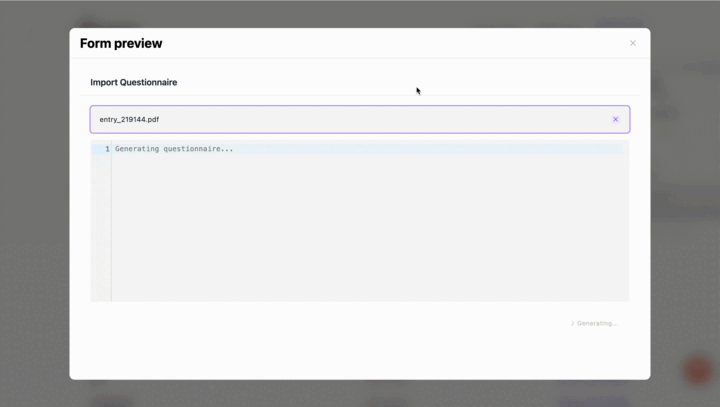
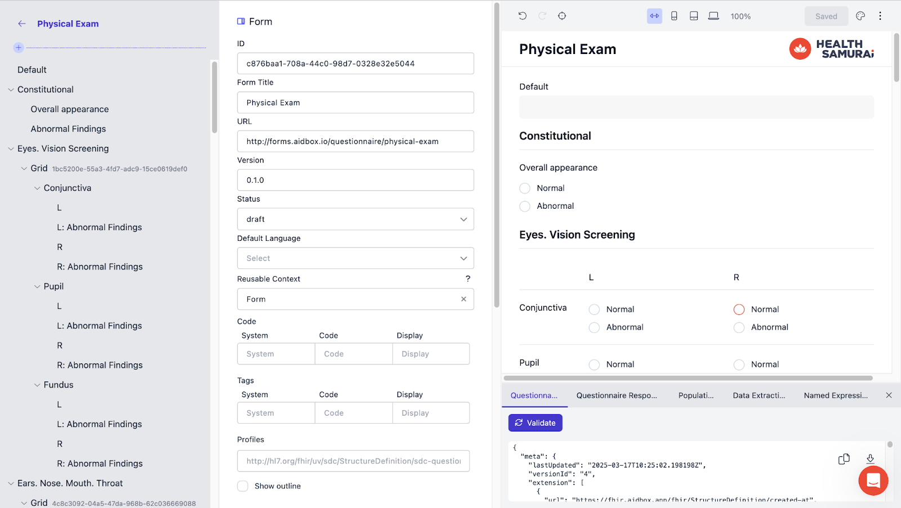

Healthcare forms are rapidly moving toward digital solutions, streamlining everything from patient intake to clinical workflows. According to [Deloitte’s 2025 Global Health Care Outlook](https://www2.deloitte.com/us/en/insights/industry/health-care/life-sciences-and-health-care-industry-outlooks/2025-global-health-care-executive-outlook.html), nearly 90% of healthcare executives expect new technologies and connected care tools to transform the industry.

Despite this shift, many organizations still struggle with form creation, integration, and ongoing updates. Based on the experience of over 1,000 users, we've identified the most common obstacles in healthcare form management—and the best ways to overcome them.

This article explores these key challenges and how [Aidbox Forms](https://www.health-samurai.io/medical-form) helps streamline the process.

## Challenge 1: Creating hundreds of forms from scratch

On average, a hospital manages anywhere from 150 to several thousand medical forms, depending on the size and complexity of its operations. Even with digital tools, form creation often remains a bottleneck, requiring technical expertise and significant effort. Many teams struggle to properly structure data and adapt forms to evolving needs. Without a simple, scalable approach, this process can become a major bottleneck in workflows.

### Our solution: Using templates, generating from PDFs, or leveraging reusable components

[Aidbox Form Builder](https://form-builder.aidbox.app/) eliminates the complexity of digital form creation, allowing teams to quickly convert existing documents into structured digital forms. Instead of manually building forms from scratch, users can:

- **Start with a template** – Choose from over 3,000 pre-built, standards-compliant templates designed to align with best practices. These templates can be easily modified and customized to match specific workflows.
- **Upload a PDF** – With AI-powered OCR, our solution automatically extracts text and structures it into a digital format. Upload a PDF, and within seconds, get a fully structured form in JSON format, ready for integration.****
- **Leverage reusable components** – Aidbox UI Builder streamlines workflows with a library of reusable components, enabling healthcare teams to standardize and accelerate form creation. By saving frequently used components, teams can ensure consistency, eliminate redundancy, and speed up development.

Read more:

[Digitize paper medical forms in seconds: Helping doctors focus on patients, not paperwork](https://www.health-samurai.io/articles/pdf-to-digital)

[Create your component library and assemble forms like a Lego](https://www.health-samurai.io/articles/how-do-you-eliminate-routine-and-improve-the-quality-of-designed-forms)

Built on the FHIR Structured Data Capture specification, [Aidbox Form Builder](https://form-builder.aidbox.app/) ensures that all forms and components are interoperable, scalable, and aligned with industry standards.

## Challenge 2: Updating forms is expensive and time-consuming

Updating healthcare forms often means relying on developers, which drives up costs and slows things down. A single form can take weeks and cost thousands of dollars – expenses that add up fast for organizations needing frequent updates.

This puts hospitals and healthcare providers in a tough spot: Should they hire a full-time, high-cost developer? Or should they invest time and resources training existing staff to learn coding just to navigate complex form-building tools? Neither option is ideal.

### Our solution: No-code Form Builder embedded in applications

[Aidbox Forms Builder](https://form-builder.aidbox.app/) is a flexible, no-code solution that allows healthcare organizations to create and manage forms without developer assistance. By embedding Aidbox Form Builder directly into your application, healthcare professionals – including clinicians, business analysts, and administrative staff – can update forms in real time.

The interface is designed for efficiency and ease of use:

- On the left, a structured workspace displays the outline of the form, allowing users to easily add, remove, or modify components.
- On the right, the real-time preview updates instantly, so users can see and test changes as they make them.
- At the top, the toolbar provides quick access to essential functions such as previewing, theming, saving, and ensuring optimal display on desktop, tablet, and mobile devices.

## Challenge 3: Embedding secure forms without sacrificing flexibility

One of the biggest challenges in integrating forms into healthcare applications is balancing seamless embedding, security, and customization. Organizations need a solution that fits their app’s design, protects sensitive data, and allows full customization—without compromising performance.

### Our solution: Embedded and customizable forms

[Aidbox Form Builder](https://form-builder.aidbox.app/) offers a web component-based embedding solution, enabling healthcare providers to integrate both the Builder (for form creation) and Renderer (for form filling) directly into their applications or websites. This allows organizations to create, manage, and complete forms without leaving their existing platforms.

- **Customizable user experience** – Maintain a native look and feel with branding, themes, and UI customization.
- **Fine-grained control** – Hide or disable specific actions, collapse debugging panels, and pass configuration settings via JSON.
- **Request interception & API control** – Modify network requests for authentication, external data sources, or added security layers.
- **Flexible data handling** – Ensure compliance with healthcare data standards by controlling how data is stored, updated, and retrieved.

## Challenge 4: Integrating forms seamlessly into your app’s design

Digitizing a form is just the first step. Healthcare teams also need the ability to customize elements to meet specific needs and align with their brand’s style guide. This includes adjusting branding, colors, fonts, and layouts, as well as enabling multilingual support for diverse patient populations.

### Our solution: Form customization

The Theme Editor gives users full control over the visual design of their forms. Located in the UI Form Builder toolbar, it allows teams to apply pre-designed themes or create custom styles. Users can instantly preview their changes to ensure brand consistency across multiple forms.

- **Customization options** – Easily adjust form colors, fonts, branding elements, input field styles, and button appearances.
- **Stored and reusable themes** – Themes are stored in the database under the `QuestionnaireTheme` resource, allowing reuse across forms. This eliminates duplication and ensures consistent branding.
- **Flexible implementation** – Set a default theme for all forms or pass a theme as a parameter when generating a form link, enabling dynamic customization.
- **Multi-language support** – Configure default languages and provide translations within a single form, so users can switch between languages easily—eliminating the need to create separate versions for different languages.

## Try Aidbox Form Builder today

By using Aidbox Forms, healthcare organizations can eliminate workflow disruptions, simplify data collection, and improve the patient experience—all while maintaining full control over customization and security.

Join over 1,000 healthcare professionals already simplifying form creation with [Aidbox Form Builder](https://form-builder.aidbox.app/). Create, manage, and deploy digital forms effortlessly —without the hassle of complex development or IT involvement.

[Get started today](https://form-builder.aidbox.app/)—no authentication or licensing needed
