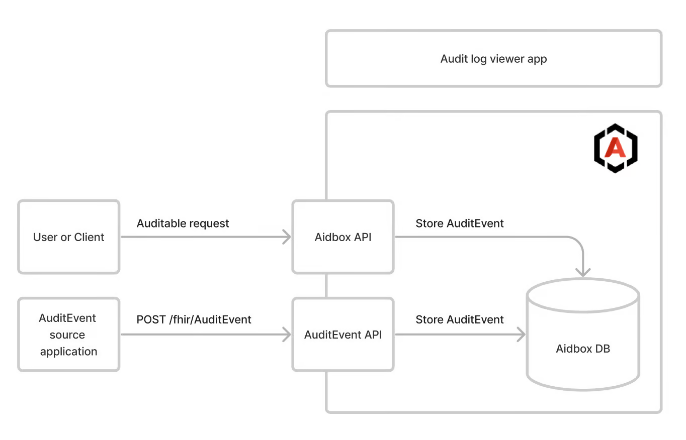

# Audit and Logging

Audit logging is essential in healthcare systems because it:

* **Protects Patient Privacy**: Tracks who accessed sensitive medical records, ensuring compliance with privacy laws like HIPAA
* **Prevents Data Breaches**: Helps detect and investigate unauthorized access to patient data
* **Ensures Accountability**: Records all changes to medical records, creating a clear trail of who modified what and when
* **Supports Legal Requirements**: Provides evidence for compliance audits and legal investigations

Aidbox provides comprehensive audit and logging capabilities:

* FHIR Basic Audit Logging Profile (BALP) implementation
* FHIR Resource versioning
* Logging configuration

## FHIR Basic Audit Logging Profile (BALP) implementation

Aidbox supports the FHIR [BALP](https://profiles.ihe.net/ITI/BALP/index.html) Implementation Guide.

<figure><figcaption></figcaption></figure>

### Aidbox as a source of audit events

When audit logging is enabled, Aidbox produces audit logs for significant events:

* FHIR CRUD & Search operations for basic FHIR resources and custom resources (with BALP profiles)
* FHIR CRUD & Search operations for Patient compartment resources (with Patient-specific BALP profiles)
* User login and logout events (custom Aidbox event types, not BALP-conformant)
* Password change events (DICOM subtype `110139`)
* SQL operations via `$psql`/`$sql` (custom `aidbox/sql-interaction` type, not BALP-conformant)
* Bundle transaction entries (each entry audited individually with BALP profiles)

### BALP profile selection

Aidbox assigns a BALP profile to each AuditEvent based on the operation type and whether the operation involves a Patient.

| Operation | Generic Profile | Patient-specific Profile |
|---|---|---|
| Create | `IHE.BasicAudit.Create` | `IHE.BasicAudit.PatientCreate` |
| Read / VRead | `IHE.BasicAudit.Read` | `IHE.BasicAudit.PatientRead` |
| Update / Patch | `IHE.BasicAudit.Update` | `IHE.BasicAudit.PatientUpdate` |
| Delete | `IHE.BasicAudit.Delete` | `IHE.BasicAudit.PatientDelete` |
| Search / Query | `IHE.BasicAudit.Query` | `IHE.BasicAudit.PatientQuery` |

**When Patient-specific profiles are used:**

* The resource **is** a Patient — CRUD operations directly on the Patient resource (e.g. `PUT /fhir/Patient/123`)
* The resource is in the [Patient Compartment](https://www.hl7.org/fhir/compartmentdefinition-patient.html) and references a Patient (e.g. creating an Observation with `subject` pointing to a Patient)


Patient **search** (`GET /fhir/Patient?...`) uses the generic `IHE.BasicAudit.Query` profile, not `IHE.BasicAudit.PatientQuery`. This is because a search does not reference a specific Patient. The `PatientQuery` profile is used when searching compartment resources that reference a Patient (e.g. `GET /fhir/Observation?patient=123`).


#### Example: AuditEvent for Patient update

When you update a Patient resource, the generated AuditEvent uses the `IHE.BasicAudit.PatientUpdate` profile:

```json
{
  "resourceType": "AuditEvent",
  "meta": {
    "profile": [
      "https://profiles.ihe.net/ITI/BALP/StructureDefinition/IHE.BasicAudit.PatientUpdate"
    ]
  },
  "type": {
    "system": "http://terminology.hl7.org/CodeSystem/audit-event-type",
    "code": "rest",
    "display": "Restful Operation"
  },
  "subtype": [
    {
      "system": "http://hl7.org/fhir/restful-interaction",
      "code": "update",
      "display": "update"
    }
  ],
  "action": "U",
  "recorded": "2026-02-25T12:00:00Z",
  "outcome": "0",
  "agent": [
    {
      "who": {
        "reference": "Client/my-client"
      },
      "requestor": true
    }
  ],
  "source": {
    "observer": {
      "display": "Aidbox"
    }
  },
  "entity": [
    {
      "what": {
        "reference": "Patient/example"
      },
      "role": {
        "system": "http://terminology.hl7.org/CodeSystem/object-role",
        "code": "4",
        "display": "Domain Resource"
      },
      "type": {
        "system": "http://terminology.hl7.org/CodeSystem/audit-entity-type",
        "code": "2",
        "display": "System Object"
      }
    }
  ]
}
```

### Password change AuditEvent

When a user's password is changed (via `PUT /User/:id` or `PATCH /User/:id`), Aidbox generates an AuditEvent with DICOM subtype `110139` ("User password changed").

```json
{
  "resourceType": "AuditEvent",
  "type": {
    "system": "http://terminology.hl7.org/CodeSystem/audit-event-type",
    "code": "rest",
    "display": "Restful Operation"
  },
  "subtype": [
    {
      "system": "http://dicom.nema.org/resources/ontology/DCM",
      "code": "110139",
      "display": "User password changed"
    }
  ],
  "action": "U",
  "outcome": "0",
  "entity": [
    {
      "what": { "reference": "User/example-user" },
      "type": {
        "system": "http://terminology.hl7.org/CodeSystem/audit-entity-type",
        "code": "2"
      },
      "role": {
        "system": "http://terminology.hl7.org/CodeSystem/object-role",
        "code": "4"
      }
    }
  ],
  "agent": [
    {
      "who": { "identifier": { "value": "root" } },
      "requestor": true
    },
    {
      "who": { "display": "Aidbox" },
      "requestor": false
    }
  ]
}
```

This event is generated regardless of whether the password value actually changed. Search for these events:

```http
GET /fhir/AuditEvent?subtype=110139
```

### Aidbox as an Audit record repository

Aidbox is an [Audit record repository](https://profiles.ihe.net/ITI/TF/Volume1/ch-9.html#9.1.1.3) (ARR) for FHIR AuditEvent resources. Aidbox supports

* `POST /fhir/AuditEvent` to record events
* `GET /fhir/AuditEvent` to receive them

### External Audit record repository support

Aidbox can also send Audit Events to a dedicated, external repository. In this case, Aidbox groups outgoing events into a single **FHIR Bundle** of type `collection` and delivers it to the target endpoint.

For setup instructions and payload examples, see the [**External Audit Repository Configuration**](../tutorials/security-access-control-tutorials/how-to-configure-audit-log.md#external-audit-repository-configuration) section of the guide.

## FHIR Resource versioning

A separate version is recorded in the history table each time a resource is created, updated, or deleted.

All versions can be accessed using the [\_history](../api/rest-api/history.md) operation.

## Logging configuration

Aidbox automatically logs all auth, API, database, and network events, so in most cases, basic audit logs may be derived from [Aidbox logs](../modules/observability/logs/).

Aidbox also provides ways to [extend](../modules/observability/logs/extending-aidbox-logs.md) Aidbox logs.

## Audit coverage

| Operation | Audited | BALP Profile | Notes |
|---|---|---|---|
| REST Create (POST) | Yes | `IHE.BasicAudit.Create` / `PatientCreate` | |
| REST Read (GET) | Yes | `IHE.BasicAudit.Read` / `PatientRead` | |
| REST Update (PUT/PATCH) | Yes | `IHE.BasicAudit.Update` / `PatientUpdate` | |
| REST Delete | Yes | `IHE.BasicAudit.Delete` / `PatientDelete` | Entity reference includes `/_history/version` — see Known limitations |
| REST Search | Yes | `IHE.BasicAudit.Query` / `PatientQuery` | |
| Bundle transaction | Yes | Per-entry BALP profiles | Each entry gets its own AuditEvent |
| Password change | Yes | No (DICOM `110139`) | See [Password change AuditEvent](#password-change-auditevent) |
| `$psql` / `$sql` | Yes | No (`aidbox/sql-interaction`) | Custom Aidbox type system |
| User login/logout | Yes | No (custom) | Not BALP-conformant |
| GraphQL | Indirect | Via underlying FHIR calls | The GraphQL query text is not captured; only the translated FHIR operations are audited |
| Bulk `$import` / `$load` | **No** | — | Imported resources have no audit trail |
| Bulk `$export` | **No** | — | |
| Auth token issuance | **No** | — | `client_credentials` grant, `/auth/token` not audited |
| `/auth/userinfo` | **No** | — | |
| Configuration changes | **No** | — | |
| AuditEvent operations | Excluded | — | Intentional — prevents infinite audit loops |

## Known limitations


**PUT-create logged as update**: When a `PUT` request creates a new resource (HTTP 201), the AuditEvent uses the `Update` profile and `update` subtype instead of `Create` / `create`. This is a known issue.



**Delete entity reference includes version**: Delete AuditEvents store the entity reference as `ResourceType/id/_history/versionId` (e.g. `Patient/123/_history/5`). This breaks entity-based AuditEvent search — querying `GET /fhir/AuditEvent?entity=Patient/123` returns no results for delete events.



**Bulk import has no audit trail**: Resources created via `$import` or `$load` bypass the CRUD pipeline and do not generate AuditEvents. If you need a complete audit trail, use individual FHIR CRUD operations or Bundle transactions instead.



**GraphQL queries are not directly audited**: GraphQL requests generate AuditEvents only for the underlying FHIR search/read operations, not for the GraphQL query itself. The original query text is not captured in any AuditEvent.


## See also:


[how-to-configure-audit-log.md](../tutorials/security-access-control-tutorials/how-to-configure-audit-log.md)

